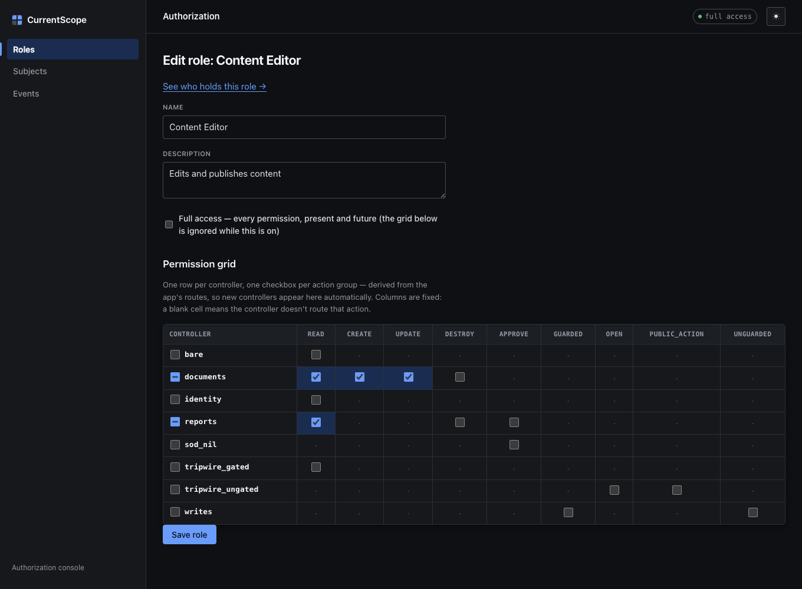
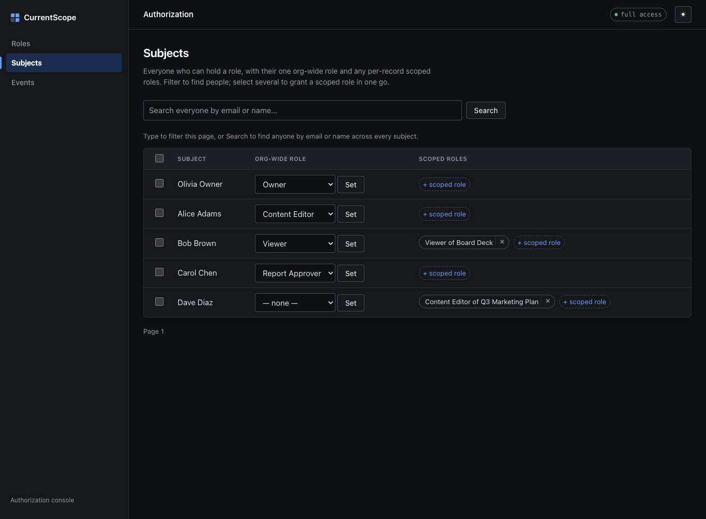
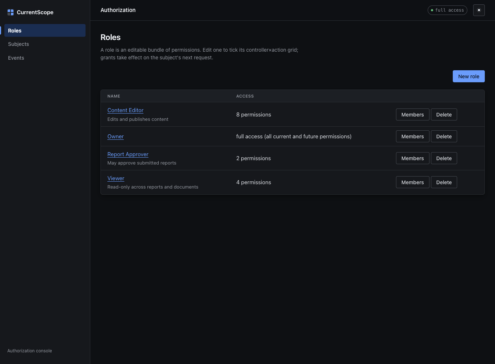
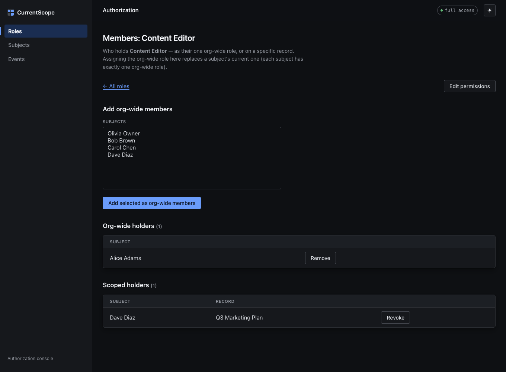
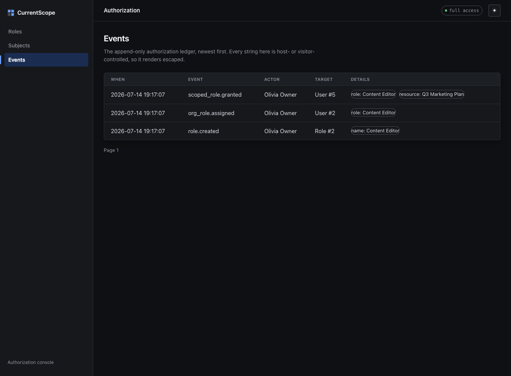

# CurrentScope

[](https://rubygems.org/gems/current_scope)
[](https://github.com/davidteren/current_scope/actions/workflows/ci.yml)
[](MIT-LICENSE)
[](https://davidteren.github.io/current_scope/)

**Website:** [davidteren.github.io/current_scope](https://davidteren.github.io/current_scope/) — overview, the resolver, and quickstart at a glance.

**Authorization as data you edit in a UI, not rules you hardcode and redeploy —
with one ambient context that makes `allowed_to?` work identically in
controllers, views, and components.**

CurrentScope is a mountable Rails engine. You add the gem, run the install
generator, and get:

- **Permissions auto-derived from your routes.** Every `controller#action`
  pair *is* a permission. Add an `OrdersController` and its actions appear in
  the permission grid with zero wiring.
- **Roles as rows, not classes.** A role is a named, editable bundle of
  permissions — ticked cells on a controller × action grid. Change what
  "Reviewer" means without a deploy.
- **Scoped roles.** The same role, attached to one specific record: "Editor of
  Project #7" grants nothing on Project #8.
- **An optional separation-of-duties veto.** Off by default; opt in by listing
  actions. Once on, whoever initiated a record can never approve it — not
  grantable, not configurable in the UI, overrides even full access. A
  structural guarantee, not a preference.
- **Fail-closed resolution.** No grant means denied. Everything is a
  permission, even the baseline things every signed-in user can do.
- **An ambient authorization context.** The current subject flows through
  `ActiveSupport::CurrentAttributes` from the controller gate down to the
  smallest ViewComponent. The view can never disagree with the gate — they ask
  the same resolver.

The decision order, fixed:

```
1. SoD veto        → initiator? (opt-in, off by default)  DENY (overrides all)
2. full_access     → role grants everything, forever     ALLOW
3. org-wide role   → role's permission set includes it   ALLOW
4. scoped role     → a role held on THIS record          ALLOW
5. otherwise       → default deny
```

## Screenshots

The mounted management UI at `/current_scope` — self-contained (no web fonts, no
build step, CSP-safe), first-class light **and** dark themes.

**Permission grid** — one row per controller, CRUD action groups derived from
your routes; ticked cells glow, a partial group reads as indeterminate.



**Subjects** — everyone who can hold a role, their one org-wide role, and any
per-record scoped roles; server-side search across all subjects.



| Roles | Members | Events |
|---|---|---|
|  |  |  |

> Regenerate: `CAPTURE_SCREENSHOTS=1 RAILS_ENV=test bin/rails test test/system/screenshots_test.rb`

## Installation

```ruby
# Gemfile
gem "current_scope"
```

```bash
bin/rails generate current_scope:install
bin/rails current_scope:install:migrations && bin/rails db:migrate
```

Include the concerns in `ApplicationController` — `Context` populates the
ambient subject from your authentication, `Guard` gates every action behind
its own `controller#action` permission:

```ruby
class ApplicationController < ActionController::Base
  include CurrentScope::Context   # sets CurrentScope::Current.user from current_user
  include CurrentScope::Guard     # fail-closed gate on every action
end
```

Skip the gate where authorization doesn't apply (sign-in, webhooks):

```ruby
class SessionsController < ApplicationController
  skip_before_action :current_scope_check!
end
```

**Assumption #1: every controller descends from a `Guard`'d base.** An action on
a controller that never includes `Guard` (an API base, a hand-rolled
`ActionController::Base`) is silently ungated. To catch that in dev/test, include
the optional `CurrentScope::GatingTripwire` on the base you want verified — it
raises after any action that didn't run the gate, and carries its own
`current_scope_skip_tripwire!` marker for genuinely-public actions (you can't use
`skip_before_action :current_scope_check!` on a controller that never defined
that callback — it raises at class load):

```ruby
class ApiController < ActionController::Base
  include CurrentScope::GatingTripwire
  current_scope_skip_tripwire! only: :health
end
```

It's an `after_action`, so it can't see an action that renders from a
`before_action` (halted chain) — a strong aid, not total coverage.

Bootstrap the first admin (the management UI needs a full-access subject to
enter, so the first grant can't happen in the UI). One command:

```bash
bin/rails current_scope:grant SUBJECT_ID=1   # grants the full-access Owner role
```

or in `db/seeds.rb`:

```ruby
CurrentScope.seed_defaults!            # Owner (full_access) + Member
CurrentScope.grant!(User.first)        # give the first user the Owner role
```

Then manage everything at `/current_scope` (full-access subjects only): the
role grid, org-wide assignments, scoped grants.

## Usage

### Checking permissions — anywhere

`allowed_to?` is available in controllers and views via `Context`, and in any
PORO or ViewComponent by mixing in `CurrentScope::Permissions`. No
`current_user` threading, ever:

```ruby
allowed_to?(:approve, report)         # key derived from the record → reports#approve
allowed_to?(:create, Report)          # class form for collection actions
allowed_to?("admin/reports#approve")  # explicit key when you need it
```

Key derivation agrees with the gate **when the current controller's path ends
in the record's route key**: inside `Admin::ReportsController` (path
`admin/reports`, route key `reports`), `allowed_to?(:approve, report)` resolves
to `admin/reports#approve` — exactly what the Guard enforces there — and a
cross-resource check from a projects view resolves to `reports#approve`.

> **Residual foot-gun — namespaced/custom-named controllers.** When a
> controller's path segment differs from the record's route key (e.g. a
> `DashboardController` that renders `Report`s: path `dashboard`, route key
> `reports`), the short-form `allowed_to?(:show, report)` derives
> `reports#show` while the Guard enforces `dashboard#show` — so a link may show
> that then 403s (or hide that would work). The Guard stays authoritative, so
> this is a display bug, not a bypass. **In such controllers, prefer the
> explicit full key** — `allowed_to?("dashboard#show")` — which removes the
> ambiguity. The short form is only guaranteed to match the gate when path
> segment == route key.

```ruby
class ApproveButtonComponent < ViewComponent::Base
  include CurrentScope::Permissions

  def render? = !report.approved? && allowed_to?(:approve, report)
end
```

### Scoping a list (`scope_for`)

`allowed_to?` answers "may I act on **this** record?". `scope_for` answers the
list-side question — "**which** records may I act on?" — from the *same* roles,
permissions, and scoped grants the gate reads. Use it for index pages so the
list and the per-record gate stay one source of truth, never a hand-written
query that drifts:

```ruby
# app/controllers/projects_controller.rb
def index
  @projects = scope_for(Project).order(created_at: :desc).page(params[:page])
end
```

- **full-access or an org-wide grant** of the key → every record (`Project.all`).
- **scoped grants** → only the specific records that role was granted on.
- **no grant** (or no subject) → empty, fail-closed like the gate.

The gate agrees. A collection action like `#index` has no record to name, so it
asks a record-less question — and a scoped grant whose role ticks that key
answers it: the subject reaches the list, and `scope_for` narrows it to the
records they were actually granted. **No org-wide grant is needed to reach a
scoped index** (and reaching for one would defeat the purpose — an org-wide
grant means "see everything", so `scope_for` would return `Project.all`). The
same holds for the class form, `allowed_to?(:index, Project)`, so a view helper
and the gate never disagree.

It returns a chainable `ActiveRecord::Relation`, so `.where`/`.order`/`.page`
compose normally. `permission:` defaults to the model's `index` key and accepts
a bare action or a full key (`scope_for(Report, permission: :approve)`).

Every record `scope_for(Project)` returns passes `allowed_to?(:index, project)`,
and every record it omits fails it — by construction, not by convention. It
resolves against the **effective** subject, so acting-as changes what lists
show, and it is **flat**: a scoped grant lists that record only (parent/child
cascade is deferred). SoD does not apply — it vetoes record-targeted *actions*,
not list membership.

### Record-level decisions

Member actions that need scoped roles or the SoD veto declare a hook. It runs
*before* your own `before_action`s (the gate comes first), so it loads the
record itself; memoize so your `set_*` callback reuses it. Key off
`request.path_parameters`, never `params` — a `?id=` query string must not
smuggle a record into collection actions:

```ruby
class ReportsController < ApplicationController
  private

  def set_report = @report ||= Report.find(params.expect(:id))

  def current_scope_record
    set_report if request.path_parameters[:id]
  end
end
```

### Scopeable models

`include CurrentScope::Scopeable` in a host model to list it in the scoped-role
picker's type dropdown, and give records a nice label with `current_scope_label`:

```ruby
class Project < ApplicationRecord
  include CurrentScope::Scopeable

  def current_scope_label = "#{name} (##{id})"   # optional; defaults to "Project ##{id}"
end
```

This is **browse-only sugar** — it does *not* gate anything. The raw-GlobalID
path still accepts **any** model as a scoped-role target whether or not it opts
in; the mixin only decides what shows up in the dropdown. `current_scope_label`
is a plain instance method, so your own definition always wins over the default.

### Separation of duties (opt-in)

Separation of duties is **off by default** — the engine's baseline is scoped
RBAC, and many apps want nothing to do with four-eyes. Turn it on by listing the
actions an initiator can never perform on their own record, and declare who
initiated each record:

```ruby
# config/initializers/current_scope.rb
config.sod_actions = %w[approve]   # empty by default → no SoD
```

```ruby
class Report < ApplicationRecord
  def current_scope_initiator = requested_by
end
```

Once enabled, the veto fails **loud, not open**: if an SoD action reaches a
record whose class doesn't define the hook, the resolver raises a
`ConfigurationError` instead of silently permitting. Return `nil` from the hook
to exempt a record type, or trim `config.sod_actions`.

> **An SoD-gated member action MUST return its record from `current_scope_record`.**
> This is the one asymmetry to know: a *present* record with a *missing*
> initiator hook raises (above), but if `current_scope_record` returns **nil**
> on an SoD member action, the veto is *skipped* — an org-wide-granted subject
> (including the initiator) passes. `nil` is legitimate for collection actions,
> so the resolver can't tell the two apart and won't raise. Returning the record
> on member actions is therefore the load-bearing control. As a dev/test aid,
> set `config.warn_on_nil_sod_record = true` to log a nudge whenever an allowed
> SoD action was gated with a nil record.

With `sod_actions` empty (the default), the veto step is a no-op and the
resolver is simply `full_access → org-wide role → scoped role → deny`. No model
needs `current_scope_initiator` — the `ConfigurationError` above only fires for
actions that are *in* `sod_actions`. `sod_identity` is moot; roles, scoped
roles, `scope_for`, audit, and impersonation are unaffected.

By default (`config.sod_identity = :either`) the veto weighs **two**
identities: the effective subject *and* the real actor behind an impersonated
session. So an admin who initiated a report can't slip past the veto by
approving it while impersonating someone else — impersonation can never approve
your own record. Set `:subject` to weigh only the effective subject. The two
are identical when nobody is impersonating (`actor == subject`), so v0.1 hosts
see no change.

### Break-glass override (`allow_sod_bypass`)

Sometimes a workflow needs a *conditional* self-approval — e.g. the owner or a
trusted admin may approve their own request. You can express that in your app
(a second `approve_own` permission plus a controller branch), but that pattern
has one forgettable, security-critical step: **recording the override in the
audit ledger**. Break-glass promotes the pattern into the engine so the audit
**cannot** be forgotten.

Be honest about what this is: it converts separation of duties from a
*structural guarantee* into an **audited policy override**. It's called
break-glass, not SoD. Its legitimacy rests on three things, all enforced: it is
**off by default**, **privilege-gated**, and **always audited**.

```ruby
config.allow_sod_bypass     = true          # default false → the veto is absolute
config.sod_bypass_permission = "bypass_sod" # grantable, editable in the role grid
```

With it on, the veto is lifted for a record **only when all three hold**,
re-checked live at decision time:

1. `config.allow_sod_bypass` is on, **and**
2. the record's host hook `current_scope_sod_bypassed?` returns true, **and**
3. the record's **initiator** holds the bypass permission (`bypass_sod`).

Holding `bypass_sod` on a flagged, self-initiated record **is** the
authorization for the SoD action — the bypass grants the action, it doesn't
merely lift the veto and then re-check for a separate `approve` grant.
`bypass_sod` must **not** appear in `sod_actions` (it isn't an SoD action); the
engine raises if it does, to prevent a re-entrant loop.

When a bypass lifts the veto, the engine records exactly one append-only
`sod.bypassed` audit event at the enforcement gate (never on advisory
`allowed_to?` checks) and sets `X-Current-Scope-Reason: sod_bypassed` on the
response. A missing hook means "this type never breaks glass" — fail-closed, no
error. Under impersonation (`sod_identity = :either`) the bypass checks the
**initiator's** privilege, so impersonation can't launder it.

**Host recipe** (the engine ships the mechanism; these stay yours, exactly as
impersonation ships plumbing + recipe, not endpoints):

```ruby
# 1. A per-record flag column: add_column :invoices, :sod_bypass_requested, :boolean, default: false
# 2. The hook, reading that column:
class Invoice < ApplicationRecord
  def current_scope_initiator     = requested_by
  def current_scope_sod_bypassed? = sod_bypass_requested?
end
# 3. Gate WHO may set the flag on the same bypass_sod permission (a controller
#    branch or a policy) — the engine deliberately does not own that decision.
```

Prefer true SoD for genuine fraud control (contracts, pay runs) where no
override should exist. Reach for break-glass only when a *conditional,
privileged, audited* self-approval is the real requirement. Unlike
`allow_mutations_while_impersonating`, there is no production env-gate — the
feature is per-record, privilege-scoped, and audited-by-construction, so
production is its intended home.

### Configuration

Everything lives in `config/initializers/current_scope.rb` (created by the
install generator): the `user_method`, the `subject_class`, `sod_actions`,
`excluded_controllers` (keep infrastructure out of the grid), and
`parent_controller` (what the management UI inherits from). The three
impersonation knobs — `actor_method`, `allow_mutations_while_impersonating`,
and `sod_identity` — are grouped in their own block and covered under
[Impersonation](#impersonation-act-as); they layer in that order, so
`sod_identity` is only observable once a mutation is allowed past the read-only
gate.

The **audit ledger** is controlled by `config.audit` — tri-state
`false | true | :strict`. `false` records nothing; `true` (the default) records
every authorization change and degrades gracefully (skip + warn once) if the
events table isn't migrated; `:strict` **raises** on a missing events table so
an audit-mandatory app never commits an unaudited change (the mutation rolls
back). `config.warn_on_nil_sod_record` (default off) is a dev/test aid — see the
[Separation of duties](#separation-of-duties-opt-in) note.

Two loud-by-design behaviors: a controller excluded from the catalog can't be
granted, so gating it is a misconfiguration — Guard raises and tells you to
either stop excluding it or `skip_before_action :current_scope_check!`. And a
`user_method` that the controller doesn't respond to raises instead of
silently turning every request into a 403.

### Impersonation (act-as)

`Current` distinguishes the **effective subject** (`current_scope_user` — who
the request acts as) from the **real actor** (`current_scope_actor` — who is
actually behind it). They're the same person until an admin impersonates
someone; then permission checks read the subject while attribution reads the
actor. `current_scope_actor` falls back to the subject, so it's never nil and
you never write a nil branch. `impersonating?` is the read-only-state signal
for views (show a banner, disable destructive controls).

Point `actor_method` at the host method that returns the real actor:

```ruby
# config/initializers/current_scope.rb
config.actor_method = :true_user
```

> **`actor_method` is security-critical, not an optional extra.** The entire
> act-as security model keys off `actor != user`. If you impersonate but leave
> `actor_method` unset, `actor` falls back to `user`, so it all *looks* fine in
> manual testing while being silently inert: the read-only-while-impersonating
> `MutationGuard` never engages, the SoD `:either` veto can't fire, and every
> audit row is attributed to the impersonated subject instead of the real
> admin. The permission path can't detect this, but the boundary API can:
> calling `CurrentScope.record_impersonation_started!` with `actor_method` unset
> **raises** — that call is your declaration that impersonation is live, so a
> missing `actor_method` there is unambiguously a misconfiguration. (A host that
> impersonates without ever calling the boundary API gets no runtime signal —
> so set `actor_method` whenever you set up act-as.)

The host owns the act-as switch — CurrentScope only reads it. The recipe:

```ruby
class ApplicationController < ActionController::Base
  include CurrentScope::Context
  include CurrentScope::Guard

  private

  # The real actor: always the signed-in account, never the impersonated one.
  def true_user = current_user

  # The effective subject: re-resolved from the session EVERY request, never
  # cached in Current (which is per-request and must not be trusted across
  # requests). Falls back to the real actor when not impersonating.
  def current_scope_user
    return true_user unless session[:impersonated_subject_id]

    User.find_by(id: session[:impersonated_subject_id]) || true_user
  end
end
```

Wire `current_scope_user` in as your `user_method`, or override the reader as
above. Start and stop act-as through state-changing verbs (CSRF-protected),
and authorize **who** may impersonate — this is a privilege escalation surface:

```ruby
class ImpersonationsController < ApplicationController
  def create   # POST /impersonation
    head :forbidden and return unless allowed_to?(:create, controller: "impersonations")
    session[:impersonated_subject_id] = params.expect(:subject_id)
    redirect_to root_path
  end

  def destroy  # DELETE /impersonation
    session.delete(:impersonated_subject_id)
    redirect_to root_path
  end
end
```

Clear the impersonation on **both** sign-in and sign-out
(`session.delete(:impersonated_subject_id)`) so an act-as session can never
outlive the login that started it or bleed into the next one.

#### Impersonated sessions are read-only by default

An impersonated session can look, but not touch: with `actor_method` set,
every non-`GET`/`HEAD` request is denied while a real actor stands behind a
different subject — **including the engine's own management UI** (editing roles
and grants is the highest-value surface to keep read-only). This gate is a
*separate* `before_action` from the permission check, so it survives
`skip_before_action :current_scope_check!` and runs *first*. Flip
`config.allow_mutations_while_impersonating = true` to allow writes (at which
point the SoD `:either` veto above becomes the observable line of defense).

**Production refuses this flag by default.** Letting a real actor write as the
subject they impersonate is a privilege-escalation and audit-integrity risk, so
`config.allow_mutations_while_impersonating = true` **raises at boot in
production** unless you set `CURRENT_SCOPE_ALLOW_PROD_IMPERSONATION_MUTATIONS` in
the environment. An unsafe deploy fails loudly instead of running silently
insecure. `development`, `test`, and `staging` are unaffected — the flag works
there with no env var. Assigning `false` (the default) never raises anywhere.
The escape hatch exists for cases like a live public showcase whose whole point
is demonstrating impersonated actions; a real production app should almost
always leave impersonated sessions read-only.

Because it runs first, the endpoints that **end** an impersonation must opt
out — your stop-impersonation, sign-out, **and** sign-in actions — or you could
never turn act-as off (and sign-in could never clear it):

```ruby
class SessionsController < ApplicationController
  skip_before_action :current_scope_mutation_guard!   # sign-in/out ends act-as
end

class ImpersonationsController < ApplicationController
  skip_before_action :current_scope_mutation_guard!, only: :destroy   # stop act-as
end
```

Denials carry a machine-readable reason (`:sod_veto`, `:no_grant`,
`:impersonation_gate`) on `AccessDenied#reason`, surfaced on the response as the
`X-Current-Scope-Reason` header.

**View/gate disagreement is by design.** `allowed_to?` is HTTP-ignorant: it
still returns `true` for a permission the subject genuinely holds, even though
the mutation gate will `403` the resulting non-GET click while impersonating.
Drive read-only affordances off `impersonating?` — render a banner, disable or
hide destructive controls — rather than expecting `allowed_to?` to hide them.

> The audit boundary events for act-as (recording who impersonated whom, and
> when it stopped) land in a later unit — this section is the resolution
> plumbing only.

`Current` is request-scoped and does **not** flow into Active Job. When a job
needs the subject or actor, pass GlobalIDs (or ids) as arguments and re-resolve
inside `perform` — never read `CurrentScope::Current` from a job.

### Testing your app

```ruby
require "current_scope/test_helpers"

class ApproveButtonComponentTest < ViewComponent::TestCase
  include CurrentScope::TestHelpers

  test "renders for a reviewer" do
    with_current_user(users(:reviewer)) do
      render_inline ApproveButtonComponent.new(report: reports(:pending))
      assert_selector "button", text: "Approve"
    end
  end
end
```

`with_current_user` is for in-process unit/view/component checks. To test your
own controllers **behind the gate** in a request or system spec, seed real
grants with `grant_role!` / `grant_scoped_role!` — they persist assignment rows
that survive the request cycle (which `with_current_user` cannot, since
`Context` re-resolves the subject on every real request). They seed grants only;
your app still signs the subject in through its own auth:

```ruby
class ReportsAccessTest < ActionDispatch::IntegrationTest
  include CurrentScope::TestHelpers

  test "a reviewer can list but not destroy" do
    reviewer = users(:reviewer)
    grant_role!(reviewer, role: roles(:member))              # org-wide grant
    grant_scoped_role!(reviewer, role: roles(:viewer), record: reports(:q3))  # one record

    sign_in reviewer            # your app's own auth
    get reports_path
    assert_response :success
  end
end
```

`CurrentAttributes` resets around every request, job, and test — the ambient
subject cannot leak between executions.

## The showcase app

The engine has a full companion **showcase** — a standalone, deployable Rails
8.1 host app (Hotwire, ViewComponent, built-in auth) that dramatizes every
mechanism end to end: a multi-domain anti-fraud gallery (payroll / contracts /
expenses), one-click "act as", a guided "try to commit fraud → refused"
walkthrough, the auto-derived permission grid, and the management UI. It lives
in its own repository:

**→ [davidteren/current_scope_showcase](https://github.com/davidteren/current_scope_showcase)**

Run it locally alongside this engine (checked out as a sibling directory):

```bash
git clone https://github.com/davidteren/current_scope
git clone https://github.com/davidteren/current_scope_showcase
cd current_scope_showcase
bin/setup          # bundle (resolves the engine at ../current_scope), seed the DB
bin/rails server   # http://localhost:3000
```

## Design notes

- [`resources/DESIGN.md`](resources/DESIGN.md) — the original design-concept
  capture (under the placeholder name "Grantwork").
- [`docs/RESEARCH.md`](docs/RESEARCH.md) — the research behind the ambient
  context: Evil Martians / Vladimir Dementyev (palkan) on CurrentAttributes
  vs dry-effects vs explicit passing, and what this gem borrows from Action
  Policy.

## License

The gem is available as open source under the terms of the
[MIT License](https://opensource.org/licenses/MIT).
