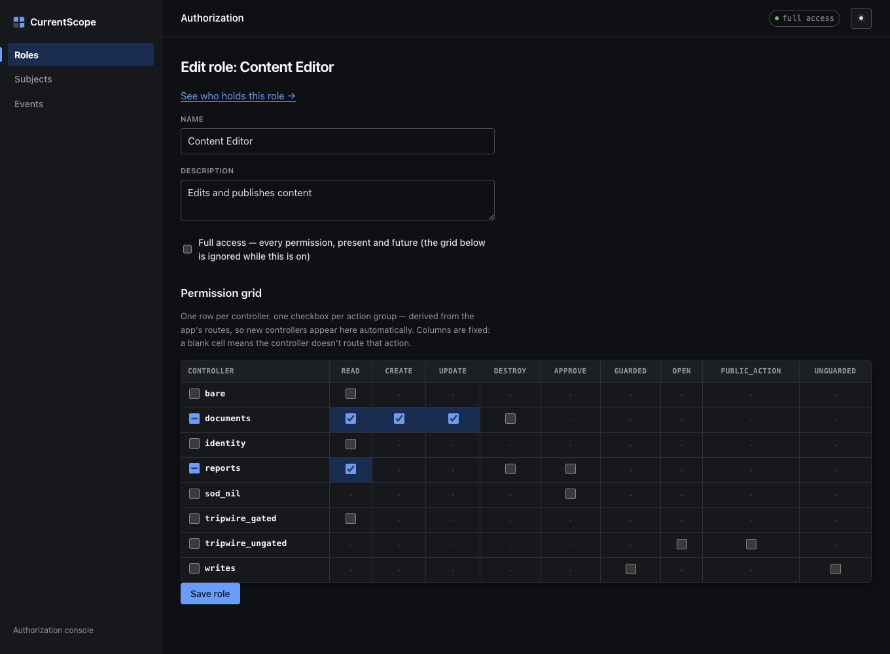
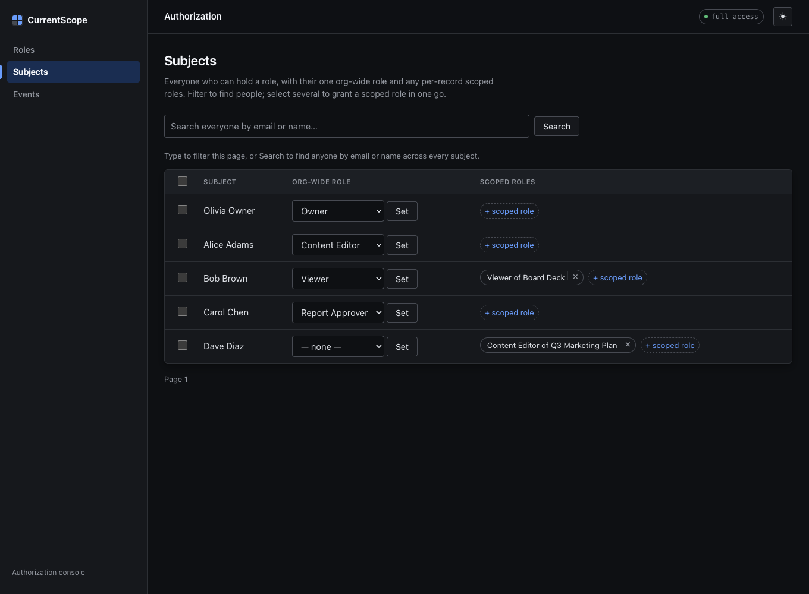
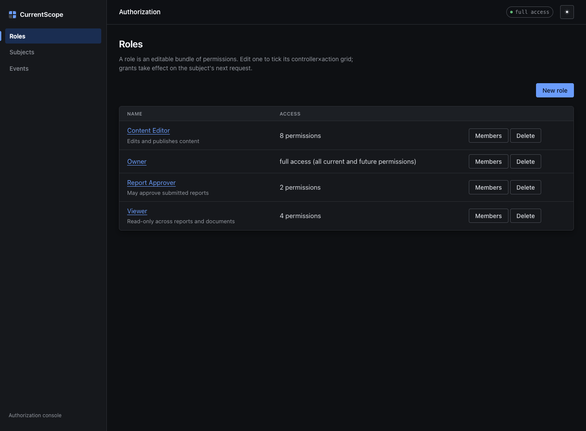
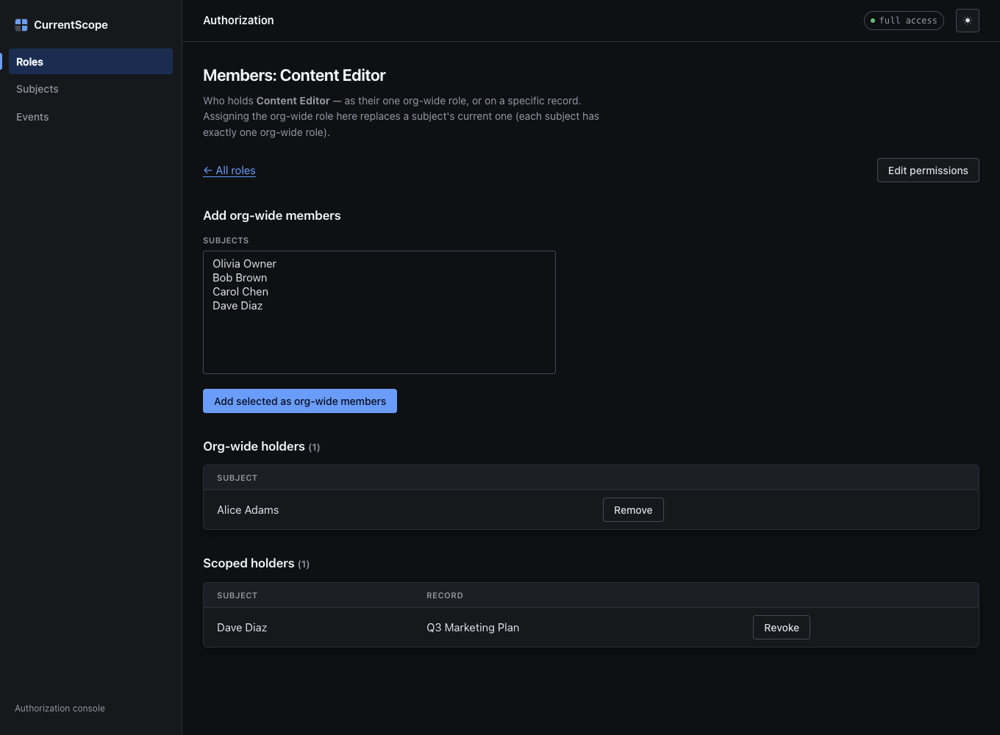
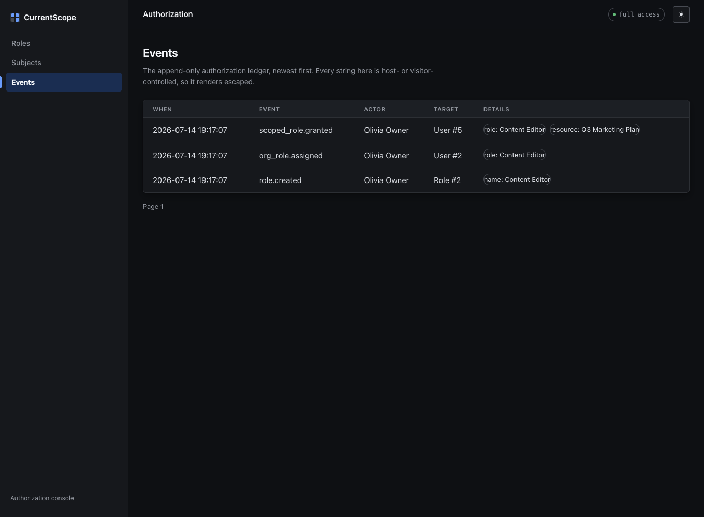

# CurrentScope

[](https://rubygems.org/gems/current_scope)
[](https://github.com/davidteren/current_scope/actions/workflows/ci.yml)
[](MIT-LICENSE)
[](https://davidteren.github.io/current_scope/)
[](https://github.com/davidteren/current_scope/issues)

> ## ⚠️ Not production-ready
>
> There are some known issues which are currently being worked on. **This is not
> production-ready**, but it is ready for experimentation and spiking, or
> whatever people want to do with it — just not yet for production.
>
> This is an **authorization** library, so the bar is different: a bug here is a
> user seeing or doing something they shouldn't. The open work is tracked in the
> [issue tracker](https://github.com/davidteren/current_scope/issues), and
> several items are security-relevant — permission keys that can be dropped
> silently, advisory checks that don't consult the catalog, and gaps in the
> separation-of-duties veto. Each is being worked through with a written plan and
> an adversarial review pass.
>
> Kick the tyres, build a spike, tell us what breaks. Don't put it in front of
> real users yet.

**Website:** [davidteren.github.io/current_scope](https://davidteren.github.io/current_scope/) —
overview, quickstart, the
[separation-of-duties guide](https://davidteren.github.io/current_scope/separation-of-duties.html),
the security checklist, and
[copy-paste prompts for AI agents](https://davidteren.github.io/current_scope/ai-agents.html).
Source lives in [`docs/site/`](docs/site/).

**Authorization as data you edit in a UI, not rules you hardcode and redeploy —
with one ambient context that makes `allowed_to?` work identically in
controllers, views, and components.**

CurrentScope is a mountable Rails engine. You add the gem, run the install
generator, and get:

- **Permissions auto-derived from your routes.** Every `controller#action`
  pair *is* a permission. Add an `OrdersController` and its actions appear in
  the permission grid with zero wiring.
- **Roles as rows, not classes.** A role is a named, editable bundle of
  permissions — ticked cells on a controller × action grid. Change what
  "Reviewer" means without a deploy.
- **Scoped roles.** The same role, attached to one specific record: "Editor of
  Project #7" grants nothing on Project #8. A model can opt in to reaching one
  level down with `current_scope_parent :project`, so a role held on a project
  covers that project's reports — including reports created after the grant.
  Flat is still the default, a scoped `full_access` grant deliberately does not
  cascade, and the four-eyes veto keeps reading the record you handed it. See
  [Checking permissions](docs/guides/checking-permissions.md#a-grant-on-a-parent-record-108).
- **An optional separation-of-duties veto.** Off by default; opt in by listing
  actions. Once on, whoever initiated a record can never approve it — not
  grantable, not configurable in the UI, overrides even full access. A
  structural guarantee, not a preference.
- **Fail-closed resolution.** No grant means denied. Everything is a
  permission, even the baseline things every signed-in user can do.
- **An ambient authorization context.** The current subject flows through
  `ActiveSupport::CurrentAttributes` from the controller gate down to the
  smallest ViewComponent. The view can never disagree with the gate — they ask
  the same resolver.

The decision order, fixed:

```
1. SoD veto        → initiator? (opt-in, off by default)  DENY (overrides all)
2. full_access     → role grants everything, forever     ALLOW
3. org-wide role   → role's permission set includes it   ALLOW
4. scoped role     → a role held on THIS record          ALLOW
5. otherwise       → default deny
```

## Screenshots

The mounted management UI at `/current_scope` — self-contained (no web fonts, no
build step, CSP-safe), first-class light **and** dark themes.

**Permission grid** — one row per controller, CRUD action groups derived from
your routes; ticked cells glow, a partial group reads as indeterminate. A route
whose controller class is missing (stale or typo) still appears — the catalog
mirrors routes — but the row is badged **no controller** so you do not grant a
key that only 500s. Remove the route or add the class;
`excluded_controllers` can hide the row if you want it out of the grid.



**Subjects** — everyone who can hold a role, their one org-wide role, and any
per-record scoped roles; server-side search across all subjects.



| Roles | Members | Events |
|---|---|---|
|  |  |  |

Screenshot regenerate command: [CONTRIBUTING.md](CONTRIBUTING.md).

## Installation

This is the **canonical greenfield quickstart** (new app, or install before
users hit gated controllers). The same numbered path lives on the
[docs site](https://davidteren.github.io/current_scope/quickstart.html) and in
the install generator's next-steps text (#25). **Existing apps with traffic
must use [report mode first](#retrofitting-an-app-that-already-has-users)**
before bootstrap — do not cut over blind.

```ruby
# Gemfile
gem "current_scope"
```

```bash
bin/rails generate current_scope:install
bin/rails current_scope:install:migrations && bin/rails db:migrate
```

**1. Include the concerns** in `ApplicationController` — `Context` populates
the ambient subject from your authentication, `Guard` gates every action:

```ruby
class ApplicationController < ActionController::Base
  include CurrentScope::Context   # sets CurrentScope::Current.user from current_user
  include CurrentScope::Guard     # fail-closed gate on every action
end
```

**2. Skip the gate on sign-in** (and other public endpoints). **Do not skip
this step** — the gate is fail-closed and covers *everything*, including login.
Prefer the declared form so the role grid shows **why** the gate is off:

```ruby
class SessionsController < ApplicationController
  current_scope_skip_gate!(reason: "sign-in must run without a grant")
  # While impersonating, sign-in/out must also clear the mutation guard or a
  # POST that ends act-as is blocked (same as bare skip of the permission gate):
  skip_before_action :current_scope_mutation_guard!
  # bare skip_before_action :current_scope_check! still works, but the grid
  # marks it as an unexplained "gate not run"
end
```

A skipped controller is unprotected by the permission gate — supply your own
auth where that matters ([security checklist](docs/SECURITY-CHECKLIST.md)).

**3. Bootstrap the first admin.** The management UI only admits full-access
subjects; the seeded **Member** role starts with **zero** permissions until
you edit it:

```bash
bin/rails current_scope:grant SUBJECT_ID=YOUR_USER_ID
# or: CurrentScope.grant!(User.first)   # upserts Owner — not RoleAssignment.create!
```

`grant!` reuses an existing role named Owner without forcing `full_access`.
On a greenfield seed that is fine (seed_defaults! creates Owner as full_access).
If someone renamed/stripped Owner earlier, repair with
`CurrentScope::Role.find_by!(name: "Owner").update!(full_access: true)` before
expecting `/current_scope` to open.

**4. Manage roles** at `/current_scope`. A Guard denial is HTTP 403 with
`X-Current-Scope-Reason` (`no_grant`, `sod_veto`, …) when the default
engine rescue runs. Host `rescue_from` handlers can replace that response.

### Retrofitting an app that already has users

> **Retrofitting a real app?** There's a full guide:
> [Adopting CurrentScope in an existing app](docs/guides/adopting-in-an-existing-app.md)
> — callback ordering vs. your authentication, the Devise recipe, the
> `skip_before_action` fail-open trap, hybrid HTML+API grants, and a rollout
> ladder. The short version is below.
>
> **Shipping?** Read the [Security & production checklist](docs/SECURITY-CHECKLIST.md)
> first — excluded controllers, the 403/404 record oracle, and the pre-ship tick list.


The gate is fail-closed, so the line you just added denies **everything** until
grants exist. On a greenfield app that's invisible — you seed the Owner role and
move on. On an app that already has controllers and traffic, it means your suite
goes red and your users get 403s the moment you deploy, and the only way to
discover what you should have granted is to break it and read the wreckage.

Don't cut over blind. Run in report mode first:

```ruby
CurrentScope.configure do |config|
  config.enforcement = :report   # :enforce (default) | :report
end
```

The gate now logs what it *would* have denied and lets the request through,
recording each one to the ledger. Exercise the app, or just run your suite —
then read the gaps back out:

```bash
bin/rails current_scope:report
```

```
Would-be denials — grant these to stop them (most-denied first):

  Ada Lovelace — currently Member
      412x  reports#index
       38x  reports#export
  Grace Hopper
        7x  reports#approve

Total: 457 would-be denials across 2 subject(s).
```

That *is* your grant-seeding work, in the shape of the role grid you need to
build: every subject who'd have been refused, what they were missing, and how
badly. Seed the roles it names, re-exercise, and flip to `:enforce` once newly
exercised requests stop adding rows (the report reads the append-only
ledger, so historical rows do not clear). Each step is one line back, and nobody gets a 403 while you learn.

The rows are ordinary ledger events, so query them directly if you want
something the task doesn't show:

```ruby
CurrentScope::Event.where(event: "access.would_deny").pluck(:subject, :details)
# => [["gid://app/User/7", {"permission" => "reports#index", "reason" => "no_grant"}], ...]
```

**Report mode is an adoption ramp, not an off switch — don't run production on
it.** It relaxes exactly one denial: *nobody has granted this yet*. Everything
else still refuses:

| Still enforced in `:report` | Why it can't be relaxed |
|---|---|
| Separation-of-duties veto | Lifting it lets an initiator really approve their own record — a fraud action executed, not a role gap surfaced. |
| SoD actions the veto *couldn't* run on | If an SoD action is gated without a record, the veto has no initiator to measure and is skipped — so the refusal that comes back says "not granted", not "SoD approved". Report mode won't speak for a rule nobody asked, and still refuses — but it **logs the blind spot and records `access.sod_blind_spot`** (not `access.would_deny`; granting will not clear the 403). `rails current_scope:report` lists them separately. |
| The management console | It's where grants are made. An observation flag that opened it would be a privilege escalation. |
| Impersonation read-only gate | Runs before the permission check and answers to its own rule. |

The response carries `X-Current-Scope-Reason: would_deny` on anything report mode
let through, so you can spot them in an integration test or a proxy log without
reading the ledger.

**Assumption #1: every controller descends from a `Guard`'d base.** An action on
a controller that never includes `Guard` (an API base, a hand-rolled
`ActionController::Base`) is silently ungated — though no longer invisibly: the
permission grid badges any controller **provably** ungated ("gate not run"),
and `bin/rails current_scope:ungated` prints the same inventory as a command.
To catch it at runtime, include the optional `CurrentScope::GatingTripwire` on
the base you want verified — it fires after any action that didn't run the
gate: **raising in dev/test, or logging once per `controller#action` under
`config.gating_tripwire = :warn` (the default outside dev/test; once per
process per site — a concurrent first hit can rarely emit a duplicate line)**, so a
production host can inventory its ungated surface without 500ing. It carries
its own `current_scope_skip_tripwire!` marker for genuinely-public actions (you
can't use `skip_before_action :current_scope_check!` on a controller that never
defined that callback — it raises at class load):

```ruby
class ApiController < ActionController::Base
  include CurrentScope::GatingTripwire
  current_scope_skip_tripwire! only: :health
end
```

It's an `after_action`, so it can't see an action that renders from a
`before_action` (halted chain) — a strong aid, not total coverage. The grid
badge and the `ungated` task mark only what the callback chain *proves*: a
conditional skip (`only:`/`except:`) renders unmarked and is exactly what
`:warn` exists to catch.

Bootstrap the first admin (the management UI needs a full-access subject to
enter, so the first grant can't happen in the UI). One command:

```bash
bin/rails current_scope:grant SUBJECT_ID=1   # grants the full-access Owner role
```

or in `db/seeds.rb`:

```ruby
CurrentScope.seed_defaults!            # Owner (full_access) + Member
CurrentScope.grant!(User.first)        # give the first user the Owner role
```

Then manage everything at `/current_scope` (full-access subjects only): the
role grid, org-wide assignments, scoped grants.

## Documentation

| Guide | What it covers |
|---|---|
| [Concepts & glossary](docs/guides/concepts-and-glossary.md) | Decision order + core vocabulary — **read first** |
| [Checking permissions](docs/guides/checking-permissions.md) | `allowed_to?`, `scope_for`, record-level, scopeable models |
| [Separation of duties & break-glass](docs/guides/separation-of-duties-and-break-glass.md) | SoD veto, `allow_sod_bypass` |
| [Impersonation](docs/guides/impersonation.md) | Act-as, mutation guard, denial shape |
| [Configuration reference](docs/guides/configuration-reference.md) | Initializer knobs, enforcement, audit, diagnostics |
| [Testing](docs/guides/testing.md) | `TestHelpers`, grants in request specs |
| [Adopting in an existing app](docs/guides/adopting-in-an-existing-app.md) | Report-mode retrofit ladder |
| [Security & production checklist](docs/SECURITY-CHECKLIST.md) | Pre-ship tick list |
| [Docs site](https://davidteren.github.io/current_scope/) | Published quickstart, SoD story, AI-agent prompts |

Root [CONCEPTS.md](CONCEPTS.md) is the longer glossary narrative for maintainers.

## The showcase app

The engine has a full companion **showcase** — a standalone, deployable Rails
8.1 host app (Hotwire, ViewComponent, built-in auth) that dramatizes every
mechanism end to end: a multi-domain anti-fraud gallery (payroll / contracts /
expenses), one-click "act as", a guided "try to commit fraud → refused"
walkthrough, the auto-derived permission grid, and the management UI. It lives
in its own repository:

**→ [davidteren/current_scope_showcase](https://github.com/davidteren/current_scope_showcase)**

Run it locally alongside this engine (checked out as a sibling directory):

```bash
git clone https://github.com/davidteren/current_scope
git clone https://github.com/davidteren/current_scope_showcase
cd current_scope_showcase
bin/setup          # bundle (resolves the engine at ../current_scope), seed the DB
bin/rails server   # http://localhost:3000
```

## Limitations

**SSR-first.** CurrentScope is for server-rendered Rails (controllers, views,
ViewComponents, Turbo). Separate JS front-ends ([#96](https://github.com/davidteren/current_scope/issues/96))
and Inertia ([#97](https://github.com/davidteren/current_scope/issues/97)) have
no first-class client contract yet. API controllers that include Guard still
authorize on the server.

**Model limits** — deliberate shape of the v1 data model, not gaps:

| Limit | What it means |
|---|---|
| **Flat scoped grants** | A scoped role on a parent record does **not** cascade to children. Hierarchy is deferred — see [docs/ROADMAP.md](docs/ROADMAP.md) §2.3. |
| **One org-wide role** | At most one org-wide role per subject (DB-enforced). |
| **Scoped role = full bundle** | Scoping reuses the whole role; there is no per-record capability subset. |

**Intentional residuals** (not forgotten bugs) — full write-up on the
[Limitations page](https://davidteren.github.io/current_scope/limitations.html)
(source: [docs/site/limitations.md](docs/site/limitations.md)):

| Residual | What it means for you |
|---|---|
| A5 SoD + nil record | Member SoD actions must return the record or the veto is skipped |
| A2 `actor_method` | Set it when you impersonate; no false auto-detect |
| A6 audit degrade | Use `audit: :strict` when the ledger is mandatory |
| Trusted `current_scope_model` | Wrong type can open wrong listed reads — review like the record hook |
| Report × model_undeclared / model_invalid | Hard 403 (reason header + dev nudge) only when a scoped grant would otherwise satisfy; plain no_grant still report-mode observes |
| GatingTripwire opt-in | Never-included Guard stays open; include Guard + optional tripwire |
| No parent/child cascade | Grant on Project does not open its Tasks (#108) |

## Design notes

- [`resources/DESIGN.md`](resources/DESIGN.md) — the original design-concept
  capture (under the placeholder name "Grantwork").
- [`docs/RESEARCH.md`](docs/RESEARCH.md) — the research behind the ambient
  context: Evil Martians / Vladimir Dementyev (palkan) on CurrentAttributes
  vs dry-effects vs explicit passing, and what this gem borrows from Action
  Policy.

## License

The gem is available as open source under the terms of the
[MIT License](https://opensource.org/licenses/MIT).
