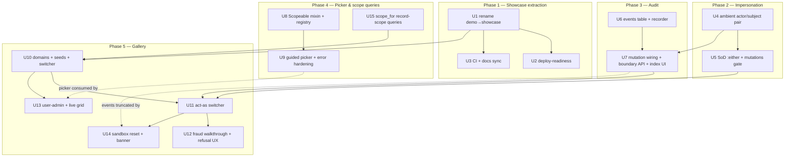

# CurrentScope Showcase & Engine Buildout - Plan

## Goal Capsule

- **Objective:** promote `demo/` to a standalone, deployable public showcase (`showcase/`), and build the engine features it dramatizes — impersonation/act-as, an audit event ledger, a guided scoped-role picker, and `scope_for` record-scope queries — without changing the settled v0.1 model.
- **Authority hierarchy:** this plan → `docs/ROADMAP.md` §2–§4 → `README.md`/`STATUS.md`. The v0.1 resolver order, one-org-role model, loud SoD, and fail-closed posture are immutable; every addition lands behind config with v0.1-preserving defaults.
- **Execution profile:** five phases, each independently shippable; units are commit-sized. Work units in dependency order (see Unit Index). Engine units gate on the engine suite; showcase units gate on the showcase suite.
- **Stop conditions:** stop and surface rather than guess if (a) a change would alter resolver decision order or v0.1 defaults, (b) the events migration schema needs a column not in this plan (it ships to hosts name-frozen), or (c) the Kamal build cannot resolve the path gem without vendoring the engine.
- **Tail ownership:** update `STATUS.md` and `README.md` as each phase lands (named in units); deferred items stay in `docs/ROADMAP.md`.

---

## Product Contract

### Summary

Extract the demo into a standalone deploy-ready showcase app, add engine impersonation (real actor vs effective subject), an append-only authorization event ledger, a guided Role → Subject → Type → Record picker, and `scope_for(Model)` record-scope queries (the list-side complement to `allowed_to?`), then rebuild the showcase as a multi-domain anti-fraud gallery (Payroll, Contracts, Expenses) with an act-as switcher, a fraud-refused walkthrough, a user-admin surface, and a live permission grid.

### Problem Frame

CurrentScope v0.1 proves the mechanism but not the pitch. The demo lives inside the gem repo as a validation harness, is not hostable, and shows one domain. The engine cannot represent an impersonated session (corrupting both SoD and any future audit), leaves no trace of authorization changes ("who gave this person access?" is unanswerable), and asks operators to paste raw GlobalIDs to grant scoped roles. The showcase's narrative — "try to game the system, you can't" — needs all three engine gaps closed to be honest: act-as must be first-class, refusals must be explainable, and changes must be visible.

### Requirements

**Showcase extraction**

- R1. The demo becomes `showcase/`, a standalone Rails app in the same repo, path-gemming the engine; it boots via `bin/rails db:setup` + server with no gem-root coupling.
- R2. The gem package stays clean: `gem build` includes no showcase files (already true by gemspec glob — verified, guarded by a test or CI check).
- R3. The showcase is deploy-ready for Kamal (volume-backed SQLite, production database paths, `RAILS_MASTER_KEY` documented), with the same Dockerfile viable on Render/Fly.
- R4. `README.md`, `STATUS.md`, `PRODUCT.md`, and `.claude/launch.json` point at the new location; CI runs both the engine and showcase suites.

**Engine: impersonation (act-as)**

- R5. `CurrentScope::Current` carries `actor` (real identity) alongside `user` (effective subject); `actor` defaults to `user` when not impersonating, so attribution always reads `actor` with no nil branch.
- R6. Permission checks resolve against the effective subject; the four existing `Current.user` consumers keep working unchanged — and under impersonation, `allowed_to?` and the Guard gate always agree (the view can never disagree with the gate, including on the actor-side veto).
- R7. The host declares how to resolve the real actor via config (mirroring `user_method`); a configured-but-missing method raises `ConfigurationError` — never a silent identity swap.
- R8. The SoD veto defaults to firing when **either** the real actor or the effective subject initiated the record (`config.sod_identity = :either`), relaxable to `:subject`. (User-confirmed reversal of the original "effective only" default — closes the impersonation-assisted self-approval path.)
- R9. Mutations while impersonating are refused by default (non-GET/HEAD → denied while `actor != user`), enabled via config. The gate covers the engine's own management UI, has a documented per-controller skip (a host's stop-impersonation and sign-out endpoints need it, or impersonation can never end), and ships with a host recipe that includes the security content the engine deliberately doesn't ship: POST + CSRF on start/stop, an authorization check on who may impersonate whom, and the boundary-event calls. The engine ships plumbing + recipe, not endpoints.
- R10. Test helpers cover the pair (`with_current_user(user, actor:)` or equivalent); impersonated state can never leak across requests, jobs, or tests.

**Engine: audit event ledger**

- R11. A `current_scope_events` table records every authorization mutation — role created/renamed/deleted, grid permissions added/removed, org-wide role set/changed/removed, scoped role granted/revoked — with who (actor and effective subject) and when.
- R12. Events are append-only: no update/destroy path (`readonly?` once persisted, no `updated_at`), GlobalID-string identities plus a denormalized `target_label` so history survives record deletion.
- R13. Event writes happen inside the mutation's transaction — a grant cannot exist without its trace, and a failed trace rolls back the grant.
- R14. Recording happens only at the engine's controller mutation sites; a recording call with no ambient actor raises `ConfigurationError` (loud, matching the SoD posture). Programmatic writes (`seed_defaults!`, seeds, model-level saves) emit nothing — true by construction, since models never record.
- R15. The engine ships a minimal read-only events index (full-access gated, newest-first, hard limit); impersonation start/stop boundary events have a public recording API the host calls.
- R16. Audit is on by default; a host that hasn't run the events migration gets a loud error naming the fix (`install:migrations` or `config.audit = false`).

**Engine: scoped-assignment picker**

- R17. Granting a scoped role is a guided flow — Role → Subject → Resource type → Record — with the GlobalID staying the storage form, built server-rendered (GET + Turbo Frame refresh, no new JS dependencies).
- R18. Resource types come from an opt-in model mixin (`include CurrentScope::Scopeable`) that self-registers; the registry drives browse UX only — the v0.1 raw-GlobalID deep-link contract is unchanged.
- R19. Records are labelled via a `current_scope_label` model hook with a generated fallback; record lists are searchable with a hard limit (no pagination gem).
- R20. Error paths that 500 today are rescued to friendly alerts: concurrent duplicate grant (`RecordNotUnique`), double revoke (`RecordNotFound`), dead or unresolvable GlobalIDs.

**Engine: record-scope queries (`scope_for`)**

Scoped roles are load-bearing, not optional (design confirmation — `docs/ROADMAP.md` §1 design note): a flat org-wide grant means "act on ANY record of the type"; only a per-record scoped grant expresses "act ONLY on the records I'm tied to." That makes the list-side complement a core capability:

- R28. `scope_for(Model)` returns the relation of records the effective subject may act on, derived from the **same** roles + permissions + scoped grants the resolver uses: an org-wide grant contributes all records of the type; scoped grants contribute the specific granted records; fail-closed — no grant means an empty relation. The list filter and the per-record gate stay one source of truth (no hand-written host query that drifts from the gate). (`docs/ROADMAP.md` §2.6, priority HIGH.)
- R29. The gallery's scoped personas prove it: a scoped approver's index shows only their granted records, and the same page shows everything for an org-wide approver.

**Showcase: multi-domain gallery**

- R21. Three self-contained domains — Payroll salary runs (headline), Contracts/procurement, Expense claims — each with an initiator hook, an approve flow, and seeded users landing on different resolver branches; a domain switcher navigates them. (Scoped-role stories attach to the approvable records themselves — flat scoping; department/cost-centre-level scoping waits for the deferred cascade.)
- R22. An "Act as" switcher lets an anonymous visitor become any seeded persona via **engine impersonation**: the visitor is auto-signed-in as a seeded Visitor actor, a persistent banner shows "acting as X (you are Y)", and the showcase enables mutations-while-impersonating.
- R23. A guided fraud walkthrough: prepare a record as one persona, watch the Approve control vanish on your own record, force the request anyway via a deliberate "send it anyway" control, and receive an explanatory refusal page (not a bare 403) — including the beat where a signed-in preparer acts as an approver and the `:either` veto still refuses.
- R24. A user-admin surface shows every user's org-wide role + scoped roles at a glance, readable by all acted-as personas, with mutations funneled to the (full-access-gated) engine UI.
- R25. A live-grid beat: toggling a permission in the engine grid changes what a persona can do on next load.
- R26. The public sandbox self-heals: a recurring job resets seed data every 15 minutes (stable user ids, visitor changes reverted, events truncated, stale visitor sessions pruned), a rate-limited "Reset sandbox now" control triggers it on demand, and a banner declares the shared-sandbox behavior with time-to-next-reset.
- R27. Everything stays 100% client-agnostic: generic domains, no real-company names.

### Scope Boundaries

**Deferred to Follow-Up Work** (captured in `docs/ROADMAP.md`, not planned here):

- Resource-hierarchy cascade (§2.3) — flat scoping stays; the gallery's seed stories are designed around it.
- Resolver memoization/caching (§2.4).
- Feature flags (§2.5).
- PaperTrail auto-detection as an alternate audit backend (events table is the only v1 backend).
- Engine-shipped impersonation start/stop endpoints (plumbing + host recipe only this round).
- Authorization-denial events (refusal logging) — the ledger records mutations only; logging denials is a deliberate deferral, not an oversight (OWASP treats authz failures as loggable — revisit on host demand).
- Hash-chain/HMAC tamper evidence for events (append-only + adapter-honest hardening docs is the v1 ceiling).
- Editorial domain (three domains carry the contrast).
- Dark mode; RubyGems publishing pipeline.

**Outside this product's identity:** authentication (host-provided), external PDP integration, multi-tenancy, and pure-association labels — "who manages X" used only for display, notification, or routing is a plain DB column in the host, not a scoped role; it enters the engine only when it gates access (`docs/ROADMAP.md` §1 design note).

---

## Planning Contract

### Key Technical Decisions

- **KTD1 — `user` stays the effective subject; `actor` is added.** Four consumers read `Current.user` today (`lib/current_scope/guard.rb`, `lib/current_scope/permissions.rb`, engine application controller, showcase layout); renaming would break v0.1 hosts for zero gain. `actor` falls back to `user`, so attribution code has one path (pretender's `true_user` shape, the ecosystem contract). One concept, one name — no `subject` alias.
- **KTD2 — SoD default `:either`** (user-confirmed). The veto consults both identities whenever they differ; `config.sod_identity = :subject` restores v0.1-equivalent reads. One extra comparison; strictly fail-closed. The resolver's decision **order** is untouched — step 1 just reads two identities. The actor enters the resolver as an explicit optional `actor:` kwarg (defaulting to the subject), not by the resolver consulting `Current` — dual-identity SoD is policy, so the PDP is where the actor belongs, and PDP purity (explicit inputs, no ambient reads) survives.
- **KTD3 — impersonation ships before audit (user-confirmed ordering), but the events schema carries `actor` + `subject` columns from migration #1.** Engine migrations are name-frozen forever (install:migrations matches by name), so the schema anticipates impersonation even though boundary-event wiring lands in the audit units. GitLab's multi-year retrofit of exactly this is the cautionary precedent.
- **KTD4 — mutations-while-impersonating default off**, enforced as an HTTP-method gate (non-GET/HEAD refused while `actor != user`) — implemented as its **own before_action** (not inside `current_scope_check!`), installed by both the Guard concern and the engine's own `ApplicationController`. This matters: the engine UI does `skip_before_action :current_scope_check!` (it gates via `require_full_access!`), so a gate living inside the permission check would exempt the most sensitive mutation surface in the system — an impersonated full-access subject rewriting the grid under default config. Two concerns, two callbacks: hosts can skip the permission gate without silently skipping the impersonation gate, and a documented per-controller skip exists for the gate itself (a host's stop-impersonation and sign-out endpoints require it). No method-spoofing bypass: `Rack::MethodOverride` only upgrades POST, and mutation actions are verb-pinned by routing. The showcase flips the config on; real hosts opt in deliberately.
- **KTD5 — events are GlobalID strings + `target_label`, not polymorphic FKs; recording lives in controllers only.** GlobalID strings match the engine's existing storage form; role deletion can't cascade away history; `target_label` keeps rows readable after the target is gone. Recording happens exclusively at the engine's six controller mutation sites — never in model callbacks: `Role#persist_permission_keys` runs on both UI and programmatic paths (seeds call `update!(permission_keys:)`), so model-level recording would make seeds emit events and pollute the ledger on every sandbox reset. Instead the model computes and exposes the `{added:, removed:}` diff; controllers wrap mutate + record in one transaction. This also dodges the `insert_all`-skips-callbacks trap (the grid save uses `delete_all` + `insert_all` today) and makes R14 true by construction.
- **KTD6 — audit toggle is loud, not magic.** `config.audit` defaults on; a missing events table raises at mutation time naming the two fixes. No silent table-existence sniffing; the read path stays untouched.
- **KTD7 — Scopeable registry is browse-UX only.** `include CurrentScope::Scopeable` self-registers a model for the picker's type dropdown and provides a default `current_scope_label`. Raw-GlobalID deep links still locate any model — tightening that would change shipped v0.1 behavior. Registry must survive dev-mode reloading (rebuild or dedupe in `to_prepare`, where the catalog already resets).
- **KTD8 — picker is a server-rendered cascade**: GET form, inline `onchange: "this.form.requestSubmit()"`, one Turbo Frame wrapping everything below the changed level. Zero new JS dependencies, no Stimulus controller needed, degrades to full-page GET without Turbo. Record search is a text filter in the same frame: label `LIKE` + hard limit, `ponytail:` ceiling comment per house style (matching the unpaginated subjects page precedent).
- **KTD9 — Kamal builds from the repo root.** The path gem (`gem "current_scope", path: ".."`) escapes a `showcase/`-scoped Docker build context, so the image cannot build as the Dockerfile stands. `deploy.yml` sets the builder context to the repo root with the dockerfile at `showcase/Dockerfile` (COPY paths adjusted); no vendoring, no published-gem dependency. Everything persistent lives under `/rails/storage` on one named volume; the same Dockerfile serves Render (disk at `/rails/storage`, `HTTP_PORT=$PORT`) and Fly (`internal_port = 80`, one mount, one machine). SQLite = exactly one app container; the AR pool must cover Puma web threads + in-process Solid Queue workers.
- **KTD10 — sandbox reset is a Solid Queue recurring job**, not cron: `config/recurring.yml` + a real job class, running in Puma via the already-present `SOLID_QUEUE_IN_PUMA` plugin. Reset = ordered `delete_all`s + re-seed inside one transaction (never `db:reset` — the SQLite files are held open; SQLite has no `TRUNCATE`, and `delete_all` is also the one sanctioned bypass of event immutability). Contract: user ids stable (idempotent seeds; no bcrypt work inside the transaction), visitor-created records and role edits reverted, `current_scope_events` cleared last, sessions kept but stale Visitor sessions pruned.
- **KTD11 — the showcase act-as is engine impersonation, not a session swap.** An anonymous visitor is auto-signed-in as a seeded Visitor actor; picking a persona sets the impersonated subject in the Rails session (re-resolved every request — never cached in `Current`). This is what makes the gallery *prove* the impersonation feature. Act-as start/stop are POST/DELETE via `button_to` (SameSite=Lax makes GET switches cross-site forceable). Act-as clears on sign-out **and on sign-in** (the Rails 8 auth generator doesn't rotate the session at login, so a stale acting-as key would otherwise ride into the authenticated session — the walkthrough's own `:either` beat signs in without signing out). Stale impersonated ids (post-reset) clear act-as loudly.
- **KTD12 — refusal UX is a showcase override reading an engine-provided reason.** `AccessDenied` gains a reason (`:sod_veto` / `:no_grant` / `:impersonation_gate`) set where the denial happens (U5); the engine default stays `head :forbidden`; the showcase overrides `current_scope_denied` with an explanatory 403 page keyed off the reason. Without the reason surface, the showcase would re-derive PDP reasoning from domain knowledge — the exact gate/view divergence the architecture forbids. Where SoD hides the real Approve control, the walkthrough renders a deliberate "send the request anyway" control so the refusal is reachable without curl.
- **KTD13 — `scope_for` derives the list from the resolver's own data, never a parallel query.** The relation is built from the subject's org-wide grant (whole type) unioned with their scoped grants (specific ids) for a given permission — Action Policy's scope idea, grounded in CurrentScope's tables. Fail-closed: no grant → `Model.none`. It ships in the `Permissions` mixin (controllers, views, components — same reach as `allowed_to?`) and resolves against the effective subject, so act-as re-renders lists the same way it re-renders buttons. Flat scoping only (no cascade — deferred with §2.3); the permission key defaults to the list context (`index`) with an explicit override for other actions.

### High-Level Technical Design

**Unit dependency flow (phases are shippable milestones):**



**Identity flow under impersonation** (directional guidance, not implementation specification):

```mermaid
sequenceDiagram
  participant V as Visitor (browser)
  participant C as Context mixin
  participant G as Guard callbacks
  participant R as Resolver
  participant E as Event ledger
  V->>C: request (session: acting_as id)
  C->>C: user = host user_method (effective subject)
  C->>C: actor = host actor_method, defaults to user
  C->>G: Current.user + Current.actor set
  G->>G: impersonation gate (own callback, also on engine UI): actor != user and non-GET? deny :impersonation_gate (unless config allows)
  G->>R: allow?(subject: user, actor: actor, permission, record)
  R->>R: step 1 SoD — veto if initiator == subject OR (sod_identity :either) initiator == actor
  R-->>G: allow / deny (order 2–5 unchanged; denial carries reason)
  G->>E: controller mutation sites record event (actor + subject) in same transaction
```

**Events write path:** the six engine controller mutation sites — `roles#create`, `roles#update`, `roles#destroy`, `role_assignments#create` (three outcomes: set / change / clear), `scoped_role_assignments#create`, `scoped_role_assignments#destroy` — call the recorder inside their own transaction. The recorder reads `Current.actor`/`Current.user`, raises loud when there is no actor, serializes both identities as GlobalID strings (subject always populated — symmetric reads, no SQL nil-branch), and denormalizes `target_label`. Target semantics are normative: for assignment events (`org_role.*`, `scoped_role.*`) the target is the **grantee** (role and resource go in `details` with their own labels — "who gave this person access?" must be an indexed lookup, not a JSON scan); for `role.*` events the target is the role. Grid changes ride `roles#update` as one event with `{added: [...], removed: [...]}` (diff computed by the model, captured before its `delete_all`); `roles#create` folds the initial permission set into `role.created` details (no second event); `roles#destroy` emits one role event plus one per cascaded assignment (snapshot taken before `destroy!`). No-op mutations (identical grid re-save, re-set of the same org role) emit nothing.

### Sandbox threat model

The public showcase is a deliberately open sandbox; naming what is and isn't defended keeps that a decision rather than an accident:

- **Not defended (accepted by design):** confidentiality and integrity of sandbox data — every visitor can act as Owner, edit the grid, and see other visitors' records; seed credentials are printed on the sign-in page, so ledger actor identity is illustrative, not evidential.
- **Defended:** (a) **demo availability** — vandalism (delete every role, untick every grid cell) is bounded by the 15-minute reset plus a rate-limited public "Reset sandbox now" control (U14); (b) **visitor browsers** — visitor-authored strings (record titles, labels) must render escaped everywhere (tests in U7/U9/U10), baseline CSP enabled (U2), length validations on free-text fields, Rails-native `rate_limit` on mutating endpoints and act-as (the pattern already exists on the sessions controller); (c) **the host disk** — reset prunes stale Visitor sessions and clears events, bounding SQLite growth from crawlers and scripted churn (U14).
- **Honesty surface:** the banner declares the shared sandbox and time-to-next-reset (R26).

### Assumptions

- The seeded Visitor actor never appears as any record's initiator, so `:either` SoD adds no false vetoes to normal gallery browsing; the dedicated walkthrough beat (R23) demonstrates the actor-side veto with a real signed-in preparer.
- The events migration number follows the existing `202607100000xx` namespace and is treated as name-frozen on first release; additive indexes may ship later in new migrations, but column shape is frozen now.

### Sources & Research

- Repo research: engine conventions (`lib/` plumbing + manual requires, `current_scope_*` hook prefix, `ponytail:` ceiling comments), migration/generator flow, management-UI patterns, demo test conventions, rename blast-radius list — grounded in `lib/current_scope/*`, `app/models/current_scope/*`, `test/`, `demo/`.
- Impersonation/audit patterns: pretender (`true_user`, session-sourced re-resolution per request), devise_masquerade (initiation-token-then-session), GitLab audit events (actor+subject under impersonation; retrofit lesson — issues #315/#8691), audited/PaperTrail schemas (whodunnit's single-string weakness confirms deferring PaperTrail), OWASP Logging Cheat Sheet (privilege changes must be logged; tamper resistance), SEI/CERT SoD guidance (drives KTD2).
- Rails/Kamal specifics: Kamal named volumes persist across deploys (missing `volumes:` entry is the known SQLite-reset failure); `install:migrations` idempotent by migration name (never rename a shipped migration); CurrentAttributes reset semantics unchanged in 8.x, `Current` does not flow into jobs; Solid Queue recurring tasks via `config/recurring.yml` + scheduler-in-Puma; Turbo Frame cascading-select idiom; thruster listens on `HTTP_PORT` (Render port note).
- Flow analysis: act-as bootstrap chain (unauthenticated visitor vs `require_authentication` + fail-closed Guard), refusal-UX gap (bare `head :forbidden` renders blank under Turbo), picker error paths that 500 in v0.1 today, seed-reset interaction with stale impersonated ids and event churn.
- Design confirmation (user, this session): scoped roles are load-bearing — `docs/ROADMAP.md` §1 design note; `scope_for` is §2.6 (priority HIGH); the association-vs-gate distinction bounds what enters the engine.
- Deepening passes (security, data-integrity, architecture) verified against `app/controllers/current_scope/application_controller.rb` (the `skip_before_action` that motivated KTD4's own-callback design), `app/models/current_scope/role.rb` (the `after_save` on both UI and programmatic paths that motivated controller-only recording), and `demo/app/controllers/concerns/authentication.rb` (no session rotation at login — motivated clear-on-sign-in).

---

## Implementation Units

| U-ID | Title | Key files | Depends on |
|---|---|---|---|
| U1 | Rename `demo/` → `showcase/` + reference sweep | `showcase/**`, `README.md`, `STATUS.md`, `PRODUCT.md`, `.claude/launch.json` | — |
| U2 | Deploy-readiness (Kamal, database paths, CSP, docs) | `showcase/config/deploy.yml`, `showcase/config/database.yml`, `showcase/Dockerfile` | U1 |
| U3 | CI showcase job + docs sync | `.github/workflows/ci.yml`, `README.md`, `STATUS.md` | U1 |
| U4 | Ambient actor/subject pair + test helpers | `app/models/current_scope/current.rb`, `lib/current_scope/context.rb`, `lib/current_scope/test_helpers.rb` | — |
| U5 | SoD `:either`, mutations gate, denial reasons | `lib/current_scope/{configuration,resolver,guard}.rb`, `lib/current_scope.rb`, engine app controller | U4 |
| U6 | Events table + model + recorder API | `db/migrate/*_create_current_scope_events.rb`, `app/models/current_scope/event.rb` | U4 |
| U7 | Mutation-site wiring + boundary API + events index | engine controllers, `app/models/current_scope/role.rb`, events index view | U6 |
| U8 | `Scopeable` mixin + registry | `lib/current_scope/scopeable.rb`, `lib/current_scope.rb` | — |
| U9 | Guided picker UI + error-path hardening | `app/{controllers,views}/current_scope/scoped_role_assignments*` | U8 |
| U15 | `scope_for` record-scope queries | `lib/current_scope/{resolver,permissions}.rb` | — |
| U10 | Gallery domains + seeds + switcher | `showcase/app/**`, `showcase/db/**` | U1, U15 |
| U11 | Act-as switcher (Visitor actor, banner, lifecycle) | `showcase/app/controllers/act_as_controller.rb`, initializer, layout | U5, U7, U10 |
| U12 | Fraud walkthrough + refusal UX | showcase walkthrough controllers/views, 403 page | U11 |
| U13 | User-admin surface + live-grid beat | `showcase/app/{controllers,views}/users*` | U10 (U9 for links) |
| U14 | Sandbox reset job + honesty banner | `showcase/app/jobs/sandbox_reset_job.rb`, `showcase/config/recurring.yml` | U11 (U7 for events truncation) |

### U1. Rename `demo/` → `showcase/` + reference sweep

- **Goal:** the demo becomes `showcase/`, standalone in the same repo, with every stale reference updated.
- **Requirements:** R1, R2, R4 (partial), R27.
- **Dependencies:** none.
- **Files:** `git mv demo showcase`; `showcase/config/application.rb` (`module Demo` → `module Showcase`); `README.md` (demo section + link), `STATUS.md` (§demo, working notes), `PRODUCT.md` (three `demo/` references), `docs/ROADMAP.md` §3 self-references, `.claude/launch.json` (config name, `cd demo`, port 3050); branding strings in `showcase/app/views/layouts/*.html.erb`, `showcase/app/assets/stylesheets/application.css:1`, `showcase/Dockerfile` comment examples.
- **Approach:** `git mv` for history; the module rename changes the session-cookie key (`_demo_session` → `_showcase_session`) — harmless. Verified non-issues: gemspec globs only `{app,config,db,lib}` (R2 already holds), root CI never referenced demo, `path: ".."` depth is unchanged.
- **Patterns to follow:** the rename-impact list above is grep-verified; re-grep `demo` case-insensitively across the repo before closing (excluding `.git/`, `.idea/`).
- **Test scenarios:** showcase suite green post-rename (25 runs); engine suite green (49 runs); `gem build` output contains no `showcase/` entries; `cd showcase && bin/rails db:setup && bin/rails runner "puts Showcase"` boots.
- **Verification:** both suites green, gem packages clean, server boots from `showcase/`, `rg -i demo` returns only intentional occurrences (e.g. ROADMAP history).

### U2. Deploy-readiness

- **Goal:** the showcase deploys with Kamal and remains Render/Fly-viable from the same Dockerfile.
- **Requirements:** R3.
- **Dependencies:** U1.
- **Files:** `showcase/config/deploy.yml` (new), `showcase/config/database.yml` (uncomment/set production `storage/*.sqlite3` paths for primary/cache/queue/cable), `showcase/Dockerfile` (adjust COPY paths for a repo-root build context), root `.dockerignore` (new or extended), `showcase/config/initializers/content_security_policy.rb` (enable the baseline CSP — the file is fully commented out today; load-bearing for a public site serving visitor-authored content), `showcase/README.md` or `docs/DEPLOY.md` (deploy + `RAILS_MASTER_KEY` + Render/Fly notes), `README.md` quickstart.
- **Approach:** KTD9 — builder context = repo root so the path gem resolves inside the image; `volumes: - "current_scope_storage:/rails/storage"` is the single load-bearing Kamal line; `SOLID_QUEUE_IN_PUMA: true` env (puma plugin already present); one server, one container (SQLite single-writer). Size the AR pool to cover Puma web threads plus in-process Solid Queue workers (one pool serves both). Document Render (disk → `/rails/storage`, `HTTP_PORT=$PORT`) and Fly (`internal_port = 80`, `[mounts]`) variants rather than shipping their config files. Verify dev boot works without `master.key` for a fresh clone; document the production key flow.
- **Execution note:** this is packaging/config — prefer an image-build + boot smoke proof (`docker build` succeeds from the root context; container boots and serves `/`) over unit coverage.
- **Test scenarios:** Test expectation: none beyond smoke — `docker build` from repo root succeeds with the path gem resolved; the built image boots with a mounted storage dir and serves the sign-in page; `bin/rails db:setup` works on a fresh clone without a master key.
- **Verification:** documented commands reproduce a working local container; deploy.yml lints (`kamal config` renders); README quickstart takes a stranger from clone to signed-in.

### U3. CI showcase job + docs sync

- **Goal:** CI proves both apps; docs describe the new shape.
- **Requirements:** R4.
- **Dependencies:** U1.
- **Files:** `.github/workflows/ci.yml` (add showcase job), `README.md`, `STATUS.md`.
- **Approach:** mirror the existing engine job; the showcase's own `bin/ci` (`showcase/config/ci.rb`: setup, bundler-audit, importmap audit, tests, seed replant) is the template — run at minimum `bin/rails test` + the seed-replant check from `showcase/`.
- **Test scenarios:** Test expectation: none — CI config; proof is a green pipeline run on the PR.
- **Verification:** CI green with both jobs; STATUS.md "CI (engine + demo suites)" next-step marked done.

### U4. Ambient actor/subject pair + test helpers

- **Goal:** `Current` distinguishes the real actor from the effective subject; hosts declare how to resolve the actor.
- **Requirements:** R5, R6, R7, R10.
- **Dependencies:** none (engine-side start).
- **Files:** `app/models/current_scope/current.rb` (add `attribute :actor`; reader falls back to `user`), `lib/current_scope/context.rb` (resolve actor via new config; `helper_method` the actor accessor), `lib/current_scope/permissions.rb` (`current_scope_actor` + an `impersonating?`-style predicate alongside `allowed_to?` — views and hosts need the actor and the read-only state without reaching into `CurrentScope::Current`), `lib/current_scope/configuration.rb` (`actor_method`, default nil), `lib/current_scope/test_helpers.rb` (`with_current_user(user, actor: nil)`), `lib/generators/current_scope/install/templates/initializer.rb` (commented knob; separately, remove the stale `initiator_method` example from the showcase initializer — the knob was deleted in hardening but `showcase/config/initializers/current_scope.rb` still shows it commented; the generator template never had it), `README.md` (impersonation section + host recipe), `test/` (new `current_test.rb` or extend `current_scope_test.rb`; new `test/integration/impersonation_context_test.rb`).
- **Approach:** mirror `user_method`'s exact loudness contract: `actor_method` nil → `actor` reads as `user`; configured but missing on the controller → `ConfigurationError`. Never store resolved identities anywhere but `Current` (session storage is the host's job; the showcase recipe shows it). The README host recipe must carry the security content the engine deliberately doesn't ship: start/stop as POST/DELETE with CSRF, an authorization check on who may impersonate whom, clearing impersonation on sign-in and sign-out, the mutations-gate skip on the stop endpoint, and the boundary-event API calls (U7). Document the job boundary: `Current` does not flow into Active Job — pass GlobalIDs explicitly.
- **Patterns to follow:** `lib/current_scope/context.rb`'s existing `user_method` resolution + raise; `current_scope_*` naming for controller-facing methods.
- **Test scenarios:** actor defaults to user when `actor_method` unset; actor resolves independently when set; configured-but-missing raises `ConfigurationError`; `Current.actor` resets between requests and between tests (no bleed — simulate two requests); `with_current_user(user, actor: other)` sets the pair and restores after the block; `current_scope_actor` and the predicate reach views via `helper_method`; v0.1 call sites (`allowed_to?`, Guard) behave identically when no actor is configured.
- **Verification:** engine suite green including new tests; a host with zero new config sees byte-identical behavior.

### U5. SoD `:either`, mutations gate, denial reasons

- **Goal:** the veto closes the impersonation self-approval path by default; impersonated sessions are read-only by default — including in the engine's own UI; refusals carry a machine-readable reason.
- **Requirements:** R8, R9.
- **Dependencies:** U4.
- **Files:** `lib/current_scope/configuration.rb` (`sod_identity` default `:either`; `allow_mutations_while_impersonating` default `false`), `lib/current_scope/resolver.rb` (veto consults actor when identities differ and `sod_identity == :either`; signature gains optional `actor:` defaulting nil→subject), `lib/current_scope/guard.rb` (the gate as its **own before_action** with documented per-controller skip; denial reasons), `lib/current_scope.rb` (`CurrentScope.allowed?` gains and forwards `actor:` — `Permissions#allowed_to?` routes through it, and dropping the actor there would let the view disagree with the gate; `AccessDenied` gains a reason: `:sod_veto` / `:no_grant` / `:impersonation_gate`), `lib/current_scope/permissions.rb` (pass actor through), `app/controllers/current_scope/application_controller.rb` (install the gate — it skips only `current_scope_check!`), initializer template (the three impersonation knobs grouped in one commented block stating the layering: the gate runs first, so `sod_identity` is only observable once mutations are allowed or on GET-listed `sod_actions`), `README.md`.
- **Approach:** resolver order unchanged — step 1 reads two identities. When not impersonating (`actor == subject`), `:either` and `:subject` are indistinguishable, so v0.1 hosts see no behavior change. KTD4's placement is the load-bearing detail: gate as a separate callback installed by Guard **and** the engine ApplicationController, with its own skip mechanism (hosts skip it on stop-impersonation/sign-out endpoints — otherwise impersonation can never end). Under the default gate, `allowed_to?` (resolver-only, HTTP-ignorant) will show enabled controls whose clicks 403 — a designed disagreement documented in the README recipe: render a read-only banner / disable controls from the U4 predicate.
- **Test scenarios:** SoD matrix — initiator == subject → veto (v0.1 regression); initiator == actor ≠ subject, `:either` → veto; same with `:subject` → allowed; initiator == neither → allowed; not impersonating → `:either` ≡ `:subject`. Gate — impersonating + POST → denied by default with `:impersonation_gate` reason; GET → allowed; config on → POST allowed; not impersonating → gate inert; **engine management-UI POST refused while impersonating at default config** (the grid is not exempt); a gate-skipped controller (dummy stop endpoint) mutates successfully while impersonating; skipping the permission gate does not skip the impersonation gate. Agreement invariant — under impersonation, `allowed_to?(:approve, record)` and the Guard verdict agree for an actor-initiated record (the `:either` veto shows in both). Full-access does not bypass the veto or the gate. `AccessDenied#reason` populated correctly for all three causes.
- **Verification:** engine suite green; the veto-under-impersonation case is asserted at both the resolver unit level and a dummy-app integration level.

### U6. Events table + model + recorder API

- **Goal:** the append-only ledger exists with the right (name-frozen) schema and a single recording entry point.
- **Requirements:** R11 (schema), R12, R13, R14, R16.
- **Dependencies:** U4 (reads `Current.actor`).
- **Files:** `db/migrate/20260710000002_create_current_scope_events.rb` (new), `app/models/current_scope/event.rb` (new), `lib/current_scope.rb` (require + `config.audit` plumbing), `lib/current_scope/configuration.rb` (`audit`, default true), `test/models/event_test.rb` (new).
- **Approach:** schema — `event` (namespaced past-tense string, `null: false`), `actor` (GlobalID string, nullable — boundary/programmatic edge cases), `subject` (GlobalID string, **always populated**; encoding "null unless differing" would put the nil-branch R5 eliminates into every host's SQL on a frozen schema — one redundant string per row buys symmetric reads forever), `target` (GlobalID string, `null: false`), `target_label` (`null: false`), `details` (JSON — plain `json`, not `jsonb`: opaque append-only payload the engine never queries; note the reasoning as a migration comment), `request_id` (nullable; documented as correlation-only — it is client-suppliable via `X-Request-Id` unless a proxy overrides, never evidence), `created_at` (`null: false`, explicit — no `t.timestamps`, there is no `updated_at` by design). **Target mapping is normative and frozen:** assignment events (`org_role.*`, `scoped_role.*`) target the **grantee**; `role.*` events target the role; role/resource ride in `details` with labels. Indexes in migration #1: `target`, `actor` (append-only + host-side retention means unbounded growth; unindexed scans are forever). Newest-first reads are `order(id: :desc)` — append-only makes id order commit order; no `created_at` index needed. Model: `def readonly? = persisted?`; header comment enumerates the honest ceiling — `update_all`/`delete_all`/`insert_all`/raw SQL bypass `readonly?`, the reset job is the one sanctioned `delete_all` caller; DB-level hardening is adapter-honest (REVOKE UPDATE/DELETE on Postgres/MySQL; SQLite gets file permissions only). `record!` serializes identities from `Current`, denormalizes `target_label` via the label helper (fallback `to_s`), raises `ConfigurationError` when there is no actor. `config.audit` guard: recording no-ops when off; when on and the table is missing, raise naming the two fixes (KTD6). One README privacy line: `target_label` deliberately survives deletion — hosts with erasure duties should keep PII out of `current_scope_label`; retention/pruning is host policy (`delete_all` works, by design). Migration stays `ActiveRecord::Migration[7.1]`, `current_scope_` prefix, next timestamp in the existing namespace — never renamed after release.
- **Patterns to follow:** `db/migrate/20260710000001_create_current_scope_tables.rb` (prefixes, FK style, named indexes); model header-comment convention stating the design rule.
- **Test scenarios:** persisted event refuses update and destroy (`readonly?`); `record!` captures actor and subject from ambient context (subject always present; equals actor when not impersonating); missing-actor raise; `target_label` survives target deletion (delete the role, event still renders); `config.audit = false` no-ops; audit on + table absent raises with actionable message; null constraints hold (`event`, `target`, `target_label`, `created_at`).
- **Verification:** engine suite green; migration applies cleanly to the dummy DB (rebuild via `RAILS_ENV=test bundle exec rake db:create db:migrate` from repo root — engine `bin/rails` lacks db commands) and copies cleanly into the showcase via `bin/rails current_scope:install:migrations`; before the release that freezes the name, a one-off `db:migrate` of the copied migration against a scratch Postgres (ideally also MySQL) proves the schema is adapter-portable.

### U7. Mutation-site wiring + boundary API + events index

- **Goal:** every authorization mutation leaves a trace; impersonation gets its boundary events; the ledger is visible.
- **Requirements:** R11 (wiring), R13, R15.
- **Dependencies:** U6 (U4 for actor attribution).
- **Files:** `app/models/current_scope/role.rb` (compute and expose the `{added:, removed:}` grid diff — captured before `persist_permission_keys`'s `delete_all`; **no recording in the model**), `app/controllers/current_scope/roles_controller.rb`, `app/controllers/current_scope/role_assignments_controller.rb`, `app/controllers/current_scope/scoped_role_assignments_controller.rb` (record at all six mutation sites: `roles#create` — initial permission set folded into `role.created` details, no second event; `roles#update` — one event with the grid diff, plus rename with previous name; `roles#destroy` — one role event plus one per cascaded assignment, snapshot taken before `destroy!`; `role_assignments#create` — set / change (with prior role) / clear outcomes; `scoped_role_assignments#create` / `#destroy`), `lib/current_scope.rb` (public `record_impersonation_started!(subject)` / `stopped!(subject)` — the impersonated identity is an **explicit argument**: at start time the ambient pair still reads actor == user, so an ambient-only recorder would lose who was impersonated), `app/controllers/current_scope/events_controller.rb` + `app/views/current_scope/events/index.html.erb` + `config/routes.rb` (read-only index), `test/integration/audit_events_test.rb` (new).
- **Approach:** controllers wrap mutate + record in one transaction (R13); recording never lives in model callbacks (KTD5 — seeds call `update!(permission_keys:)` through the same `after_save`, and model-level recording would violate R14 by construction). Capture-before-mutate for every "previous value": rename needs the old name, org-role change the prior role id, destroy the assignment snapshot. No-op mutations (identical grid re-save, same org role re-set, clear-branch with nothing persisted) emit nothing — otherwise every idempotent re-seed writes noise. Events index inherits `CurrentScope::ApplicationController` (full-access gate for free), newest-first via `order(id: :desc)`, hard limit with a `ponytail:` comment; render `subject` alongside `actor` when they differ.
- **Patterns to follow:** flash/redirect conventions and `params.expect` in the existing engine controllers; `cs-table` view idiom; `ponytail:` ceiling comment (subjects page precedent).
- **Test scenarios:** each of the six sites emits exactly one event with correct name and payload; failed save emits nothing; event-write failure rolls back the grant (force a failure; assert grant absent); role destroy emits cascade events from the pre-destroy snapshot; no-op re-save / re-set emits nothing; boundary API records the impersonated identity as target while the ambient pair still reads actor == user (start), and correctly at stop; events index renders for full-access, 403s below; limit honored; a `target_label` containing markup renders escaped in the index.
- **Verification:** engine suite green; manual pass through the management UI shows a coherent ledger.

### U8. `Scopeable` mixin + registry

- **Goal:** models opt into pickability; the registry powers the type dropdown without touching the GlobalID contract.
- **Requirements:** R18, R19 (label hook).
- **Dependencies:** none (parallel-safe with U4–U7).
- **Files:** `lib/current_scope/scopeable.rb` (new concern), `lib/current_scope.rb` (require + `scopeable_resources` accessor), `lib/current_scope/engine.rb` (registry reset in the existing `to_prepare` block), `README.md`, `test/scopeable_test.rb` (new; dummy models in `test/dummy/app/models/`).
- **Approach:** `included` hook self-registers the class name (store names, not constants — survives reloading; resolve lazily). Provide instance `current_scope_label` default (`"#{model_name.human} ##{id}"`) only when the model doesn't define its own; keep the existing view-helper fallback chain intact (KTD7). Registry is browse-only: nothing in the resolver or the assignment model consults it.
- **Patterns to follow:** `lib/current_scope/context.rb`'s concern shape + file-header contract comment; `current_scope_*` hook naming.
- **Test scenarios:** including registers exactly once (double-include, simulated reload); registry lists names sorted; default label renders and a model-defined `current_scope_label` wins; unregistered models still locate via GlobalID deep-link (regression for the v0.1 contract).
- **Verification:** engine suite green; dummy app demonstrates two scopeable + one non-scopeable model.

### U9. Guided picker UI + error-path hardening

- **Goal:** granting a scoped role is a guided, searchable flow; the 500s a public sandbox would find are gone.
- **Requirements:** R17, R19, R20.
- **Dependencies:** U8.
- **Files:** `app/controllers/current_scope/scoped_role_assignments_controller.rb` (cascade params in `new`, rescues in `create`/`destroy`), `app/views/current_scope/scoped_role_assignments/new.html.erb` (rebuild as cascade), `app/helpers/current_scope/application_helper.rb` (label plumbing), `app/assets/stylesheets/current_scope/application.css` (picker styles on `--cs-*` tokens), `test/integration/scoped_assignment_picker_test.rb` (new).
- **Approach:** KTD8 — GET form, inline `requestSubmit`, one `turbo_frame_tag` wrapping type → record → search; server re-renders the remaining cascade from params. Record step: select for small sets, text search (label LIKE, hard limit ~50, `ponytail:` comment) above it for large ones. Deep-link prefill (`resource_gid` param) keeps working and pre-selects type + record — the two-door pattern. Empty states: no Scopeable models registered (developer-facing copy naming the mixin), zero records of chosen type. Hardening: rescue `ActiveRecord::RecordNotUnique` (concurrent duplicate → friendly alert), `RecordNotFound` on destroy (already revoked → notice), unresolvable/dead gids in `locate` (deleted record, renamed class → alert, not 500). Two of these 500s exist in v0.1 today — this unit fixes them regardless of the picker.
- **Patterns to follow:** existing controller's GlobalID wire format, `params.expect`, flash conventions; `cs-*` class + token contract ("floor not ceiling" header in the engine CSS).
- **Test scenarios:** full cascade happy path grants the role and stores the GlobalID; each step re-render preserves upstream choices; search filters and honors the limit; empty-registry and zero-records states render their copy; deep-link prefills type + record; concurrent duplicate → alert not 500; double revoke → notice not 500; dead gid deep-link → alert not 500; a record label containing markup renders escaped in the cascade and search results; works without Turbo (plain GET degradation).
- **Verification:** engine suite green; manual pass in the showcase against seeded data.

### U15. `scope_for` record-scope queries

- **Goal:** the list and the gate share one source of truth — "which records may I act on?" is answered by the same data as "may I act on this record?".
- **Requirements:** R28, R29 (proof lands in U10).
- **Dependencies:** none (builds on the v0.1 model only; parallel-safe with U4–U9).
- **Files:** `lib/current_scope/resolver.rb` or a sibling `lib/current_scope/` file (the relation builder — placement per the lib-plumbing convention), `lib/current_scope/permissions.rb` (`scope_for` exposed alongside `allowed_to?`), `lib/current_scope.rb` (require + module-level entry point mirroring `CurrentScope.allowed?`), `README.md` (list-side usage — the manager-sees-only-their-records example from the ROADMAP design note), `test/scope_for_test.rb` (new; dummy models).
- **Approach:** KTD13 — for (subject, Model, permission key): full_access or an org-wide grant of the key → `Model.all`; otherwise the union reduces to the subject's scoped grants on that type whose role grants the key → `Model.where(id: granted_ids)`; no grants → `Model.none`. Fail-closed like the resolver; nil subject → `Model.none`. Permission key defaults to the model's `index` derivation (same key-derivation rules `allowed_to?` uses), explicit `permission:` override for other list contexts. Resolves against the effective subject (`Current.user`) — act-as changes what lists show, which U10's gallery makes visible. SoD does not apply (it vetoes record-targeted actions, not list membership). Flat scoping only; note the §2.3 cascade unlock in the README.
- **Patterns to follow:** `lib/current_scope/permissions.rb` mixin shape (`allowed_to?` + helper_method); resolver's fail-closed posture and key-derivation helpers; `current_scope_*` naming.
- **Test scenarios:** full_access subject → all records; org-wide grant of the key → all records; scoped-only subject → exactly the granted records, none of the siblings; scoped grant whose role lacks the key → excluded; no grants → empty relation; nil subject → empty relation; class with zero records → empty relation (no error); returns a chainable `ActiveRecord::Relation` (host can `.where`/`.order` on it); agreement invariant — every record in `scope_for(Model)` passes `allowed_to?(:show/:index, record)` and every excluded record fails it (property-style test over the seeded matrix); under act-as, the relation reflects the effective subject.
- **Verification:** engine suite green; the gate/list agreement invariant is the load-bearing assertion.

### U10. Gallery domains + seeds + switcher

- **Goal:** three agnostic domains, each landing every resolver branch, navigable by a domain switcher.
- **Requirements:** R21, R27, R29.
- **Dependencies:** U1, U15.
- **Files:** `showcase/app/models/{pay_run,contract,expense_claim}.rb` + migrations; matching controllers/views (approve member actions, `current_scope_record` hooks); `showcase/app/components/` approve-button components per domain (or one shared, parameterized); `showcase/db/seeds.rb` (per-domain personas + roles + scoped examples); layout nav switcher; `showcase/test/` (fixtures + integration per domain).
- **Approach:** clone the proven Reports shape per domain: `current_scope_initiator` (`prepared_by`/`raised_by`/`submitted_by`), approve as a custom member action (auto-appears in the grid — the story writes itself), the four-eyes countersign note, `ApproveButtonComponent` pattern (`render?` + `allowed_to?`). Index pages filter through `scope_for` (U15) so a scoped persona's list shows only their granted records — the list and the gate visibly agree (R29). Flat scoping constraint (R21): scoped stories attach to the records themselves ("Approver of Pay Run #7"), not container records — note the cascade unlock in ROADMAP. Seeds: per domain, one persona per resolver branch (full-access owner stays global; per-domain preparer/approver/scoped-approver/bystander), idempotent `find_or_create_by!`, final credential printout. Sandbox abuse bounds (threat model): length validations on all free-text fields; Rails-native `rate_limit` on record-creating/mutating actions (sessions controller precedent). Keep the harbor-master token system — extend `--*` tokens, no second design system.
- **Test scenarios:** per domain — preparer creates but cannot approve own record (view hides + POST 403s); approver approves others' records; scoped persona approves exactly the one granted record and nothing else; scoped persona's index lists only their granted records while an org-wide approver sees all (R29, via `scope_for`); bystander default-denied; grid shows the domain's controllers automatically (catalog integration); domain switcher marks `aria-current`; visitor-authored record titles render escaped in every listing.
- **Verification:** showcase suite green with the new integration matrix; `db:setup` seeds all domains; every seeded credential exercises its documented branch.

### U11. Act-as switcher

- **Goal:** any visitor becomes any persona in one click, through real engine impersonation.
- **Requirements:** R22.
- **Dependencies:** U5, U7, U10.
- **Files:** `showcase/app/controllers/act_as_controller.rb` (new), `showcase/config/initializers/current_scope.rb` (`actor_method`, `allow_mutations_while_impersonating = true`, `excluded_controllers` += act_as), `showcase/app/controllers/concerns/authentication.rb` (Visitor auto-session; act-as cleared in `terminate_session` **and on sign-in** — the auth generator doesn't rotate the session at login, and the walkthrough's `:either` beat signs in while acting-as), `showcase/app/controllers/application_controller.rb` (effective-user resolution), layout (persistent "acting as X — you are Y" banner), seeds (Visitor actor), `showcase/test/integration/act_as_test.rb` (new).
- **Approach:** KTD11 — bootstrap chain: visitor hits the app → auto-signed-in as seeded Visitor actor (its own session record); act-as controller is `allow_unauthenticated_access`-exempt where needed, in `excluded_controllers`, and skips the permission gate (all three, or Guard raises on the excluded-but-gated misconfiguration) — plus the mutations-gate skip on the stop action (U5's skip semantics; without it, stopping act-as is itself a refused mutation). Start/stop are POST/DELETE via `button_to`, never GET links (SameSite=Lax rides top-level GETs), rate-limited. Picking a persona stores `session[:acting_as_id]`; the host's `user_method` returns the impersonated user when set (re-resolved every request), `actor_method` returns the real session user; boundary events recorded via the U7 API (explicit subject argument). Lifecycle: re-pick replaces; sign-out and sign-in both clear the key; stale/unresolvable id (post-reset) → clear act-as, flash explaining the reset, continue as Visitor — loudly, never silent.
- **Test scenarios:** anonymous first hit auto-creates the Visitor session; picking a persona re-renders nav/permissions as that persona; banner names both identities; re-pick replaces; sign-out clears act-as; **sign-in while acting-as does not carry impersonation into the new session**; stale impersonated id ends act-as with the flash; mutations work while acting-as (config on); act-as stop succeeds while impersonating (gate skip works); GET requests to start/stop routes are rejected (verb-pinned); boundary events written on start/stop/switch.
- **Verification:** showcase suite green; manual: one-click persona hopping visibly re-renders the same screen.

### U12. Fraud walkthrough + refusal UX

- **Goal:** the guided "try to commit fraud → refused" path, with refusals that explain themselves.
- **Requirements:** R23.
- **Dependencies:** U11.
- **Files:** `showcase/app/controllers/walkthrough_controller.rb` + views (guided steps), `showcase/app/controllers/application_controller.rb` (`current_scope_denied` override → explanatory 403 page), a "send the request anyway" control rendered where SoD hides the real Approve, per-domain countersign notes, `showcase/test/integration/walkthrough_test.rb` (new).
- **Approach:** KTD12. Script the headline beats: (1) act as preparer → prepare a pay run → your own record shows no Approve, shows the four-eyes note; (2) press "send the request anyway" → explanatory 403 ("the gate refused: the initiator of a record can never approve it — this is not grantable"); (3) act as approver → approve succeeds with the stamp; (4) the `:either` beat — sign in *as* the preparer persona (real session, not act-as), act as an approver, attempt the approval → refused, because the real actor initiated the record ("even impersonation can't approve your own run"). The 403 override keys its copy off `AccessDenied#reason` (`:sod_veto` / `:no_grant` / `:impersonation_gate` — U5's surface); no domain re-derivation. The forced-POST control is a plain `button_to` at the real approve route — no special casing server-side; the gate does the refusing. Every walkthrough state change is a POST — a GET that mutates would bypass both the mutations gate and CSRF.
- **Test scenarios:** walkthrough pages render in order and gate-free; forced POST as initiator → 403 page with the SoD explanation (not bare `head`); forced POST as unauthorized persona → 403 page with the no-grant explanation; the `:either` beat refuses (actor-side veto) — integration-asserted; approver path succeeds and stamps; no walkthrough route mutates on GET.
- **Verification:** showcase suite green; a stranger can complete the walkthrough start-to-finish without instructions beyond the page copy.

### U13. User-admin surface + live-grid beat

- **Goal:** who-can-do-what is visible to every persona; "authorization as data" is demonstrated live.
- **Requirements:** R24, R25.
- **Dependencies:** U10 (links consume U9's picker and U7's events index).
- **Files:** `showcase/app/controllers/users_controller.rb` + views (read-only listing: user, org-role chip, scoped-role chips), layout nav, live-grid walkthrough beat (page or walkthrough step), `showcase/test/integration/users_surface_test.rb` (new).
- **Approach:** the engine management UI stays full-access-gated; this surface is the showcase's own read-only mirror so a Member-acting visitor can still *see* the model. Mutations link into the engine UI (grid, picker, events ledger) and appear only for full-access personas. Live-grid beat: instruct "act as Owner → untick `expense_claims#approve` for Reviewer → act as Reviewer → the button is gone" — permission checks are per-request, so no cache invalidation caveats.
- **Test scenarios:** surface renders for a non-full-access acted-as persona; chips reflect org + scoped grants; engine-UI links hidden below full access; grid toggle changes the target persona's next request (integration: untick → 403 where allowed before).
- **Verification:** showcase suite green; the beat works hands-on.

### U14. Sandbox reset job + honesty banner

- **Goal:** the public sandbox heals itself and says so.
- **Requirements:** R26.
- **Dependencies:** U11 (U7's events table truncated when present).
- **Files:** `showcase/app/jobs/sandbox_reset_job.rb` (new), `showcase/config/recurring.yml` (entry), `showcase/db/seeds.rb` (extract into a callable used by both seed and job), layout banner ("shared sandbox — resets in N minutes" + rate-limited "Reset sandbox now" `button_to`), reset controller action (enqueues the job), `showcase/test/jobs/sandbox_reset_job_test.rb` (new).
- **Approach:** KTD10 — Solid Queue recurring (`class:` form, **every 15 minutes**: vandalism-until-reset is an availability decision, and an hour of "someone deleted every role" is too long for a public demo), plus the on-demand reset control (rate-limited; also a nice authorization-as-data beat). Reset transaction, in order: `scoped_role_assignments` → `role_assignments` → `role_permissions` → non-seed roles → visitor-created domain records → events cleared **last**; restore seeded roles in place via `permission_keys=` rather than delete-and-recreate (the existing FKs are RESTRICT — deleting a visitor-created role before its assignments aborts the whole reset, silently, every cycle). Test the killer case explicitly: a visitor-created role that is *assigned to a user* resets cleanly. Keep user rows out of the transaction (stable ids, no bcrypt work inside it); `ponytail:` comment naming the ceiling ("reset txn must stay well under SQLite's 5s busy timeout"). A mid-reset request that read pre-commit data 404s on post-commit writes — accepted, standard path. Prune Visitor sessions older than a few hours (crawler traffic grows the session table forever on a volume-backed file — `ponytail:` note the disk ceiling). SQLite has no `TRUNCATE`: "truncate events" is `Event.delete_all`, the one sanctioned bypass of `readonly?` (named as such in U6's model header).
- **Test scenarios:** job restores a mutated grid to seed state; deletes a visitor-created pay run; **removes a visitor-created role that has an active assignment** (FK order); keeps seeded user ids stable (session survives); clears events last; prunes only stale Visitor sessions; runs inside a transaction (mid-failure leaves consistent state); recurring entry parses (`fugit` schedule valid); the on-demand reset control enqueues and is rate-limited.
- **Verification:** showcase suite green; running the job manually in dev resets a hand-mutated sandbox.

---

## Verification Contract

| Gate | Command | Applies to |
|---|---|---|
| Engine tests | `RAILS_ENV=test bundle exec rake db:create db:migrate` (once, after new migrations) then `bin/rails test` from repo root | U4–U9, U15, U1 (regression) |
| Showcase tests | `cd showcase && bin/rails test` (or `bin/ci` for the full local pipeline) | U1–U3, U10–U14 |
| Lint | `bin/rubocop` from repo root (omakase, zero offenses) | every unit |
| Gem packaging | `gem build current_scope.gemspec` — output lists no `showcase/` files | U1, and any unit touching gemspec-adjacent files |
| Boot smoke | `cd showcase && bin/rails db:setup && bin/rails server` serves sign-in; act-as flow clickable | U1, U2, U11 |
| Image smoke | `docker build` from repo root succeeds; container boots with a storage mount | U2 |
| Adapter portability | one-off migrate of the copied events migration against scratch Postgres (ideally MySQL) before the name-freezing release | U6 |
| CI | both jobs green on the PR | U3 onward |

Engine test-DB gotcha (STATUS.md): rebuild the dummy DB from the repo root with rake — engine `bin/rails` lacks db commands. Integration tests touching the mounted engine must use literal host paths afterward (SCRIPT_NAME leakage) and `main_app.` helpers inside the engine.

---

## Definition of Done

**Global:**

- All five phases landed in dependency order; both suites green; `bin/rubocop` clean; `gem build` clean of showcase files.
- v0.1 behavioral regression holds: a host with zero new config sees identical authorization behavior (asserted by the untouched v0.1 test corpus passing without modification).
- The events migration shipped under its final name (never to be renamed), with the target mapping and always-populated `subject` as specified — schema shape is frozen at release.
- The gate/view agreement invariant holds under impersonation (`allowed_to?` never disagrees with the Guard verdict, including the actor-side veto).
- `README.md` and `STATUS.md` describe the showcase location, the impersonation recipe (including its security content: POST+CSRF, who-may-impersonate, clear-on-sign-in/out, gate skip on stop), audit ledger, picker, and deploy story; `docs/ROADMAP.md` reflects what moved from "gap" to "done" and the deferred list (cascade, memoization, flags, PaperTrail, endpoints, denial events, Editorial).
- No client or real-company names anywhere (R27).
- Abandoned or experimental code from dead-end approaches removed before each phase closes.

**Per-phase gates:**

| Phase | Done when |
|---|---|
| 1 (U1–U3) | showcase boots standalone, deploys locally via Docker, CI runs both suites, docs updated |
| 2 (U4–U5) | actor/subject pair live; SoD matrix + gate tests green (incl. engine-UI coverage and skip semantics); v0.1 defaults byte-identical |
| 3 (U6–U7) | every auth mutation leaves a transactional trace; ledger visible; boundary API documented |
| 4 (U8–U9, U15) | picker grants end-to-end without typing a GlobalID; the v0.1 500s are gone; `scope_for` holds the gate/list agreement invariant |
| 5 (U10–U14) | a stranger completes the fraud walkthrough on the hosted sandbox; the sandbox resets itself |
