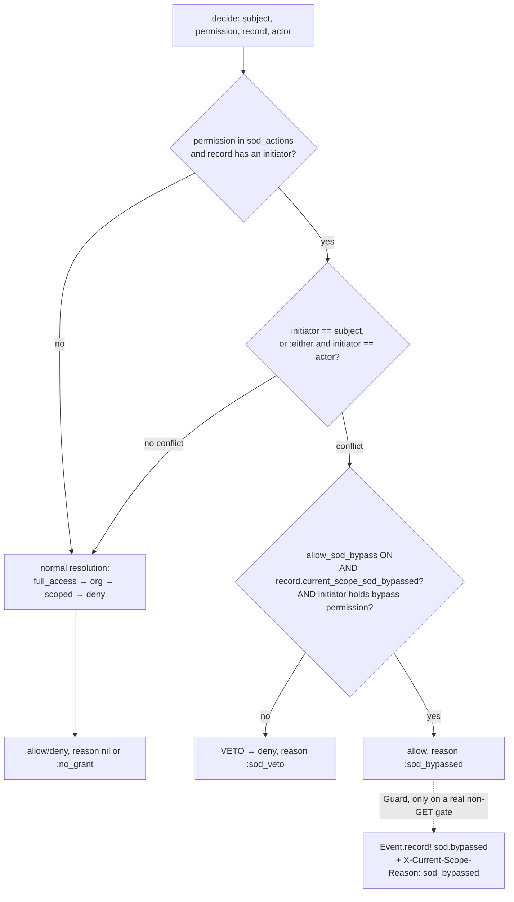

# SoD Break-Glass Override (`allow_sod_bypass`) - Plan

## Goal Capsule

- **Objective:** add an opt-in, default-off, privilege-gated, fully-audited **break-glass** that lets a designated subject waive the separation-of-duties veto on a specific record — the reusable, un-forgettable-audit version of the app-level "maker-checker with override" pattern.
- **Authority hierarchy:** this plan → the settled v0.1 engine model (`README.md`, `resources/DESIGN.md`, `docs/ROADMAP.md`). The resolver decision order (SoD veto → full_access → org role → scoped role → deny), fail-closed posture, one-org-role model, and ambient context are **immutable**. This feature extends behind config with a v0.1-preserving default (`allow_sod_bypass = false`), and does **not** change any existing decision path when the flag is off.
- **Honest framing (load-bearing):** a self-selected bypass converts SoD from a *structural guarantee* into an *audited policy override*. The feature is named **break-glass**, not SoD. Its legitimacy rests entirely on three guarantees — default-off, privilege-gated, and **every bypass recorded by the engine** — so those are requirements, not nice-to-haves.
- **Engine-only, v0.2.** No showcase or host-app code ships here beyond a documented recipe. Test-first for the behavior-bearing units (resolver, Guard); RuboCop omakase clean.
- **Stop conditions:** stop and surface rather than guess if (a) the design would require the resolver to perform a write or hold per-decision state (its purity is non-negotiable — see KTD-1), (b) a change would alter the decision order or any behavior while `allow_sod_bypass` is off, or (c) the bypass could lift the veto without a corresponding ledger row.

---

## Product Contract

> **Product Contract preservation:** new feature, no upstream requirements doc (`product_contract_source: ce-plan-bootstrap`). Design co-developed in session 2026-07-12; see MemPalace `current_scope/decisions`.

### Summary

Introduce `config.allow_sod_bypass` (default `false`). When on, the SoD veto is lifted for a specific record **only** when three conditions all hold, re-validated live at decision time: the record is flagged for bypass by a host-owned hook, and the record's initiator holds a grantable bypass permission, and the config switch is on. Every lifted veto is recorded by the engine at the mutation gate as an append-only audit event and surfaced on the `X-Current-Scope-Reason` response header (`sod_bypassed`). The engine ships the mechanism plus a host recipe; the per-record flag column and the enforcement of *who may set it* stay host concerns, exactly as impersonation ships plumbing + recipe rather than endpoints.

### Problem Frame

The engine's SoD veto is deliberately absolute — the initiator can never perform an SoD action on their own record, overriding even full_access. That is correct for genuine fraud control (contracts, pay runs). But a common real workflow (e.g. the Miele invoice-key request/approval, where the owner or a trusted admin may approve their own request) needs a *conditional* self-approval. Today a host can express this app-side (a second `approve_own` permission plus a controller branch), but that pattern has one forgettable, security-critical step: **recording the override in the audit ledger**. A bypass that isn't logged is a fraud hole dressed as a control. Promoting the pattern into the engine centralizes the audit so it *cannot* be forgotten, and makes the override loud and consistent across every record type that opts in.

### Requirements

- **R1.** `config.allow_sod_bypass` defaults to `false`. With it off, every existing decision is byte-for-byte unchanged — the SoD veto is absolute, and no new hook is ever consulted.
- **R2.** The bypass privilege is a **grantable permission** (default action `bypass_sod`, configurable via `config.sod_bypass_permission`), resolved against the record's route key like any other permission — editable in the role grid, never a hardcoded role name.
- **R3.** The per-record opt-in is read from a **host-defined hook** `current_scope_sod_bypassed?` on the record. A record type that does not define the hook is treated as never-bypassed (**fail-closed**, no raise — unlike `current_scope_initiator`, absence here is unambiguous and safe).
- **R4.** The veto is lifted for a record **iff all three hold, evaluated live at decision time**: `config.allow_sod_bypass` is on AND `record.current_scope_sod_bypassed?` is true AND the record's **initiator** holds the bypass permission. A flag persisted earlier is never trusted on its own — the config and the privilege are re-checked at every decision.
- **R5.** When (and only when) a bypass lifts the veto, the resolver decision carries the machine-readable reason `:sod_bypassed`.
- **R6.** Every bypassed **mutation** is recorded exactly once by the engine as an append-only audit event (`sod.bypassed`) targeting the record, capturing the initiator and the permission — recorded at the enforcement gate, not by the host and not on advisory `allowed_to?` checks. The permitted response carries `X-Current-Scope-Reason: sod_bypassed`.
- **R7.** The resolver remains a **pure** decision function — no writes, no per-decision state, safe to share across threads and memoize (its documented contract). The bypass check only reads; the audit write happens at the Guard layer (KTD-1).
- **R8.** Break-glass composes with impersonation without becoming a laundering path: under `sod_identity = :either`, a bypass lifts the veto only for the initiating identity that actually holds the permission, never by swapping to a different acting identity.
- **R9.** The engine ships the mechanism and a documented host recipe (add the flag column, gate *who may set it*, define the hook). The flag column, its UI, and the who-may-set-it enforcement are explicitly **out of engine scope**.

---

## Key Technical Decisions

- **KTD-1 — The resolver surfaces the reason; the Guard records the audit.** The original framing was "the resolver records the bypass." The resolver (`lib/current_scope/resolver.rb`) is documented and relied upon as a **pure**, memoized, thread-shared decision point with no per-decision state. Making it write ledger rows would break that contract *and* double-record, because advisory `allowed_to?` calls (view button visibility) run the same `decide` path. Resolution: the resolver stays pure and simply carries `:sod_bypassed` in its decision tuple; the **Guard** (`current_scope_check!`), which already runs once per *actual* gated action and is the established audit mutation site, records the event and sets the header. This delivers the same guarantee — engine-owned, un-forgettable, loud — with sound architecture. **This deviates from the literal initial ask; flagged for review.**
- **KTD-2 — Bypass privilege is checked against the record's *initiator*.** Break-glass is "the maker waives the second set of eyes," so the identity that must hold `bypass_sod` is the initiator (`record.current_scope_initiator`) — which is, by construction, the identity the veto fired on. This makes R8 fall out naturally: the veto only fires when the initiator is the subject or (under `:either`) the actor, and the bypass re-checks that same initiator's privilege.
- **KTD-3 — Absent hook is fail-closed silently (no raise).** Unlike `current_scope_initiator` (whose absence on an SoD action is genuinely ambiguous → loud raise), a missing `current_scope_sod_bypassed?` unambiguously means "this type never breaks glass" → treat as `false`. Fail-closed, no configuration burden on record types that don't use the feature.
- **KTD-4 — No production env-gate on `allow_sod_bypass`.** `allow_mutations_while_impersonating` is prod-gated behind an env var because a blanket impersonated-write flag is high-blast-radius and unaudited-by-itself. Break-glass is the opposite: it is inherently per-record, privilege-scoped, and audited-by-construction, and its whole purpose (e.g. Miela invoice keys) is legitimate production use. Gating it behind an env var would defeat the feature. It is loud and documented instead. (Revisit if a real deployment wants the extra ceremony.)
- **KTD-5 — Re-entrancy is bounded.** The bypass check calls `CurrentScope.allowed?(sod_bypass_permission, …)` from inside SoD evaluation. Because `bypass_sod` is not in `config.sod_actions`, that inner decision returns immediately at the veto step without recursing into the bypass check. No loop; documented in the code.

---

## High-Level Technical Design

The bypass is a branch inside the existing step-1 veto check. Everything downstream (full_access → org role → scoped role → deny) is untouched. The decision stays pure; only the Guard, on a permitted-and-bypassed *mutation*, writes the ledger row and header.

*Directional — the prose and requirements are authoritative.* Note the `:sod_bypassed` allow (P) is reachable **only** from the conflict branch, so a non-conflicting or non-SoD action can never be mislabeled a bypass.

---

## Implementation Units

### U1. Config surface for break-glass

- **Goal:** add the two config knobs, default-off, with v0.1-preserving behavior.
- **Requirements:** R1, R2.
- **Dependencies:** none.
- **Files:** `lib/current_scope/configuration.rb`, `test/configuration_test.rb`.
- **Approach:** `attr_accessor :allow_sod_bypass` (default `false` in `initialize`) and `attr_accessor :sod_bypass_permission` (default `"bypass_sod"`). Document both with the honest break-glass framing in the comment blocks, mirroring the existing `sod_actions` / `sod_identity` doc style. No writer guard (contrast the `allow_mutations_while_impersonating` prod-gate — see KTD-4; note the difference in the comment).
- **Patterns to follow:** the existing `attr_accessor` + `initialize` defaults + doc-comment style already in `configuration.rb`.
- **Test scenarios:**
  - `allow_sod_bypass` defaults to `false`; `sod_bypass_permission` defaults to `"bypass_sod"`.
  - Both are assignable and read back.
- **Verification:** config test green; defaults confirmed; RuboCop clean.

### U2. Resolver: bypass lifts the veto and carries `:sod_bypassed`

- **Goal:** teach the SoD step to lift the veto under the three-way AND, staying pure, and to report `:sod_bypassed` on that allow.
- **Requirements:** R3, R4, R5, R7, R8, and KTD-2/3/5.
- **Dependencies:** U1.
- **Files:** `lib/current_scope/resolver.rb`, `test/sod_bypass_test.rb` (new; may lean on the `Report` fixture used by `test/resolver_test.rb`).
- **Approach:** in `sod_veto?`, after computing the `initiator` and confirming a conflict exists (initiator == subject, or `:either` && initiator == actor), consult a private `sod_bypassed?(record:, initiator:)` predicate: `config.allow_sod_bypass && record.respond_to?(INITIATOR-style hook, true) && record.current_scope_sod_bypassed? && CurrentScope.allowed?(config.sod_bypass_permission, subject: initiator, record: record)`. When it returns true, the veto does **not** fire. Thread the bypass outcome up so `decide` returns `[true, :sod_bypassed]` for a lifted veto (extend the tuple to carry a reason on an allow — today reason is populated only on denial). `allow?` still returns `.first`, so its public boolean contract is unchanged. Keep the method free of writes and per-decision instance state (R7). Add a code comment naming the bounded re-entrancy (KTD-5).
- **Execution note:** behavior-bearing security logic — write the failing tests first and watch them go red before editing the resolver.
- **Technical design (directional):** the predicate is a pure `&&` chain; the only new outward call is `CurrentScope.allowed?(sod_bypass_permission, …)`, which is safe to call re-entrantly because `bypass_sod ∉ sod_actions`.
- **Patterns to follow:** the existing `sod_veto?` structure and the `[bool, reason]` tuple convention in `decide`.
- **Test scenarios:**
  - **Happy path:** conflict + config on + hook true + initiator holds `bypass_sod` → `decide` returns `[true, :sod_bypassed]`; `allow?` is true.
  - **Config off (default):** same setup but `allow_sod_bypass = false` → veto stands, `[false, :sod_veto]`. (Proves R1 no-op.)
  - **Hook false:** flag returns false → veto stands.
  - **Hook absent:** record type doesn't define `current_scope_sod_bypassed?` → treated as false, veto stands (fail-closed, no raise — KTD-3).
  - **Not privileged:** initiator lacks `bypass_sod` → veto stands.
  - **No conflict:** initiator ≠ subject/actor → normal allow with reason `nil` (never `:sod_bypassed`).
  - **Non-SoD action:** permission not in `sod_actions` → bypass path never consulted.
  - **Impersonation (`:either`):** actor initiated the record while impersonating a different subject; bypass lifts only if that **initiator** identity holds `bypass_sod` — not by virtue of the *subject* holding it (R8, no laundering).
  - **Purity:** the bypass path performs no DB writes (assert no `current_scope_events` row created by `decide`/`allow?` alone — recording is U3's job).
  - **Re-entrancy:** granting `bypass_sod` does not loop or raise (KTD-5).
- **Verification:** all resolver + bypass tests green; existing `test/resolver_test.rb` unchanged and passing; RuboCop clean.

### U3. Guard records the bypass at the mutation gate and surfaces the header

- **Goal:** record exactly one append-only `sod.bypassed` event, and set `X-Current-Scope-Reason: sod_bypassed`, when the gate permits a bypassed mutation — never on advisory checks.
- **Requirements:** R6, and KTD-1.
- **Dependencies:** U2.
- **Files:** `lib/current_scope/guard.rb`, `test/dummy/app` controller/route additions as needed for a controller test, `test/guard_sod_bypass_test.rb` (new; integration-style through `test/dummy`).
- **Approach:** in `current_scope_check!`, capture the `reason` from `decide` on the permitted path. When `allowed && reason == :sod_bypassed` **and** the request is a mutation (`request.get?`/`request.head?` → skip; SoD actions are mutations, so this is defense-in-depth), call `CurrentScope::Event.record!(event: "sod.bypassed", target: record, details: { permission:, initiator: <gid> })` and set `response.headers["X-Current-Scope-Reason"] = "sod_bypassed"`. The advisory `allowed_to?` path lives in `CurrentScope::Permissions`, not `Guard`, so it never records — this is the structural reason recording lives here (KTD-1).
- **Execution note:** integration-style proof through `test/dummy` — the "records once, and not on advisory checks" guarantee is exactly what a unit-level mock would miss.
- **Patterns to follow:** the existing `Event.record!` call sites at the engine's controller mutation points (audit ledger unit); the `AccessDenied#reason` → `X-Current-Scope-Reason` convention for the denial path.
- **Test scenarios:**
  - **Records once:** a bypassed approve mutation through the gate creates exactly one `sod.bypassed` event targeting the record, with the initiator and permission in `details`; response header is `sod_bypassed`.
  - **Not on advisory:** calling `allowed_to?(:approve, record)` in a view/helper for a bypassable record creates **zero** events (advisory path is not the Guard).
  - **Not on a normal allow:** a non-bypassed permitted action records no `sod.bypassed` event and sets no bypass header.
  - **Append-only:** the recorded event is `readonly?` once persisted (inherits the ledger's contract).
  - **Audit-off:** with `config.audit = false`, the gate still permits the bypassed action but records nothing (consistent with `Event.record!` no-op).
- **Verification:** guard bypass test green; no double-recording; header present on the permitted bypass response; RuboCop clean.

### U4. Documentation and host recipe

- **Goal:** document the feature honestly and give hosts a copy-able recipe.
- **Requirements:** R9 (and the honest-framing mandate).
- **Dependencies:** U1–U3.
- **Files:** `README.md` (new "Break-glass override" subsection near Separation of duties), `lib/current_scope/configuration.rb` (doc comments, done in U1), `docs/ROADMAP.md` / `STATUS.md` (mark the feature landed).
- **Approach:** add a README subsection that (a) states plainly this converts structural SoD into an **audited policy override** — call it break-glass, not SoD; (b) shows the two config knobs; (c) documents the `current_scope_sod_bypassed?` host hook contract and that **who may set the flag is the host's responsibility** (gate the checkbox on the same `bypass_sod` permission); (d) shows the `sod.bypassed` audit event and the `X-Current-Scope-Reason` header; (e) contrasts it with true SoD and with the app-level `approve_own` pattern so readers pick the right tool. Mirror the "engine ships plumbing + recipe, not endpoints" framing used by the Impersonation section.
- **Test expectation:** none — documentation only.
- **Verification:** README renders; the recipe is self-contained; `STATUS.md` "Next" item for break-glass is moved to done.

---

## Verification Contract

- `RAILS_ENV=test bundle exec rake db:create db:migrate` then the engine suite is green, including the new `test/sod_bypass_test.rb` and `test/guard_sod_bypass_test.rb`.
- With `allow_sod_bypass = false` (default), the full existing suite passes unchanged — proving the feature is inert when off (R1).
- `bin/rubocop` clean (omakase).
- Manual/observable: a bypassed approve returns `X-Current-Scope-Reason: sod_bypassed` and leaves exactly one `sod.bypassed` ledger row; the same action with the flag off is vetoed with `:sod_veto`.

## Definition of Done

- All four units landed; resolver stays pure (no writes/per-decision state); decision order unchanged when the flag is off.
- The three-way AND is enforced and re-validated live; absent hook is fail-closed; impersonation cannot launder a bypass (R8).
- Every bypassed mutation is recorded once by the engine and surfaced on the header; advisory checks record nothing.
- README documents the feature with the honest break-glass framing and a host recipe; `STATUS.md` updated.
- Engine suite + RuboCop green.

---

## Scope Boundaries

**In scope:** the config knobs, the resolver bypass branch + `:sod_bypassed` reason, the Guard-side audit recording + header, tests, and docs/recipe — engine only.

**Out of scope (host concerns, documented in the recipe):**
- The per-record flag column/attribute and any migration for it.
- The UI (checkbox at create-time) and the enforcement that *only a `bypass_sod`-privileged maker may set the flag*.
- Any showcase or Miela-app wiring.

### Deferred to Follow-Up Work

- A `config` prod env-gate for `allow_sod_bypass` (deliberately omitted — KTD-4; add only if a deployment asks for the ceremony).
- A test helper (e.g. `with_sod_bypass`) if host request-spec ergonomics warrant it later.
- Surfacing bypass events distinctly in the management UI events index (they already appear as ledger rows).

## Risks & Dependencies

- **Weakening a fraud control (highest).** The feature exists to waive four-eyes. Mitigations are the requirements themselves: default-off, privilege-gated, per-record, live re-validation, and mandatory engine-side audit. The honest-framing docs prevent it being sold as "SoD."
- **Silent-audit regression.** If recording moved back into the pure resolver it would double-record or (guarded against that) drop advisory-vs-mutation distinctions. KTD-1 fixes the site; U3's "not on advisory / records once" tests are the guardrail.
- **Reason-on-allow plumbing.** `decide` currently carries a reason only on denial. Extending it to carry `:sod_bypassed` on an allow must not leak a stale reason onto ordinary allows — covered by the "no conflict → reason nil" and "normal allow → no header" scenarios.
- **Dependency:** relies on the existing audit ledger (`CurrentScope::Event.record!`) and the `current_scope_initiator` seam — both shipped.

## Open Questions

- **Permission granularity:** `sod_bypass_permission` defaults to a per-resource `bypass_sod` key (grantable per record type in the grid). Confirm a single global bypass permission is *not* wanted instead — the per-type default is the safer, more precise choice and is assumed here.
- **Event name:** `sod.bypassed` is assumed, matching the `noun.verb` ledger convention. Adjust if a different taxonomy is preferred before first release.

## Sources & Research

- In-repo seams (read 2026-07-12): `lib/current_scope/resolver.rb` (`sod_veto?`, `decide`, purity contract), `lib/current_scope/configuration.rb`, `lib/current_scope/guard.rb` (`current_scope_check!`), `app/models/current_scope/event.rb` (`record!`, append-only ledger).
- Design rationale and the maker-checker-vs-SoD distinction: session 2026-07-12 (MemPalace `current_scope/decisions`); the app-level `approve_own` pattern this feature promotes.
- Motivating use case: Miela invoice-key request/approval (owner / trusted-admin self-approval).
