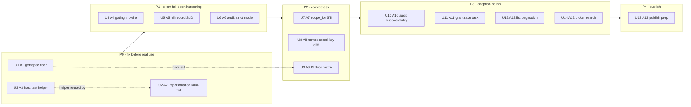

# CurrentScope Engine Readiness Remediation (P0–P4) - Plan

## Goal Capsule

- **Objective:** make the CurrentScope engine safely adoptable by real host apps by closing every gap in the readiness audit (`docs/READINESS-AUDIT.md`, items A1–A13, priorities P0→P4): packaging claims that don't match the code, security protections that fail **silently** on host misconfiguration, correctness bugs, and adoption ergonomics.
- **Authority hierarchy:** this plan → `docs/READINESS-AUDIT.md` (the authoritative source; every A-item and its acceptance check is carried forward verbatim in intent) → the settled v0.1 model (`resources/DESIGN.md`, `README.md`). The audit's **"Verified holding — DO NOT regress"** invariants are immutable; every change preserves them and adds a regression test.
- **Execution profile:** Deep, phased P0→P4. Each phase is independently shippable; units are commit-sized and roughly one-per-A-item. Test-first for the behavior-bearing units. The silent-fail-open items are **not** uniform "loud-fail revert-guards" — they differ by what the code can actually observe (validated by an intent-engineering predictability pass): **A6** delivers a clean revert-guard (strict mode raises + rolls back, test fails if reverted); **A4** ships an independent opt-in tripwire *mixin* with its own guard test; **A5** gets characterization coverage plus an opt-in dev-mode nudge (no prod behavior change); **A2** is **docs + a loud check at the impersonation-boundary API** — the permission path can't observe the misconfig, but `record_impersonation_started!` is a host declaration of intent, so a nil `actor_method` there is a crisp, non-noisy signal (see KTD-2); no unconditioned per-request warning.
- **Definition of done signal:** engine suite green + RuboCop omakase clean per unit; a regression test added for every fix; `STATUS.md` ticked as items land; the audit's acceptance check satisfied for each A-item.
- **Stop conditions:** stop and surface rather than guess if (a) a fix would change the resolver's fixed decision order or violate a "DO NOT regress" invariant, (b) the A1 floor decision would break the showcase or an intended host, or (c) a "loud-fail" design (A2/A4) cannot distinguish misconfiguration from legitimate use without false positives.

---

## Product Contract

> **Product Contract preservation:** sourced from `docs/READINESS-AUDIT.md` (an engine self-audit, not a ce-brainstorm doc). This plan enriches it into implementation units without changing its findings or acceptance criteria. No product-scope change.

### Summary

Fix, in priority order, the thirteen readiness items: **P0** — the false gemspec Rails floor (A1), impersonation security going silently inert when `actor_method` is unset (A2), and the missing host request/system-spec test helper (A3). **P1** — three silent-fail-open hardenings: a "was this action gated?" tripwire (A4), the SoD veto silently skipped on a nil record (A5), and audit silently no-op'ing a committed mutation (A6). **P2** — correctness polish: `scope_for` under-listing STI subclasses (A7), view-helper/gate key drift under namespaced controllers (A8), and CI proving the advertised Ruby/Rails floors (A9). **P3** — adoption polish: `config.audit` discoverability (A10), a first-owner bootstrap rake task (A11), and pagination/scaling for large tables (A12). **P4** — publish prep (A13). Every fix keeps the resolver order and the audit's verified invariants intact and ships with a regression test.

### Problem Frame

The gate itself is trustworthy as designed — the resolver is fail-closed, SoD overrides `full_access`, the management UI is gated server-side, the production guardrail fails loud at boot, the ledger is append-only, and no in-gem authorization bypass exists (per the audit's verdict). The gaps are three shapes: **(1) packaging claims that don't match the code** (A1, A9, A13), **(2) security protections that fail silently when a host mis-wires them** (A2, A4, A5, A6), and **(3) adoption ergonomics** (A3, A10, A11, A12) — plus two correctness bugs (A7, A8). The unifying risk in shape (2): a protection that "works" in manual testing but is silently inert in a real host is worse than no protection, because it reads as safe. The remediation's spine is *make silent failures loud where the code can observe them, and prove every claim with a test* — "where the code can observe them" is load-bearing: A2's misconfig is invisible to the permission path but crisply observable at the impersonation-boundary API (KTD-2), so it gets a loud check there plus docs; A5's is observable only at the gate seam, not the shared resolver; A6's only for mutation-wrapping call sites. The plan states per-item what each protection can and cannot guarantee rather than billing all four uniformly.

### Requirements

Each requirement restates an audit item's **acceptance check** as the bar this plan must hit. IDs map 1:1 to audit A-IDs and to the unit that delivers them.

**P0 — fix before real use**

- **R1 (A1 · U1):** the gem installs and every role/grant mutation works on the *declared* minimum Rails version; migrations declare that floor; the README no longer instructs a floor the code contradicts.
- **R2 (A2 · U2):** `actor_method` is documented as **security-critical** (not optional), and a host that omits it *while impersonating* gets a loud signal — via a check inside the impersonation-boundary API (`record_impersonation_started!`), the one seam where impersonation intent is declared. *Note: the permission path cannot detect the misconfig (`actor` falls back to `user`), so hosts that never call the boundary API get docs only; that residual is recorded. No unconditioned per-request warning.*
- **R3 (A3 · U3):** a host request/system spec can place a subject in a role (org-wide and scoped) and assert allow/deny **through the real gate** in a few lines, surviving a real request cycle.

**P1 — harden silent fail-opens**

- **R4 (A4 · U4):** an action that was never gated by `current_scope_check!` is catchable in test/dev via an **independent opt-in tripwire mixin** — separate from the Guard `before_action` so a host can add it to a base controller that lacks the gate (the ungated case the check must reach); base-controller inclusion is documented as assumption #1.
- **R5 (A5 · U5):** the nil-record SoD skip is documented as member-action misuse and pinned by a characterization test proving the asymmetry, **plus** an opt-in dev-mode nudge that fires on the crisp condition `action ∈ sod_actions AND record nil AND an org-wide grant would otherwise allow` — dev/test only, prod behavior unchanged (bulk/collection paths untouched).
- **R6 (A6 · U6):** an audit-mandatory host can set a strict mode so a missing events table **raises and rolls the mutation back** rather than committing an unaudited grant — for every *mutation-wrapping* `record!` call site (the grant/role paths; the two bare impersonation-boundary calls are explicitly carved out — a strict raise there is a loud 500, nothing unaudited to lose). The current graceful default stays documented.

**P2 — correctness polish**

- **R7 (A7 · U7):** `scope_for(STISubclass)` returns exactly the records the per-record gate allows (normalize to `base_class`).
- **R8 (A8 · U8):** no silent shown-but-403 in namespaced views; helper/gate agreement documented, with a full-key escape hatch recommended.
- **R9 (A9 · U9):** CI proves the claimed Ruby/Rails minimums (matrix), or the declared floors are set to the tested reality.

**P3 — adoption polish**

- **R10 (A10 · U10):** `config.audit` appears in the generated initializer and the README config section.
- **R11 (A11 · U11):** a `current_scope:grant` rake task exists and is documented, so the first-owner assignment isn't a bare console step.
- **R12 (A12 · U12):** the subjects page, events index, and scoped-role picker scale via indexed SQL / pagination rather than in-Ruby filtering of capped row sets.

**P4 — publish**

- **R13 (A13 · U13):** `CHANGELOG.md` exists; gemspec metadata is complete (`changelog_uri`, `rubygems_mfa_required`, deduped homepage/source, bounded `rails` dependency); `gem build` is warning-clean; the engine is publishable and the showcase can later swap off its vendored path gem.

### Traceability & coverage

| Audit | Priority | Unit | Behavior-bearing? | Regression test focus |
|---|---|---|---|---|
| A1 | P0 | U1 | yes | mutation works on declared floor; migration-version diff before any bump |
| A2 | P0 | U2 | yes (boundary-API check) + docs | nil `actor_method` at `record_impersonation_started!` → loud; RBAC-only hosts not nagged |
| A3 | P0 | U3 | yes (test infra) | request-spec allow/deny through the gate |
| A4 | P1 | U4 | yes (own mixin) | ungated action reachable by the tripwire mixin → raises in test/dev |
| A5 | P1 | U5 | characterize + dev-nudge | nil-record SoD skip asymmetry pinned; dev nudge on crisp condition |
| A6 | P1 | U6 | yes (loud-fail) | strict mode raises + rolls back; audit-mandatory host can't lose an event |
| A7 | P2 | U7 | yes | `scope_for(subclass)` == gate |
| A8 | P2 | U8 | docs + optional align | namespaced helper/gate agreement |
| A9 | P2 | U9 | CI | declared floor exercised |
| A10 | P3 | U10 | docs/config | — |
| A11 | P3 | U11 | yes | `current_scope:grant` grants full_access |
| A12 | P3 | U12 (pagination) + U14 (picker) | yes | list pagination; picker via opt-in Scopeable search hook/column |
| A13 | P4 | U13 | packaging | `gem build` warning-clean |

**Coverage map (explicit out-of-scope):** the v0.2 break-glass `allow_sod_bypass` feature is planned separately in `docs/plans/2026-07-12-001-feat-sod-bypass-breakglass-plan.md`. The showcase Dockerfile rewrite is a separate showcase-repo plan. Roadmap features — resource-hierarchy cascade (ROADMAP §2.3), resolver memoization (§2.4), feature flags (§2.5) — are deferred future features, **not** adoptability blockers; they stay out of this remediation (see Scope Boundaries).

---

## Key Technical Decisions

- **KTD-1 — A1: raise the gemspec Rails floor to `>= 8.0` (with a sane upper bound), rather than rewriting `params.expect` → `require/permit`.** The engine already uses Rails 8 APIs (`params.expect`), the README teaches hosts `params.expect`, and the showcase runs 8.1. Raising the declared floor to match reality is the honest, smaller change and keeps the modern API. *(Rejected: downgrading to `require/permit` to support 7.1 — more churn, abandons a cleaner API, no known host needs 7.1.)* **Migration versions are a separate axis (convention-lens F3):** the `ActiveRecord::Migration[X.Y]` bracket pins *generation-time defaults* (index/timestamp behavior), not the gem's minimum Rails — and `create_current_scope_events` is explicitly a FROZEN schema. So U1 **diffs** what `Migration[7.1]` vs `[8.0]` actually changes for the engine's migrations before touching them; bump only if the diff is inert (hygiene) or treat any real change as its own decision — never a mechanical "match the floor" pass.
- **KTD-2 — A2 is docs-first; A4 is an independent tripwire mixin (predictability-lens F1/F2).** These are *not* symmetric loud-fail assertions:
  - **A2** cannot be detected from the *permission-check* path (with `actor_method` nil, `Current.actor` falls back to `user`, so `impersonating?` is always false; `actor_method` defaults nil on every host, so a per-request check would nag every correctly-configured RBAC-only install). **But there is exactly one non-noisy seam** (security-lens F1): the engine's public boundary API `CurrentScope.record_impersonation_started!` / `record_impersonation_stopped!` is called **only when a host is actually impersonating** — an unambiguous declaration of intent. So A2 = **docs** (flag `actor_method` security-critical) **+ a loud check inside `record_impersonation_started!`**: if `config.actor_method` is nil there, raise (or warn-loud in dev) naming the inert protections. This *meets* the audit's acceptance for hosts using the boundary API; there is **no** unconditioned per-request warning (it would cry-wolf on every RBAC-only host). Hosts that never call the boundary API get docs only — recorded honestly as the residual.
  - **A4** must live in its **own mixin, independent of the Guard `before_action`** — an `after_action` inside the Guard mixin can't see a controller that never included Guard (the ungated API/hand-rolled base it targets), and on an including controller the `before_action` always runs unless skipped (so there's no "forgot to authorize" state there, unlike Pundit's manual `authorize`). The tripwire ships as a separate opt-in mixin a host adds to the base that lacks the gate; it honors `skip_before_action` and is a dev/test aid, off by default.
- **KTD-3 — A6: fold audit config into a tri-state `config.audit = false | true | :strict` (simplicity-lens).** Rather than a second boolean (four combos, one meaningless), one knob with three states: `false` (off), `true` (default graceful-degrade, unchanged), `:strict` (missing table raises → mutation rolls back). **The rollback guarantee applies to *mutation-wrapping* `record!` calls** (the grant/role controller paths, which ARE transaction-wrapped — audited in review). The two impersonation-boundary calls (`record_impersonation_started!` / `_stopped!` in `lib/current_scope.rb`) run bare and are **explicitly carved out**: under `:strict` a missing table raises there as a loud 500 on a mis-migrated host — acceptable, since there is no DB mutation to leave unaudited (only the event row itself would be lost). So R6/this KTD say "every *mutation-wrapping* call site," not "every call site" (adversarial B2 / security F2). `config.audit` is read in exactly one place and never as `== true`, so `:strict` (truthy) is safe with existing code — U6 adds a guard test for that (adversarial L3).
- **KTD-4 — Preserve every "Verified holding" invariant; add regression tests rather than loosening.** Resolver fixed order, SoD-before-full_access, nil-subject-deny, loud missing-initiator-hook, guard fail-closed on unknown permission, management-UI server-side gating, CSRF inherited, append-only ledger, `scope_for` fail-closed, production guardrail. Any unit that touches this code adds a test that fails if the invariant is removed.
- **KTD-5 — A9: matrix-test the declared floor.** After A1 sets the floor to `>= 8.0`, CI adds a job (or matrix axis) that installs and runs the suite against that minimum, so the claim is proven, not asserted.
- **KTD-6 — Test-first, but per-item (not a uniform loud-fail claim).** Items with a real runtime protection get a revert-guard written to fail-first: **A6** (strict raise + rollback on wrapped paths), **A4** (the tripwire mixin raises on an unmarked ungated action), and **A2** (a nil-`actor_method` raise inside `record_impersonation_started!`). **A5** gets a characterization test pinning the asymmetry + a test of the opt-in dev nudge. A2's residual (hosts that never call the boundary API) is docs, not a guarded gate.

---

## High-Level Technical Design

The remediation is a **phased worklist**, not a new subsystem — the right visual is the phase/dependency shape and the priority spine, not a component diagram. Phases ship in order; within a phase, units are independent unless noted.

One cross-phase dependency worth calling out: **U9 (CI floor job) depends on U1** (there is no floor to test until A1 sets it). *(An earlier draft coupled U2's test to U3's request helper; after the A2 reframe, U2's signal lives at the boundary API and is a unit-level assertion — no request cycle, no U3 dependency.)*

---

## Implementation Units

### U1. A1 — Correct the gemspec Rails floor (and everything that lies about it)

- **Goal:** the declared Rails floor matches the code; mutations work on that floor; the README stops propagating a false minimum.
- **Requirements:** R1.
- **Dependencies:** none.
- **Files:** `current_scope.gemspec`, `db/migrate/*` (migration version headers), `README.md` (the `params.expect` guidance ~lines 153, 283), `app/controllers/current_scope/roles_controller.rb`, `.../scoped_role_assignments_controller.rb`, `.../role_assignments_controller.rb` (verify they stay on `params.expect`), `test/` (a floor-marker test or gemspec assertion).
- **Approach:** per KTD-1, set `add_dependency "rails", ">= 8.0", "< 9"` (confirm the exact upper bound against the current lockfile). Audit the README for any `>= 7.1` claim or 7.x instruction and correct it. Do **not** rewrite `params.expect`. **Migration versions are handled separately (KTD-1 / convention-lens F3):** do NOT blanket-bump the `ActiveRecord::Migration[X.Y]` brackets to match the floor — first diff what `[7.1]` vs `[8.0]` changes in generation-time defaults for these specific migrations; the events migration is a FROZEN schema, so a silent default change there is a regression. Bump only if the diff is inert, and treat any real change as its own decision.
- **Patterns to follow:** existing gemspec dependency style; the FROZEN-schema comment on `db/migrate/20260710000002_create_current_scope_events.rb`.
- **Test scenarios:**
  - Happy path: gemspec loads; `Gem::Specification` shows the `>= 8.0, < 9` Rails requirement (a small spec test or a `gem build` check).
  - Migration-version safety: document (or test) that no migration's generated schema shape changed as a side effect of any bracket bump — the events schema stays byte-for-byte as frozen.
  - Regression: a management-UI mutation (role create / permission toggle / assignment) succeeds — proving `params.expect` works on the declared floor (existing controller tests; assert they run on the floored dependency).
- **Verification:** gemspec floor is `>= 8.0`; migrations agree; README carries no sub-8.0 claim; existing mutation tests green.

### U2. A2 — Loud `actor_method` check at the impersonation-boundary API (+ docs)

- **Goal:** a host that wires impersonation but forgets `actor_method` gets a loud signal at the moment it declares impersonation intent — instead of silently inert act-as security (dead MutationGuard, dead SoD `:either`, mis-attributed audit).
- **Requirements:** R2.
- **Dependencies:** none.
- **Files:** `lib/current_scope.rb` (the `record_impersonation_started!` / `record_impersonation_stopped!` methods — the loud check), `README.md` (impersonation section), `test/` (a test that the boundary API raises/warns when `actor_method` is nil).
- **Approach:** per KTD-2. The permission path can't observe the misconfig (`actor` falls back to `user`, and `actor_method` defaults nil on every host — an unconditioned per-request warning would cry-wolf on all RBAC-only installs). **The one crisp, non-noisy seam is the boundary API** (`record_impersonation_started!` / `_stopped!`): a host calls it only when actually impersonating, so a nil `config.actor_method` at that point is an unambiguous misconfiguration. Add a loud check there — **raise** a `ConfigurationError` (or warn-loud in dev / raise in `production`, mirroring the production guardrail posture) naming the inert protections. Plus (2) rewrite the README impersonation section to flag `actor_method` as **security-critical, not optional**, listing exactly what goes inert without it. Do **not** add an unconditioned per-request warning. Record the residual honestly: a host that impersonates via a bespoke path and never calls the boundary API gets docs only.
- **Patterns to follow:** the production guardrail raise in `configuration.rb`; the `user_method`-missing raise in `context.rb`; the existing `record_impersonation_started!` methods in `lib/current_scope.rb`.
- **Test scenarios:**
  - Loud signal (regression guard): `record_impersonation_started!` called with `config.actor_method` nil → raises/warns-loud naming the inert protections. Fails if the check is removed.
  - No false positive: an RBAC-only host that never calls the boundary API gets **no** warning on ordinary requests.
  - Configured correctly: `record_impersonation_started!` with `actor_method` set → no signal.
  - Docs: the README impersonation section states `actor_method` is security-critical and lists what goes inert without it.
  - Invariant preserved: with `actor_method` set, SoD `:either` still vetoes an actor-initiated record (DO-NOT-REGRESS).
- **Verification:** omitting `actor_method` while impersonating is caught at the boundary API; RBAC-only hosts are never nagged; the docs-only residual is recorded.

### U3. A3 — Ship a host request/system-spec test helper

- **Goal:** a host can place a subject in a role (org-wide and scoped) and assert allow/deny through the **real** gate in a few lines, surviving a real request cycle.
- **Requirements:** R3.
- **Dependencies:** none. (Unblocks a cleaner U2 regression test.)
- **Files:** `lib/current_scope/test_helpers.rb` (extend), `README.md` ("Testing your app" section), `test/` (a test that exercises the helper through a dummy request).
- **Approach:** add **`grant_role!(subject, role:)`** and **`grant_scoped_role!(subject, role:, record:)`** (convention-lens F1/F2): bang-suffixed to match the engine's other DB-mutating helpers (`seed_defaults!`, `Event.record!`), and *not* named `sign_in_*` — they seed grants, they do **not** authenticate the session (naming them after Devise's `sign_in` would promise login state they don't provide). They create `Role` + `RoleAssignment` / `ScopedRoleAssignment` rows that survive a real request cycle — unlike `with_current_user`, which only sets `Current.user` in-process and is overwritten by `Context`'s `before_action`. The contract to document: these seed grants; the host still authenticates via its own auth. Keep `with_current_user` for unit/view/component checks.
- **Execution note:** prove it end-to-end — a dummy-app request spec that signs a subject into a role and asserts a 200/403 through the gate, not a stubbed unit.
- **Patterns to follow:** existing `test_helpers.rb`; the dummy app request tests in `test/integration/guard_test.rb`.
- **Test scenarios:**
  - Happy path: `grant_role!(user, role: reviewer_role)` then a request to a gated action → allowed (200); a request to an ungranted action → 403.
  - Scoped: `grant_scoped_role!` opens exactly one record; a sibling record 403s through the gate.
  - Lifecycle: the seeded grant survives the `Context` `before_action` re-resolution (the precise gap `with_current_user` has).
  - Isolation: helper-seeded state does not leak across tests (CurrentAttributes reset invariant preserved).
- **Verification:** a host request spec asserts allow/deny through the gate in a few lines; documented in the README testing section.

### U4. A4 — "Was this action gated?" tripwire (independent opt-in mixin)

- **Goal:** an action on a controller that never included Guard (an API base controller, a hand-rolled `ActionController::Base`) is catchable in test/dev instead of silently ungated.
- **Requirements:** R4.
- **Dependencies:** none.
- **Files:** `lib/current_scope/gating_tripwire.rb` (new — a standalone mixin), `lib/current_scope.rb` (**add `require "current_scope/gating_tripwire"`** — modules are explicitly required here, no Zeitwerk autoload; feasibility-lens), `lib/current_scope/guard.rb` (optional: record that `current_scope_check!` ran), `README.md` (assumptions section), `test/` (new tripwire test + a dummy controller that includes the tripwire without Guard).
- **Approach:** per KTD-2, ship the tripwire as its **own opt-in mixin, separate from Guard** — an `after_action` inside Guard can never see a controller that didn't include Guard (the exact ungated case). **The mixin must own its exempt marker (adversarial B1 / feasibility):** it can NOT rely on `skip_before_action :current_scope_check!` to mark a public action, because on a non-Guard controller `current_scope_check!` isn't a defined callback and `skip_before_action` raises `ArgumentError` at class load — self-defeating on the exact controllers the tripwire targets. Instead the mixin ships a first-class skip API (Pundit `skip_authorization` idiom, e.g. `current_scope_skip_tripwire!` / a class-level `skip`). The `after_action` raises when the action neither ran a gate **nor** was marked skipped via that API. Discriminate "gated" on `respond_to?(:current_scope_check!, true)` (Guard present + a request-local "ran" flag) rather than on `skip_before_action` bookkeeping. Off by default; a dev/test aid, not a runtime gate. Document base-controller inclusion as adoption assumption #1, **and the known blind spot** (security-lens F3): an `after_action` does not run when a `before_action` halts the chain (renders/redirects), so a controller that renders a 2xx from a `before_action` escapes the tripwire — the tripwire is a strong aid, not total. *(Resolves convention-lens F5: the opt-in surface is a host-added mixin with its own skip API — the Pundit idiom — not a `config.*` boolean.)*
- **Execution note:** test-first — a controller with the tripwire mixin but no Guard/gate should raise on an unmarked action, and NOT raise on one marked with the mixin's own skip API; then a Guard'd action should not raise.
- **Patterns to follow:** Pundit `verify_authorized` / `skip_authorization`; the existing mixin structure of `Guard` / `Context` / `Permissions`; the `require` list in `lib/current_scope.rb`.
- **Test scenarios:**
  - Regression guard: a controller including the tripwire mixin but **not** Guard → an unmarked action raises (the ungated case the tripwire exists to catch).
  - Skip honored (via the mixin's OWN API): an action marked `current_scope_skip_tripwire!` on a non-Guard controller → no raise (this is the scenario `skip_before_action` cannot satisfy).
  - Gated normal: a Guard'd action that ran the check → no raise.
  - Off by default: a controller that doesn't include the tripwire mixin is unaffected.
  - Blind-spot documented (not a passing test, a doc note): a `before_action` that renders halts the chain and the tripwire's `after_action` won't fire — stated as a known limit.
- **Verification:** an ungated base controller is catchable in test/dev via the mixin; a public action is exemptable via the mixin's own API; blind spot documented; assumption #1 documented.

### U5. A5 — SoD veto silently skipped when `current_scope_record` returns nil

- **Goal:** close/attest the asymmetry where an SoD-gated member action whose record hook returns nil lets an org-wide-granted subject through with SoD never applied — while a *present* record with a *missing initiator hook* raises loud.
- **Requirements:** R5.
- **Dependencies:** none.
- **Files:** `lib/current_scope/guard.rb` (~line 45 — **the nudge seam**, where "member action returned a nil record" is meaningful), `lib/current_scope/configuration.rb` (the dev-nudge opt-in flag), `README.md` (SoD section — the member-action record contract, **the load-bearing control**), `test/resolver_test.rb` or a new `test/sod_nil_record_test.rb`, `test/integration/guard_test.rb` (nudge test).
- **Approach:** **document + characterization test + an opt-in dev-mode nudge.** Prod behavior unchanged — a nil record is a legitimate collection-action case, so no unconditional raise. **Emit the nudge from the Guard gate path, NOT the shared resolver seam (adversarial M3):** `sod_veto?` runs inside `decide`, which every view/helper `allowed_to?` and `scope_for` also calls — a nudge at `resolver.rb:83` would fire on every nav paint that renders `allowed_to?(:approve)` with no record, and would have to re-run the org-grant check `decide` does anyway. The Guard's `current_scope_check!` (`guard.rb:45`) is where "an SoD member action was gated with a nil record hook" is actually meaningful, so place the opt-in nudge there. (1) Document that SoD-gated **member** actions MUST return the record from `current_scope_record` — this README contract is the **load-bearing control** (security-lens F4: the nudge is opt-in, so a host not running dev with the flag gets no signal; docs carry the weight). (2) Characterization test pinning the asymmetry (present record + missing initiator → raises; absent record → skips). (3) The opt-in nudge fires on `action ∈ config.sod_actions AND record nil AND an org-wide grant would allow`. Not branded a loud-fail revert-guard (no prod behavior to guard).
- **Execution note:** characterize both arms of the asymmetry first; place the nudge at the Guard seam so it doesn't fire on shared resolver calls.
- **Patterns to follow:** the loud missing-initiator raise in `resolver.rb:88-94`; the Guard `current_scope_check!` structure; the opt-in dev-flag posture used by U4.
- **Test scenarios:**
  - Present record + missing initiator hook → raises (DO-NOT-REGRESS, existing).
  - Absent record (hook returns nil) on an SoD action + org-wide grant → allowed (prod unchanged); test pins this and the docs name it member-action misuse.
  - Dev nudge (opt-in, at the Guard seam): the crisp condition logs a nudge; a view `allowed_to?(:approve)` with no record does **not** nudge (proves the seam choice avoids the shared-path noise).
  - Caveat (documented, not a false claim): a legitimately collection-level action whose name collides with an `sod_actions` entry (e.g. a bulk `approve`) + an org grant can false-fire — rare, opt-in, dev-only (adversarial L2). No false-*miss*: scoped grants can't allow a nil record, so org-grant-only is the correct trigger.
  - Documented contract: an SoD-gated member action returning the record → veto applies correctly.
- **Verification:** the asymmetry is documented and pinned; the README member-action contract is the primary control; the opt-in nudge fires at the gate seam only; prod behavior unchanged.

### U6. A6 — Audit strict mode (no silently-unaudited mutation)

- **Goal:** an audit-mandatory host cannot commit a mutation with no audit row when the `current_scope_events` table is missing (partial upgrade).
- **Requirements:** R6.
- **Dependencies:** none.
- **Files:** `lib/current_scope/configuration.rb` (the tri-state `audit` accessor), `app/models/current_scope/event.rb` (~lines 60–70, the `StatementInvalid` rescue), `README.md` / initializer (document the tri-state), `test/` (extend the event tests).
- **Approach:** per KTD-3 (simplicity-lens), make `config.audit` **tri-state: `false | true | :strict`** — one knob. `false` = off (unchanged), `true` = default graceful-degrade (warn-once + no-op, unchanged), `:strict` = a missing `current_scope_events` table makes `record!` **raise** instead of warn-once-nil, rolling back the enclosing mutation rather than committing it unaudited. The change is **contained to the single `record!` method** (the top `return unless config.audit` guard — `:strict` is truthy — plus the `StatementInvalid` rescue), not scattered across call sites (feasibility-lens positive).
  - **Scope the guarantee correctly (adversarial B2 / security F2 / feasibility): the rollback guarantee applies to *mutation-wrapping* `record!` calls only.** An audit of all `record!` sites (done in review) shows the five grant/role controller paths ARE transaction-wrapped, but the two **impersonation-boundary** calls (`record_impersonation_started!` / `_stopped!` in `lib/current_scope.rb`) run bare from the host's session endpoints — there is no DB mutation to roll back there. So `:strict` **explicitly carves out the boundary-event calls**: a strict raise there is an acceptable loud 500 on a mis-migrated host (nothing unaudited is committed — only the event row itself would be lost), not the "unaudited grant" failure A6 targets. Reword R6/KTD-3 as "every *mutation-wrapping* call site," not "every call site."
  - Also **re-assert the existing invariant** (security F6): a raised audit failure already rolls back the mutation for the wrapped paths — `:strict` extends *when* it raises (missing table), it does not invent the rollback. And add a guard test that no other reader treats `config.audit` as a strict boolean `== true` (adversarial L3) so a future refactor can't silently disable `:strict`.
- **Execution note:** test-first — under `:strict` with the events table dropped, a wrapped mutation must raise and roll back. **Simulate the missing table properly** (feasibility): the existing `with_failing_event_record` helper redefines `record!` wholesale and never exercises the `StatementInvalid`/`missing_events_table?` rescue — instead `connection.drop_table(:current_scope_events)` (recreate in teardown; SQLite DDL isn't transactional) or stub `create!` to raise `StatementInvalid("no such table: current_scope_events")`.
- **Patterns to follow:** the existing `missing_events_table?` / `warn_missing_events_table_once` logic in `event.rb`; the append-only + transactional-rollback invariant.
- **Test scenarios:**
  - Default (`true`): table missing → `record!` warns once and returns nil; the mutation still commits (today's behavior, DO-NOT-REGRESS).
  - Strict, wrapped path (loud-fail regression guard): `config.audit = :strict` + table dropped → a grant/role mutation raises and **rolls back** (no orphaned assignment) — asserted on **≥2** distinct wrapped `record!` paths.
  - Strict, boundary path: `record_impersonation_started!` under `:strict` + table dropped → raises a loud 500 at the host endpoint; no grant is committed unaudited (there is none to commit) — documented as the accepted boundary behavior, not a rollback.
  - Off (`false`): `record!` no-ops regardless of table state (unchanged).
  - Table present: `true` and `:strict` record exactly one row (unchanged).
  - Missing-column (not missing-table) still raises in all modes (existing `\bcolumn\b` exclusion, DO-NOT-REGRESS).
  - Config reader: no code path treats `config.audit == true` as a boolean (so `:strict` can't be silently downgraded).
- **Verification:** an audit-mandatory host (`:strict`) cannot silently commit an *unaudited grant*; the boundary-event carve-out is documented; the default stays graceful; one knob documented.

### U7. A7 — `scope_for` STI subclass normalization

- **Goal:** `scope_for(SomeSTISubclass)` returns exactly the records the per-record gate allows.
- **Requirements:** R7.
- **Dependencies:** none.
- **Files:** `lib/current_scope/resolver.rb` (~lines 61–65 `scope_for` filter; contrast the gate's `base_class` storage ~113–115), `test/scope_for_test.rb`, **plus new dummy STI fixtures** — `test/dummy/app/models/*` (an STI base + subclass), a `test/dummy/db/migrate/*` migration adding the `type` column, and the `test/dummy/db/schema.rb` update (feasibility: the dummy app has **no** STI model / `type` column today, so the failing test can't be written without these).
- **Approach:** normalize the `scope_for` query to `model.base_class.name` (the gate stores scoped grants keyed on `base_class` via the polymorphic `resource:` write), so a subclass query no longer returns nothing while the gate would allow those records. Cannot over-list — STI's type predicate on `model.where(id: …)` filters sibling-subclass rows sharing the table (security-lens F6). Fail-closed semantics preserved.
- **Execution note:** add the dummy STI base+subclass model + `type` migration first, then a failing `scope_for(Subclass)` test (returns empty today), then the `base_class` fix.
- **Patterns to follow:** the gate's `base_class` handling in the same file.
- **Test scenarios:**
  - Happy path: a scoped grant on an STI subclass record → `scope_for(Subclass)` includes it (fails before the fix).
  - Gate agreement: every record `scope_for(Subclass)` returns passes the per-record gate; every omitted one fails it (the standing `scope_for` invariant, now holding for STI).
  - Base class unaffected: `scope_for(BaseClass)` behavior unchanged.
  - Fail-closed: nil subject → `.none` (DO-NOT-REGRESS).
- **Verification:** `scope_for(subclass)` == what the gate allows.

### U8. A8 — Namespaced helper vs gate key drift

- **Goal:** no silent shown-but-403 (or hidden-but-allowed) link in namespaced/custom-named controllers, where `allowed_to?`/`scope_for` in a view can test a different permission than the gate enforces.
- **Requirements:** R8.
- **Dependencies:** none.
- **Files:** `lib/current_scope.rb` (~lines 96–104 `permission_key` route-key preference), `lib/current_scope/guard.rb` (~line 34, gate enforces `controller_path#action`), `README.md` (namespaced-controllers guidance), `test/permission_catalog_test.rb` / `test/permissions_mixin_test.rb`, **plus a new namespaced dummy controller + route + view** (`test/dummy/app/controllers/admin/*`, `test/dummy/config/routes.rb`) — the dummy app has only top-level controllers today, so reproducing `controller_path` last-segment ≠ `route_key` needs one (feasibility).
- **Approach:** **document, and teach the full-key form as the default for record checks** (predictability-lens F5). Helper + gate agree only when `controller_path`'s last segment == the record's `route_key`; under a namespaced/custom-named controller they diverge → a shown link that 403s. Rather than framing this as "resolved by guidance," teach `allowed_to?("ctrl#action")` as the recommended default for cross-resource/namespaced checks, and **label the short-form divergence a known residual WYSIWYG foot-gun** (not eliminated). Optionally align the helper default toward `controller_path` where safe — but do not claim the short form is safe. Not a bypass (the Guard stays authoritative); keep behavior changes conservative and test-pinned.
- **Execution note:** add a test that reproduces the drift (a namespaced controller whose path segment ≠ route_key) so the residual is proven and documented, before deciding whether to also align the default.
- **Patterns to follow:** the existing `permission_key` derivation and its namespaced handling already covered in `README.md:96-101`.
- **Test scenarios:**
  - Drift reproduction: a namespaced controller where `controller_path` last segment ≠ `route_key` → helper and gate resolve different keys (pinned by test).
  - Full-key escape hatch: `allowed_to?("admin/reports#approve")` agrees with the gate in that controller.
  - Non-namespaced: unchanged agreement (DO-NOT-REGRESS).
- **Verification:** documented boundary; no silent shown-but-403 when hosts follow the guidance.

### U9. A9 — CI proves the declared Ruby/Rails floors

- **Goal:** CI exercises the claimed minimums instead of only the lockfile's Rails 8.1.
- **Requirements:** R9.
- **Dependencies:** U1 (the floor must be set first).
- **Files:** `.github/workflows/ci.yml`, `Appraisals` (new), `gemfiles/*.gemfile` (generated), `current_scope.gemspec`/`Gemfile` (add the `appraisal` dev dependency).
- **Approach:** per KTD-5, use **`appraisal`** (convention-lens F4). Add an `Appraisals` file with a `rails-8.0` entry (and optionally `rails-8.1`), `bundle exec appraisal install` to generate `gemfiles/`, and a CI job that runs `bundle exec appraisal rails-8.0 bin/rails db:test:prepare` then `bundle exec appraisal rails-8.0 bin/rails test` against the floor. The existing `test` job keeps `bundler-cache: true` on the committed `Gemfile.lock` (8.1); the floor job uses the appraisal gemfile instead. A single lockfile can't hold both versions, which is why "a matrix axis" alone is not a mechanism. *(No bad interaction with the showcase — it's a separate repo now; appraisal touches only the engine's dummy-app suite — adversarial non-finding.)* A lighter fallback if `appraisal` is unwanted: a CI step running `bundle update rails --conservative` to the floor before the suite.
- **Execution note:** CI config; verify by a green run against the floor, not unit tests. Decide Appraisal vs `bundle update --conservative` at implementation based on repo weight tolerance (Appraisal is the standard for gems with exactly this floor/ceiling problem).
- **Patterns to follow:** the existing single-Ruby `ci.yml` job; `appraisal`'s standard `gemfiles/` layout.
- **Test scenarios:** `Test expectation: none — CI configuration.` Verification is a green CI run of the suite against the declared minimum Rails/Ruby.
- **Verification:** CI proves the claimed minimums (a matrix cell for the floor passes).

### U10. A10 — Make `config.audit` discoverable

- **Goal:** the load-bearing `config.audit` toggle appears where hosts look.
- **Requirements:** R10.
- **Dependencies:** U6 (documents the tri-state values). Could ride in U6's commit (simplicity-lens note).
- **Files:** `lib/generators/current_scope/install/templates/initializer.rb`, `README.md` (Configuration section).
- **Approach:** add the single tri-state `config.audit` (`false | true | :strict`, from U6) to the generated initializer with a clear comment explaining the three states, and to the README config section. One knob, not two. Pure documentation/scaffolding.
- **Test scenarios:** `Test expectation: none — generated-initializer/docs change.` Verify the generator template renders the new lines and the README lists them.
- **Verification:** `config.audit` is discoverable in both the initializer and the README.

### U11. A11 — First-owner bootstrap rake task

- **Goal:** the first `full_access` assignment isn't a bare console step.
- **Requirements:** R11.
- **Dependencies:** none.
- **Files:** `lib/tasks/current_scope_tasks.rake` (currently an empty placeholder), `README.md` (getting-started), `test/` (a task test).
- **Approach:** add a `current_scope:grant` rake task that seeds/assigns a role (default: the `full_access` Owner) to a given subject, so a fresh install can bootstrap its first admin without hand-writing console commands. Document it in the install flow.
- **Execution note:** test the task's effect (grant created) via a task invocation in the dummy app.
- **Patterns to follow:** `seed_defaults!` in `lib/current_scope.rb`; standard Rails engine rake task conventions.
- **Test scenarios:**
  - Happy path: `current_scope:grant` for a subject creates the org-wide `full_access` assignment; the subject can enter the management UI.
  - Idempotence / re-run: running twice doesn't create a duplicate assignment (one org-wide role per subject invariant).
  - Bad input: an unknown subject id → a clear error, not a silent no-op.
- **Verification:** first-owner bootstrap is a documented one-liner.

### U12. A12 (part 1) — Paginate the subjects page and events index

- **Goal:** the subjects page and events index scale beyond small tables.
- **Requirements:** R12 (list-pagination half).
- **Dependencies:** none.
- **Files:** `app/controllers/current_scope/subjects_controller.rb` (~line 3), `app/controllers/current_scope/events_controller.rb` (~line 8, hard 200 cap), corresponding views, `test/`.
- **Approach:** paginate both with a minimal `limit`/`offset` page slice — dependency-light (prefer a built-in over a heavy pagination gem unless the repo already has one). This is the trivial, safe half of A12 (feasibility: split from the picker, which is a different kind of change).
- **Execution note:** verify the query returns a slice (not load-all) and behavior is unchanged for small tables.
- **Patterns to follow:** the existing controllers' queries.
- **Test scenarios:**
  - With more rows than one page, the controller returns a page slice; navigation reaches later pages.
  - Small-table parity: unchanged when rows fit one page (DO-NOT-REGRESS).
- **Verification:** subjects + events paginate; small-table behavior unchanged.

### U14. A12 (part 2) — Scoped-role picker: replace the in-Ruby label filter

- **Goal:** the scoped-role picker scales past its in-Ruby 500-row cap.
- **Requirements:** R12 (picker-search half).
- **Dependencies:** none (but a genuinely different change from U12 — feasibility: `current_scope_label` is an arbitrary Ruby method with **no backing column**, so a plain `ILIKE` is impossible without either a schema or an API addition).
- **Files:** `app/controllers/current_scope/scoped_role_assignments_controller.rb` (~lines 8–16), `lib/current_scope/scopeable.rb` (if adding a search hook), views, `test/`, **and** — if the indexed-column route is chosen — a host-facing opt-in migration pattern (documented, not shipped as a host migration).
- **Approach:** the picker filters in Ruby *because* the label is computed in Ruby (`Widget` uses the mixin default, others override) — there is nothing to `ILIKE`. Two viable routes, **decide at implementation**: (a) add an opt-in `Scopeable` search hook (`current_scope_searchable_scope(term)`) the host implements to return an indexed relation — keeps the engine schema-free; or (b) document an opt-in indexed label column the host adds. Do **not** claim "indexed SQL" against the Ruby label — that's the infeasibility the review caught. Descope to whichever route is chosen; the current 500-cap in-Ruby filter stays the documented fallback for hosts that adopt neither.
- **Execution note:** this is an **API/contract** change, not a query tweak — spec the `Scopeable` hook (or the column convention) before touching the controller.
- **Patterns to follow:** the existing `CurrentScope::Scopeable` mixin/registry; the `ponytail:` upgrade-path note already in `scoped_role_assignments_controller.rb`.
- **Test scenarios:**
  - With a host-provided `current_scope_searchable_scope`, the picker filters via that indexed relation and returns matches beyond the old 500 cap.
  - Fallback: a Scopeable model without the hook still uses the capped in-Ruby filter (unchanged, DO-NOT-REGRESS).
- **Verification:** the picker scales for hosts that adopt the search hook/column; the no-hook fallback is unchanged and documented.

### U13. A13 — Publish prep

- **Goal:** the gem is publishable and `gem build` is warning-clean.
- **Requirements:** R13.
- **Dependencies:** U1 (bounded `rails` dependency lands there; confirm no double-fix).
- **Files:** `CHANGELOG.md` (new), `current_scope.gemspec` (metadata).
- **Approach:** add `CHANGELOG.md`; add gemspec metadata (`changelog_uri`, `rubygems_mfa_required`); fix the duplicate homepage/source and the open-ended `rails` dependency `gem build` warnings (the bound is set in U1 — verify consistency). Then the engine is publishable and the showcase can later swap its vendored path gem for `gem "current_scope"` (that swap is a showcase-repo task, out of scope here).
- **Execution note:** verify by a clean `gem build` (no warnings) rather than unit tests.
- **Test scenarios:** `Test expectation: none — packaging.` Verify `gem build current_scope.gemspec` emits no warnings and produces the gem.
- **Verification:** `gem build` warning-clean; metadata complete; `CHANGELOG.md` present.

---

## Verification Contract

- Per unit: `RAILS_ENV=test bin/rails db:test:prepare` (the form `ci.yml` proves works — the engine's `bin/rails` runs one command per invocation, so don't chain `db:create db:migrate test` in one call), then the engine suite is green including the unit's new regression test(s); `bin/rubocop` clean.
- The runtime-protection regression tests **fail** if reverted, per-item (KTD-6): **U6** (strict raise + rollback across ≥2 call sites) and **U4** (tripwire mixin raises on an ungated action). **U5** has a characterization test pinning the asymmetry + a dev-nudge test; **U2** has a docs check + a dev-note test (no runtime gate to guard).
- Every "Verified holding" invariant (KTD-4) still passes after each phase.
- U9: a CI run against the declared floor (`>= 8.0`) is green.
- U13: `gem build current_scope.gemspec` is warning-clean.

## Definition of Done

- A1–A13 each meet the audit's acceptance check (Requirements R1–R13), with two honest partials: **A2** meets the "signal in an impersonation setup" clause for hosts using the boundary API and is docs-only for hosts that don't (undetectable there — recorded, not overclaimed); **A12** is delivered as list pagination (U12) plus an opt-in picker search (U14). A8 is documentation + a taught default, not a code guarantee (the short form stays a labeled residual foot-gun).
- A regression test added for every behavior-bearing fix; the runtime-protection items have revert-guards where the code can observe the failure (U6, U4), and the rest (U2 docs, U5 characterize+nudge) have the coverage their actual mechanism supports.
- Resolver decision order and all DO-NOT-REGRESS invariants intact.
- `STATUS.md` ticks each item as it lands; `docs/READINESS-AUDIT.md` items are addressed (the doc can be annotated done or left as the historical audit — implementer's call, but STATUS is the live tracker).
- Engine suite green + RuboCop omakase clean; CI green including the floor matrix.

---

## Scope Boundaries

**In scope:** engine items A1–A13 only.

### Deferred to Follow-Up Work
- **v0.2 break-glass (`allow_sod_bypass`)** — planned separately at `docs/plans/2026-07-12-001-feat-sod-bypass-breakglass-plan.md`.
- **Showcase Dockerfile rewrite** — a separate showcase-repo plan (single-app build now that the engine is vendored).
- **Showcase swap off the vendored path gem** to `gem "current_scope"` — a showcase-repo task, unblocked by U13 but executed there.

### Out of scope (deferred future features — not adoptability blockers)
- **Resource-hierarchy cascade** (ROADMAP §2.3) — opt-in parent→child scoped grants.
- **Resolver memoization / caching** (ROADMAP §2.4) — request-scoped effective-permission cache. *Note: A12 (pagination) is adjacent but distinct — A12 fixes list-surface scaling; §2.4 fixes per-request query fan-out. Doing A12 does not deliver §2.4.*
- **Feature flags layer** (ROADMAP §2.5) — capture-only.

## Risks & Dependencies

- **Silent→loud changes risking false positives (A2, A4).** A loud assertion that fires on a legitimate setup is its own adoption bug. Mitigation: both are opt-in / advisory and honor existing skips; the tests include explicit "no false positive" cases.
- **Changing the declared floor (A1) could exclude an intended host.** Mitigation: KTD-1 confirms the code already requires Rails 8 APIs and the only known consumer (the showcase) runs 8.1; the change makes the truth explicit. Stop-and-surface if a real 7.x host is intended.
- **A6 strict mode interacting with the transactional-rollback invariant.** A raise inside `record!` must roll back the enclosing mutation cleanly — covered by the strict-mode rollback test.
- **A12 scope creep toward a pagination gem.** Keep minimal; prefer a built-in slice unless the repo already depends on one.
- **Dependency:** U9 depends on U1; U13's `rails` bound overlaps U1 (avoid double-fixing — U1 sets `>=8.0,<9`, U13 only verifies + adds metadata).
- **Residual (documented, not fixed here):** under the default `config.audit = true`, a missing events table silently drops the two impersonation-boundary rows (highest-integrity "who impersonated whom") via warn-once-nil — same as any other event under `true`. A host that needs those guaranteed uses `:strict` (and accepts the loud 500 on a mis-migrated boundary endpoint). Called out so it isn't mistaken for a bug.
- **Residual (A4):** the tripwire is an `after_action`, so it can't catch a controller that renders a 2xx from a `before_action` (halted chain) or non-Rails endpoints (Grape/Rack) — documented as a known blind spot, not total coverage.

## Open Questions

- **A1 upper bound:** `< 9` is the assumed cap — confirm against the current lockfile and intended support window at implementation time. **Migration bracket:** whether `Migration[7.1]`→`[8.0]` changes anything for the engine's migrations is a diff to run in U1 (KTD-1), not a default bump.
- **A2 posture at the boundary API:** raise `ConfigurationError` unconditionally vs warn-loud-in-dev / raise-in-production (mirroring the production guardrail) when `record_impersonation_started!` fires with `actor_method` nil — resolve in U2. A raise is defensible because reaching that call *is* the impersonation declaration. The residual (hosts that impersonate without ever calling the boundary API) is docs-only and cannot be detected — recorded honestly.
- **A4 tripwire bookkeeping:** how "the check ran" is recorded (request-local flag set by Guard, read by the separate tripwire mixin) is an implementation detail for U4; the mixin-not-in-Guard decision is settled (KTD-2).
- **A12 pagination approach:** built-in slice vs an existing repo dependency — decide at U12 based on what's already available (keep minimal; avoid a heavy gem).

## Sources & Research

- **Authoritative origin:** `docs/READINESS-AUDIT.md` (items A1–A13, the "Verified holding" invariants, and the per-item acceptance checks). External research intentionally skipped — the audit already grounds every item in exact `file:line` within the engine's own code, and local patterns are strong.
- **Reconciled against:** `docs/ROADMAP.md` (§2.3/§2.4/§2.5 deferred features; §2.1/§2.2/§2.6 already shipped), `STATUS.md` (live tracker), and the settled v0.1 model in `resources/DESIGN.md` / `README.md`.
- **Adjacent plans:** `docs/plans/2026-07-12-001-feat-sod-bypass-breakglass-plan.md` (break-glass, separate).
- **Validation (two passes, 2026-07-12):** revised after an **intent-engineering** plan-validation pass (predictability / simplicity / convention) and a **ce-doc-review** pass (security / adversarial / feasibility). Material changes: A6 audit config folded to tri-state `false|true|:strict`; A4 moved to an independent tripwire mixin **with its own skip API** (a `skip_before_action`-based exemption is impossible on a non-Guard controller) + a `require` line; A5 → characterize + opt-in dev-nudge **placed at the Guard seam** (not the shared resolver); U1 migration-version bump gated behind a behavior diff (FROZEN schema); U3 helpers renamed `grant_role!`/`grant_scoped_role!`; U9 names Appraisal + its CI wiring; U8 teaches the full-key form and labels the short form a residual foot-gun. **The security lens corrected the IE pass on A2:** it is *not* fully undetectable — the impersonation-boundary API (`record_impersonation_started!`) is a crisp seam, so A2 now ships a loud check there + docs (no cry-wolf per-request warning). A6's "every `record!` in a transaction" was **false** (the two boundary-event calls are bare) → the guarantee is scoped to mutation-wrapping call sites with the boundary events carved out. A12 split into U12 (list pagination) + U14 (picker search, which needs a Scopeable search hook/column — an `ILIKE` on the Ruby-computed label was infeasible). U7/U8 gained the dummy STI + namespaced fixtures their tests require.
