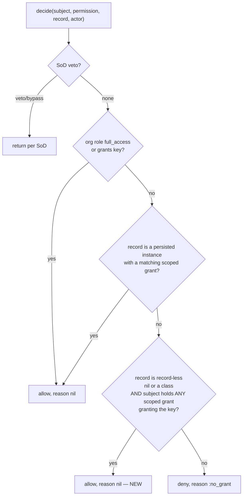

# Scoped grants open the collection gate (record-less scoped check) - Plan

## Goal Capsule

- **Objective:** make the collection gate and `scope_for` agree, so the README's advertised *scoped index* actually works: a subject holding only scoped grants reaches a gated `#index` (and other collection/class-form checks) whose role ticks the key, and `scope_for` narrows the list to exactly the records they were granted. Today the gate turns them away, and the org-wide grant needed to pass it makes `scope_for` return every record — no grant combination yields a gated index of only the scoped subset.
- **Authority hierarchy:** this plan → the settled v0.1 engine model (`README.md`, `resources/DESIGN.md`, `docs/ROADMAP.md`). The resolver decision order (SoD veto → full_access → org role → scoped role → deny), fail-closed posture, one-org-role-per-subject, resolver **purity** (no writes, no per-decision state, thread-shared/memoizable), and ambient `CurrentAttributes` context are **immutable**. This fix adds a new *allow* path that fires only for record-less targets (nil record / a class), leaving every decision on a persisted record byte-for-byte unchanged.
- **Stop conditions — surface rather than guess if:** (a) the fix would require `scope_for` to change to make the story work (it must not — `scope_for` is already the correct record filter; see KTD-2), (b) any change would alter a decision on a *persisted-record* target, (c) the new branch would need the resolver to write or hold per-decision state, or (d) the maintainer wants the fix gated behind a config flag rather than shipped as a straight bug fix (Open Question OQ-1).

---

## Product Contract

> **Product Contract preservation:** bug fix against a documented promise; no upstream requirements doc (`product_contract_source: ce-plan-bootstrap`). The contract being restored is the README "Scoping a list" section: *"scoped grants → only the specific records that role was granted on"* for index pages.

### Summary

The collection gate passes `record: nil` to the resolver (`guard.rb:48`), and the resolver's scoped branch (`scoped_grant?`, `resolver.rb:161-169`) requires a **persisted** record — so scoped grants are invisible to every collection gate, and a scoped-only subject gets a 403 on `#index`. The only way past the gate is an org-wide grant of the key, but that makes `scope_for` short-circuit to `model.all` (`resolver.rb:71-72`), showing every record. The two halves of the per-record feature contradict each other on collection actions.

Fix: teach the shared resolver that a **record-less** target (nil record for a collection action, or a class for `allowed_to?(:index, Model)`) is allowed when the subject holds **any** scoped grant whose role grants the key — a record-less scoped existence check. `scope_for` stays exactly as-is and remains the record filter. This is issue option **(a)**, the one that matches the docs' promise. One new branch in `decide`, at the shared seam, so the Guard gate and the `allowed_to?` view helper both get it — no per-caller patching.

### Problem Frame

Per-record access is one of the gem's three headline features, and the index is where users meet it. As shipped, a scoped-only subject can never open the list page the feature promises them, and the workaround (key `scope_for` to a *different* permission than the gate, e.g. `scope_for(Post, permission: :show)`, or skip the gate on index) is undocumented and surprising. This directly violates least-astonishment: the README shows `scope_for(Project)` on `#index` as the blessed pattern, but that pattern is unreachable on the default index key.

### Requirements

- **R1.** A subject holding **only** a scoped grant on record X, whose role grants `posts#index`, passes the `posts#index` collection gate (no 403) — no org-wide grant required.
- **R2.** With that same scoped-only grant, `scope_for(Post)` returns exactly the granted subset (X and any siblings the subject is scoped on), never `Post.all`. `scope_for` behavior is unchanged by this fix.
- **R3.** The class-form advisory check `allowed_to?(:index, Post)` (and any `allowed_to?(action, SomeClass)`) agrees with the gate: true iff the subject holds a scoped grant granting that key somewhere. The gate and the view helper never disagree.
- **R4.** Fail-closed is preserved: a subject with **no** matching scoped grant and no org grant is still denied (`:no_grant`) on a record-less target.
- **R5.** Every decision on a **persisted record** is unchanged — a scoped grant on X still grants nothing on Y, and the SoD veto, full_access, and org-role paths are untouched.
- **R6.** The resolver stays a **pure** decision function: the new branch only reads (one existence query), holds no per-decision state, and remains safe to share across threads and memoize.
- **R7.** The **upgrade hazard is documented loudly**, because the gate *admits* and `scope_for` *narrows* — and only the first is the engine's to enforce. A host whose gated `#index` renders `Model.all` (rather than `scope_for(Model)`) previously turned scoped-only subjects away with a 403; after this fix they reach the action and see **every record it queries**. `scope_for` is guidance, not a constraint, so the engine cannot narrow a list it doesn't build. This is the one path by which the fix can *expose data* rather than merely admit a user, and it must be called out in the CHANGELOG (as an upgrade check), the README's "Scoping a list" section, and `resources/DESIGN.md` — not left for an upgrader to discover. *(Raised by review on the plans PR; folded in here.)*
- **R8.** A scoped **`full_access`** role does not open record-less gates (KTD-6), while keeping its full authority over its own record.

---

## Key Technical Decisions

- **KTD-1 — One branch in the shared resolver, not N per-caller patches.** The gate (`Guard#current_scope_check!`) and the view helper (`Permissions#allowed_to?`) both route through `Resolver#decide`. The scoped branch is invisible to record-less targets because `scoped_grant?` bails on a non-persisted record. The fix is a *single* new branch in `decide` that fires only for record-less targets — so both callers are fixed at once. Patching only the index path the ticket names would leave `allowed_to?(:index, Model)` in views still disagreeing with the gate (a second bug). Root cause = the shared seam.
- **KTD-2 — `scope_for` is NOT changed; issue option (a), not (b).** `scope_for` already returns the correct scoped subset for a scoped-only subject (`test/scope_for_test.rb` proves it). The bug was never in `scope_for`; it was that the gate wouldn't let the subject *reach* the list. Option (b) (intersect org-wide with scoped inside `scope_for`) would complicate a currently-correct, well-tested function and change the meaning of an org-wide grant (which legitimately means "see everything"). We leave `scope_for` pure: org/full_access → `model.all`, scoped-only → the subset. Fixing the gate is sufficient and minimal.
- **KTD-3 — The new branch fires for nil record AND for a class target, uniformly.** A collection action gates with `record: nil`; a class-form check (`allowed_to?(:create, Report)`) gates with a `Class`. Both mean "no specific instance." The branch tests for that **positively** — `record.nil? || record.is_a?(Class)` — so it never affects a persisted-record decision (R5) and treats every record-less target the same way the existing org/full_access paths already do. **Do not express this as the negation `!record.respond_to?(:new_record?)`**: "not an AR instance" is not the same set as "nil or a Class". The negation admits an *open* set — a `String`, `Integer`, `Symbol` or any PORO — so a host whose `current_scope_record` wrongly returns `params[:id]` would hand the gate a String, land in this branch, and be **allowed** on the strength of a scoped grant held over some *other* record. That is a fail-open in a fail-closed engine and it inverts this branch's own invariant (a grant on X must not act on Y). `sod_decision` (`resolver.rb:107`) uses the same duck-type test and also treats a non-instance as `:none`, which was harmless only while the decision then fell through to `:no_grant`. Test the closed set; anything that is not literally nil-or-a-Class is not record-less. *(This was caught in implementation review after the negation shipped and was empirically confirmed to escalate — the correction is folded back here so a future reader of this plan doesn't reintroduce it.)* Restricting it to `:index` only would be a special-case that drifts from the engine's "the gate is uniformly `controller#action`" model. Consequence to accept: a scoped role that *also* ticks a collection action like `create` or a bulk key will open that gate too — but that is the role author's choice, identical to how an org grant of `create` already works, and there is no record filter on `create` regardless. Called out in Scope Boundaries and OQ-2. **SoD nuance:** the same uniformity means a *member* SoD action mis-gated with a nil record (e.g. `reports#approve` where `current_scope_record` wrongly returns nil) is now opened by a scoped grant that ticks it, resolving `[true, nil]` where it previously denied `:no_grant`. This is not an SoD bypass — `sod_decision` already returns `:none` for any record-less target (`resolver.rb:107`), so the veto never applied here (an org grant of that key already passed too) — and the Guard's `warn_on_nil_sod_record` nudge still fires on the resulting allow (`guard.rb:85`). Tracked at OQ-2.
- **KTD-4 — Purity preserved (resolver invariant).** The new predicate is a single `ScopedRoleAssignment.where(subject:, role_id: roles_ticking(permission)).exists?` — a read, no writes, no `self` state. No threat to the memoized, thread-shared contract.
- **KTD-6 — The record-less branch requires an EXPLICIT tick; it must NOT reuse `roles_granting`.** `roles_granting` unions `Role.where(full_access: true)` into *every* permission key. That is safe for its two existing callers **because both bind the grant to a record** — `scoped_grant?` by `resource:`, `scope_for` by `resource_type:`. The record-less branch binds to neither, so reusing it makes one scoped full_access grant on one record ("Owner of Report #7") pass **every** record-less gate in the host app — every `#index` and `#create` on every controller, including keys that don't exist. That is reachable with stock data: `seed_defaults!` ships a full_access `Owner` role and the scoped picker offers every role unfiltered. Extract `roles_ticking(permission)` (`RolePermission.where(permission_key: permission).select(:role_id)`) and express `roles_granting` in terms of it, so "does a role tick this key?" still lives in exactly one place. **Accepted cost:** a scoped full_access role then does not open its own index either, keeping the pre-existing 403 that this plan fixes for explicitly-ticked roles; bounding it properly needs the Guard to pass the collection's model (OQ-2), and deny is the honest answer until then rather than an app-wide wildcard. *(Also caught in implementation review, after KTD-4's "reuse `roles_granting`" instruction shipped the escalation.)*
- **KTD-5 — Ship as a straight bug fix, default-on, no config flag.** This restores documented behavior and *expands* access that was always intended (a scoped-only subject was meant to reach their index). It removes a fail-closed-too-hard 403; it does not open anything the role author did not grant. Pre-1.0 (v0.2.x), a fix that aligns behavior with the README ships on by default. It is upgrade-visible (a scoped-only subject who previously 403'd on a collection action will now pass if their role ticks the key) — noted loudly in the CHANGELOG. A config gate is offered only as OQ-1 if the maintainer wants ceremony.

---

## High-Level Technical Design

The change is one new branch inside `decide`, after the existing persisted-record scoped check and before the final deny. It is reachable only for record-less targets, so full_access → org role → persisted-scoped are all evaluated first and unchanged.



*Directional — prose and requirements are authoritative.* The NEW node (C) is the only added path; every existing edge is preserved. Note C is guarded to fire **only** when the target is record-less, so a persisted record that lacks a scoped grant still falls straight to deny (R5).

---

## Implementation Units

### U1. Resolver: a record-less scoped grant opens the collection/class gate

- **Goal:** allow a record-less target when the subject holds any scoped grant whose role grants the key, staying pure, without touching any persisted-record decision.
- **Requirements:** R1, R3, R4, R5, R6 (and KTD-1/3/4).
- **Dependencies:** none.
- **Files:** `lib/current_scope/resolver.rb`, `test/resolver_test.rb` (extend), and a focused new `test/collection_scope_gate_test.rb`.
- **Approach:** in `decide`, after the persisted `scoped_grant?` line and before the final `[false, :no_grant]`, add:
  `return [ true, nil ] if record_less_scoped_grant?(subject: subject, permission: permission, record: record)`.
  Implement the private predicate directionally as:
  ```ruby
  # A record-less target (nil for a collection action, or a Class for
  # allowed_to?(:index, Model)) is allowed when the subject holds ANY scoped
  # grant whose role EXPLICITLY ticks the key — the list-side complement to
  # scope_for, which then narrows the collection to the granted records. Never
  # fires for an instance: a grant on X must not act on Y (that stays
  # scoped_grant?).
  def record_less_scoped_grant?(subject:, permission:, record:)
    # POSITIVE, closed set (KTD-3). The negation !respond_to?(:new_record?)
    # would admit String/Integer/PORO and fail OPEN.
    return false unless record.nil? || record.is_a?(Class)
    # An SoD action is record-targeted by definition, so a record-less one has
    # no record for the veto to measure — deny rather than hand out a four-eyes
    # action with the guarantee skipped.
    return false if sod_action?(permission)

    ScopedRoleAssignment
      .where(subject: subject, role_id: roles_ticking(permission)) # NOT roles_granting — KTD-6
      .exists?
  end

  # Explicit ticks only; full_access roles deliberately EXCLUDED (KTD-6) —
  # whether or not they also carry a RolePermission row.
  def roles_ticking(permission)
    RolePermission
      .where(permission_key: permission)
      .where.not(role_id: Role.where(full_access: true).select(:id))
      .select(:role_id)
  end

  # Existing helper, now expressed in terms of the above — full_access is safe
  # to wildcard here because both callers bind the grant to a record.
  def roles_granting(permission)
    Role.where(full_access: true).or(Role.where(id: roles_ticking(permission)))
  end
  ```
  Name it `record_less_scoped_grant?`, not `collection_...`: it fires for `nil` **and** any Class, and a class-form `create` check is not a collection. Pure: one existence read, no writes, no `self` state.

  > **The `where.not` is load-bearing, not belt-and-braces.** A role can be `full_access` **and** retain explicit `RolePermission` rows — tick grid cells, then flip the full-access toggle — and matching on the leftover row alone walks it straight back through the bar KTD-6 puts it behind. This clause was itself missing from the first *corrected* version of this sketch, written in review by the person who found the escalation: a sketch that has already been through review can still under-specify the fix by one clause. Re-derive from the source, not from the sketch. (`test/collection_scope_gate_test.rb`, "a scoped full_access role with explicit permission rows is still barred".)
- **Execution note (test-first — this is a gate/resolver security path):** write the failing tests first and watch them go red before editing `decide`. The load-bearing assertion is R5 (persisted-record decisions unchanged) — assert it explicitly so a future refactor can't quietly widen the branch.
- **Patterns to follow:** the existing `scoped_grant?` / `scope_for` pair and the `roles_granting` shared helper; the `[bool, reason]` tuple convention in `decide` (record-less scoped allow carries reason `nil`, like the org-role allow — it is an ordinary grant, not an audited exception).
- **Test scenarios:**
  - **Scoped-only, key granted, nil record →** `allow?(subject: alice, permission: "reports#index", record: nil)` is `true` (R1).
  - **Scoped-only, key granted, class target →** `allow?(..., record: Report)` is `true` (R3).
  - **Scoped-only, role does NOT grant the key →** nil/class target denied `:no_grant` (R4 — a scoped `reports#show` role does not open `reports#index`).
  - **No grants at all →** nil target denied `:no_grant` (fail-closed, R4).
  - **Persisted record, grant on X, target Y →** `allow?(..., record: y)` stays `false` — the new branch never fires for an instance (R5, the anti-regression assertion).
  - **Persisted record, grant on X, target X →** still allowed via the unchanged `scoped_grant?` (R5, proves no double-path).
  - **Org grant present →** unchanged: allowed via the org-role path before the new branch is reached (ordering).
  - **full_access →** unchanged.
  - **SoD veto still upstream (persisted record):** a subject who initiated the persisted record X is still denied `:sod_veto` on an SoD action targeting X, even while holding a scoped grant that ticks the key — the veto runs before both the persisted-scoped and the new record-less branches (R5). (A record-less SoD target proves nothing here: `sod_decision` returns `:none` for it — see the next scenario.)
  - **Nil-record SoD action + scoped grant ticking it:** `allow?(subject: alice, permission: "reports#approve", record: nil)`, where alice's scoped role ticks `reports#approve`, stays **denied** `[false, :no_grant]` — the branch refuses SoD actions outright (see the `sod_action?` guard in the sketch above).

    > **This scenario originally said the opposite** — "now returns `[true, nil]` … Assert the allow" — on the reasoning that `sod_decision` returns `:none` for a record-less target, so no veto was being skipped that an org grant of the same key wouldn't also skip. Review rejected that: an SoD action is record-targeted *by definition*, so a record-less one has no record for the veto to measure, and handing out a four-eyes action with the guarantee silently skipped is not something an opt-in dev warning (`warn_on_nil_sod_record`) can be allowed to backstop. The reachable case is a host mis-gating a *member* SoD action with a nil record; the answer is to deny it. See `test/collection_scope_gate_test.rb`, "a record-less SoD action is never opened by a scoped grant", and PR #49.
    >
    > This does **not** close the older org-grant asymmetry — a nil record on an SoD action still passes for an org-wide grant, which is characterised and pinned in `test/sod_nil_record_test.rb`. It only stops this branch widening that hole to scoped grants.
  - **Purity:** `decide`/`allow?` on the new path creates zero DB rows (no `current_scope_events`, no writes).
- **Verification:** new + existing resolver tests green; `test/resolver_test.rb` and `test/scope_for_test.rb` pass unchanged; RuboCop omakase clean.

### U2. Integration: a scoped-only subject reaches the gated index, and gate + `scope_for` agree

- **Goal:** prove end-to-end through `test/dummy` that a scoped-only subject gets the index (not a 403), and that the same grant yields the scoped subset via `scope_for` — the two halves the issue says contradict each other now agree.
- **Requirements:** R1, R2, R3.
- **Dependencies:** U1.
- **Files:** `test/integration/guard_test.rb` (extend) and `test/scope_for_test.rb` (add the paired agreement assertion) — reuse the existing `ReportsController#index` collection action (`test/dummy/app/controllers/reports_controller.rb`, whose `current_scope_record` returns nil on the collection route).
- **Approach:** grant Alice a scoped role on one `Report` whose role ticks `reports#index`, sign in, `GET reports_url`, assert `:success` (today this is `:forbidden`). Do NOT give her an org grant. Then assert the paired invariant: `scope_for(Report)` for that subject returns exactly the scoped `Report`(s), not `Report.all`. Add a negative: a scoped role that ticks only `reports#show` still `:forbidden` on index (fail-closed unchanged).
- **Execution note:** integration-style proof through `test/dummy` — a unit mock would miss that the Guard passes `record: nil` on the collection route, which is the whole mechanism under test.
- **Patterns to follow:** the `sign_in` header helper, `assign`/`role` builders, and `X-Current-Scope-Reason` assertions already in `test/integration/guard_test.rb`; the `scope_grant`/`scope_for` helpers in `test/scope_for_test.rb`.
- **Test scenarios:**
  - **Scoped-only reaches index:** scoped grant on report1 (role ticks `reports#index`), no org grant → `GET reports_url` is `:success`.
  - **Gate + scope agree:** same subject → `scope_for(Report).ids` equals `[report1.id]` (subset, not all), and every returned record passes `allowed_to?(:index, record)`.
  - **Still fail-closed:** scoped grant on report1 whose role ticks only `reports#show` → `GET reports_url` is `:forbidden`, reason `no_grant`.
  - **Anonymous unchanged:** `GET reports_url` with no subject → `:forbidden`.
- **Verification:** integration + scope_for tests green; the previously-failing "scoped-only 403 on index" behavior is now a passing "reaches index" test; RuboCop clean.

### U3. Docs: correct the "Scoping a list" promise and record the behavior change

- **Goal:** make the README accurate now that the gate honors scoped grants, and warn upgraders of the visible behavior change.
- **Requirements:** R1–R3 (documentation of), KTD-5.
- **Dependencies:** U1, U2.
- **Files:** `README.md` ("Scoping a list" and "Record-level decisions" sections), `CHANGELOG.md`, `STATUS.md` (mark the known contradiction resolved if tracked there).
- **Approach:** in "Scoping a list", add one sentence stating that a collection gate (e.g. `#index`) passes when the subject holds a scoped grant whose role ticks the key, and that `scope_for` then narrows the list to those records — so a scoped-only subject reaches the index and sees exactly their subset, no org-wide grant required. Remove any implication that an org grant is needed to reach a scoped index; delete/avoid documenting the `permission:`-to-a-different-key workaround as necessary (it no longer is). Add a CHANGELOG entry under fixes: *scoped-only subjects were 403'd on collection actions; the record-less collection gate now honors scoped grants (upgrade-visible: a scoped grant whose role ticks a collection key now opens that gate).* Note the KTD-3 consequence briefly (a scoped role that ticks `create`/bulk keys opens those collection gates too).
- **Test expectation: none — documentation only.**
- **Verification:** README renders; the "Scoping a list" example is now reachable as written; CHANGELOG entry present and phrased as upgrade-visible; `STATUS.md` known-issue cleared if listed.

---

## Scope Boundaries

**In scope:** one new record-less scoped-grant branch in `Resolver#decide` (the shared seam serving both the Guard gate and `allowed_to?`), its tests (resolver unit + `test/dummy` integration + the gate/`scope_for` agreement assertion), and the README/CHANGELOG correction.

**Explicit non-goals / preserved design choices:**
- `scope_for` is **not** changed (KTD-2) — it is already the correct record filter; org/full_access → `model.all` stays the documented meaning of an org grant.
- The SoD veto, full_access, org-role, and persisted-scoped paths are untouched (R5). No change to the route-derived permission catalog, the one-org-role model, or ambient context.
- No new config flag (KTD-5); this is a bug fix, not an opt-in feature.

**Deferred to Follow-Up Work:**
- Restricting the record-less branch to read-ish collection actions only (e.g. never opening `create`/bulk-destroy gates from a scoped grant) — deferred as OQ-2; the current uniform behavior matches how org grants already treat those keys.
- A parent/child scoped cascade for `scope_for` (already deferred in the README — flat by design).

---

## Open Questions

- **OQ-1 (config gate?):** Should the fix be gated behind a config flag (default-on) for hosts that want the old 403? Assumed **no** — it restores documented behavior and adds no grant the role author didn't make (KTD-5). Flag only if a maintainer wants an escape hatch.
- **OQ-2 (which collection actions?):** The record-less branch opens *any* collection/class-form gate whose scoped role ticks the key, including `create`, a bulk action, or a *member* SoD action mis-gated with a nil record. Assumed acceptable and consistent with org grants (the role author controls the ticks; there is no record filter on `create` anyway, and `sod_decision` already returns `:none` for a record-less target — so no veto is skipped that an org grant of the same key wouldn't also skip). For the nil-record SoD case, `warn_on_nil_sod_record` still nudges on the allow (`guard.rb:85`). Confirm before release, or restrict to a read-ish allowlist as a follow-up (OQ-2 → Deferred); such an allowlist should also decide whether SoD-action keys belong in it.

---

## Cross-issue coupling

- **Denial-ergonomics cluster (#24 denial-behavior ↔ #23 engine-403 ↔ #39 denial-ergonomics):** this fix removes one specific spurious 403 (scoped-only on a collection action). It does not change the *shape* of a genuine denial (`AccessDenied` / `X-Current-Scope-Reason`), so it composes cleanly with that cluster — but a plan there should account for one fewer false-positive deny after this lands (the "scoped-only index 403" is no longer a denial to explain).
- **Adoption-guide (#26):** the README "Scoping a list" example becomes reachable-as-written after this fix; an adoption guide should reference the corrected section rather than the old workaround.
