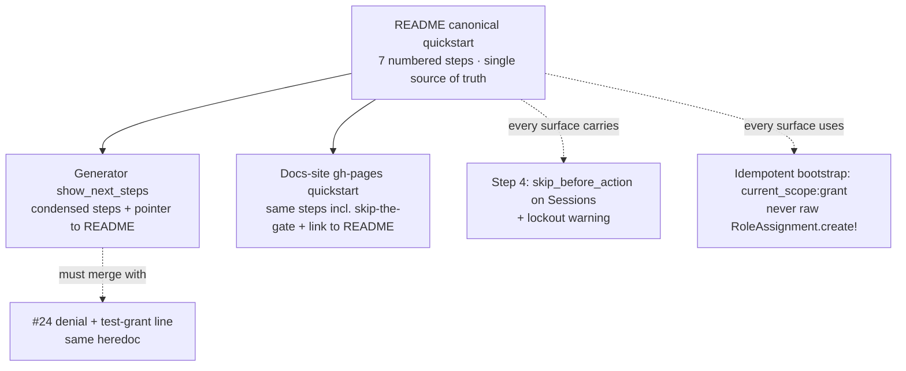

# One Canonical Quickstart Across README, Docs Site, and Install Generator - Plan

## Goal Capsule

- **Objective:** collapse three divergent, individually-incomplete onboarding paths into **one canonical numbered quickstart** (authored in `README.md`) and re-derive the other two surfaces — the install generator's `show_next_steps` output and the docs-site (`gh-pages`) "five steps" — from it. Fix the two concrete harms the divergence causes: (a) a newcomer who follows the docs-site steps or the generator output verbatim **bricks their own sign-in** (no `skip_before_action :current_scope_check!` step → the login page 403s), and (b) the generator still prints raw `CurrentScope::RoleAssignment.create!`, which is **non-idempotent** and raises on re-run against the one-org-role-per-subject uniqueness, while `README` and the rake task use the idempotent `grant!`. Along the way, document the two smaller papercuts the review surfaced: the seeded **Member role grants nothing** until edited, and the README's redundant `seed_defaults!`-then-`grant!` pair (`grant!` seeds internally).
- **Authority hierarchy:** this plan → the settled v0.1/v0.2 engine model (`README.md`, `docs/ROADMAP.md`, `resources/DESIGN.md`). The engine invariants are **immutable and NOT touched by this issue** — resolver decision order (SoD veto → full_access → org role → scoped role → deny), fail-closed posture, one-org-role-per-subject, resolver PURITY (no writes / no per-decision state), and the ambient `CurrentAttributes` context. This is a **docs-plus-one-generator-string** change. No `lib/current_scope/*` decision code, no models, no resolver, no Guard behavior changes. The single non-README file edited is the generator's `say` heredoc (`install_generator.rb`), which emits inert text.
- **Stop conditions — surface rather than guess if:**
  - (a) making the canonical quickstart accurate would require *changing* engine behavior (e.g. making Member grant a baseline, or making `RoleAssignment.create!` idempotent) — it must not; the fix is documenting what the engine does today, and the Member-seed shape is a deliberate design choice (empty until edited), not a bug to code around;
  - (b) the generator `show_next_steps` rewrite collides with the concurrent edit to the *same* heredoc planned under issue #24 (denial-behavior docs) in a way that can't be merged into one coherent block — coordinate, don't ship two conflicting rewrites (see Cross-issue coupling);
  - (c) editing the docs site would require touching the `gh-pages` branch's build/deploy in a way outside a plain HTML content edit — the load-bearing fix there is one added step; flag anything larger.

---

## Product Contract

> **Product Contract preservation:** documentation issue, no upstream requirements doc (`product_contract_source: ce-plan-bootstrap`). Grounded entirely in the filed finding (`issue #25`) and re-verified on 2026-07-15 against `lib/generators/current_scope/install/install_generator.rb:14-30`, `lib/current_scope.rb:129-146` (`seed_defaults!`, `grant!`), `app/models/current_scope/role_assignment.rb:9` (the uniqueness that makes `create!` raise), `lib/tasks/current_scope_tasks.rake`, `README.md:67-133`, and the `gh-pages` `index.html` quickstart (lines 598-630).

### Summary

A newcomer meets three onboarding flows that disagree, and two of the three are actively broken:

| Surface | Bootstrap spelling | Skip-the-gate step? | Member-empty note? |
|---|---|---|---|
| **README** Installation (`README.md:67-133`) | `current_scope:grant` **and** `grant!` (two spellings) + redundant `seed_defaults!` | yes, but mid-page prose (`README.md:90-96`) | no ("Owner (full_access) + Member", `README.md:127`) |
| **Docs site** "five steps" (`gh-pages` `index.html:598-630`) | `current_scope:grant` | **NO** — following it verbatim 403s the login page | no |
| **Install generator** `show_next_steps` (`install_generator.rb:14-30`) | raw `RoleAssignment.create!` (**non-idempotent**, drifts from `grant!`) | **NO** | no |

The first fifteen minutes decide adoption, and two of these three paths brick sign-in. The fix is one canonical numbered quickstart in the README, made complete and internally consistent, from which the generator output and the docs site are re-derived so all three agree.

### Problem Frame

Four verified defects, all rooted in the same divergence:

1. **Login lockout (highest severity, dx).** Neither the docs-site steps nor the generator output mentions `skip_before_action :current_scope_check!`. The gate is fail-closed and runs on *every* action, including `SessionsController#new`, so a newcomer who wires up `Context` + `Guard` and follows either path to the letter gets a 403 on the very page they need to sign in through — with an empty body and no hint why (see #24). The README *does* mention the skip, but as mid-page prose (`README.md:90-96`), easy to skim past.
2. **Non-idempotent bootstrap (minor, docs → correctness).** The generator prints `CurrentScope::RoleAssignment.create!(subject: User.first, role: …Owner)`. `RoleAssignment` validates `subject_id` unique per `subject_type` (`role_assignment.rb:9`), so re-running seeds raises `RecordInvalid`. `grant!` (`lib/current_scope.rb:142-146`) is `find_or_initialize_by(subject:).update!(role:)` — idempotent by construction, and is what the README and the rake task use. Three spellings of one step, and the one the generator picked is the fragile one.
3. **Member is an empty shell (minor, dx).** `seed_defaults!` creates Member with no `full_access` and no permissions (`lib/current_scope.rb:129-134`); a Member-granted user is 403 everywhere (`no_grant`), indistinguishable from an ungranted user, until an admin ticks grid cells. No surface says so — the README even reads "Owner (full_access) + Member" (`README.md:127`), implying Member is a usable baseline.
4. **Redundant seed one-liner (trivial, docs).** The README seeds block runs `seed_defaults!` then `grant!(User.first)`, but `grant!` calls `seed_defaults!` internally (`lib/current_scope.rb:143`) — the single `grant!` line suffices. Minor, but it's exactly the kind of "why two lines?" friction the canonical version should remove. The rake task's failure modes (`SUBJECT_ID` must reference an existing record; `subject_class` must be configured first for non-`User` apps — `current_scope_tasks.rake:8-11`) are also unstated.

### Requirements

- **R1.** `README.md` carries **one canonical numbered quickstart** — the single source of truth — covering the whole first-run path end to end, in order: (1) add the gem; (2) generate + migrate; (3) include `Context` + `Guard` in `ApplicationController`; (4) **`skip_before_action :current_scope_check!` on `SessionsController` (and other public endpoints), with an explicit lockout warning** that without it the login page itself 403s; (5) bootstrap the first admin with the rake task; (6) visit `/current_scope`; (7) what a denial renders + that the seeded **Member role grants nothing** until edited.
- **R2.** Every surface uses **one bootstrap spelling**: the idempotent rake task `bin/rails current_scope:grant SUBJECT_ID=…` as the primary, with `CurrentScope.grant!(subject)` named only as its console/`db/seeds.rb` equivalent. The raw `RoleAssignment.create!` form is **removed** from the generator output.
- **R3.** The canonical quickstart states the seeded **Member role starts empty** (no `full_access`, no permissions → 403 everywhere until an admin edits it), correcting the "Owner (full_access) + Member" phrasing that implies Member is usable out of the box.
- **R4.** The canonical quickstart drops the redundant `seed_defaults!`-then-`grant!` pair (a single `grant!`/rake call suffices) and states the rake task's two failure modes: `SUBJECT_ID` must reference an existing record, and `subject_class` must be configured before granting in a non-`User` app.
- **R5.** The install generator's `show_next_steps` (`install_generator.rb:14-30`) is rewritten to **match the canonical quickstart**: the idempotent grant (rake task primary), the `skip_before_action` step with its lockout warning, and a pointer to the denial-behavior docs — with the raw `RoleAssignment.create!` gone. Generator string only; no behavior change.
- **R6.** The docs-site (`gh-pages` `index.html`) quickstart is corrected so following it verbatim **no longer bricks sign-in**: it gains the skip-the-gate step (making it six steps, or an explicit sub-step), and links the canonical README quickstart as the authoritative source. This is a `gh-pages` HTML content edit.

---

## Key Technical Decisions

- **KTD-1 — The README is the single canonical source; the generator output and docs site derive from it (no new `docs/quickstart.md`).** The onboarding story is short, first-ten-minutes material that belongs where adopters already look — the README next to Installation. Introducing a third artifact (`docs/quickstart.md`) to be "the canonical one" would create a *fourth* surface to drift, the opposite of the issue's goal. This mirrors the sibling #24 plan's KTD-4 (one README section, not a `docs/guides/` tree). The README's existing Installation section (`README.md:67-133`) already contains ~90% of the canonical content; the work is to **sequence it as an explicit numbered list, complete the two gaps (skip-step prominence, Member-empty note), and remove the redundancy** — then point the other two surfaces at it.
- **KTD-2 — Standardize on the rake task as THE bootstrap spelling, and delete raw `create!` from the generator — this is a correctness fix, not tidiness.** `RoleAssignment.create!` is not merely inconsistent with `grant!`; it is *wrong* for a seeds/bootstrap context because it raises on re-run against the one-org-role-per-subject uniqueness (`role_assignment.rb:9`), exactly when a developer re-seeds. `grant!`/the rake task are idempotent by design (`find_or_initialize_by`). The lazy, root-cause fix is to standardize the one idempotent spelling everywhere and remove the fragile one — a smaller, safer diff than teaching newcomers to work around `create!`'s failure mode.
- **KTD-3 — The `skip_before_action` step is a first-class *numbered* step in every surface, not mid-page prose.** Its omission is the single divergence that bricks sign-in (403 on the login page), the highest-severity harm in the issue. Prose that a reader can skim past (the README's current treatment) is not sufficient mitigation. In all three surfaces the skip is a discrete step carrying an explicit "without this, your login page 403s" warning. One rule, stated as a step, kills the lockout on every path.
- **KTD-4 — The generator `show_next_steps` rewrite must MERGE with issue #24's edit to the same heredoc, not race it.** Issue #24 (denial-behavior docs) plans to add a denial + test-grant line to the *same* `show_next_steps` heredoc (`install_generator.rb:14-30`). This plan rewrites the grant step and adds the skip step. These are one coherent block, not two conflicting patches. Whichever lands second must incorporate the other's line; ideally they land together. Flagged in Cross-issue coupling; Stop condition (b) is the guardrail.
- **KTD-5 — Document the Member-empty shape; do NOT change the seed.** Member starting empty is a deliberate design choice (`seed_defaults!` intentionally sets no permissions — the app defines what "Member" means by editing the grid, the whole thesis of the gem). Making Member grant a baseline would be a behavior change smuggled under a `documentation` label and would surprise every existing install. The fix is one sentence of docs, not a seed change. (Stop condition (a).)

---

## High-Level Technical Design

Three onboarding surfaces converge on one canonical source. The README quickstart is authored once; the generator output and the docs site are *derivations* that must stay faithful to it — same steps, same order, same idempotent spelling, same skip-the-gate warning.



*Directional — the prose and requirements are authoritative.* The three surfaces need not be textually identical (the generator is terse, the docs site is marketing-styled), but they MUST agree on the load-bearing invariants: the skip step exists and is warned about (S1), and the bootstrap is the idempotent spelling (S2).

---

## Implementation Units

### U1. README canonical quickstart (single source of truth)

- **Goal:** turn the README Installation section into one explicit numbered quickstart that is complete, internally consistent, and safe to follow verbatim — the source the other two surfaces derive from.
- **Requirements:** R1, R2, R3, R4.
- **Dependencies:** none.
- **Files:** `README.md`.
- **Approach:** restructure the existing Installation prose (`README.md:67-133`) into a numbered sequence (directional ordering, reusing the copy that already exists — this is mostly re-sequencing, not net-new prose):
  1. **Add the gem** — `gem "current_scope"`.
  2. **Generate + migrate** — `bin/rails generate current_scope:install` then `install:migrations && db:migrate`.
  3. **Include the concerns** — `Context` then `Guard` in `ApplicationController` (keep the existing "Context first" note and the Assumption #1 / `GatingTripwire` callout, which stays valuable).
  4. **Skip the gate on public endpoints** — promote the existing `skip_before_action :current_scope_check!` snippet (`README.md:90-96`) into a numbered step and prepend an explicit warning: *without this on `SessionsController`, the fail-closed gate 403s your own sign-in page* (KTD-3). Cross-link the "When access is denied" section (from #24) for what that 403 looks like.
  5. **Bootstrap the first admin** — `bin/rails current_scope:grant SUBJECT_ID=1` as the primary spelling; show `CurrentScope.grant!(User.first)` **only** as the console/`db/seeds.rb` equivalent, on its own (drop the preceding `seed_defaults!` line — R4). Add one line on the rake task's failure modes: `SUBJECT_ID` must reference an existing record; set `config.subject_class` first in a non-`User` app (R4).
  6. **Manage at `/current_scope`** — full-access subjects only.
  7. **What you get / what to know next** — a short note that a denial renders a blank 403 with a reason header (cross-link #24), **and that the seeded Member role grants nothing until you edit it in the grid** (R3) — correcting the "Owner (full_access) + Member" line (`README.md:127`) so it no longer implies Member is a usable baseline.
- **Patterns to follow:** the existing Installation voice and code-fence style; keep the Assumption #1 and `GatingTripwire` callouts intact (they are correct and load-bearing). Match the numbered-step register the docs site already uses so the two read as siblings.
- **Test scenarios:** Test expectation: none — documentation only. Every factual claim is re-verified against source: idempotent `grant!` (`lib/current_scope.rb:142-146`), `create!` raises on re-run (`role_assignment.rb:9`), Member empty (`lib/current_scope.rb:129-134`), `grant!` calls `seed_defaults!` (`lib/current_scope.rb:143`), rake failure modes (`current_scope_tasks.rake:8-11`).
- **Verification:** the Installation section reads as a single numbered quickstart; the skip step is step 4 with a lockout warning; exactly one bootstrap spelling is primary (rake), `grant!` is the named equivalent, and no `seed_defaults!`-then-`grant!` pair remains; the Member-empty note is present; every claim matches source as read 2026-07-15.

---

### U2. Install generator `show_next_steps` — derive from the canonical quickstart

- **Goal:** rewrite the generator's printed next-steps so a fresh installer reads a condensed, *correct* version of the canonical quickstart — idempotent grant, the skip-the-gate step, no raw `create!`.
- **Requirements:** R2, R5.
- **Dependencies:** U1 (the wording it points at and mirrors). Must MERGE with #24's edit to this heredoc (KTD-4).
- **Files:** `lib/generators/current_scope/install/install_generator.rb`.
- **Approach:** replace the `show_next_steps` heredoc (`install_generator.rb:14-30`). Directional new shape (condensed — the generator points at the README for detail, it does not duplicate it):
  ```
  1. bin/rails current_scope:install:migrations && bin/rails db:migrate
  2. Include the concerns in ApplicationController (Context first):
       include CurrentScope::Context
       include CurrentScope::Guard
  3. Skip the gate on public endpoints — WITHOUT THIS YOUR LOGIN PAGE 403s:
       # app/controllers/sessions_controller.rb
       skip_before_action :current_scope_check!
  4. Bootstrap the first admin (idempotent):
       bin/rails current_scope:grant SUBJECT_ID=1   # grants the full-access Owner role
  5. Manage roles at /current_scope (full-access subjects only).
  ```
  Delete the raw `CurrentScope::RoleAssignment.create!` block entirely (R2 / KTD-2). Add (or merge with #24's) one pointer line: denials render a blank 403 (reason on `X-Current-Scope-Reason`) and existing controller tests will 403 until granted — see "When access is denied" in the README. Keep it a plain `say` string; no logic, no new deps.
- **Patterns to follow:** the existing numbered-step / imperative register already in the heredoc; the `say <<~NEXT` style.
- **Test scenarios:** Test expectation: none — no generator test exists in `test/` (verified 2026-07-15: no `*generator*` spec), and this is inert string output. If a generator test is later added, it should assert the output contains `skip_before_action`, `current_scope:grant`, and does **not** contain `RoleAssignment.create!`.
- **Verification:** running `bin/rails generate current_scope:install` in a scratch app prints the skip step with its warning and the rake-task grant; the output contains no `RoleAssignment.create!`; the heredoc still renders (no interpolation errors); the block is a single coherent list that already incorporates #24's denial/test-grant line (not a second conflicting rewrite).

---

### U3. Docs-site (`gh-pages`) quickstart — add the skip step, link to canonical

- **Goal:** correct the docs-site "five steps" so following them verbatim no longer 403s sign-in, and point readers at the canonical README quickstart.
- **Requirements:** R6.
- **Dependencies:** U1 (the canonical source it links to). Independent of U2.
- **Files:** `index.html` **on the `gh-pages` branch** (quickstart section, currently lines 598-630). *Repo-relative path is `index.html`; note the branch — this is not a `main`-branch file.*
- **Approach:** insert a new `.qstep` between the current "Include the concerns" step and the "Bootstrap" step, mirroring the README's step 4: a short heading ("Skip the gate on public endpoints") plus the `skip_before_action :current_scope_check!` snippet in a `SessionsController`, with one line of warning text that omitting it locks you out of your own sign-in page. Update the section heading "Mounted and gating in **five** steps" → **six** (or keep five and fold the skip as an explicit sub-note on step 3 — maintainer's call, see Open Questions). Add a link near the quickstart to the README's canonical quickstart as the authoritative, always-current source. Do not restyle the section; reuse the existing `.qstep`/`.qc`/`.qt`/`pre` markup so it renders identically.
- **Patterns to follow:** the existing `.qstep` block structure in `index.html:604-627`; the `<pre>`/token-span styling already used for the sessions-skip snippet that appears elsewhere on the page (`index.html:590-593`, so the markup is already in the file to copy).
- **Test scenarios:** Test expectation: none — static HTML content edit. Manual check: the rendered quickstart now shows the skip step; the step count in the heading matches the number of `.qstep` blocks; the README link resolves.
- **Verification:** the `gh-pages` quickstart contains a skip-the-gate step with the lockout warning; the heading's step count is consistent; a reader following the steps top-to-bottom skips the gate before hitting the app; a link to the README quickstart is present. Deploy is whatever the `gh-pages` publish flow already is — no build/tooling change (Stop condition (c)).

---

## Scope Boundaries

**In scope:** re-sequencing + completing the README Installation into one canonical numbered quickstart (U1); rewriting the generator `show_next_steps` string to match, idempotent-grant + skip-step, `create!` removed (U2); adding the skip step + canonical link to the `gh-pages` quickstart (U3); a `CHANGELOG.md` "Unreleased" documentation note. Faithful description of *current* engine behavior only.

**Explicit non-goals — preserve deliberate design:**
- **No engine behavior changes.** Member stays empty-by-design (KTD-5); `RoleAssignment.create!` is not made idempotent (we stop *recommending* it, that's all); the seed, the resolver, the Guard, the rake task, and the route-derived catalog are untouched.
- No new default 403 rendering, no `docs/quickstart.md` third artifact (KTD-1), no restyle of the docs site beyond the one added step and link.
- No change to the fail-closed posture or the `skip_before_action` mechanism itself — we document *when* to use it, not what it does.

**Deferred to Follow-Up Work (tangential):**
- A broader `docs/`-hosted adoption/onboarding guide (issue #26) could later absorb an expanded quickstart; when it lands it should link the README canonical version, not fork it.
- Automating docs-site quickstart generation from the README (so they can't drift again) is a nice-to-have; out of scope here — the near-term win is convergence, not tooling.

---

## Open Questions

- **Docs-site step count framing.** Add the skip as a full sixth `.qstep` ("Mounted and gating in six steps") or fold it as an explicit sub-note on the existing "Include the concerns" step (keeping "five")? A discrete numbered step is the safer, harder-to-skim choice (consistent with KTD-3) and is the plan's default; the maintainer may prefer the tighter five-step marketing framing with a prominent inline warning. Either satisfies R6 as long as the skip is unmissable.
- **How much of the denial story to inline vs. cross-link.** Step 7 of the canonical quickstart mentions the blank-403 denial; issue #24 owns the full "When access is denied" section. Plan assumes the quickstart *cross-links* #24's section rather than duplicating it. Confirm #24 lands first (or concurrently) so the link target exists.

---

## Cross-issue coupling

- **#25 (this) ↔ #24 (denial-behavior docs) — shared edit to `install_generator.rb` `show_next_steps` AND to the README Installation region.** This is the tightest coupling and the biggest execution risk. Both plans edit the *same* `show_next_steps` heredoc (#24 adds a denial + test-grant line; this plan rewrites the grant step and adds the skip step) and both add material near README Installation (#24 adds a "When access is denied" section + a "tests will 403" callout; this plan restructures the quickstart and cross-links denial behavior). **Compose them as one coherent change, not two races:** land #24's README section first (it creates the link target step 7 and the skip step both point at), then this plan's U1 quickstart cross-links it; merge U2's generator rewrite with #24's U3 generator line into a single heredoc. If they land in the other order, whoever is second must fold in the first's lines. Stop condition (b) is the guardrail.
- **#25 ↔ #26 (adoption guide).** The canonical quickstart (U1) is the seed of the broader onboarding guide #26. When #26 is planned, it should link this README quickstart as the authoritative source rather than duplicating it (same single-source discipline as KTD-1), and can expand on the Member-empty and rake-failure-mode notes with worked examples.
