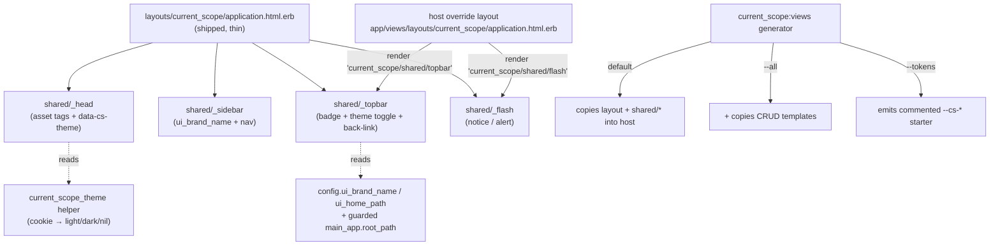

# Theming & Overriding the Engine UI — docs, partials, and a views generator

## Goal Capsule

- **Objective:** make the *already-working* restyle path a first-class, documented move — as `PRODUCT.md` promises ("decent by default, yours by override … a first-class, documented move — not a rescue"). Three gaps close together: (1) there is **no** README "Theming & overrides" section, so the token-retheme and layout-shadowing mechanisms are discoverable only by reading gem source; (2) there is **no** `current_scope:views` generator (only `install` exists under `lib/generators/current_scope/`); and (3) a naïve layout override **silently drops** the engine's flash, theme toggle, and "full access" badge, because they are baked inline into `app/views/layouts/current_scope/application.html.erb` — with no partials to re-include and no link back to the host app.
- **Authority hierarchy:** this plan → the settled v0.1/v0.2 engine model (`README.md`, `PRODUCT.md`, `docs/ROADMAP.md`, the shipped `app/**` UI). This is a **UI + docs + generator** change. The engine's decision invariants are **untouched and only described**: the resolver decision order (SoD veto → full_access → org role → scoped role → deny), the fail-closed posture, one-org-role-per-subject, resolver **purity** (no writes, no per-decision state), and the ambient `CurrentAttributes` context. No file under `lib/current_scope/` that participates in a decision (`resolver.rb`, `guard.rb`, `permission_catalog.rb`, `mutation_guard.rb`) is edited. The management-UI access gate — `require_full_access!` in `app/controllers/current_scope/application_controller.rb:24-26` — stays exactly as-is; nothing here lets a non-full-access subject reach or restyle the console.
- **Stop conditions:** stop and surface rather than guess if (a) extracting the layout chrome into partials would change the **rendered output** of the shipped layout in any way beyond the two intentional additions (configurable wordmark, host back-link) — the existing `test/system/*` render/theme tests are the guardrail and must stay green; (b) the host back-link could ever **raise** on a host with no root route (it must degrade to "no link", never 500 the console — see KTD-4); (c) a "copy the views" generator would need to copy engine controllers/routes/logic (it must copy **views only** — layout, shared partials, optionally CRUD templates — never behavior); or (d) documenting the retheme would require changing the `@layer current_scope.tokens` cascade contract (`app/assets/stylesheets/current_scope/application.css:9-17`) rather than describing it.

---

## Product Contract

> **Product Contract preservation:** documentation + UX-enablement issue, no upstream requirements doc (`product_contract_source: ce-plan-bootstrap`). The finding is verified against source in issue #31 (`05_legacy_ui_overrides` scenario): the retheme + shadow mechanisms are confirmed working; the gaps are missing docs, a missing generator, and inline-only chrome. This plan does not re-litigate whether the mechanisms work — it documents them and removes the sharp edges.

### Summary

Ship the restyle story the product already claims to have. (1) Extract the layout's chrome — head assets + `data-cs-theme` attribute, sidebar brand/nav, topbar badge + theme toggle + a new host back-link, and the flash region — into `app/views/current_scope/shared/*` partials that the shipped layout renders, so an override layout re-includes each piece by name instead of hand-reimplementing it. (2) Centralize the no-flash theme-cookie read in a `current_scope_theme` helper so the shipped layout and any override compute `data-cs-theme` identically. (3) Add two small branding knobs (`config.ui_brand_name`, default `"CurrentScope"`; `config.ui_home_path`, default `nil` → auto-detect `main_app.root_path`) and a guarded host back-link in the stock chrome. (4) Add a `current_scope:views` generator (Devise-style) that copies the layout + shared partials into the host to shadow the engine, with `--all` to also copy the CRUD templates and an optional token-override CSS starter. (5) Document all of it in a new README "Theming & overrides" section, plus the two new knobs in the initializer template.

### Problem Frame

Every real product that mounts the console wants it to look native, and the engine was *built* for that: ~197 `--cs-*` custom properties, defaults deliberately parked in `@layer current_scope.tokens` so an unlayered host `:root { --cs-accent: … }` wins the cascade (`application.css:9-17`), and `layout "current_scope/application"` on the engine's ApplicationController (`application_controller.rb:14`) so a host file at `app/views/layouts/current_scope/application.html.erb` shadows the engine layout. All verified working. But today a host developer learns none of this from the README — it has zero mentions of layout/view overrides or theming — and there is no generator to scaffold the override. Worse, the mechanisms have a trap: the flash rendering (`application.html.erb:44-45`), the dark-mode toggle + `current_scope_theme` cookie handling (`:1`, `:37-41`), and the "full access" badge (`:36`) all live **inline in the layout**. Override the layout and they vanish — the issue's `05_legacy_ui_overrides` Bootstrap host had to re-implement flash by hand. The stock chrome is also a cul-de-sac: no link back to the host app (`grep` confirms no `main_app` usage anywhere in `app/` or `lib/`), and the wordmark + badge are hardcoded strings. The retheme story is real; it just isn't documented, isn't scaffolded, and isn't override-safe.

### Requirements

- **R1.** The shipped layout's chrome is extracted into `app/views/current_scope/shared/` partials — head assets + theme attribute, sidebar (brand + nav), topbar (badge + theme toggle + back-link), and flash — and the shipped `application.html.erb` renders those partials. Rendered output is **unchanged** except for the two intentional additions (R5, R6); every existing `test/system/*` render and theme test stays green.
- **R2.** A `current_scope_theme` view helper returns `"light"` / `"dark"` / `nil` from the `current_scope_theme` cookie (unknown/absent → `nil`), so the shipped layout and any override set the no-flash `<html data-cs-theme>` identically from one source, not a copy-pasted inline ternary.
- **R3.** A `current_scope:views` generator copies the layout + `shared/*` partials into the host (shadowing the engine), and prints next steps. `--all` additionally copies the CRUD templates (`roles/`, `subjects/`, `scoped_role_assignments/`, `events/`); an option emits a commented `--cs-*` token-override CSS starter. It copies **views only** — never controllers, routes, or logic.
- **R4.** A new README **"Theming & overrides"** section documents: the `--cs-*` token retheme and the `@layer`-wins rule; the view/layout **shadow paths**; that an override layout must re-include `stylesheet_link_tag`/`javascript_include_tag "current_scope/application"` **and** the shared flash/theme-toggle/badge partials (with the exact `render` lines); the `current_scope:views` generator; and `parent_controller` semantics (it supplies host **auth + before_actions**, not the visual layout — the layout is a separate override).
- **R5.** The sidebar wordmark is driven by `config.ui_brand_name` (default `"CurrentScope"`), so a host rebrands the console without copying the layout.
- **R6.** The stock chrome carries a host back-link: `config.ui_home_path` (default `nil`) — when `nil`, auto-detect `main_app.root_path` and render the link **only if the host defines a root route**; render nothing otherwise. It must **never raise** on a host without a root path (fail-safe, not fail-closed — this is chrome, not a gate).
- **R7.** No decision-path change. Zero edits to `lib/current_scope/resolver.rb`, `guard.rb`, `permission_catalog.rb`, `mutation_guard.rb`. The `require_full_access!` console gate and the retheme cascade contract (`@layer current_scope.tokens`) are preserved exactly; upgraders see only the new wordmark/back-link chrome (both inert-by-default: brand defaults to today's string, back-link appears only if a root route exists).

---

## Key Technical Decisions

- **KTD-1 — Extract the chrome into partials once, in the shipped layout — don't tell every host to hand-reimplement it.** The trap the issue names (override → flash/toggle/badge vanish) has exactly one lazy, root-cause fix: the pieces must exist as named partials an override can re-include. Reimplementing flash in each host (what the `05_legacy_ui_overrides` scenario had to do) is the symptom-patch; extracting `shared/_flash`, `shared/_topbar` (badge + toggle + back-link), `shared/_sidebar` (brand + nav), and `shared/_head.html.erb` (asset tags + theme attr) is the shared-seam fix. The shipped layout becomes a thin composition of those partials with **byte-equivalent output** (the existing system tests are the proof), and every override layout — generated or hand-rolled — re-includes by name. One extraction serves both the generator path and the hand-roll path.
- **KTD-2 — `current_scope:views` copies views only, and defaults to chrome (layout + shared partials), not the full CRUD tree.** Devise's `devise:views` is the model, but copying *all* engine views by default is a maintenance trap: the CRUD templates (`roles/edit` permission grid, `subjects/index` bulk bar) are dense and evolve with the engine, and a host that copied them silently misses later fixes. The 90% need is **retheme + chrome** (tokens + layout), so the default copies the layout + `shared/*` only; `--all` opts into the CRUD templates for structural overrides, accepting the drift that implies. (Ponytail: scaffold the thing people actually override; make the heavy, drift-prone copy an explicit opt-in.)
- **KTD-3 — CSS retheme stays token-override; the generator does not copy or fork the engine stylesheet, and does not auto-wire the asset pipeline.** The `@layer current_scope.tokens` design already makes an unlayered host `:root { --cs-accent: … }` win without touching engine CSS — so the documented path is "add `--cs-*` overrides in your own stylesheet," and the generator's optional starter is a **commented `--cs-*` stub**, not a copy of `application.css`. Wiring that stub into the host's pipeline is host-specific (propshaft vs sprockets vs importmap), so the generator prints the include line rather than guessing — least-astonishment over a brittle auto-edit. Copying the 700-line engine stylesheet would fork it and guarantee drift; the layer contract exists precisely to avoid that.
- **KTD-4 — The host back-link is fail-*safe*, guarded, and inert without a root route.** This is the one spot the additions touch runtime rendering, so it gets the care. `config.ui_home_path` (default `nil`) → when set, use it; when `nil`, resolve `main_app.root_path` **only** behind `main_app.respond_to?(:root_path)` and rescue any routing error to "no link." A console is chrome, not an access decision — the right failure mode here is "the link is absent," never a 500 that takes down the authorization UI. This deliberately contrasts the engine's fail-*closed* gate posture (KTD noted so a reader doesn't mistake it for a weakening — the gate is untouched; only a decorative link is being made optional).
- **KTD-5 — Add a brand-name knob, but keep the "full access" badge as a partial, not a config knob.** The issue asks for "configurable branding instead of hardcoded 'CurrentScope' + 'full access' badge." The wordmark is genuine branding → `config.ui_brand_name`. The "full access" badge is a **status indicator** (it states *why* you can see this console — only full-access subjects reach it), not branding; a config knob for its text would invite hosts to relabel a security signal misleadingly. Extracting it into `shared/_topbar` already makes it fully overridable for hosts that want to restyle or remove it, without shipping a knob that muddies a security affordance. (Least-astonishment: don't make a security status line trivially re-wordable via config.)

*No decision here touches resolver purity, the fail-closed gate, or the decision order — this plan composes ERB partials, adds two chrome knobs, and writes prose + a views generator. The only runtime-behavior addition (the back-link) is guarded to be inert-by-default and non-raising.*

---

## High-Level Technical Design

The layout stops being a monolith and becomes a composition of shared partials. Both override paths — the generated shadow and a hand-rolled shadow — consume the *same* partials, so re-including flash/toggle/badge is a one-line `render`, not a reimplementation.

*Directional — the prose and requirements are authoritative.* The retheme path (unlayered `:root { --cs-* }` beating `@layer current_scope.tokens`) is unchanged and orthogonal to this diagram; it needs no layout override at all, which is exactly the "cheapest restyle" the docs will lead with.

---

## Implementation Units

### U1. Theme helper + two chrome config knobs

- **Goal:** one source of truth for the no-flash theme attribute, and the two branding knobs the chrome will consume.
- **Requirements:** R2, R5, R6 (config surface), R7.
- **Dependencies:** none.
- **Files:** `app/helpers/current_scope/application_helper.rb`, `lib/current_scope/configuration.rb`, `test/helpers/application_helper_test.rb` (extend), `test/configuration_test.rb` (extend).
- **Approach:** add `current_scope_theme` to the existing `CurrentScope::ApplicationHelper` — lift the layout's line-1 ternary verbatim (`%w[light dark].include?(cookies[:current_scope_theme]) ? cookies[:current_scope_theme] : nil`) so behavior is identical, returning `"light"`/`"dark"`/`nil`. In `configuration.rb`, add `attr_accessor :ui_brand_name` (default `"CurrentScope"`) and `attr_accessor :ui_home_path` (default `nil`) in `initialize`, each with a doc comment matching the file's existing style and stating the honest scope (branding/chrome only, never a gate). No writer guard (contrast `allow_mutations_while_impersonating` — these are cosmetic; note that in the comment).
- **Patterns to follow:** the existing `attr_accessor` + `initialize` default + doc-comment density in `configuration.rb`; the helper style already in `application_helper.rb`.
- **Test scenarios:**
  - `current_scope_theme` returns `"dark"` when `cookies[:current_scope_theme] == "dark"`, `"light"` for `"light"`, and `nil` for absent or garbage (`"purple"`) → proves the no-flash contract is preserved.
  - `config.ui_brand_name` defaults to `"CurrentScope"`; assignable and read back.
  - `config.ui_home_path` defaults to `nil`; assignable and read back.
- **Verification:** helper + config tests green; RuboCop clean.

### U2. Extract layout chrome into shared partials; wire brand + guarded back-link

- **Goal:** the shipped layout renders `shared/*` partials with byte-equivalent output plus the two intentional additions, so overrides re-include chrome by name.
- **Requirements:** R1, R5, R6, R7.
- **Dependencies:** U1.
- **Files:** `app/views/layouts/current_scope/application.html.erb`, new `app/views/current_scope/shared/_head.html.erb`, `_sidebar.html.erb`, `_topbar.html.erb`, `_flash.html.erb`; `test/system/management_ui_smoke_test.rb` and `test/system/theme_toggle_test.rb` (assert unchanged/green — guardrail); new `test/integration/layout_override_test.rb`.
- **Approach:** move the head asset tags + the `data-cs-theme` attribute (now from `current_scope_theme`) into `_head`; the brand (`config.ui_brand_name`) + nav into `_sidebar`; the badge + theme-toggle button + the new back-link into `_topbar`; the two flash lines (`:44-45`) into `_flash`. The layout renders them in place. Back-link (KTD-4): a small private helper `current_scope_home_path` returning `config.ui_home_path` if set, else `main_app.root_path` if `main_app.respond_to?(:root_path)`, else `nil` (rescue `NoMethodError`/routing errors → `nil`); `_topbar` renders the link only when non-nil. Keep every `cs-*` class and DOM hook (`data-cs-theme-toggle`, `cs-flash`, `cs-badge`, `role="status"`/`role="alert"`) identical so JS and tests bind unchanged.
- **Execution note:** UI-render seam with existing browser tests — run `test/system/theme_toggle_test.rb` and `management_ui_smoke_test.rb` *before* the extraction to capture green, then after, to prove the refactor changed nothing observable but the intended additions.
- **Patterns to follow:** the current layout markup verbatim (move, don't rewrite); the partial-naming convention Rails expects for a mounted engine (`render "current_scope/shared/flash"`).
- **Test scenarios:**
  - **Byte-equivalent chrome:** every management page still renders (smoke test green); `cs-flash--notice`/`cs-flash--alert` still appear on a flashed action; `data-cs-theme-toggle` present; theme toggle test green (flip + cookie + aria-pressed + server restore).
  - **Brand:** with `config.ui_brand_name = "Acme Admin"` the sidebar shows "Acme Admin"; default shows "CurrentScope".
  - **Back-link present:** dummy host with a root route → topbar contains a link to `/`.
  - **Back-link absent, no raise:** dummy host request context without `main_app.root_path` → no back-link rendered, page 200s (not 500).
  - **Override re-includes chrome:** a shadow layout in `test/dummy` (`app/views/layouts/current_scope/application.html.erb`) that renders only `current_scope/shared/flash` shows the flash — proving an override can re-include a single partial instead of reimplementing it.
- **Verification:** system + integration tests green; existing theme/smoke tests unchanged and passing; RuboCop clean; visual screenshot diff (from `screenshots_test`) shows only the added back-link.

### U3. `current_scope:views` generator

- **Goal:** one command scaffolds the override — layout + shared partials into the host — Devise-style, views only.
- **Requirements:** R3.
- **Dependencies:** U2 (the partials must exist to be copied).
- **Files:** new `lib/generators/current_scope/views/views_generator.rb`; new `test/generators/views_generator_test.rb` (no `test/generators/` dir exists today — create it).
- **Approach:** a `Rails::Generators::Base` that, by default, `directory`-copies `app/views/layouts/current_scope` and `app/views/current_scope/shared` from the engine into the host (shadow paths). A `class_option :all` (`--all`) additionally copies `roles/`, `subjects/`, `scoped_role_assignments/`, `events/`. A `class_option :tokens` (`--tokens`) writes a commented `--cs-*` starter to `app/assets/stylesheets/current_scope_overrides.css`. A `show_next_steps` `say` block mirroring the install generator: how to re-include chrome partials, that overriding the layout requires the two asset tags, the `@layer`-wins token rule, and (for `--tokens`) the pipeline include line the host must add itself (KTD-3). Source the copied files from the engine's own view root via `source_root` pointing at the engine `app/views`.
- **Patterns to follow:** `lib/generators/current_scope/install/install_generator.rb` structure (`source_root`, copy method, `show_next_steps` `say <<~NEXT`). Devise's `views_generator` for the `--all`/scoped-copy idiom.
- **Test scenarios:**
  - **Default copy:** running the generator creates host `app/views/layouts/current_scope/application.html.erb` and `app/views/current_scope/shared/_flash.html.erb` (+ `_head`, `_sidebar`, `_topbar`); does **not** create `roles/edit.html.erb`.
  - **`--all`:** additionally creates `roles/`, `subjects/`, `scoped_role_assignments/`, `events/` templates.
  - **`--tokens`:** creates `app/assets/stylesheets/current_scope_overrides.css` containing commented `--cs-accent`/`--cs-bg` examples and no uncommented rule that would change rendering by mere presence.
  - **Views-only:** no controller/route/`.rb` logic file is emitted under `app/controllers` or `config/`.
  - **Copied layout is valid:** the emitted layout loads/parses (ERB compiles) and references `current_scope/shared/*` partials.
- **Verification:** generator test green (Rails `Generators::TestCase`, destination a tmp dir); `bin/rails g current_scope:views --help` lists `--all` and `--tokens`; RuboCop clean.

### U4. Docs — README "Theming & overrides" section + initializer knobs + roadmap/changelog

- **Goal:** the restyle path is discoverable without reading gem source, and the two new knobs appear where hosts configure.
- **Requirements:** R4 (and the `PRODUCT.md` "first-class, documented move" mandate).
- **Dependencies:** U1–U3 (docs describe the shipped partials, knobs, and generator).
- **Files:** `README.md` (new `### Theming & overrides` section, placed near the UI/showcase material — after `### Configuration`, before `## The showcase app`), `lib/generators/current_scope/install/templates/initializer.rb` (add the two commented knobs), `docs/ROADMAP.md` + `CHANGELOG.md` (mark landed).
- **Approach:** write the section in the README's established plain, honest voice with four parts: **(1) Cheapest restyle — tokens.** Show an unlayered `:root { --cs-accent: … }` override and state the `@layer current_scope.tokens` rule (host wins because its rule is unlayered) — no layout override needed. **(2) Chrome — brand & back-link.** `config.ui_brand_name`, `config.ui_home_path` (+ the `main_app.root_path` auto-detect and its no-root-route no-op). **(3) Deep overrides — shadow the layout/views.** The shadow paths (`app/views/layouts/current_scope/application.html.erb`, `app/views/current_scope/**`), the `current_scope:views` generator (`--all`, `--tokens`), and — load-bearing — the exact lines an override layout **must** re-include: `stylesheet_link_tag`/`javascript_include_tag "current_scope/application"` and `render "current_scope/shared/flash"` / `"…/topbar"` / `"…/sidebar"` / `"…/head"`, calling out that skipping them drops flash, the theme toggle, and the badge. **(4) `parent_controller` vs the layout.** Clarify the two are different seams: `parent_controller` gives the console the host's **authentication + before_actions** (`application_controller.rb:6`), the **layout** is a separate visual override — a host restyles without changing auth, and vice versa. Add the two commented knobs to the initializer template near the UI-facing options (`subject_label`/`permission_grid_groups`).
- **Test expectation:** none — documentation + commented template lines only (no behavior emitted).
- **Verification:** README renders; every `render "current_scope/shared/*"` line in the docs names a partial that exists (U2); the `current_scope:views` invocations match the generator's real options (U3); the two knobs in the template match `configuration.rb` defaults exactly; `docs/ROADMAP.md`/`CHANGELOG.md` note the feature landed.

---

## Scope Boundaries

**In scope:** the `current_scope_theme` helper; `config.ui_brand_name` + `config.ui_home_path`; extraction of the layout chrome into `shared/*` partials with byte-equivalent output; a guarded host back-link; the `current_scope:views` generator (default chrome copy, `--all`, `--tokens`); the README "Theming & overrides" section; the two initializer-template knobs; roadmap/changelog notes. Views, docs, generator, and two cosmetic config knobs only.

**Deferred to Follow-Up Work:**
- **Exposing the design tokens as a documented, versioned contract** (a `--cs-*` reference table / "supported tokens" list). Useful, but a larger docs artifact and an API-stability commitment on ~197 properties; the retheme section links the source-of-truth comment for now.
- **A ViewComponent extraction** of the chrome. Partials are the lazy, framework-free fit (the engine ships no ViewComponent dependency); componentizing is a bigger, unrequested refactor.
- **Per-CRUD-template override ergonomics** beyond `--all` (e.g. copying a single named view). Add if a host actually asks.

**Explicit non-goals (preserve deliberate design):**
- No change to any decision path — `resolver.rb`, `guard.rb`, `permission_catalog.rb`, `mutation_guard.rb` are untouched (R7).
- No change to the `require_full_access!` console gate — the UI stays full-access-only; theming never widens who can reach it.
- No change to the `@layer current_scope.tokens` cascade contract — it is documented, not altered (KTD-3).
- No config knob for the "full access" badge text — it's a security status line, overridable via the partial, not re-wordable via config (KTD-5).
- The generator does **not** copy engine CSS, controllers, routes, or logic — views only (KTD-2/3).

## Open Questions

- **Default copy scope of `current_scope:views`.** KTD-2 assumes the default copies chrome (layout + `shared/*`) and gates the CRUD templates behind `--all`. If the maintainer prefers the strict Devise parity (copy *everything* by default), flip the default — but that inherits Devise's drift problem the CRUD templates make worse. Assumed: chrome-by-default.
- **Back-link placement.** Assumed: topbar (near the badge/toggle), as a "← back to app" affordance. A sidebar-foot placement (next to "Authorization console") is equally reasonable; pick during U2 against the real chrome.
- **Token starter filename/location.** Assumed `app/assets/stylesheets/current_scope_overrides.css` with a printed include line. If the gem later standardizes an importmap/propshaft convention, align the generator to it.

## Cross-issue coupling

- **Companion to #28 (config reference sync).** #28 builds the README config **reference table** and syncs the initializer template to `configuration.rb`. This plan **adds two new knobs** (`ui_brand_name`, `ui_home_path`) — they must land as new rows in #28's table and as commented lines in the template. Composition rule: whichever ships second updates the other's artifact; if #28 lands first, this plan's U4 appends the two rows rather than restating the whole table.
- **Sibling to the README docs cluster — quickstart (#7-family / `2026-07-15-007`), adoption guide (#26 / `2026-07-15-008`), denial-behavior (`2026-07-15-006`).** "Theming & overrides" is a new top-level README section; it should slot into the same information architecture (link from the adoption guide's "make it yours" step, and from the showcase section as the worked example `PRODUCT.md:100` already gestures at). Keep the section ordering coherent with those plans rather than each inserting independently.
- **Unrelated to the engine-403/denial cluster (#23/#24/#39).** That cluster is about *decision* ergonomics; this is *presentation*. They share no code seam — flagged only so a reviewer doesn't expect overlap.
