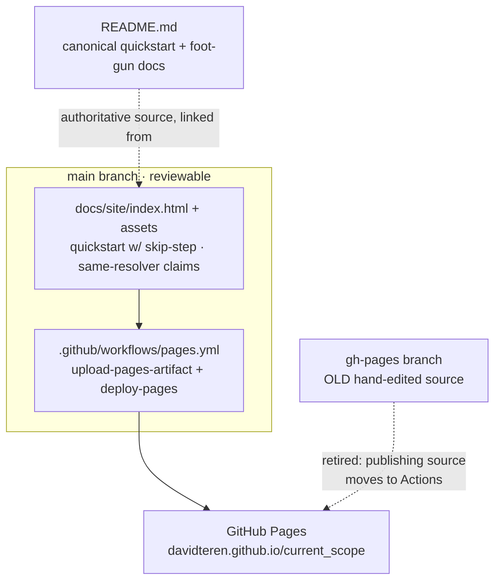

# Docs Site — Commit the Source In-Repo, Fix the Sign-In-Bricking Quickstart, Align Overclaims - Plan

## Goal Capsule

- **Objective:** end the structural drift between the GitHub Pages site and the repo by (a) **committing the site source into the repo** (`docs/site/`) with a PR-able GitHub Actions deploy, so every doc fix goes through review instead of a hand-edited `gh-pages` branch; (b) **fixing the "five steps" quickstart that bricks sign-in** — it omits the `skip_before_action :current_scope_check!` step, so following it verbatim 403s the login page; and (c) **retracting the site's absolutist claims** ("the button and the gate can't disagree", "the button literally can't render when the gate would refuse") that the README's own namespaced-controller and impersonation sections explicitly retract — standardizing on the accurate framing "controller, view, and component ask the same resolver."
- **Authority hierarchy:** this plan → the settled v0.1/v0.2 engine model (`README.md`, `docs/ROADMAP.md`, `resources/DESIGN.md`). The engine invariants are **immutable and NOT touched by this issue**: resolver decision order (SoD veto → full_access → org role → scoped role → deny), fail-closed posture, one-org-role-per-subject, resolver **PURITY** (no writes / no per-decision state), and the ambient `CurrentAttributes` context. This is a **docs-site relocation + content edit + one CI workflow** change. No `lib/current_scope/*` decision code, no models, no resolver, no Guard, no generator behavior. The only executable file added is a static-site Pages workflow that copies files; it changes no runtime path.
- **Stop conditions — surface rather than guess if:**
  - (a) committing the source turns out to require more than a **static file move + a Pages workflow** — e.g. the `gh-pages` `index.html` depends on a build step, Jekyll processing, or generated assets (it does not: `git ls-tree origin/gh-pages` is a flat set of static files with `.nojekyll`). Anything beyond copying files and wiring `actions/deploy-pages` is out of the load-bearing fix.
  - (b) making a claim on the site accurate would require **changing engine behavior** rather than rewording — it must not; the fix is to describe what the engine does today (which the README's *engine model* and its "View/gate disagreement is by design" section do correctly — but note the README's own summary bullet at `README.md:33-34` still carries the same "the view can never disagree with the gate" overclaim being retracted here; that README-side reword is coordinated with #25, which owns README edits — see U3 and Deferred Work).
  - (c) switching the Pages **publishing source** from "deploy from `gh-pages` branch" to "GitHub Actions" cannot be done without a repository-settings change the implementer can't make in code — flag it as the one manual maintainer step (see Open Questions), don't fake it.
  - (d) the quickstart/skip-step edit here collides irreconcilably with issue #25's plan (`docs/plans/2026-07-15-007-...`), which independently scoped a skip-step edit to `index.html` **on the `gh-pages` branch** — coordinate so the fix lands once, in the new `docs/site/` location (see Cross-issue coupling).

---

## Product Contract

> **Product Contract preservation:** documentation issue, no upstream requirements doc (`product_contract_source: ce-plan-bootstrap`). Grounded in the filed finding (`issue #33`) and re-verified 2026-07-15 against the `gh-pages` branch (`git show origin/gh-pages:index.html`): the quickstart at lines 596–632 (five `.qstep` blocks, **no** skip-the-gate step), the overclaims at `index.html:411` ("the button and the gate can't disagree"), `:455` ("The view can't disagree with the gate"), and `:571` ("the button literally can't render when the gate would refuse"); and against the README sections that retract them — the namespaced-controller display-bug callout (`README.md:154-163`) and "View/gate disagreement is by design" under Impersonation (`README.md:490-494`). The site is served **directly from the `gh-pages` branch** (flat static files, `.nojekyll`, no Actions workflow — `.github/workflows/` holds only `ci.yml`).

### Summary

The site's source lives **only** on the `gh-pages` branch as hand-committed static HTML (`549575c "Add CurrentScope landing site"`). Nothing about it is in `main`, so a doc fix can't be proposed as a normal PR against the repo, reviewed, or kept in sync with the README — drift is structural, not accidental. It has already drifted in three concrete ways:

| Problem | Where | Harm |
|---|---|---|
| Source not in-repo | `gh-pages` branch only | Fixes can't be PR'd/reviewed; site re-diverges after every in-repo improvement |
| Quickstart omits the gate-skip | `index.html` quickstart (5 steps) | A newcomer following it verbatim **403s their own login page** (fail-closed gate runs on `SessionsController#new`) |
| Absolutist claims | `index.html:411,455,571` | Contradicts the README's own retractions (namespaced-controller display bug, impersonation view/gate disagreement) — overpromises a guarantee the gem doesn't make |

The fix relocates the source into `docs/site/` on `main`, deploys it via a GitHub Actions Pages workflow (so edits are PRs), corrects the quickstart to match the canonical README quickstart, and rewords the three claims to the accurate "same resolver" framing the README uses.

### Problem Frame

Three verified defects, one root cause (source lives outside the reviewable repo):

1. **Unversioned source (structural, highest — it's why the other two persist).** The only copy of the site is on `gh-pages`. There is no `docs/site/`, no Pages Action, no way to review a change to it alongside the code it documents. Every fix made in-repo (README quickstart, foot-gun docs) silently re-diverges from the site because the site is edited by a separate manual push to a branch. Committing the source is the load-bearing fix; the content fixes below only *stay* fixed once it lands.
2. **Quickstart bricks sign-in (dx, high).** The five-step quickstart (`index.html:596-632`) goes straight from "Include the concerns in `ApplicationController`" to "Bootstrap the first admin" — it never tells the reader to `skip_before_action :current_scope_check!` on their `SessionsController`. The gate is fail-closed and runs on *every* action including `SessionsController#new`, so the login page itself returns a blank 403 and the newcomer is locked out of the app they just installed. (The site's *feature* tab at `index.html:585-593` shows the skip snippet — but the numbered quickstart, the copy-this-to-get-running path, omits it.) This is the same lockout the canonical-quickstart issue (#25) fixes in the README and generator.
3. **Overclaims contradict the README (accuracy, medium).** Three lines promise an absolute that the README retracts:
   - `index.html:411` — "the button and the gate can't disagree, because they ask the same question."
   - `index.html:455` — "The view can't disagree with the gate."
   - `index.html:571` — "the button literally can't render when the gate would refuse."

   The README documents two situations where they *do* disagree by design: a **namespaced/custom-named controller** whose path segment differs from the record's route key derives a different permission key than the Guard enforces, so a link may show then 403 (`README.md:154-163`); and under **impersonation**, `allowed_to?` is HTTP-ignorant and returns `true` for a permission the subject holds even though the mutation gate 403s the non-GET click — "View/gate disagreement is by design" (`README.md:490-494`). The honest, still-compelling claim is the one the README's engine model, its "View/gate disagreement is by design" section, and the site's own meta description already use: controller, view, and component **ask the same resolver** — one source of truth for the decision, not a guarantee that the rendered affordance can never diverge from an HTTP outcome. (Caveat: the README is **not** uniformly on this framing — `README.md:33-34` itself still states the absolutist "The view can never disagree with the gate — they ask the same resolver", so that bullet contradicts its own `README.md:490-494` and needs the same reword; flagged in U3 and Deferred Work, coordinated with #25.)

### Requirements

- **R1.** The site source is **committed under `docs/site/` on `main`** — `index.html`, `assets/`, `favicon.svg`, `robots.txt`, `sitemap.xml`, `.nojekyll`, and `screenshots/` — a faithful copy of the current `gh-pages` content, so any edit is a reviewable PR against the repo.
- **R2.** The site is **deployed by a GitHub Actions workflow** that publishes `docs/site/` to GitHub Pages on push to `main` (paths-filtered to `docs/site/**`). The published URL (`davidteren.github.io/current_scope/`) and all in-page asset/screenshot references keep resolving unchanged.
- **R3.** The quickstart is **safe to follow verbatim**: it gains a discrete step to `skip_before_action :current_scope_check!` on `SessionsController` (and other public endpoints) **with an explicit lockout warning** that without it the fail-closed gate 403s the sign-in page. The step count in the heading matches the number of steps shown.
- **R4.** The three absolutist claims (`index.html:411,455,571`) are **reworded to the accurate framing** — controller, view, and component *ask the same resolver* (one decision source) — dropping "can't disagree" / "literally can't render when the gate would refuse." No claim on the site asserts a guarantee the README retracts.
- **R5.** The quickstart and the reworded claims **cite the README as the authoritative, always-current source** (a link near the quickstart to the canonical README quickstart; the "same resolver" copy consistent with the README's own wording), so the two surfaces read as siblings and future drift is visible.
- **R6.** The old `gh-pages`-branch deploy is **retired cleanly** once Actions deploy is live — no double-publishing, no stale branch silently overriding the reviewed source. (The branch may be deleted or left dormant; the publishing *source* moves to Actions — see Open Questions for the one manual settings step.)

---

## Key Technical Decisions

- **KTD-1 — Source of truth is `docs/site/` on `main`, deployed via GitHub Actions; retire the branch-served copy.** The issue's own sketch ("commit the site source, e.g. `docs/site/` + a Pages workflow") is the right shape and the least-astonishment one: docs live next to the code they document, edits are PRs, CI can lint/deploy. The `gh-pages` content is flat static HTML with `.nojekyll` — no build step to preserve — so "copy the files, add `actions/upload-pages-artifact` + `actions/deploy-pages`" is the whole mechanism. **The fork was: keep publishing from `gh-pages` (a workflow that pushes built files to the branch) vs. publish directly from `main` via the Actions Pages artifact.** Direct-from-Actions wins — it removes the branch as a second editable surface entirely (the exact drift this issue is closing), whereas a "build into `gh-pages`" flow keeps a branch anyone can hand-edit. One publishing source, one reviewable source.
- **KTD-2 — Do not build a templating/generation pipeline to "generate the quickstart from the canonical one."** The issue says the quickstart should be *generated* from the README's canonical quickstart. A real generator (parse README, emit HTML) is over-engineering for two short lists that change a few times a year — it's a whole new build surface to maintain and break. The lazy, correct fix is to **hand-sync the quickstart content to the README's canonical version and link the README as the source of truth** (R5), with an HTML comment marking the block as "keep in sync with README quickstart." Automated generation is explicitly deferred (Scope Boundaries) — it mirrors #25's plan (007), which also defers quickstart-generation tooling in favor of convergence + a link. `ponytail:` two short lists; a parser earns its place only if this drifts again despite the link.
- **KTD-3 — The skip-the-gate step is a first-class *numbered* step, not a footnote.** Its omission is the single divergence that bricks sign-in. A prominent inline warning inside a "note" is skimmable; a discrete numbered step with a "without this, your login page 403s" line is not. This matches KTD-3 of the sibling #25/007 plan (same rule stated as a step on every surface).
- **KTD-4 — Reword the claims to "same resolver"; do not change engine behavior to make the old claims true.** The old copy overstates a real strength. The strength ("one ambient resolver answers every check") is genuine and worth selling; the overstatement ("they can't disagree" / "the button literally can't render when the gate would refuse") is false in the two documented cases. The fix is words, not code — making them literally true would mean making `allowed_to?` HTTP-aware and route-key-aware in ways the README deliberately rejects (Stop condition (b)). Keep the resolver-purity/HTTP-ignorance design; fix the prose.
- **KTD-5 — Foot-gun *coverage* on the site is out of scope; foot-gun-*contradicting claims* are in scope.** The issue notes the site "omits every documented foot-gun." Adding full foot-gun guides is the "grow it into real guide pages / reposition as a landing page linking to in-repo guides" long-term work the issue itself defers. What must happen now is narrower and load-bearing: stop the site *asserting the opposite* of those foot-guns (R4), and link the README where the foot-guns live (R5). A landing page that doesn't lie and points at the authoritative docs is the right near-term state.

---

## High-Level Technical Design

Three onboarding/marketing surfaces (README, generator output, docs site) already exist; this plan moves the **docs site** from an unreviewable branch into the repo and makes its content faithful to the README. After this lands, the site is a `main`-branch artifact deployed by CI, and its quickstart + claims are derivations of the README (linked, hand-synced), not independent copies that drift.

*Directional — the prose and requirements are authoritative.* The load-bearing move is that the arrow into Pages now originates from a reviewed `main`-branch file through CI, not from a hand-pushed branch. Content fixes (quickstart skip-step, reworded claims) ride on the relocated file.

---

## Implementation Units

### U1. Commit the site source in-repo and deploy it from GitHub Actions

- **Goal:** relocate the `gh-pages` static site into `docs/site/` on `main` and publish it via a Pages Action, so the site is a reviewable, PR-able repo artifact and stops drifting.
- **Requirements:** R1, R2, R6.
- **Dependencies:** none.
- **Files:** `docs/site/index.html`, `docs/site/assets/logo.svg`, `docs/site/assets/og.png`, `docs/site/assets/og.svg`, `docs/site/favicon.svg`, `docs/site/robots.txt`, `docs/site/sitemap.xml`, `docs/site/.nojekyll`, `docs/site/screenshots/{permission-grid,subjects,roles,members,events}.png`, `.github/workflows/pages.yml`.
- **Approach:** copy the current `gh-pages` tree verbatim into `docs/site/` (`git show origin/gh-pages:<path>` for each file, or a worktree checkout of `origin/gh-pages` into `docs/site/`). Keep `.nojekyll` (the site is hand-written HTML, not Jekyll). Add `.github/workflows/pages.yml`: trigger on `push` to `main` filtered to `docs/site/**` (plus `workflow_dispatch`), `permissions: { pages: write, id-token: write }`, a single job that runs `actions/configure-pages`, `actions/upload-pages-artifact` with `path: docs/site`, then `actions/deploy-pages` (the standard static-site Pages recipe — no build step). Verify every in-page reference is root-relative or repo-relative and still resolves under the same published base path (the `screenshots/` refs on the site are already relative; the README's screenshot refs are a *separate* `docs/screenshots/` set and are untouched). The one thing code cannot do — flipping the repo's Pages **source** from "Deploy from `gh-pages` branch" to "GitHub Actions" — is a Settings→Pages change the maintainer makes once (Open Questions); until then the Action can run but the branch may still serve. Optionally delete the `gh-pages` branch after cutover (R6).
- **Patterns to follow:** the existing `.github/workflows/ci.yml` for job/permissions style; GitHub's canonical "static HTML" Pages workflow (upload-pages-artifact + deploy-pages) — no custom build.
- **Test scenarios:** Test expectation: none — static-asset relocation + CI config; there is no test harness for the marketing site and none is warranted. Manual verification only (below).
- **Verification:** `docs/site/index.html` and all assets exist on `main` and are byte-faithful to the `gh-pages` copy (a `diff` between the `docs/site/` tree and `git show origin/gh-pages:` for each file shows only intended content edits, which land in U2/U3 — U1 alone is a pure move); the Pages workflow validates (`actionlint` clean or a dry `workflow_dispatch` run) and, once the Pages source is switched to Actions, a push touching `docs/site/**` publishes the site to `davidteren.github.io/current_scope/` with the logo, OG image, favicon, and all five screenshots loading; no 404s in the deployed page's asset requests.

---

### U2. Fix the quickstart that bricks sign-in

- **Goal:** make the docs-site quickstart safe to follow verbatim by adding the skip-the-gate step with a lockout warning, matching the canonical README quickstart.
- **Requirements:** R3, R5.
- **Dependencies:** U1 (edits the relocated `docs/site/index.html`, not the `gh-pages` copy). Composes with #25/007-U3 — see Cross-issue coupling.
- **Files:** `docs/site/index.html`.
- **Approach:** in the quickstart section (the five `.qstep` blocks, `gh-pages` `index.html:596-632`), insert a new `.qstep` **between** "Include the concerns in `ApplicationController`" and "Bootstrap the first full-access admin": heading *"Skip the gate on public endpoints"*, a `<pre>` showing the `SessionsController < ApplicationController` / `skip_before_action :current_scope_check!` snippet (the markup already exists on the page at the feature tab `index.html:585-593` — copy that token styling so it renders identically), and one line of warning text: *without this, the fail-closed gate 403s your own sign-in page.* Update the section heading "Mounted and gating in **five** steps." → **six** so the count matches (the `.qstep` `num` markers are CSS-numbered, so the added block renumbers automatically — just fix the prose count). Add a link near the quickstart to the canonical README quickstart ("Full quickstart in the README") and an HTML comment `<!-- keep in sync with README canonical quickstart (see issue #25) -->` on the block (R5, KTD-2). Reuse the existing `.qstep`/`.qc`/`.qt`/`pre` markup — no restyle.
- **Patterns to follow:** the existing `.qstep` block structure (`index.html:598-627`) and the sessions-skip `<pre>` token spans already on the page (`index.html:585-593`); the README's step-4 wording under the canonical quickstart (#25/007) so the two match.
- **Test scenarios:** Test expectation: none — static HTML content edit. Manual: a reader following the quickstart top-to-bottom skips the gate before first request; the heading number equals the visible step count.
- **Verification:** the rendered quickstart shows a skip-the-gate step with the lockout warning between "Include the concerns" and "Bootstrap"; the heading reads "six steps" (or matches whatever final count is shown); the README link resolves; the block carries the sync comment. No engine or generator file is touched.

---

### U3. Align the site's overclaims with the README

- **Goal:** replace the three absolutist claims with the accurate "same resolver" framing the README uses, and point readers at the README's foot-gun sections so the site no longer contradicts them.
- **Requirements:** R4, R5.
- **Dependencies:** U1 (edits the relocated file). Independent of U2 (same file, non-overlapping lines).
- **Files:** `docs/site/index.html`.
- **Approach:** reword three spots (line numbers per the `gh-pages` source; find-by-text after relocation):
  - `index.html:411` — "One ambient resolver answers every check — the button and the gate can't disagree, because they ask the same question." → "One ambient resolver answers every check — **controller, view, and component ask the same resolver**, so the decision has a single source of truth."
  - `index.html:455` — "The view can't disagree with the gate — no `current_user` threading, ever." → "The view **reads the same resolver as the gate** — no `current_user` threading, ever." (Keep the genuine strength; drop the absolute.)
  - `index.html:571` — the code comment "# the button literally can't render when the gate would refuse" → "# the button asks the same resolver the gate does" (accurate; avoids implying render visibility can never diverge from an HTTP outcome).
  Add one short link near the resolver section to the README's authoritative docs, naming the two documented divergences plainly ("edge cases — namespaced controllers and impersonation — are covered in the README"), so a curious reader is routed to the foot-guns rather than misled by the marketing copy (R5, KTD-5). Do not touch the meta `description`/OG/JSON-LD strings — they already use the accurate "work identically in controllers, views, and components" phrasing (`index.html:7,22,41`), which is fine (identical *access to the resolver*, not "can never disagree").
- **Patterns to follow:** the README's *accurate* wording — the site's own meta description and README's "View/gate disagreement is by design" (`README.md:490-494`) — so the site and README say the same thing. **Note — README:34 is not yet a clean model to copy:** the full sentence at `README.md:33-34` ("The view can never disagree with the gate — they ask the same resolver") carries the *same* absolutist overclaim this unit retracts from the site, so lifting README:34 verbatim would copy the overclaim rather than fix it. Reconcile `README.md:33-34` to the non-absolutist "reads the same resolver" framing via #25 (which owns README edits); until that lands, treat the README-internal contradiction (33-34 vs 490-494) as a known follow-up (Deferred Work) so R5's "read as siblings" goal is genuinely met rather than silently unmet.
- **Test scenarios:** Test expectation: none — static HTML copy edit.
- **Verification:** none of "can't disagree", "cannot disagree", or "literally can't render when the gate would refuse" remains in `docs/site/index.html`; the reworded lines assert "same resolver / single source of truth"; a link routes readers to the README where the namespaced-controller and impersonation edge cases are documented; every reworded claim is consistent with `README.md`.

---

## Scope Boundaries

**In scope:** relocating the `gh-pages` static site into `docs/site/` on `main` (U1); a GitHub Actions Pages workflow deploying `docs/site/` (U1); adding the skip-the-gate step to the site quickstart with a lockout warning + README link (U2); rewording the three absolutist claims to "same resolver" and linking the README's foot-gun sections (U3); a `CHANGELOG.md` "Unreleased" documentation note. Faithful description of *current* engine behavior only.

**Explicit non-goals — preserve deliberate design:**
- **No engine behavior changes.** The resolver stays pure and HTTP-ignorant; `allowed_to?` is not made route-key-aware or verb-aware to retroactively justify the old claims (KTD-4). The Guard, catalog, and generator are untouched.
- **No quickstart-generation tooling.** The quickstart is hand-synced to the README and linked, not machine-generated (KTD-2).
- **No new foot-gun guide pages / site restructure.** Growing the site into real guide pages, or repositioning it as a landing page linking to a `docs/guides/` tree, is the issue's own "longer term" work — deferred below.
- **No repository-settings automation.** Switching the Pages publishing source (branch → Actions) is a one-time manual maintainer step (Open Questions).

**Deferred to Follow-Up Work (tangential):**
- Site foot-gun coverage / guide pages (namespaced-controller display bug, SoD nil-record asymmetry, `actor_method` being security-critical) — either as expanded site content or by repositioning the site as a thin landing page linking in-repo guides (couples with adoption-guide issue #26).
- Automated generation of the site quickstart from the README canonical quickstart (so they *cannot* drift), if the link+comment discipline proves insufficient over time.
- CI content-lint (e.g. fail the build if the site reintroduces "can't disagree" or drops the skip step) — a cheap guardrail worth adding once the source is in-repo.
- **Reconcile `README.md:33-34` with the site's reworded claims.** That summary bullet ("The view can never disagree with the gate — they ask the same resolver") carries the *same* absolutist overclaim U3 retracts from the site and contradicts the README's own "View/gate disagreement is by design" (`README.md:490-494`). Reword it to the non-absolutist "reads the same resolver" framing so README and site read as siblings (R5). README edits are owned by #25 (Cross-issue coupling) — do the reword there, not from this docs-site plan; until it lands, R5's "read as siblings" goal is only partially met (the site is fixed, the README bullet still overclaims).

---

## Open Questions

- **Pages publishing-source switch (the one manual step).** Deploying from Actions requires the repo's Settings→Pages "Source" to be set to "GitHub Actions" instead of "Deploy from a branch (`gh-pages`)". This is a settings change the plan cannot make in code. Confirm the maintainer flips it at cutover; until then, U1's workflow runs but the `gh-pages` branch may still serve the old copy. After cutover, decide whether to **delete** `gh-pages` (cleanest — removes the second editable surface, R6) or leave it dormant.
- **Quickstart step-count framing on the site (mirrors #25/007's open question).** Add the skip as a full sixth `.qstep` ("six steps") or fold it as an explicit sub-step under "Include the concerns" (keeping "five")? A discrete numbered step is the plan's default (KTD-3, harder to skim past); the maintainer may prefer the tighter five-step marketing framing with an unmissable inline warning. Either satisfies R3.
- **How much foot-gun context to inline vs. link.** U3 links the README rather than duplicating the namespaced-controller / impersonation caveats on the site. Confirm a link is the right near-term level (plan's assumption) vs. a short inline "edge cases" note.

---

## Cross-issue coupling

- **#33 (this) ↔ #25 (canonical quickstart, `docs/plans/2026-07-15-007-docs-canonical-quickstart-plan.md`) — the tightest coupling, and a real collision risk.** #25's plan U3 independently scopes a skip-the-gate edit to `index.html` **on the `gh-pages` branch**. This plan **moves that file to `docs/site/` on `main` (U1) and retires the branch deploy**, so #25-U3's target ceases to exist as an editable surface. **Compose, don't race:** land #33-U1 first (relocate + Actions deploy), then the skip-step fix happens **once**, in `docs/site/index.html` — this plan's U2 *is* the execution of #25-U3's docs-site requirement (R6 there ≈ R3 here). Whichever team executes should treat U2 here and #25-U3 as the same deliverable in the new location, and #25-U3 should be re-pointed (or closed as done-by-#33) rather than applied to the dead `gh-pages` file. The README-side canonical quickstart (#25-U1) is the source U2/U3 here link to (R5) — so #25-U1 should land before or with this so the link target exists.
- **#33 ↔ #24 (denial-behavior docs).** U2's lockout warning and U3's "edge cases in the README" link both benefit from #24's "When access is denied" README section (what the blank 403 looks like). If #24 has landed, U2/U3 can cross-link it; if not, keep the wording self-contained and add the link when #24 lands. No file overlap (this plan touches `docs/site/`, #24 touches README + generator).
- **#33 ↔ #26 (adoption guide).** The deferred "grow the site into guide pages / reposition as a landing page linking in-repo guides" work is where #26's adoption guide and this site converge — when #26 lands, the site should link it as the authoritative onboarding source rather than forking its content (same single-source discipline as KTD-2/KTD-5).
