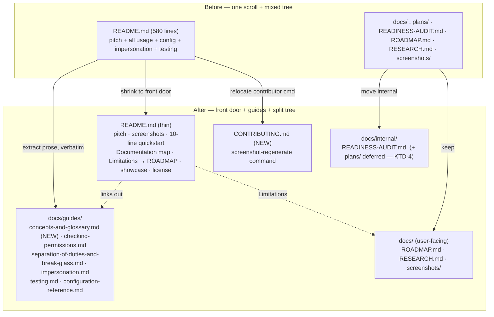

# Restructure the README into Guides, Add a Glossary, Separate Internal Docs, Fix Stale STATUS - Plan

## Goal Capsule

- **Objective:** the content is good; the *structure* is what hides it. Split the 684-line single-scroll `README.md` into a short front door plus a `docs/guides/` tree; give the core vocabulary a single home before any section uses those words — **note that `CONCEPTS.md` now exists at the repo root and already defines most of it** (subject, actor, initiator, org-wide vs scoped role, break-glass, fail-closed, permission, and the grant/decision/ledger model), so this is now *link to it and fill its gaps* — `effective subject` and `ambient context` are the terms it does not name — rather than authoring a guide from scratch; move internal artifacts (`docs/plans/`, `docs/READINESS-AUDIT.md`) out of the user-facing `docs/` tree into `docs/internal/`; link `docs/ROADMAP.md` from a plain **Limitations** heading that states the deferred hierarchy/cascade limitation in the open rather than a parenthetical; correct the stale `STATUS.md` (still "Version 0.1.0 — Not yet published to RubyGems" while 0.2.0 is live per `CHANGELOG.md`); and relocate the contributor-only screenshot-regenerate command out of the adopter README into `CONTRIBUTING.md`.
- **Authority hierarchy:** this plan → the settled v0.1/v0.2 engine model (`README.md`, `docs/ROADMAP.md`, `resources/DESIGN.md`, `CHANGELOG.md`). The engine invariants are **immutable and NOT touched by this issue**: resolver decision order (SoD veto → full_access → org-role → scoped-role → deny), fail-closed posture, one-org-role-per-subject, resolver **PURITY** (no writes / no per-decision state), and the ambient `CurrentAttributes` context. This is a **documentation reorganization** — moving and re-homing existing prose, adding one glossary, correcting stale facts. **No `lib/` runtime code, no `app/` code, no resolver / Guard / catalog / model behavior changes.** The extracted guide prose is copied faithfully from the current README; it is not rewritten or "corrected" (any factual correction is a sibling issue's job — see Cross-issue coupling).
- **Stop conditions — surface rather than guess if:**
  - (a) faithfully moving a README section into a guide would require *changing* an engine behavior to keep the prose true — it must not; re-home the words verbatim and, if a claim looks wrong, flag it against the owning sibling issue rather than editing it here under a `docs` label;
  - (b) moving `docs/plans/` would break in-flight cross-references from the concurrently-executing docs cluster (#24–#28) or from this very plan's own path — if so, defer the `docs/plans/` move (see U4 and Open Questions) rather than breaking sibling plans mid-flight;
  - (c) the README-shrink collides irreconcilably with a concurrent sibling README edit (#24 denial section, #25 canonical quickstart, #28 config table) — coordinate on landing order (see Cross-issue coupling), do not ship two conflicting rewrites of the same file.

---

## Product Contract

> **Product Contract preservation:** documentation issue, no upstream requirements doc (`product_contract_source: ce-plan-bootstrap`). Grounded in the filed finding (`issue #34`) and re-verified 2026-07-15 against `README.md` (580 lines), `STATUS.md:26`, `CHANGELOG.md:9` (0.2.0 shipped 2026-07-14), `docs/ROADMAP.md:72-79` (§2.3 cascade deferral), `docs/` tree (`plans/`, `READINESS-AUDIT.md`, `RESEARCH.md`, `ROADMAP.md`, `screenshots/`), and `README.md:65` (the contributor screenshot command).

### Summary

`README.md` is one 684-line scroll whose section order forward-references itself (Configuration points down to Impersonation while break-glass already used impersonation knobs 60 lines earlier; the SoD/break-glass prose uses "subject", "actor", "initiator", "effective subject", "veto" long before anything defines them). The `docs/` folder mixes internal build artifacts (`plans/`, `READINESS-AUDIT.md`) into the same tree an adopter browses. The one place the deferred no-cascade limitation is stated in the open — `docs/ROADMAP.md` §2.3 — is not linked from the README; it survives only as a parenthetical ("parent/child cascade is deferred", `README.md:201`). `STATUS.md` still says version 0.1.0, not yet on RubyGems, contradicting its own 2026-07-14 session log (which describes shipping v0.2 break-glass) and `CHANGELOG.md`. A contributor-only regenerate command sits in the adopter-facing Screenshots section.

The fix is structural, not editorial: a short README front door (pitch, screenshots, a 10-line quickstart, a documentation map, a Limitations link, showcase, license) plus a `docs/guides/` tree that homes the deep prose; a new concepts + glossary guide; internal docs moved under `docs/internal/`; STATUS corrected; the screenshot command relocated to `CONTRIBUTING.md`.

### Problem Frame

Five verified structural pains, all in the docs, none an engine bug:

1. **Vocabulary used before it is defined (concepts gap).** Core terms — subject, actor, effective subject, org-wide role, scoped role, `full_access`, permission key, SoD veto, initiator, break-glass, fail-closed, ambient context — have no single home; each is introduced inline inside whichever section first needs it (`README.md:241-346` uses "initiator"/"break-glass"/"veto" heavily; impersonation defines "effective subject" only at line 376). A reader hitting SoD before Impersonation meets undefined words.
2. **Single-scroll with self-referencing order (navigation).** 580 lines, one `README.md`. The Configuration section (`README.md:348-372`) forward-references Impersonation (`README.md:374`); break-glass (`README.md:288`) leans on impersonation semantics defined later. There is no map and no per-topic page.
3. **Internal artifacts in the user-facing tree (separation).** `docs/plans/` (31 plan files) and `docs/READINESS-AUDIT.md` sit beside `docs/ROADMAP.md` and `docs/RESEARCH.md` that the README legitimately links. An adopter browsing `docs/` wades through implementation plans.
4. **The real limitation is buried (discoverability).** The deferred resource-hierarchy/cascade limitation lives, fully explained, in `docs/ROADMAP.md:72-79` (§2.3), but the README surfaces it only as a parenthetical inside `scope_for` prose (`README.md:201`) and never links ROADMAP. There is no "Limitations" heading.
5. **Stale STATUS + misplaced contributor command (freshness).** `STATUS.md:26` reads "Version `0.1.0`. **Not yet published to RubyGems**" while `CHANGELOG.md:9` records `0.2.0` (2026-07-14) and STATUS's own session log (`STATUS.md:143-192`) describes shipping v0.2 break-glass. `README.md:65` puts `CAPTURE_SCREENSHOTS=1 … screenshots_test.rb` — a contributor task — in the adopter Screenshots section.

### Requirements

- **R1.** A `docs/guides/` directory exists and homes the deep usage prose currently in the README's Usage/Configuration/Impersonation/Testing sections, moved **faithfully** (verbatim content, internal anchors repaired), not rewritten.
- **R2.** A new `docs/guides/concepts-and-glossary.md` defines the core vocabulary in one place: a short concepts narrative plus a glossary of **at least 10** terms — subject, actor, effective subject, org-wide role, scoped role, `full_access`, permission key (`controller#action`), SoD veto, initiator, break-glass, fail-closed, ambient context. Each entry is one to three plain sentences; the guide is linkable and is the thing other guides point back to for definitions.
- **R3.** `README.md` is reduced to a front door: pitch (the existing "authorization as data" framing + the fixed decision-order block), Screenshots, a ~10-line quickstart, a **Documentation** map linking every guide, a **Limitations** section, the showcase, design notes, and license. Extracted deep sections are replaced by one-line summaries that link their guide.
- **R4.** A **Limitations** heading in the README links `docs/ROADMAP.md` and states the deferred hierarchy/cascade limitation plainly (scoped grants are flat; parent→child cascade is not built — ROADMAP §2.3), rather than leaving it as a parenthetical.
- **R5.** Internal artifacts move out of the browsable tree: `docs/internal/` exists; `docs/READINESS-AUDIT.md` moves into it; every reference to the moved file(s) (e.g. `STATUS.md:20`) is updated to the new path. The `docs/plans/` move is **conditional and sequenced** — see U4 and Open Questions — so it does not break in-flight sibling plans.
- **R6.** `STATUS.md` states the true version and publication status, consistent with `CHANGELOG.md` (0.2.0, 2026-07-14), and its "Last updated" bumps to 2026-07-15. No invented facts — copy the version/date from `CHANGELOG.md`.
- **R7.** The contributor screenshot-regenerate command moves from `README.md:65` into `CONTRIBUTING.md`; the README Screenshots section no longer carries a contributor-only command.
- **R8.** Backward compatibility for external links: any guide that absorbs a section keeps a stable heading/anchor, and the README's replacement one-liner links it, so an inbound deep link to the README lands on a pointer rather than a 404-shaped void. (No redirect machinery — this is Markdown; the guarantee is "the README still names the topic and links onward.")

---

## Key Technical Decisions

- **KTD-1 — Move, don't rewrite.** The issue's own premise is "the content is genuinely good; the structure is what stops people finding it." So the guide bodies are the **existing README prose, relocated**, with only mechanical fixes (repair intra-doc anchors, drop now-redundant forward-reference sentences like `README.md:356-358` that only existed because everything was one file). No re-authoring, no re-explaining. This keeps the diff reviewable as a move and avoids smuggling behavior claims. The single **new** authored artifact is the concepts + glossary guide (R2), which the issue explicitly requests and which no current text supplies.
- **KTD-2 — Guides are the home for sibling docs content; the README stays thin.** Several sibling docs issues (#24 denial behavior, #25 canonical quickstart, #26 adoption guide, #27 UPGRADING, #28 config reference) are in flight and some author into the README. To avoid the README re-bloating the moment it is shrunk, this plan establishes `docs/guides/` as the canonical home and recommends the content siblings target guides (denial → `docs/guides/denial-behavior.md`; config → `docs/guides/configuration-reference.md`; adoption → `docs/guides/adopting-in-an-existing-app.md`, already this file per #26). The README keeps only the ~10-line quickstart (#25's canonical quickstart) and links out. This is a coordination decision, flagged in Cross-issue coupling — **it constrains sibling plans, so it is called out for the maintainer, not silently assumed.**
- **KTD-3 — Land the README-shrink LAST in the docs cluster; land the low-conflict moves EARLY.** The internal-docs move (U4, except `docs/plans/`), the glossary (U1), and the STATUS fix (U5) touch files the README-editing siblings do not, so they can land any time. The README-shrink (U3) rewrites the same file #24/#25/#28 edit; sequencing it last means U3 slices the *then-final* README rather than racing concurrent edits. If instead #34 must go first, the siblings retarget their README edits to the guide homes this plan creates — either order works, but one must be chosen; default is #34-shrink-last.
- **KTD-4 — Defer the `docs/plans/` directory move until the active docs cluster lands.** `docs/plans/` holds this plan and 30 siblings that cross-reference each other by `docs/plans/…` path. The referencing set is wider than this plan first recorded: `STATUS.md`, the sibling plans themselves, and now `docs/solutions/` — which did not exist when this was written. Enumerating the referrers is the wrong shape of fix, because the enumeration goes stale faster than the move happens; **cite plans by number rather than path** and the move stops breaking anything. Moving the directory mid-cluster breaks those links and this plan's own recorded path. Decision: move `READINESS-AUDIT.md` now (it is finished internal history, referenced only from `STATUS.md`), and re-home `docs/plans/` → `docs/internal/plans/` as a **final** step once #24–#28 and #34 have all merged. R5 is satisfied incrementally; the astonishing "your plan links all 404 now" outcome is avoided. (Open Question OQ-2 records the alternative: move everything at once behind a link-rewrite sweep.)
- **KTD-5 — `ROADMAP.md` and `RESEARCH.md` stay in `docs/` (user-facing).** The issue names `plans/` and `READINESS-AUDIT.md` as the misplaced internal artifacts. `docs/ROADMAP.md` (linked under the new Limitations heading) and `docs/RESEARCH.md` (linked under Design notes) are legitimately adopter-facing reference and are **not** moved. `resources/DESIGN.md` likewise stays. Least-astonishment: don't move files the README points at.

---

## High-Level Technical Design

The change has real shape — a source tree reorganization with a fixed target layout and a sequencing constraint — so the target `docs/` tree is worth drawing.

*Directional — the prose and requirements are authoritative.* Landing order (KTD-3/4): glossary + internal-move(READINESS) + STATUS-fix any time → README-shrink + prose-extraction last in the cluster → `docs/plans/` move final.

---

## Implementation Units

### U1. Concepts + glossary guide (the one new artifact)

- **Goal:** give the core vocabulary a single, linkable home so every other guide can reference definitions instead of re-introducing terms.
- **Requirements:** R2.
- **Dependencies:** none (can land first).
- **Files:** `docs/guides/concepts-and-glossary.md` (new).
- **Approach:** a short "Concepts" narrative that walks the decision order once in plain language (reuse the fixed-order block from `README.md:36-45` as the anchor), followed by a `## Glossary` with one entry per term. Terms and one-line senses, drawn from the current README so they match shipped behavior: **subject** (who a request acts as — the identity permissions resolve against); **actor** (the real account behind the request; equals subject unless impersonating); **effective subject** vs **real actor** (the impersonation split — `README.md:376-382`); **org-wide role** (one per subject, DB-enforced; grants apply to every record of a type); **scoped role** (a role held on one specific record — "Editor of Project #7"); **`full_access`** (a role that grants everything, forever; step 2 of the order); **permission key** (`controller#action`; the route pair *is* the permission — `README.md:17-19`); **SoD veto** (opt-in four-eyes; the initiator can never act on their own record; overrides even full access); **initiator** (`current_scope_initiator`; who created the record, the identity SoD weighs); **break-glass** (`allow_sod_bypass`; an audited, privileged, opt-in waiver of the veto — *not* SoD, `README.md:288-346`); **fail-closed** (no grant → denied; the baseline, `README.md:29-30`); **ambient context** (`CurrentAttributes`-carried subject so `allowed_to?` is identical in controller, view, component — `README.md:31-35`). Cross-link each term to the guide that uses it (checking-permissions, SoD/break-glass, impersonation).
- **Patterns to follow:** the plain-language definitional tone the README already uses in its bullet pitch (`README.md:16-35`); the house convention of `noun.verb` / `controller#action` in monospace.
- **Test scenarios:** Test expectation: none — documentation only. Manual: every term the SoD, break-glass, and impersonation guides use is defined here; a reader can start cold at this guide and understand the decision-order block.
- **Verification:** the guide renders; all 10+ required terms present with a one-to-three-sentence definition; the Documentation map (U3) links it first.

### U2. Extract the deep usage prose into topic guides

- **Goal:** relocate the README's Usage / Configuration / Impersonation / Testing bodies into per-topic guides, verbatim, with anchors repaired.
- **Requirements:** R1, R8, and KTD-1/KTD-2.
- **Dependencies:** U1 (guides link back to the glossary).
- **Files (new):** `docs/guides/checking-permissions.md` (absorbs README "Checking permissions — anywhere" `:135-171`, "Scoping a list (`scope_for`)" `:173-202`, "Record-level decisions" `:204-221`, "Scopeable models" `:224-239`); `docs/guides/separation-of-duties-and-break-glass.md` (absorbs "Separation of duties (opt-in)" `:241-286` and "Break-glass override" `:288-346`); `docs/guides/impersonation.md` (absorbs "Impersonation (act-as)" `:374-502`); `docs/guides/testing.md` (absorbs "Testing your app" `:504-545`); `docs/guides/configuration-reference.md` (absorbs "Configuration" `:348-372` — and is the intended home for sibling #28's expanded config table, KTD-2). **Not extracted:** the Installation section (`:67-133`) — the quickstart plus the ungated-controller `GatingTripwire`/"Assumption #1" block (`:98-115`) and the bootstrap-first-admin recipe (`:117-132`) — stays in the README front door (U3), so this safety-critical setup guidance is neither dropped nor buried in a topic guide.
- **Approach:** move the section bodies verbatim. Mechanical fixes only: (a) repair intra-README anchors (e.g. the SoD section's `[Impersonation](#impersonation-act-as)` link, `README.md:357`, becomes a link to `impersonation.md`); (b) drop forward-reference sentences that only existed because it was one file (e.g. the Configuration paragraph's "covered under Impersonation … they layer in that order", `README.md:356-358`, becomes a plain cross-link); (c) add a one-line "See also: [Concepts & glossary](concepts-and-glossary.md)" header to each guide. **Do not** re-explain or correct content — if a claim looks wrong, it belongs to the owning sibling issue, not here (Stop condition a).
- **Patterns to follow:** the existing README section structure and code-fence style are preserved wholesale; only the container changes.
- **Test scenarios:** Test expectation: none — documentation only. Manual: diff each guide body against the README section it came from and confirm it is a move (content-identical modulo the three mechanical fixes); every relocated internal link resolves.
- **Verification:** all five guides render; no dangling anchors; the SoD/impersonation/config cross-links point at the new guide files, not `#`-anchors that no longer exist.

### U3. Shrink the README to a front door

- **Goal:** reduce `README.md` to pitch + screenshots + 10-line quickstart + a Documentation map + Limitations + showcase + design notes + license, replacing each extracted section with a one-line summary that links its guide.
- **Requirements:** R3, R4, R7, R8.
- **Dependencies:** U1, U2 (the guides must exist to link). **Sequencing:** land LAST in the docs cluster (KTD-3).
- **Files:** `README.md`.
- **Approach:** keep the top matter unchanged (`README.md:1-45`: badges, website, pitch bullets, the fixed decision-order block). Keep Screenshots (`:46-64`) but **remove** the contributor regenerate line (`:65`, moves to U4/CONTRIBUTING). Keep Installation as the ~10-line quickstart (this is #25's canonical quickstart — coordinate, KTD-2/Cross-issue). **Retain — do not extract or drop — the safety-critical setup guidance that follows the quickstart: the ungated-controller `GatingTripwire` / "Assumption #1" block (`:98-115`) and the bootstrap-first-admin recipe (`:117-132`). These are footgun-avoidance notes that belong at the front door beside the `Guard` install step, not buried in a topic guide; U2 deliberately does not extract them, so shrinking Installation must not silently delete them.** Replace the deep sections (Usage → Testing, `:134-545`) with a **Documentation** map: a short list linking `concepts-and-glossary.md` (read first), `checking-permissions.md`, `separation-of-duties-and-break-glass.md`, `impersonation.md`, `testing.md`, `configuration-reference.md`, plus the sibling-owned `adopting-in-an-existing-app.md` (#26) and `UPGRADING.md` (#27) once they exist. Add a **## Limitations** section (before or after The showcase) that links `docs/ROADMAP.md` and states plainly: scoped grants are flat — a scoped role on a parent record does not cascade to its children (ROADMAP §2.3); one org-wide role per subject; scoped roles reuse full role bundles (no per-record capability restriction) — the three open design questions from ROADMAP §2.3/§2 and `STATUS.md:204-211`. Keep The showcase (`:547-566`), Design notes (`:568-575`), License (`:577-580`).
- **Patterns to follow:** the README's existing bulleted, link-forward pitch style; the "→ [repo]" link style used for the showcase.
- **Test scenarios:** Test expectation: none — documentation only. Manual: README is materially shorter (target well under 200 lines); every extracted topic is named and linked (R8); Limitations names the cascade deferral in the open (R4); no contributor-only command remains (R7).
- **Verification:** README renders; the Documentation map links resolve to real files; the decision-order pitch and screenshots survive; the `GatingTripwire`/"Assumption #1" and bootstrap-first-admin safety notes survive in the README; Limitations links ROADMAP.

### U4. Separate internal docs + relocate the contributor command

- **Goal:** get implementation artifacts out of the browsable `docs/` tree and move the screenshot command to `CONTRIBUTING.md`.
- **Requirements:** R5, R7, and KTD-4/KTD-5.
- **Dependencies:** none for the `READINESS-AUDIT.md` move and `CONTRIBUTING.md`; the `docs/plans/` move is **deferred** to a final cluster-wide step (KTD-4).
- **Files:** create `docs/internal/`; `git mv docs/READINESS-AUDIT.md docs/internal/READINESS-AUDIT.md`; update `STATUS.md:20` (and the prose mention `STATUS.md:96`) to the new path; create `CONTRIBUTING.md` (new) with a "Regenerating screenshots" section carrying `CAPTURE_SCREENSHOTS=1 RAILS_ENV=test bin/rails test test/system/screenshots_test.rb` (from `README.md:65`). **Deferred sub-step (do not run until #24–#28 + #34 merge):** `git mv docs/plans docs/internal/plans` and rewrite the `docs/plans/…` references in `STATUS.md:97` and any sibling plan.
- **Approach:** `git mv` to preserve history; grep the repo for the old paths and fix every hit (`README.md`, `STATUS.md` are the only tracked non-plan Markdown that reference them — verified 2026-07-15). `CONTRIBUTING.md` is created at repo root (GitHub-conventional, surfaces in the PR/issue UI) and is the home for contributor-only tasks; seed it with the screenshot command and a one-line "how to run the suite" pointer to `STATUS.md`'s Working notes.
- **Patterns to follow:** the repo's existing link style; keep `docs/ROADMAP.md`, `docs/RESEARCH.md`, `resources/DESIGN.md` where they are (KTD-5).
- **Test scenarios:** Test expectation: none — documentation/file-move only. Manual: `docs/internal/READINESS-AUDIT.md` exists; no tracked file links the old `docs/READINESS-AUDIT.md` path; `CONTRIBUTING.md` carries the regenerate command; the README Screenshots section no longer does.
- **Verification:** `git mv` preserves history; every reference to a moved file resolves; the deferred `docs/plans/` move is recorded as a follow-up, not executed here (KTD-4).

### U5. Correct the stale STATUS

- **Goal:** make `STATUS.md`'s version/publication line true and consistent with `CHANGELOG.md`.
- **Requirements:** R6.
- **Dependencies:** none (can land first).
- **Files:** `STATUS.md`.
- **Approach:** replace `STATUS.md:26` ("Version `0.1.0`. **Not yet published to RubyGems** …") with the true state drawn from `CHANGELOG.md:9` — 0.2.0 (2026-07-14). If publication is still parked (STATUS's "Next" §1 says RubyGems push is parked, `STATUS.md:196-198`), say exactly that: "0.2.0 is the current version; a RubyGems push is prepared but parked (the showcase consumes the engine via a vendored path gem)" — do not claim it is published if it is not. Also correct the same file's "Publish to RubyGems" **Next** item (`STATUS.md:196-198`), whose "`gem build` clean, `v0.1.0`. Tag `v0.1.0`" still names the old version — bump those two `v0.1.0` references to `0.2.0` so the Next item does not contradict the corrected header (R6, no self-contradiction). Bump "Last updated: 2026-07-14" (`STATUS.md:3`) to 2026-07-15. **Copy version and date from `CHANGELOG.md`; invent nothing** (Stop condition — this is a fact correction, not a status rewrite).
- **Patterns to follow:** the existing STATUS voice and the CHANGELOG's version/date format.
- **Test scenarios:** Test expectation: none — documentation only. Manual: STATUS version matches CHANGELOG's latest (0.2.0); the "not yet published" contradiction with its own 2026-07-14 v0.2 session log is gone.
- **Verification:** STATUS version/date agree with `CHANGELOG.md`; no self-contradiction between the header line, the "Next" publish item (`:196-198`), and the session log.

---

## Scope Boundaries

**In scope:** creating `docs/guides/` and the concepts+glossary guide; moving the README's deep usage/config/impersonation/testing prose into guides (verbatim); shrinking the README to a front door with a Documentation map and a Limitations link to ROADMAP; moving `docs/READINESS-AUDIT.md` into `docs/internal/` and updating references; creating `CONTRIBUTING.md` with the relocated screenshot command; correcting `STATUS.md`'s version/publication line and date.

**Preserved deliberate design (documented, never changed):** the route-derived permission catalog, opt-in SoD, the fixed resolver order, one-org-role-per-subject, fail-closed default, resolver purity, and the flat (no-cascade) scoping. This issue *surfaces* the flat-scoping limitation in the README's new Limitations section — it does not build cascade.

### Deferred to Follow-Up Work

- **Moving `docs/plans/` into `docs/internal/plans/`** — deferred to a final step after the active docs cluster (#24–#28, #34) merges, to avoid breaking in-flight cross-references and this plan's own recorded path (KTD-4; OQ-2).
- **A docs-site (`gh-pages`) restructure** to mirror the new guide tree — out of scope here; the site is touched by #25 for the quickstart only. If the site should gain a per-guide nav, file it separately.
- **Any factual correction discovered while moving prose** — routed to the owning sibling issue (e.g. a wrong denial claim → #24/#23/#39), not fixed under this `docs` reorg.
- **Updating `InstallGenerator#show_next_steps`** to point at the new guides — the generator string is already being rewritten by #24, #25, #26; this plan does not add a competing edit (Cross-issue coupling). If none of those lands, a one-line pointer to `docs/guides/` is a trivial follow-up.

### Non-goals

No engine, model, resolver, Guard, catalog, or config **behavior** change. No new runtime code. No rewrite of the (good) existing prose beyond the mechanical move-fixes in U2.

---

## Open Questions

- **OQ-1 — README quickstart ownership.** The shrunk README keeps a ~10-line quickstart, which is exactly #25's "one canonical quickstart (authored in README)". Confirm #34 defers the quickstart *wording* to #25 and only frames it structurally. Default assumed: yes — #34 provides the slot, #25 fills it.
- **OQ-2 — `docs/plans/` move: incremental or big-bang.** KTD-4 defers the directory move to a final step. Alternative: move it now behind a repo-wide link-rewrite sweep (all sibling plans + STATUS in one commit). Deferral is safer for the in-flight cluster; the maintainer may prefer big-bang if the cluster is about to close. Which?
- **OQ-3 — Guide file naming.** Proposed slugs (`separation-of-duties-and-break-glass.md`, `checking-permissions.md`, …) should match whatever #26 already assumes (`adopting-in-an-existing-app.md`) and #24/#28's intended homes (`denial-behavior.md`, `configuration-reference.md`). Confirm the slug set once, so all docs plans link the same paths.
- **OQ-4 — `CONTRIBUTING.md` location.** Root (GitHub-conventional, PR/issue UI surfaces it) vs `docs/internal/contributing.md` (keeps all internal docs together). Default: root, because the screenshot task is a real contributor entry point and GitHub links it automatically.

---

## Cross-issue coupling

This issue is the **structural umbrella** for a cluster of content-authoring docs issues already planned in `docs/plans/`. It must compose with them, not collide:

- **#25 — canonical quickstart** (`docs/plans/2026-07-15-007-…`): authors the quickstart in the README. #34 keeps that quickstart as the README's only deep content and links everything else out. **Coupling:** both edit the README Installation/quickstart region — land #25 first, then #34 shrinks around the now-canonical quickstart (KTD-3). Slug/anchor agreement per OQ-1.
- **#24 — denial behavior** (`…-006-…`): adds a "When access is denied" README section *and* edits the generator `show_next_steps`. #34 recommends that section become `docs/guides/denial-behavior.md` linked from the README map (KTD-2), so the README stays thin. **Coupling:** coordinate whether denial lives in README (then #34 extracts it) or goes straight to a guide (preferred). Both touch `install_generator.rb` intent — #34 adds no generator edit to avoid a three-way collision.
- **#26 — adoption guide** (`…-008-…`): already writes `docs/guides/adopting-in-an-existing-app.md`. #34 just links it from the Documentation map and provides the `docs/guides/` parent. **Coupling:** #34 must not re-create that file; it depends on the same directory. Slug per OQ-3.
- **#27 — UPGRADING** (`…-009-…`): writes root `UPGRADING.md`. #34's Documentation map links it. No file conflict; pure link addition.
- **#28 — config reference sync** (`…-010-…`): expands the README Configuration section into a full table *and* edits the initializer template. #34 extracts Configuration into `docs/guides/configuration-reference.md` (U2). **Coupling (highest):** #28's table should land in that guide, not the README, or #34 will immediately re-extract it. Recommend #28 target `configuration-reference.md`; if #28 lands in the README first, #34's U2 moves the finished table into the guide (KTD-2/KTD-3).

**Recommended cluster landing order:** #28/#25/#24 content edits (targeting guides where possible) → #26/#27 new guide files → **#34 U1/U4(READINESS)/U5 any time**, **#34 U2/U3 last** → final `docs/plans/` move (KTD-4). The maintainer picks the exact order; this plan's units are written so that "shrink last" and "establish homes first" are both viable.
