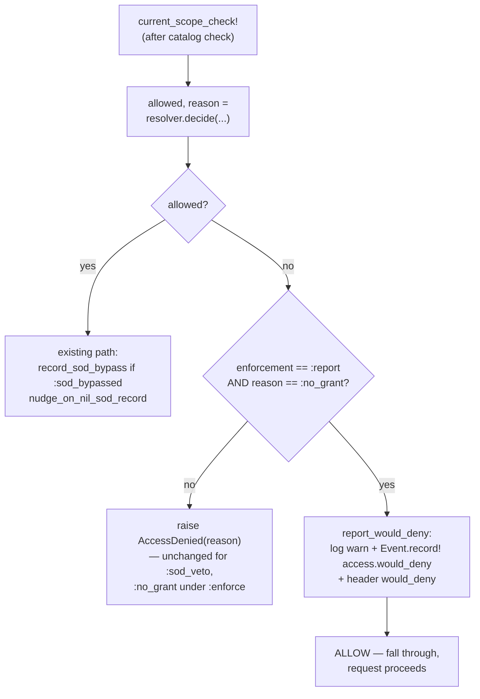

# Report-Only Enforcement Mode (`config.enforcement = :report`) - Plan

## Goal Capsule

- **Objective:** add an opt-in, default-off **report-only** enforcement mode so a team retrofitting `Guard` into a legacy controller can watch would-be denials on real traffic — and mine them into a role grid — before flipping enforcement on. The engine's problem today is that including `Guard` is an instant, total 403 wall (every action denies for every user until roles exist), which forces big-bang adoption a legacy team can't do. This is the CSP `report-only` / strong_migrations `dry_run` pattern applied to authorization.
- **Authority hierarchy:** this plan → the settled v0.1 engine model (`README.md`, `resources/DESIGN.md`, `docs/ROADMAP.md`). These invariants are **immutable** and this feature must not touch them:
  - resolver decision order — **SoD veto → full_access → org role → scoped role → deny**;
  - **fail-closed** posture (absence of a grant means deny);
  - **one org-role per subject**;
  - resolver **PURITY** — no writes, no per-decision state, thread-shareable/memoizable (`lib/current_scope/resolver.rb` header);
  - ambient `CurrentAttributes` context (`CurrentScope::Current`) as the only source of actor/subject.
  The feature lives entirely at the **Guard** seam behind a config switch that defaults to the current behavior. With `enforcement = :enforce` (default) every existing decision and response is byte-for-byte unchanged.
- **Honest framing (load-bearing):** report-only relaxes the **grant-absence** wall (`:no_grant`), which is the retrofit problem — and **nothing else**. It deliberately does **not** relax the SoD veto (`:sod_veto`) or the read-only-while-impersonating gate (`:impersonation_gate`). Those are structural fraud/act-as safety guarantees, not "missing role" walls; letting an SoD-vetoed mutation *execute* in report mode would allow a real self-approval, not merely surface a role gap. Report mode surfaces role gaps; it never softens a security veto. (See KTD-3.)
- **Engine-only, v0.2.** Additive: no migration, no schema change; would-be denials ride the existing append-only `current_scope_events` ledger. Test-first for the Guard branch (a security-relevant enforcement path). RuboCop omakase clean.
- **Stop conditions:** stop and surface rather than guess if (a) the design would require the resolver to write or hold per-decision state, (b) any behavior changes while `enforcement == :enforce`, (c) report mode would let a `:sod_veto` or `:impersonation_gate` denial through, or (d) an unknown `enforcement` value could silently *disable* enforcement (it must fail loud or fail closed, never open).

---

## Product Contract

> **Product Contract preservation:** new feature, no upstream requirements doc (`product_contract_source: ce-plan-bootstrap`). Motivated by the god-controller retrofit shakedown (issue #37); repro and evidence in the issue body.

### Summary

Introduce `config.enforcement` with values `:enforce` (default) and `:report`. In `:report`, `current_scope_check!` runs the full resolution exactly as today, but when the decision is a **grant-absence denial** (`:no_grant`), instead of raising `AccessDenied` it (a) emits a structured log line, (b) records a `access.would_deny` row on the existing audit ledger (when `config.audit` is on), (c) sets `X-Current-Scope-Reason: would_deny` on the response, and (d) **allows** the request to proceed. A companion rake task `current_scope:report` summarizes the recorded would-be denials — top denied permission keys by subject — so a team can turn real traffic into a role grid. A loud boot warning fires when `:report` runs in production, so an observe-first rollout can't be silently left on.

### Problem Frame

Including `CurrentScope::Guard` in a legacy `ApplicationController` gates every action behind its own `controller#action` permission key, fail-closed, the instant it exists (`lib/current_scope/guard.rb:33-57`). For a 27-action legacy controller with no roles yet, that means every action 403s for every user — including admins pre-grant. The only current adoption tools are `skip_before_action :current_scope_check!` (fail-open, per action, easy to forget) and hand-built `full_access` grants. There is no observe-first ramp: no way to include the gate, watch what *would* be denied under real traffic, and build the role grid from evidence before enforcing. That is the single biggest wall to retrofitting the gem into an existing app, and it is exactly the wall this feature removes.

### Requirements

- **R1.** `config.enforcement` defaults to `:enforce`. With `:enforce`, every existing decision, raise, and response header is byte-for-byte unchanged — report mode is entirely inert.
- **R2.** `config.enforcement` accepts only `:enforce` or `:report`. Any other value is refused loudly (`ConfigurationError`) at assignment — an unrecognized mode must never silently disable enforcement.
- **R3.** In `:report`, a decision that denies with reason `:no_grant` does **not** raise: the request is allowed to proceed, and the would-be denial is reported (R4–R6).
- **R4.** In `:report`, a decision that denies with reason `:sod_veto` **still raises** `AccessDenied` exactly as under `:enforce`. The SoD veto is never relaxed by report mode.
- **R5.** In `:report`, the read-only-while-impersonating gate (`MutationGuard`, reason `:impersonation_gate`) is **unaffected** — it is a separate `before_action` and report mode does not touch it.
- **R6.** A reported would-be denial emits a structured `Rails.logger` warning naming the subject, permission, and reason; sets `X-Current-Scope-Reason: would_deny` on the response; and, when `config.audit` is on, appends exactly one `access.would_deny` event carrying the permission and reason. With `config.audit` off, report mode still allows + logs but records no row (consistent with the rest of the ledger).
- **R7.** The resolver is untouched and stays pure — report mode is a Guard-layer branch over the resolver's existing `[allowed, reason]` tuple. No resolver writes, no per-decision state.
- **R8.** `rake current_scope:report` summarizes recorded `access.would_deny` events — top denied permission keys grouped by subject (and the subject's org role when resolvable) — so the output reads as a starter role grid. It degrades cleanly (clear message) when there are no rows or the events table is absent.
- **R9.** When `enforcement == :report` in production, a prominent warning is logged once at boot (not raised — production is a legitimate home for an observe-first retrofit, but it must be loud so it isn't forgotten).

---

## Key Technical Decisions

- **KTD-1 — Report mode is a Guard-layer branch, not a resolver change.** The resolver already returns `[allowed, reason]` (`lib/current_scope/resolver.rb:33-47`) and is contractually pure. The observe-vs-enforce choice is an *enforcement* concern, and the Guard (`current_scope_check!`) is the established enforcement + audit-mutation seam — it already records `sod.bypassed` and sets `X-Current-Scope-Reason` there (`guard.rb:59-78`). So the entire feature is one branch in `current_scope_check!` that inspects `reason` before raising. The resolver stays byte-for-byte pure (R7). One guard in the shared function, not N per-caller skips.
- **KTD-2 — Report mode relaxes only `:no_grant`, by matching on the resolver's reason.** The resolver already distinguishes `:no_grant`, `:sod_veto`, and (allow) `:sod_bypassed`. Report mode keys off `reason == :no_grant` so it lifts *exactly* the retrofit wall and can never accidentally lift a security veto. This is safer and simpler than a blanket "allow everything in report mode."
- **KTD-3 — SoD veto and the impersonation gate are NOT relaxed (deliberate, flagged).** A literal reading of "log would-be denials without 403ing" would include `:sod_veto`. We deliberately don't: allowing an SoD-vetoed *mutation* to run in report mode lets the initiator actually self-approve their own record — a real fraud action executes, not merely a surfaced role gap. Report mode is an RBAC-adoption ramp, and the retrofit scenario is pure RBAC (SoD is empty by default), so relaxing only `:no_grant` fully solves the motivating case while keeping the fraud control intact. `:impersonation_gate` is enforced by a *separate* `before_action` (`mutation_guard.rb`) that report mode simply doesn't touch. **This narrows the literal ask; flagged for review** (Open Questions Q1).
- **KTD-4 — Would-be denials reuse the existing audit ledger; no new table.** `CurrentScope::Event` is an append-only ledger with `event/subject/actor/target/details/request_id` and a working `record!` no-op-when-audit-off path (`app/models/current_scope/event.rb`). A would-be denial is recorded as `event: "access.would_deny"` with `details: { permission:, reason: }`. `Event.record!` requires a non-nil `target`; a collection-action denial has no record, so the **target is the denied subject** (`Current.user`) — which is exactly the axis `current_scope:report` groups on. No migration, no new model. **Fork named:** a dedicated `would_deny` table (or log-only + a `current_scope.would_deny` `ActiveSupport::Notifications` event) was considered; reuse wins because report mode is transitional, the rows are append-only and disposable after rollout, and a rake summary needs *persisted* data a log line can't cheaply give it. Trade-off: report-mode traffic adds rows to the audit ledger during retrofit — acceptable and documented, since that IS the data being mined. (See Open Questions Q2.)
- **KTD-5 — Validating writer, fail-loud on unknown; fall-through fails closed.** `enforcement=` validates against `%i[enforce report]` and raises `ConfigurationError` on anything else (R2) — matching the gem's loud-config posture (cf. `allow_mutations_while_impersonating=`). Belt-and-braces: the Guard branch only relaxes when `enforcement == :report`, so even if validation were ever bypassed, an unrecognized value **enforces** (fail-closed), never opens the gate.
- **KTD-6 — Boot warning is `after_initialize`, logged not raised.** The host sets `config.enforcement` in an initializer, so the production check must run after initializers — `Engine.config.after_initialize`. It warns loudly (banner line) but does not raise: an observe-first production retrofit is legitimate; the requirement is that it be un-forgettable, not forbidden (R9). Contrast `allow_mutations_while_impersonating`, which *is* refused in prod — that flag executes real cross-identity writes; report mode only *observes* denials while preserving every real security veto, so a warning is the right ceiling.

---

## High-Level Technical Design

The change is one reason-inspecting branch at the single enforcement seam. The resolver, the catalog check, the SoD/bypass paths, and the impersonation `MutationGuard` are all untouched.



*Directional — prose and requirements are authoritative.* Note the report branch (D→F→G) is reachable only from the deny path AND only for `:no_grant`, so an SoD veto (E) and every ordinary allow (K) are structurally unreachable from it.

---

## Implementation Units

### U1. Config surface for `enforcement`

- **Goal:** add the `enforcement` knob, default `:enforce`, with a validating writer that fails loud on unknown values.
- **Requirements:** R1, R2, KTD-5.
- **Dependencies:** none.
- **Files:** `lib/current_scope/configuration.rb`, `test/configuration_test.rb`.
- **Approach:** `attr_reader :enforcement`; set `@enforcement = :enforce` in `initialize`. Add a custom writer `enforcement=(value)` that coerces to a Symbol and raises `ConfigurationError` unless it is in `ENFORCEMENT_MODES = %i[enforce report].freeze`, naming the allowed values in the message. Document with a doc-comment in the file's established style: what `:report` does, that it relaxes only `:no_grant` (not SoD, not the impersonation gate — point at KTD-3), and the prod-warning behavior. Directional signature:
  ```ruby
  # ponytail: tiny allow-list writer; fail loud, never silently disable enforcement
  def enforcement=(value)
    # Coerce only what CAN be a Symbol: bare value.to_sym raises NoMethodError
    # on nil (and on Integer), which is the wrong error — the writer promises a
    # ConfigurationError naming the allowed values. Anything non-symbolizable
    # falls through unchanged and fails the allow-list check below.
    mode = value.respond_to?(:to_sym) ? value.to_sym : value
    raise ConfigurationError, "..." unless ENFORCEMENT_MODES.include?(mode)
    @enforcement = mode
  end
  ```
  **Test the coercion, not just the allow-list:** `nil`, `42`, and `"nonsense"` must each raise `ConfigurationError` (not `NoMethodError`), while `"report"` and `:report` both set `:report`. The nil case is the one a host actually hits — `config.enforcement = ENV["..."]` is nil when the var is unset, and it must fail loud rather than crash with an unrelated error class.
- **Patterns to follow:** the existing `attr_accessor` + `initialize` defaults + doc-comment style; the guarded-writer precedent of `allow_mutations_while_impersonating=`.
- **Test scenarios:**
  - `enforcement` defaults to `:enforce`.
  - Assigning `:report` reads back `:report`; assigning `:enforce` reads back `:enforce`.
  - Assigning `"report"` (String) coerces to `:report` (or is rejected — pick one and pin it; recommend coerce for ergonomics).
  - Assigning `:reporting` / `:off` / `nil` raises `ConfigurationError` naming the allowed values (proves fail-loud, R2).
- **Verification:** configuration test green; defaults confirmed; RuboCop clean.

### U2. Guard: report-only branch relaxes `:no_grant`, records the would-be denial

- **Goal:** in `:report`, convert a `:no_grant` denial into an allow-with-report; leave `:sod_veto` (and everything under `:enforce`) raising exactly as today.
- **Requirements:** R3, R4, R6, R7, KTD-1, KTD-2, KTD-3, KTD-4.
- **Dependencies:** U1.
- **Files:** `lib/current_scope/guard.rb`, `test/integration/guard_report_mode_test.rb` (new; integration-style through `test/dummy`, mirroring `test/integration/guard_test.rb`).
- **Approach:** in `current_scope_check!`, replace the unconditional `raise ... unless allowed` (`guard.rb:57`) with a branch: when `!allowed`, if `CurrentScope.config.enforcement == :report && reason == :no_grant`, call a new private `report_would_deny(permission, record)` and fall through (do not raise); otherwise raise `AccessDenied` as today. The existing `record_sod_bypass`/`nudge_on_nil_sod_record` tail runs only on the allowed path and is untouched. `report_would_deny` (sibling of `record_sod_bypass`): emit `Rails.logger&.warn` naming subject/permission/`no_grant`; set `response.set_header("X-Current-Scope-Reason", "would_deny")`; and record the ledger row with `target = record || CurrentScope::Current.user` — but skip the row (log-only, still allow) when there is **no ambient subject** (`CurrentScope::Current.user` is nil), because an unauthenticated `:no_grant` can't be attributed. Guard on the ambient subject, **not** on `target`: a member action carrying a non-nil `record` under a nil subject would pass a `target`-based guard and reach `Event.record!`, which raises `ConfigurationError` on the nil `Current.actor` (`event.rb:40-45`) — turning an observe-mode request into a 500. Guarding on `Current.user` keeps report mode from ever raising (R3 non-disruption):
  ```ruby
  # ponytail: reuse Event ledger; target = the denied subject (or the record) — the axis :report groups on
  def report_would_deny(permission, record)
    Rails.logger&.warn("[CurrentScope] report-only: would DENY \"#{permission}\" (reason: no_grant)")
    response.set_header("X-Current-Scope-Reason", "would_deny")
    # No ambient subject ⇒ nothing to attribute the row to, and Event.record! would
    # raise on the nil actor. Guard on the subject, not on `target` (a record can be
    # non-nil while the subject is nil), so observe mode never raises.
    return unless CurrentScope::Current.user
    CurrentScope::Event.record!(event: "access.would_deny", target: record || CurrentScope::Current.user,
                                details: { permission: permission, reason: "no_grant" })
  end
  ```
- **Execution note (test-first):** this is a security-relevant enforcement path — write the failing integration tests first and watch them go red before editing the Guard. The most important assertions are the *negative* ones: SoD veto still 403s in report mode, and `:enforce` is unchanged.
- **Patterns to follow:** the sibling `record_sod_bypass` (`guard.rb:71-78`) for the record-once-and-set-header shape; `Event.record!` call convention; the `X-Current-Scope-Reason` header convention (`mutation_guard.rb:49-53`).
- **Test scenarios:**
  - **Report allows a `:no_grant` action:** roleless subject GET/POST a gated action under `enforcement = :report` → response is 2xx/normal (not 403), `X-Current-Scope-Reason: would_deny`, and (audit on) exactly one `access.would_deny` event with `details.permission` = the key and `subject` = the user.
  - **Enforce is unchanged (default):** same roleless request under `enforcement = :enforce` → 403, `X-Current-Scope-Reason: no_grant`, no `access.would_deny` row. (Proves R1 no-op.)
  - **SoD veto still blocks in report mode:** with `sod_actions` set and an initiator conflict, the SoD action under `:report` → **403**, `X-Current-Scope-Reason: sod_veto`, no `access.would_deny` row. (Proves R4/KTD-3 — the security veto is not relaxed.)
  - **Granted action in report mode:** a subject who *does* hold the permission → normal allow, no `would_deny` header, no `access.would_deny` row (report only fires on would-be denials).
  - **Collection action (nil record):** roleless index action under `:report` → allowed, `would_deny` row targets the subject (record is nil).
  - **Unauthenticated `:no_grant` (nil subject, member action):** no ambient subject/actor set, a member action carrying a non-nil `record` under `:report` → allowed (not 403, **no raise**), `X-Current-Scope-Reason: would_deny` header set, log line emitted, and **zero** `access.would_deny` rows (the denial can't be attributed, so it's log-only). Guards against `Event.record!` raising `ConfigurationError` on the nil actor and turning observe mode into a 500.
  - **Audit off:** `config.audit = false` under `:report` → request allowed, header set, log line emitted, zero rows (R6 tail).
  - **Catalog error still raises:** an excluded/unrouted permission under `:report` still raises `ConfigurationError` (report mode never masks a wiring mistake).
- **Verification:** report-mode integration test green; `test/integration/guard_test.rb` unchanged and passing; no double-recording; RuboCop clean.

### U3. Production boot warning when report mode is on

- **Goal:** log one prominent warning at boot when `enforcement == :report` in production, so an observe-first rollout can't be silently left on.
- **Requirements:** R9, KTD-6.
- **Dependencies:** U1.
- **Files:** `lib/current_scope/engine.rb`, `test/current_scope_test.rb` (or a small `test/enforcement_boot_warning_test.rb`).
- **Approach:** add `config.after_initialize` to the Engine that, when `Rails.env.production? && CurrentScope.config.enforcement == :report`, emits a banner-style `Rails.logger.warn` explaining that authorization is in **report-only** mode (would-be denials are logged, not enforced) and how to enforce (`config.enforcement = :enforce`). Keep it a warning, never a raise (KTD-6). Guard against `Rails.logger` being nil.
- **Patterns to follow:** the existing `Engine` block; the loud-but-non-fatal warning style of `Event.warn_missing_events_table_once`.
- **Test scenarios:**
  - With `enforcement = :report` and a stubbed production env, the boot hook logs a warning containing "report-only". (Invoke the hook's logic directly rather than rebooting the app if a full re-init is awkward in the suite.)
  - With `enforcement = :enforce` in production → no warning.
  - With `enforcement = :report` in test/development → no warning (prod-only).
- **Verification:** boot-warning test green; RuboCop clean.

### U4. `current_scope:report` rake task

- **Goal:** summarize recorded `access.would_deny` events into a starter role grid — top denied permission keys by subject.
- **Requirements:** R8.
- **Dependencies:** U2 (produces the rows).
- **Files:** `lib/tasks/current_scope_tasks.rake`, `test/report_task_test.rb` (new; exercise via `CurrentScope::Event` fixtures/rows, mirroring `test/grant_test.rb` for structure).
- **Approach:** add a `current_scope:report` task in the existing `namespace :current_scope`. Load `CurrentScope::Event.where(event: "access.would_deny")`, group in Ruby by `[subject, details["permission"]]`, count, and print a readable table sorted by count desc (subject label + org role when resolvable via `RoleAssignment`/`config.subject_label`, permission key, count). Print a clear "no would-be denials recorded — is report mode on and audit enabled?" message when empty. Rescue a missing events table into the same guidance the ledger uses. Keep the grouping in Ruby (adapter-agnostic; no JSON-column SQL).
  ```ruby
  # ponytail: group in Ruby, not adapter-specific JSON SQL. Ceiling: fine for a transitional
  # retrofit's volume; if a host accumulates millions of rows, push the GROUP BY into SQL.
  ```
- **Patterns to follow:** the existing `current_scope:grant` task (arg handling, `constantize`, `puts` output, `abort` on misuse); `config.subject_label` resolution used by the management UI.
- **Test scenarios:**
  - Given several `access.would_deny` rows across two subjects and three permissions, the task output lists each permission with the correct count, highest first, grouped by subject.
  - No rows → the empty-state guidance message, no crash.
  - Missing events table → the graceful "run the migration" guidance (no unhandled `StatementInvalid`).
- **Verification:** report-task test green; running the task by hand against seeded rows prints the expected summary; RuboCop clean.

### U5. Documentation and adoption cross-link

- **Goal:** document report-only mode honestly and wire it into the retrofit/adoption narrative.
- **Requirements:** R1–R9 (the honest-framing mandate: report mode relaxes only the grant-absence wall).
- **Dependencies:** U1–U4.
- **Files:** `README.md` (new subsection, near Usage/Installation retrofit guidance), `lib/current_scope/configuration.rb` (doc comment done in U1), `docs/ROADMAP.md` / `STATUS.md` (mark landed), `CHANGELOG.md`.
- **Approach:** add a README subsection — "Retrofitting an existing app: report-only mode" — that (a) states the problem (including Guard is an instant fail-closed 403 wall), (b) shows `config.enforcement = :report`, (c) explains the observe-then-enforce workflow: include Guard in report mode, run real traffic, run `rake current_scope:report`, build roles from the output, flip to `:enforce`; (d) states plainly that report mode relaxes **only** `:no_grant` — the SoD veto and the read-only-while-impersonating gate are **still enforced** (point readers to why); (e) documents the `access.would_deny` ledger event, the `X-Current-Scope-Reason: would_deny` header, and the production boot warning; (f) notes the rake summary needs `config.audit` on. Cross-link the "adopting in an existing app" guide (issue #26): report mode is the runtime mechanism, #26 is the narrative — the docs should reference each other so a retrofitting reader lands on both.
- **Test expectation:** none — documentation only.
- **Verification:** README renders; the workflow is self-contained and copy-able; `STATUS.md`/`ROADMAP.md` updated; `CHANGELOG.md` notes the additive, default-off feature.

---

## Scope Boundaries

**In scope:** the `enforcement` config knob + validating writer; the Guard-layer report branch (relaxing only `:no_grant`); the `access.would_deny` ledger recording + `would_deny` header; the production boot warning; the `current_scope:report` rake summary; tests; docs + adoption cross-link — engine only.

**Explicit non-goals (preserve deliberate design choices):**
- Report mode does **not** relax the SoD veto (`:sod_veto`) or the read-only-while-impersonating gate (`:impersonation_gate`) — those are structural security guarantees, not adoption walls (KTD-3, R4/R5).
- No change to the resolver, the route-derived permission catalog, or the fail-closed default under `:enforce`.
- No per-action or per-controller report/enforce granularity — `enforcement` is a single global switch (a legacy team retrofits the whole controller at once; per-action skips already exist via `skip_before_action`).
- No new table, model, or migration — would-be denials reuse the audit ledger.

### Deferred to Follow-Up Work

- Per-controller / per-namespace report scoping (e.g. `report` for `legacy/*` while enforcing elsewhere) — add only if a real staged rollout needs it.
- An `ActiveSupport::Notifications` (`current_scope.would_deny`) instrument for hosts that want to route would-be denials to their own APM instead of / in addition to the ledger.
- A "role grid diff" that turns `current_scope:report` output directly into `RolePermission` rows (auto-generate the grid) — the task currently *informs* the grid; auto-writing it is a bigger, riskier step.
- Pushing the rake `GROUP BY` into SQL if a host accumulates very large `would_deny` volumes (ponytail ceiling noted in U4).

---

## Open Questions

- **Q1 (scope of relaxation).** KTD-3 restricts report mode to `:no_grant`, deliberately keeping `:sod_veto` (and the impersonation gate) enforcing — because allowing an SoD-vetoed mutation to *execute* is a real self-approval, not just a surfaced gap. Confirm this is the intended boundary. If a maintainer wants SoD would-be-vetoes *logged* too (without executing the mutation), that's a different, larger feature (report the veto without letting the write through) and should be its own issue.
- **Q2 (persistence substrate).** KTD-4 reuses the `current_scope_events` ledger. Confirm mixing observability rows (`access.would_deny`) into the security-audit ledger is acceptable for a transitional retrofit, versus a dedicated table or notification-only. The reuse assumption is the smallest correct change and is what this plan builds.
- **Q3 (String vs Symbol coercion).** U1 assumes `enforcement=` coerces `"report"` → `:report` for initializer ergonomics. Confirm coercion (recommended) vs. strict "Symbol only."

---

## Cross-issue coupling

- **#26 (adoption / "adopting in an existing app" guide) — companion.** This issue is the runtime **mechanism**; #26 is the **narrative**. The two plans should compose: U5 here adds the report-mode workflow to the README and links out to #26's adoption guide, and #26 should reference report-only mode as the recommended first step of a retrofit. Land them so a retrofitting reader arrives at both — neither is complete alone (report mode without the guide is undocumented; the guide without report mode still hits the 403 wall).
- **Denial-ergonomics cluster (#23 engine-403 / #24 denial-behavior / #39 denial-ergonomics).** Report mode adds a new machine-readable outcome on the shared `X-Current-Scope-Reason` seam (`would_deny`). If any of those issues reshape how denials/reasons are surfaced (headers, response bodies, exception shape), they should account for the `would_deny` value and the allow-with-header case introduced here, so the reason vocabulary stays consistent across enforce and report modes.
