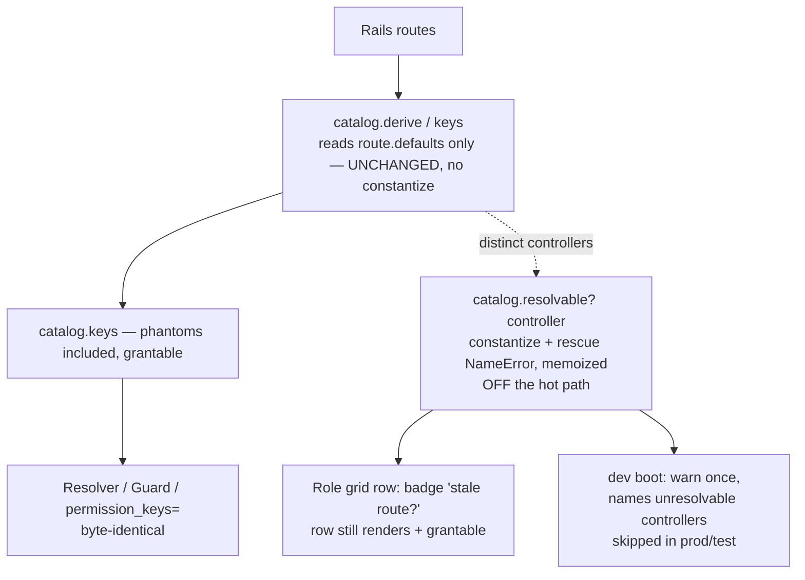

# Flag Phantom Permissions (routes to nonexistent controllers)

## Goal Capsule

- **Objective:** make a permission whose route points at a controller class that does not exist **visible as a probable mistake** — badge the row in the role grid and warn once at boot in development — instead of letting it masquerade as a normal, grantable permission that 500s when hit. Detection only; the catalog stays a truthful mirror of the routes.
- **Authority hierarchy:** this plan → the settled v0.1 engine model (`README.md`, `resources/DESIGN.md`, `docs/ROADMAP.md`). Immutable: the resolver decision order (SoD veto → full_access → org role → scoped role → deny), the **fail-closed** posture, one-org-role-per-subject, the **resolver's purity** (no writes, no per-decision state, safe to memoize/share across threads), the ambient `Current`-attributes context, and the **route-mirror contract** — the catalog is derived from routes, one permission per `controller#action`, with no side table to maintain. This feature is **purely additive and advisory**: it changes no decision, mutates no catalog key, and adds no gate.
- **Stop conditions — surface rather than guess if:** (a) any design pressure pushes the resolvability check into `derive`/`keys` (the hot path the Guard and resolver ride) or into the resolver itself; (b) a change would remove or disable a catalog key rather than flag it (that silences a real misconfiguration and breaks the route-mirror contract — KTD-1); (c) the detection would need to `rescue` broader than `NameError` (a real controller failing to load must surface, not be relabeled "phantom" — KTD-3); or (d) anyone proposes intercepting the Rails routing-time `MissingController` 500 inside the engine (out of reach — the gate never runs — KTD-5).

---

## Product Contract

> **Product Contract preservation:** UX/observability enhancement on shipped behavior; no upstream requirements doc (`product_contract_source: ce-plan-bootstrap`). Grounded in issue #43 and verified against `lib/current_scope/permission_catalog.rb:22-31`.

### Summary

The permission catalog is derived from `Rails.application.routes` — for each route it reads `route.defaults[:controller]` and `[:action]` and emits `"controller#action"`. It **never checks that the controller class exists**. So a stale or mistyped route (`get "ghosts" => "ghosts#index"` with no `GhostsController`) yields a catalog key `ghosts#index`, a normal-looking grid row with a real checkbox and an "Enable all ghosts permissions" toggle, and a grant that persists through `Role#permission_keys=` (the key IS in the catalog, so the stale-key filter passes it). Granting is harmless-looking; hitting `GET /ghosts` raises `ActionDispatch::MissingController` at routing time — **not** rescuable as 404, so production serves a 500. Nothing distinguishes these phantoms from real permissions.

This plan adds a **resolvability check** — attempt to constantize the controller for each distinct catalog controller — surfaced in exactly two advisory places: a **badge** on the grid row ("stale route?") and a **once-per-boot development warning** naming the unresolvable controllers. The catalog keys, the resolver, the Guard, and the grant path are all untouched. `excluded_controllers` remains the documented way to silence a phantom you've acknowledged.

### Problem Frame

Long-lived apps accumulate stale routes: a controller gets renamed or deleted, a `routes.rb` line or a typo lingers. The engine's whole value proposition is "your routes *are* your permissions," so it faithfully mirrors even the broken ones — and a broken one is indistinguishable from a real one in the grid. The cost is low-severity but real: an admin grants a permission that can never serve a request (grid pollution, confusion), and the only way to discover the break is to hit the route in production and read a 500. The engine already leans **loud-by-design** (README:365: an excluded-but-gated controller raises; a bad `user_method` raises) — phantom routes are the same class of "wired-up-wrong" problem and deserve the same loudness, at advisory strength.

### Requirements

- **R1.** The catalog's derived keys are **unchanged**: a phantom `controller#action` stays in `catalog.keys`, stays grantable, and round-trips through `Role#permission_keys=` exactly as today. Detection is additive — the route-mirror contract is preserved, nothing is excluded or disabled by this feature (KTD-1).
- **R2.** The catalog can report, per controller, whether its controller class **resolves**, by constantizing `"#{controller}_controller".camelize` and treating an `uninitialized constant` (`NameError`) as unresolvable. The result is **memoized** and computed **outside** the `derive`/`keys` hot path — `keys` never constantizes.
- **R3.** The role-editor grid **visually flags** each row whose controller does not resolve, phrased as a non-destructive hint ("stale route?" / "no controller"), without removing, unchecking, or disabling the row or its checkboxes.
- **R4.** In **development only**, the app logs **one** warning at boot naming the unresolvable catalog controllers (if any). `production` and `test` never scan and never log — no per-request or per-boot constantize cost in production.
- **R5.** The resolver, the Guard, `CurrentScope.allowed?`, and `Role#permission_keys=` are **byte-for-byte unchanged**. A phantom key remains grantable and the decision path is identical; the engine does **not** attempt to convert the routing-time 500 into a 404 (KTD-5).
- **R6.** `config.excluded_controllers` remains the supported, documented way to silence a phantom you've acknowledged (excluding it drops the key and the badge/warning) — documented, not re-implemented.

---

## Key Technical Decisions

- **KTD-1 — Flag, do not exclude.** The honest fork is: (a) silently drop unresolvable keys from the catalog, or (b) keep them and flag them. Choose **(b)**. Excluding silently would hide a real misconfiguration behind the engine's back and break the route-mirror contract ("the catalog mirrors your routes") — the admin would never learn the route is dead, and a later `git revert` of the controller deletion would silently change the grid. Flagging keeps the catalog truthful and makes the break **visible and self-explaining**, consistent with the engine's loud-by-design stance. `excluded_controllers` already exists for the deliberate-silence case (R6).
- **KTD-2 — The resolvability check lives in the catalog but off the hot path.** The catalog is the one shared seam that already knows every controller, so the predicate belongs there (one place, not N callers). But `derive`/`keys` is ridden by the resolver and the Guard on every check — it must stay a cheap route read and **must never constantize**. Decision: add a **separate, lazily-computed, memoized** `resolvable?(controller)` (and an `unresolvable_controllers` roll-up) that the two advisory surfaces call. The resolver's purity is untouched because the resolver never calls it; `keys` is untouched because resolvability is computed on demand, not during derivation. *This is the load-bearing invariant guard — flagged for the stop condition.*
- **KTD-3 — Rescue `NameError` only; advisory phrasing bounds false positives.** Constantize can fail for reasons other than "class doesn't exist" (a real controller with a load-time error raises `NameError`'s cousins or a `LoadError`/`SyntaxError`). Rescue **only `NameError`** (the `uninitialized constant` case) so a genuinely-broken real controller surfaces its own error instead of being mislabeled a phantom. And phrase the grid badge as a **question** ("stale route?") not a verdict — a rare false positive is a harmless hint, never a blocked grant. Broadening the rescue is a stop condition.
- **KTD-4 — No new config knob; dev-only, default-on.** Following the break-glass plan's instinct to add config was tempting, but YAGNI: the warning is development-only and harmless, matching the always-on dev loudness the README already documents. `excluded_controllers` is the existing opt-out for a known phantom. Skip the speculative `config.warn_on_phantom_permissions` until a real deployment asks for it (noted in Open Questions).
- **KTD-5 — The engine does not intercept the 500.** `ActionDispatch::MissingController` is raised by Rails **routing**, before dispatch — the engine's `current_scope_check!` gate never runs for a phantom route, so the engine has no seam to turn it into a 404. Rendering 404 for missing controllers is a host/Rails concern (`config.action_dispatch.rescue_responses` / a routing constraint), explicitly out of scope. Naming this prevents scope creep into Rails internals.

---

## High-Level Technical Design

The check is a new advisory branch hanging off the catalog. The derivation hot path (left) and the entire decision path are untouched; only the grid renderer and a dev-boot hook (right) consult resolvability.

*Directional — prose and requirements are authoritative.* The dotted edge is lazy/memoized and advisory-only; nothing on the solid decision path calls `resolvable?`.

---

## Implementation Units

### U1. Catalog resolvability predicate

- **Goal:** teach `PermissionCatalog` to report whether a controller resolves, memoized and strictly off the `derive`/`keys` path.
- **Requirements:** R1, R2; KTD-2, KTD-3.
- **Dependencies:** none.
- **Files:** `lib/current_scope/permission_catalog.rb`, `test/permission_catalog_test.rb`.
- **Approach:** add a public `resolvable?(controller)` that constantizes the controller class and memoizes per controller in a hash:
  - directional: `"#{controller}_controller".camelize.constantize` → `true`; `rescue NameError` → `false`. (`camelize` handles namespaces: `"admin/reports_controller".camelize == "Admin::ReportsController"`.)
  - `@resolvable ||= {}`; `@resolvable.fetch(controller) { @resolvable[controller] = compute }`.
  - add `unresolvable_controllers` → the distinct controllers in `grouped.keys` for which `resolvable?` is false (roll-up for U3/U4).
  - Do **not** touch `derive`, `keys`, `grouped`, or `include?` — `keys` must remain a pure route read (assert this in a test). Reset the memo alongside the catalog (it's a new instance per `reset_catalog!`, so no extra wiring — confirm).
- **Patterns to follow:** the existing `@keys ||= derive` memoization style; the lazy-constant discipline noted in `lib/current_scope.rb` (`scopeable_registry` resolves lazily so dev reload never pins a stale constant) — same reasoning for not constantizing at derive time.
- **Test scenarios:**
  - Real controller present in `test/dummy` → `resolvable?("<real>")` is `true`.
  - Phantom route (add `get "ghosts" => "ghosts#index"` with no `GhostsController` to `test/dummy/config/routes.rb`) → key `ghosts#index` **is** in `catalog.keys` (R1) **and** `resolvable?("ghosts")` is `false`; `unresolvable_controllers` includes `"ghosts"`.
  - Namespaced real controller (e.g. `admin/reports`) resolves to `Admin::ReportsController` → `true` (camelize/namespace correctness).
  - `keys` performs no constantize: the phantom key appears in `keys` without raising and without loading any constant (guard against a regression that moves the check into `derive`).
  - Rescue scope: `resolvable?` returns `false` for `uninitialized constant` only — a controller name that maps to a defined non-controller constant (or a real controller) is not spuriously flagged (assert against a real one; the `NameError`-only rescue is the mechanism).
  - Memoization: repeated calls return the same value (behavioral — no observable second constantize needed beyond asserting stable return).
- **Verification:** catalog tests green; `keys`/`grouped` output unchanged from before; RuboCop clean.

### U2. Badge unresolvable rows in the role grid

- **Goal:** surface `resolvable?` in the role-editor grid so a phantom row reads as a probable mistake, without altering the row's grantability.
- **Requirements:** R3; R1 (row still renders + grantable).
- **Dependencies:** U1.
- **Files:** `lib/current_scope/permission_grid.rb`, `app/views/current_scope/roles/edit.html.erb`, `app/assets`/engine CSS as used by the grid (add a `.cs-badge`/`.cs-grid-warn` style consistent with existing `cs-` classes), `test/permission_grid_test.rb`, `test/controllers/current_scope/roles_controller_test.rb` (or the existing roles controller/integration test) for the rendered-badge assertion.
- **Approach:**
  - `PermissionGrid` currently keeps only `@grouped = catalog.grouped`. Keep a reference (`@catalog = catalog`) and add a thin `unresolvable?(controller)` delegating to `@catalog.resolvable?(controller) == false` (or expose `unresolvable_controllers` as a Set). Do not change `controllers`, `columns`, `cell`, or `expand`.
  - In `edit.html.erb`, inside the row `<th scope="row">`, when `grid.unresolvable?(controller)` render a small non-interactive badge next to the controller name — directional: `stale route?`. Keep the existing `cs-row-all` master checkbox and all cell checkboxes exactly as-is (the row stays fully grantable — R1). Keep it in the a11y tree (no `aria-hidden`); the title carries the explanation.
- **Patterns to follow:** the existing `cs-hint` / `cs-alert` class usage and the "kept in the a11y tree" comment style already in `edit.html.erb`; the grid's Struct/keyword conventions in `permission_grid.rb`.
- **Test scenarios:**
  - Grid unit: with a phantom controller in the catalog, `grid.unresolvable?("ghosts")` is `true` and `grid.unresolvable?("<real>")` is `false`; `grid.controllers` still includes `"ghosts"` (row not dropped).
  - Rendered view: `GET /current_scope/roles/:id/edit` as a full-access subject renders the `ghosts` row **with** the badge text/title, and the row still contains its `role[permission_groups][]` checkbox (grantable — the phantom is flagged, not removed).
  - No badge on healthy rows: a real controller's row renders no badge.
  - Regression: a partial-group / normal grant on a real row is unaffected (existing grid tests stay green).
- **Verification:** grid + roles view tests green; badge visible only on unresolvable rows; existing grid behavior unchanged; RuboCop clean.

### U3. Development boot warning

- **Goal:** name unresolvable catalog controllers once at boot in development so a phantom is discoverable without opening the grid.
- **Requirements:** R4; KTD-4.
- **Dependencies:** U1.
- **Files:** `lib/current_scope/engine.rb`, `test/current_scope_test.rb` or a small new `test/phantom_warning_test.rb`.
- **Approach:** in the engine, after the catalog can be derived, in **development only**, log a single `Rails.logger.warn` (or `ActiveSupport::Deprecation`-style one-liner) listing `CurrentScope.catalog.unresolvable_controllers` when non-empty — directional message: `"[CurrentScope] Routes reference controllers that don't resolve: ghosts (GhostsController). These appear in the permission grid but 500 when hit. Fix the route/controller, or add to config.excluded_controllers to silence."`. Gate with `Rails.env.development?` so production/test never scan (R4). Decide placement to avoid Zeitwerk friction: prefer a dev-only `config.after_initialize` (app fully loaded, constantize is safe) over folding it into the existing `to_prepare` reset block (which runs before eager-load and on every reload — constantizing there risks reload churn and false autoload timing). Keep the existing `to_prepare` reset (`reset_catalog!` / `reset_scopeable_registry!`) unchanged.
- **Patterns to follow:** the engine's existing `config.to_prepare` block and the README's loud-by-design dev warnings; the "degrade + warn once" tone used by `config.audit`.
- **Test scenarios:**
  - Development env with a phantom route → boot emits exactly one warning naming `ghosts`; message mentions `excluded_controllers` as the silence.
  - No phantoms → no warning emitted.
  - Production/test envs → no scan, no warning (assert the log is silent even with a phantom present).
  - Excluded phantom: adding the phantom's controller to `config.excluded_controllers` drops it from the catalog, so no warning (proves R6 composition).
- **Verification:** warning fires once in development only; silent in prod/test; no boot-time regression on the dummy app; RuboCop clean.

### U4. Documentation

- **Goal:** document phantom detection, the badge, the dev warning, and the `excluded_controllers` silence.
- **Requirements:** R3, R4, R6.
- **Dependencies:** U1–U3.
- **Files:** `README.md` (near the route-mirror contract at README:14 and the loud-by-design note at README:365), `docs/ROADMAP.md`/`STATUS.md` (mark landed if such a list is tracked).
- **Approach:** add a short subsection ("Phantom permissions — routes to controllers that don't exist"): (a) explain that the catalog mirrors routes and so a stale/typo route becomes a grid row; (b) show the badge and the dev boot warning as the two signals; (c) state plainly the engine **flags, does not exclude** (KTD-1) and **does not** turn the routing 500 into a 404 (KTD-5 — point at Rails' own `rescue_responses` if the host wants that); (d) show `config.excluded_controllers` as the way to silence an acknowledged phantom. Mirror the existing loud-by-design paragraph's tone.
- **Test expectation:** none — documentation only.
- **Verification:** README renders; the phantom subsection is self-contained and cross-links the route-mirror contract and `excluded_controllers`.

---

## Scope Boundaries

**In scope:** a memoized, off-hot-path `resolvable?`/`unresolvable_controllers` on the catalog; a role-grid badge on unresolvable rows; a development-only once-at-boot warning; documentation. Engine only.

**Explicit non-goals (preserve deliberate design):**
- **No exclusion or disabling** of phantom keys — the route-mirror contract stays intact; phantoms remain grantable and visible (KTD-1). `excluded_controllers` is the deliberate-silence path.
- **No interception of the `MissingController` 500** — it's raised by Rails routing before the engine's gate; converting it to a 404 is a host/Rails concern (KTD-5).
- **No resolver or Guard change** — the decision path is untouched; this is observability, not authorization.
- **No new config knob** for the warning (KTD-4).

### Deferred to Follow-Up Work

- A `config.warn_on_phantom_permissions` opt-out (or opt-in-for-test/staging) if a real deployment wants to tune the dev warning — add only on demand.
- A rake task (`current_scope:doctor` / `current_scope:phantoms`) that prints unresolvable controllers for CI, if hosts want a build-time gate rather than a dev log.
- Extending the same resolvability signal to the management-UI events/subjects surfaces, if phantoms prove confusing beyond the role editor.

---

## Open Questions

- **Warning delivery in development:** `Rails.logger.warn` vs. an `ActiveSupport::Deprecation`-style notice vs. writing to `$stderr`. `Rails.logger.warn` is assumed (least surprising, matches the audit "warn once" precedent). Confirm before release.
- **Badge copy:** "stale route?" (question, per KTD-3) vs. "no controller". The question form is assumed to keep a rare false positive harmless; confirm the wording with the maintainer's voice.
- **Should the dev warning also fire in `test`?** Assumed **no** (keeps suites quiet; the catalog/grid tests already assert resolvability directly). Flip only if a host wants CI to fail on phantoms — which is the deferred rake-task's job instead.

---

## Cross-issue coupling

- This is the enhancement half of the phantom-permissions finding; the issue body references sibling proposals **#45** (grid badge) and **#46** (dev boot warning) — this plan implements **both** as U2 and U3 respectively, sharing the single U1 catalog predicate so they cannot drift. If #45/#46 are tracked as separate issues, they should be closed by this one plan (or split as U2→#45, U3→#46) rather than each re-deriving resolvability.
- Composes with the **`excluded_controllers`** contract (README:365 loud-by-design, and the Guard-raises-on-excluded-but-gated behavior): a phantom silenced via `excluded_controllers` drops out of the catalog and therefore out of both the badge and the warning — no special-casing needed. Any future change to `excluded_controllers` semantics should keep this composition (R6).
