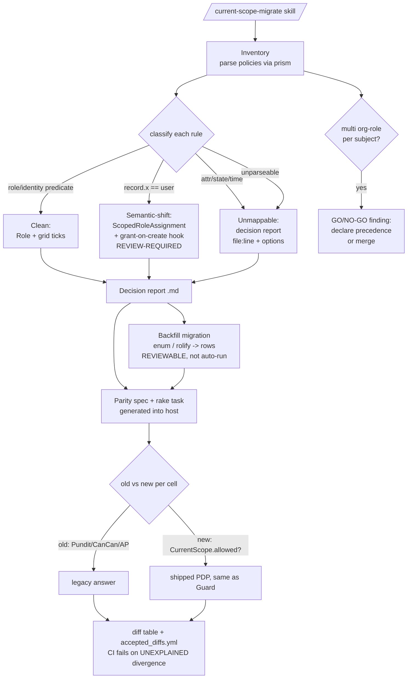

# Assisted Migration Tooling (Pundit / CanCanCan / Action Policy) - Plan

## Goal Capsule

- **Objective:** ship an assisted-migration toolkit that moves an existing Pundit / CanCanCan / Action Policy app onto `current_scope` with three cooperating pieces — a **code analyzer** (old rules → roles + grid ticks, with a human decision report for what can't be proven), a **data backfill** (existing role columns/tables → `Role` / `RoleAssignment` / `ScopedRoleAssignment` rows), and a **parity harness** (replays subject × permission × record through both the old and new systems and diffs the answers until they agree). Report-only by default; every write is opt-in and reviewable.
- **Authority hierarchy:** this plan → the settled v0.1/v0.2 engine model (`README.md`, `docs/RESEARCH.md`, `docs/ROADMAP.md`, `STATUS.md`). The migration tooling is **generative and strictly read-only against the engine** — it never edits `lib/current_scope/*`. These invariants are immutable and the tooling must *depend on* them rather than reimplement them:
  - the resolver decision order — **SoD veto → break-glass bypass → full_access → org role → scoped role → default-deny** (`lib/current_scope/resolver.rb#decide`);
  - **fail-closed** posture (nil subject / no grant → deny; "can't determine" is never "permit");
  - **one org-wide role per subject** (unique index `index_current_scope_one_role_per_subject`);
  - resolver **purity** — no writes, no per-decision state, shared across threads;
  - **ambient `CurrentAttributes` context** as the boundary-only actor store.
  The parity harness in particular MUST call the real `CurrentScope.allowed?` / `CurrentScope.scope_for` PDP, never a hand-rolled copy of the resolver (KTD-2).
- **Delivery posture:** MVP ships as a Claude Code **skill** under `.claude/skills/`, not as new gem code and not as a new gem. The skill *generates self-contained files into the host app* (decision report, backfill migration, parity spec/rake task); generated output has zero runtime dependency on Claude or on any new package, so host CI never needs either. A `current_scope-migrate` dev-gem is explicitly deferred until the deterministic parts stabilize (KTD-1).
- **Stop conditions — surface, do not guess:**
  - a source app is **genuinely multi-role per subject** with no derivable precedence — one-org-role-per-subject is a hard `current_scope` invariant; report it as a go/no-go finding at inventory time, before any backfill (KTD-4).
  - a policy is **metaprogrammed / DSL-generated / multi-clause** such that an AST can't prove its meaning — emit it to the decision report as `unparseable` with `file:line`, never approximate it into a grant (KTD-3).
  - a rule requires the **intensional → extensional** shift (ownership predicate → per-record scoped grants + grant-on-create hook) — generate it but mark it **review-required**; never apply it silently, it changes semantics for future records.
  - a policy needs **request context** that can't be replayed in-process — exclude it from parity and flag it; a cell that can't be compared is never scored as "parity holds."

---

## Product Contract

> **Product Contract preservation:** new capability, no upstream requirements doc (`product_contract_source: ce-plan-bootstrap`). Scoped from the automated shakedown across six local scenario host apps (issue #45); every claim re-verified against gem source before filing.

### Summary

Provide a repeatable, low-fear path off the three dominant Rails authorization libraries. The analyzer reads the app's existing rules and sorts every one into *maps cleanly* (role/identity predicates → `Role` rows + grid ticks), *maps with a semantic shift* (record-ownership predicates → scoped roles + a review-required grant-on-create hook), or *cannot map* (attribute/state/time conditions → a human decision list with `file:line` and suggested options). The backfill turns existing role **data** into `current_scope` rows via a reviewable migration. The parity harness proves the old and new systems return the same allow/deny (and same scoped id-sets) across an exemplar matrix, failing CI only on *unexplained* divergence. Everything is report-only until the operator opts into `--write`.

### Problem Frame

Nobody rewrites working authorization by hand — per issue #45 it is *the single biggest adoption blocker for the gem*. The effort is real but the fear is worse: the risk of silently changing who can do what. Tooling that does the mechanical ~70% **and** proves equivalence removes both. The gem is already well-shaped for this: its permission catalog is derived from `Rails.application.routes` (`lib/current_scope/permission_catalog.rb#derive`), which is the *same* source an analyzer must use to resolve a Pundit per-model policy onto the per-controller `controller#action` key space — the two agree by construction. And the parity harness has a clean seam: `CurrentScope.allowed?` is the single entry point behind every gate (`lib/current_scope.rb`), so both systems can be diffed in-process with no HTTP.

### Requirements

- **R1.** Report-only is the default for every phase. No file is written and no migration is run without an explicit `--write` (code rewrites) or an explicit generate-then-review step (data backfill).
- **R2.** The analyzer deterministically classifies each source rule into exactly one of three buckets — *clean* / *semantic-shift* / *unmappable* — using an AST (prism) for what it can prove (pure role predicates, hash conditions, single `record.x == user` comparisons). Anything it cannot prove is reported as `unparseable`, never approximated (fail-honest, mirrors the engine's fail-closed).
- **R3.** Model → controller key resolution uses `Rails.application.routes`, the identical source as `PermissionCatalog#derive`, so the analyzer's proposed keys are exactly the keys the Guard will enforce.
- **R4.** *Clean* rules produce `Role` rows with `RolePermission` grants seeded via `Role#permission_keys=`; a `user.admin? => everything` predicate produces `full_access: true`. Grid ticks come from **code** analysis, not from data.
- **R5.** *Semantic-shift* rules (record-ownership) produce, per matching existing record, one `ScopedRoleAssignment`, **plus** a generated `after_create` grant-on-create hook — emitted **review-required**, never silently applied (R1).
- **R6.** *Unmappable* rules (attribute/state/time/quota) produce a decision-report entry with `file:line`, the original source, and per-rule options (keep as a plain controller/model guard, or restructure). The special case `record.requester != user` on an approve-like action is detected and proposed as `config.sod_actions` + `current_scope_initiator` rather than a hand-rolled check.
- **R7.** The data backfill detects the source shape (`users.role` enum column; rolify global + resource-scoped roles) and emits a **reviewable migration** (never auto-run), producing one `Role` per role value + one `RoleAssignment` per user, and mapping rolify resource-scoped roles onto `ScopedRoleAssignment` (subject, role, polymorphic resource).
- **R8.** Before any backfill, the inventory surfaces the **one-org-role-per-subject** constraint as a go/no-go finding: a subject holding multiple org-wide roles needs either a declared precedence (config in the generated migration) or a merged role, decided by a human.
- **R9.** Grid seeding runs with routes loaded and **asserts the catalog diff it expected**, because `Role#permission_keys=` silently drops keys absent from the route-derived catalog (`app/models/current_scope/role.rb#permission_keys=`). A seed that expected to grant a key the catalog doesn't contain must fail loudly, not drop it.
- **R10.** The parity harness generates a self-contained parity spec + `rake current_scope:parity` that, for each matrix cell (subject exemplar per role × every `CurrentScope.catalog.keys` × record exemplar per conditioned model), computes the **old** answer (`Pundit.policy`, `Ability#can?`, or Action Policy `apply`) and the **new** answer via `CurrentScope.allowed?` (the same PDP the Guard uses — never a reimplementation), and emits a markdown diff table.
- **R11.** Parity also compares scope: old `policy_scope(Model).pluck(:id)` / `accessible_by` / `relation_scope` vs `CurrentScope.scope_for(...).pluck(:id)`.
- **R12.** Intentional differences are declared in an `accepted_diffs.yml`; CI fails only on **unexplained** divergence. Cells that can't be replayed in-process (policies needing request context) are excluded and flagged — never scored as passing (fail-honest).
- **R13.** Safe call-site rewrites under `--write` are mechanical and enumerated: delete `authorize @x` (the Guard gate replaces it), `policy(@x).update?` / `can?(:update, @x)` → `allowed_to?(:update, @x)`, `policy_scope(X)` / `accessible_by` / `relation_scope` → `scope_for(X)`.
- **R14.** MVP scope is **Pundit, report-only** (inventory + decision report + parity spec generator; no code rewriting, no data writes). CanCanCan and Action Policy follow in a later phase.

---

## Key Technical Decisions

- **KTD-1 — Skill-first, host-generated files; no new gem yet.** The AI layer (classifying arbitrary predicates, naming roles) is genuinely load-bearing; the deterministic layer is just the files it emits. Ship MVP as a `.claude/skills/current-scope-migrate/` skill that generates *self-contained* artifacts into the host app, so host CI depends on neither Claude nor a new package. A gem is a maintenance contract we should not sign to ship an experiment; extract `current_scope-migrate` (generators + rake task) only once the deterministic parts stabilize and non-Claude demand appears. **This is a deliberate `.claude/skills/` tree rather than `lib/` gem code — flagged as the central delivery decision.**
- **KTD-2 — The parity harness calls the real PDP, never a copy.** The generated parity spec computes the "new" answer through `CurrentScope.allowed?` / `CurrentScope.scope_for` — the exact entry points the Guard and host lists route through (`lib/current_scope.rb`). Reimplementing the resolver in the harness would let the harness pass while the gate disagrees, defeating the entire point. This mirrors the engine's own invariant that `scope_for` reads the same grants as the per-record gate so a list "can never drift from the per-record decision" (`resolver.rb#scope_for`). Risk to invariants: **none** — the harness is a pure reader of the shipped PDP.
- **KTD-3 — Deterministic AST for the provable ~70%; report-only for the rest; never guess.** Parse with prism what an AST can *prove* — pure role predicates, hash conditions, single `record.x == user`. Everything metaprogrammed or multi-clause becomes a decision-report row, not a grant. This is the analyzer's fail-honest analogue of the engine's fail-closed posture: under-reporting a mapping (honest `unparseable`) is safe; over-confidently inventing a grant is a silent authorization change. `--write` applies only the safe, proven rewrites (R13).
- **KTD-4 — Backfill emits a reviewable migration; one-org-role precedence is a human go/no-go at inventory, not a backfill-time guess.** `current_scope` enforces one org-wide role per subject (`index_current_scope_one_role_per_subject`). A multi-role source app has no mechanical "correct" collapse — picking one would silently narrow or widen access. The inventory step reports this as a blocker on day one; the operator declares a precedence (config in the generated migration) or a merged role before the backfill is generated. Preserves fail-closed: no silent role loss.
- **KTD-5 — Grid ticks come from code analysis and seed with routes loaded, asserting the expected catalog diff.** The backfill moves *who holds what* (data); *which permissions each role gets* (ticks) comes from the code analyzer (R4). Because `Role#permission_keys=` silently drops keys not in the route-derived catalog, the generated seed must run under loaded routes and assert `expected - CurrentScope.catalog.keys == []`, failing loudly on a drop. This couples to the companion silent-drop fix (`docs/plans/2026-07-15-002-fix-permission-keys-silent-drop-plan.md`, issue #21): if that fix makes the drop loud engine-side, the seed can lean on it; until then the seed asserts the diff itself.
- **KTD-6 — Model→controller resolution reuses the route table, the catalog's own source.** A Pundit `PostPolicy` may govern several controllers (`posts`, `admin/posts`); resolving model → controllers via `Rails.application.routes` (not by guessing `"#{model}s"`) is the only way the analyzer's proposed keys match `PermissionCatalog#derive` exactly. One source of truth for the key space, shared by tool and engine.

---

## High-Level Technical Design

Three cooperating pieces, all driven by the skill, all defaulting to report-only. The engine is a read-only dependency: the analyzer reads its catalog/route source, the backfill writes its models, the parity harness reads its PDP.

*Directional — the prose and requirements are authoritative.* Note the "new" answer edge terminates at `CurrentScope.allowed?` (the shipped PDP), never at a harness-local resolver (KTD-2).

---

## Implementation Units

Generated-into-host paths are marked *(host)* — they land in the operator's app, not in this repo. All repo paths are relative to the gem root.

### U1. Skill scaffold + migration orchestration

- **Goal:** stand up the `current-scope-migrate` skill: the top-level flow (inventory → report → optional backfill → parity), the report-only default, phase gating, and the honest contract copy.
- **Requirements:** R1, R14.
- **Dependencies:** none.
- **Files:** `.claude/skills/current-scope-migrate/SKILL.md`, `.claude/skills/current-scope-migrate/reference/contract.md` (the "automate the mechanical ~70%, never guess the rest" contract), `.claude/skills/current-scope-migrate/reference/invariants.md` (the engine invariants the tooling must preserve — decision order, one-org-role, fail-closed, resolver purity).
- **Approach:** SKILL.md defines the ordered steps and the guardrails: default report-only; `--write` only after a report exists; parity generation available from step one (the scariest part gets proof first). Encode the source-library detection (Gemfile: `pundit` / `cancancan` / `action_policy`) and route to the matching analyzer unit. The invariants reference doc is the tooling's contract that it never edits `lib/current_scope/*` and never reimplements the resolver.
- **Patterns to follow:** the repo has no `.claude/skills/` tree yet — mirror the house SKILL.md conventions used across the user's other skills (front-matter name/description, numbered flow, explicit "when NOT to use"). Mirror the honest-framing tone of the SoD break-glass docs.
- **Test scenarios:** Test expectation: none — prompt/skill asset. (Behavioral proof lives in U2/U3/U4 where generated artifacts are executed against scenario apps.)
- **Verification:** running the skill against a scenario host app produces a report skeleton and writes nothing without `--write`; the contract + invariants docs are self-contained.

### U2. Pundit policy inventory → decision report (MVP core)

- **Goal:** parse Pundit policies with prism, classify each predicate into clean / semantic-shift / unmappable, resolve model→controller keys via the route table, and emit a decision report with `file:line`.
- **Requirements:** R2, R3, R4, R5, R6.
- **Dependencies:** U1.
- **Files:** `.claude/skills/current-scope-migrate/analyzers/pundit.md` (classification rules + prism node shapes to match), `.claude/skills/current-scope-migrate/templates/decision_report.md.erb` (the report the skill fills in). *(host)* `docs/current_scope_migration/decision_report.md` — generated output.
- **Approach:** for each `*Policy` class, walk predicate methods (`update?`, `edit?`, …). Match three provable shapes: pure role predicate (`user.admin?`, `user.role == "editor"`) → clean; single ownership comparison (`record.author_id == user.id`, hash `author_id: user.id`) → semantic-shift; anything else (`record.published?`, `locked_at.nil?`, time/quota, multi-clause, metaprogrammed) → unmappable. Resolve the policy's model to its controllers via `Rails.application.routes` (KTD-6) so proposed keys are catalog-real. Detect `record.requester != user` on approve-like actions and propose `config.sod_actions` + `current_scope_initiator` (R6). `edit?`→`update?` / `new?`→`create?` aliasing is applied when mapping to CRUD keys. Report groups by bucket; the semantic-shift section is explicitly labelled review-required.
- **Patterns to follow:** `PermissionCatalog#derive` for the route-walking idiom (filter_map over `Rails.application.routes.routes`, `route.defaults[:controller]/[:action]`); the `permission_grid_groups` CRUD folding for how new/edit collapse.
- **Test scenarios:**
  - `user.admin? => true` in every predicate → proposed `full_access: true` role. (clean)
  - `PostPolicy#update?` = `user.role == "editor"` → `posts#update` + `admin/posts#update` grant on an "Editor" role, both keys resolved from routes. (clean, multi-controller)
  - `record.author_id == user.id` → semantic-shift entry: one ScopedRoleAssignment per existing authored post + a review-required `after_create` hook. (input→expected: ownership predicate → scoped-role proposal, marked review-required)
  - `record.published?` → unmappable entry with `file:line` + options (plain guard / restructure). (edge)
  - `record.requester != user` on `approve?` → proposed `config.sod_actions = %w[approve]` + `current_scope_initiator`, NOT a grant. (special case)
  - metaprogrammed predicate (`define_method`) → reported `unparseable`, counted honestly, never approximated. (error/honest)
- **Verification:** run against scenario apps 01 (baseline blog) and 04 (SoD matrix); the report's bucket counts match a hand audit; no `unparseable` policy is silently mapped; proposed keys all exist in `CurrentScope.catalog.keys`.

### U3. Parity harness generator (the killer feature)

- **Goal:** generate a self-contained parity spec + `rake current_scope:parity` into the host that diffs old vs new answers (and scopes) across the exemplar matrix, failing only on unexplained divergence.
- **Requirements:** R10, R11, R12, and KTD-2.
- **Dependencies:** U1 (U2 optional — parity can run before any mapping, proving the *current* state).
- **Files:** `.claude/skills/current-scope-migrate/templates/parity_spec.rb.erb`, `.claude/skills/current-scope-migrate/templates/parity.rake.erb`, `.claude/skills/current-scope-migrate/templates/accepted_diffs.yml.erb`, `.claude/skills/current-scope-migrate/reference/parity_matrix.md` (how to build the exemplar manifest). *(host)* `test/current_scope/parity_spec.rb`, `lib/tasks/current_scope_parity.rake`, `test/current_scope/accepted_diffs.yml` — generated.
- **Approach:** the generated spec builds the matrix from a small operator-declared manifest (one subject exemplar per role via factories/fixtures) × `CurrentScope.catalog.keys` × one record exemplar per conditioned model. Per cell: **old** = `Pundit.policy(user, record).public_send("#{action}?")` (with `edit?`→`update?` aliasing); **new** = `CurrentScope.allowed?("#{controller}##{action}", subject: user, record: record)` — the shipped PDP, never a copy (KTD-2). Scope parity compares `policy_scope(Model).pluck(:id)` vs `CurrentScope.scope_for(subject:, model:, permission:).pluck(:id)`. Divergences are matched against `accepted_diffs.yml`; unmatched → spec fails. Cells whose policy needs request context are excluded and listed in the report as unreplayable (R12) — never counted as passing. Matrix is sampled (cap records per model) to keep the run under a minute.
- **Patterns to follow:** `CurrentScope.allowed?` / `CurrentScope.scope_for` public signatures in `lib/current_scope.rb`; `CurrentScope.catalog.keys` for the permission axis.
- **Test scenarios:**
  - identical old/new answers across the matrix → spec green, empty diff table. (happy)
  - one cell diverges (new denies what Pundit allowed) and is absent from `accepted_diffs.yml` → spec **fails** with that cell named. (error)
  - the same cell listed in `accepted_diffs.yml` with a reason → spec green, diff shown as accepted. (edge)
  - scope mismatch (`scope_for` ids ≠ `policy_scope` ids) → reported as a scope divergence, not silently ignored. (integration)
  - a request-context-dependent policy → excluded, listed as unreplayable, never scored pass. (fail-honest)
  - harness never touches the resolver internals — asserted by the template calling only `CurrentScope.allowed?`/`.scope_for`. (invariant guard)
- **Verification:** generate into scenario app 04, run `rake current_scope:parity`; a deliberately introduced grant mismatch makes it red; adding the accepted-diff entry makes it green; whole run < 60s on the sample matrix.

### U4. Data backfill generator (enum + rolify)

- **Goal:** detect the source role-data shape and emit a reviewable migration turning it into `Role` / `RoleAssignment` / `ScopedRoleAssignment` rows, with the one-org-role go/no-go surfaced first.
- **Requirements:** R7, R8, R9, and KTD-4, KTD-5.
- **Dependencies:** U2 (grid ticks come from the code analysis).
- **Files:** `.claude/skills/current-scope-migrate/generators/backfill.md`, `.claude/skills/current-scope-migrate/templates/backfill_migration.rb.erb`, `.claude/skills/current-scope-migrate/templates/seed_grid.rb.erb`. *(host)* `db/migrate/<ts>_current_scope_backfill.rb`, `db/seeds/current_scope_grid.rb` — generated, reviewed, run by the operator.
- **Approach:** detect `users.role` enum column → one `Role` per enum value + one `RoleAssignment` per user (near 1:1). Detect rolify → global roles → `Role`+`RoleAssignment`; resource-scoped roles → `ScopedRoleAssignment` (subject, role, polymorphic resource). **Before** emitting anything, scan for subjects holding >1 org-wide role; if found, stop and report the go/no-go (KTD-4) — the migration is generated only after a precedence/merge is declared. The grid seed applies U2's ticks via `Role#permission_keys=` under loaded routes and asserts `(expected - CurrentScope.catalog.keys).empty?`, failing loudly on a silent drop (R9/KTD-5). The migration is reviewable and idempotent (`find_or_create_by`), aligning with the engine's own `seed_defaults!` / `grant!` idempotence.
- **Patterns to follow:** `CurrentScope.seed_defaults!` and `grant!` (idempotent role/assignment creation) in `lib/current_scope.rb`; `Role#permission_keys=` drop semantics in `app/models/current_scope/role.rb`; the `index_current_scope_one_role_per_subject` constraint.
- **Test scenarios:**
  - `users.role` enum (`admin`/`editor`/`viewer`) → 3 Roles + one RoleAssignment per user; re-run creates no duplicates. (happy + idempotence)
  - rolify resource-scoped role (`user has_role :manager, project`) → one ScopedRoleAssignment per (user, project). (mapping)
  - a subject with two org-wide roles → **no migration generated**; go/no-go finding emitted instead. (blocker, KTD-4)
  - grid seed expecting a key absent from the route-derived catalog → seed **raises** (asserted diff), does not silently drop. (R9)
  - migration is never auto-run — generator writes the file and stops. (R1)
- **Verification:** generate against scenario app 05 (legacy UI & overrides); review + run the migration on a scratch DB; row counts match source; the multi-role case blocks as specified.

### U5. Safe call-site rewrites (`--write`)

- **Goal:** apply the enumerated mechanical rewrites in the host source, opt-in only.
- **Requirements:** R1, R13.
- **Dependencies:** U2 (mapping must exist before rewriting call sites).
- **Files:** `.claude/skills/current-scope-migrate/rewriters/call_sites.md` (the exact rewrite table + prism match/replace shapes).
- **Approach:** under `--write` only: delete `authorize @x` (the `before_action :current_scope_check!` gate replaces it); `policy(@x).update?` and `can?(:update, @x)` → `allowed_to?(:update, @x)`; `policy_scope(X)` / `accessible_by(...)` / Action Policy `relation_scope` → `scope_for(X)`. Rewrites are AST-scoped (prism), not regex, and each is listed in the report before application so the diff is reviewable. Anything ambiguous (a `policy(@x)` used for a non-boolean, a block-form `can?`) is left untouched and reported, never rewritten.
- **Patterns to follow:** `allowed_to?` (headline method) and `scope_for` usage in `README.md` "Usage"; the Guard's `current_scope_check!` as the reason `authorize` deletes cleanly.
- **Test scenarios:**
  - `authorize @post` in a controller action → line removed; the action is already gate-covered. (happy)
  - `policy(@post).update?` in a view → `allowed_to?(:update, @post)`. (mapping)
  - `policy_scope(Post)` → `scope_for(Post)`. (mapping)
  - `can?(:update, @post) { |p| ... }` block form → left untouched, reported as manual. (edge/honest)
  - no `--write` flag → nothing changes on disk. (R1)
- **Verification:** run `--write` against a scenario app copy; `git diff` shows only the enumerated rewrites; the app boots and its parity spec (U3) still passes.

### U6. CanCanCan support

- **Goal:** extend the analyzer and parity harness to CanCanCan `Ability` definitions (with rolify pairing).
- **Requirements:** R2, R6, R10 (CanCanCan variants).
- **Dependencies:** U2, U3.
- **Files:** `.claude/skills/current-scope-migrate/analyzers/cancancan.md`, additions to the parity template for the `Ability#can?` old-answer path.
- **Approach:** classify `can :read, Post` (unconditioned → grid tick), `can :read, Post, author_id: user.id` (hash condition → semantic-shift, same as Pundit ownership), and block conditions (`can :update, Post do |p| ... end` → clean only if the block is a pure role predicate, else unmappable). Old-answer path in parity becomes `Ability.new(user).can?(action, record)`. rolify pairing feeds U4's backfill.
- **Patterns to follow:** U2's three-bucket classifier and route-key resolution; U3's parity cell shape.
- **Test scenarios:**
  - `can :manage, :all if user.admin?` → `full_access: true`. (clean)
  - `can :read, Post, author_id: user.id` → semantic-shift, per-record scoped grant. (mapping)
  - block ability with `record.published?` → unmappable. (edge)
  - parity old-answer via `Ability#can?` matches new for a clean-mapped role. (integration)
- **Verification:** run against scenario app 03 (god/legacy controller) with a CanCanCan Ability; buckets + parity behave as U2/U3.

### U7. Action Policy support

- **Goal:** extend the analyzer and parity harness to Action Policy (the closest cousin — see `docs/RESEARCH.md`).
- **Requirements:** R2, R6, R10 (Action Policy variants).
- **Dependencies:** U2, U3.
- **Files:** `.claude/skills/current-scope-migrate/analyzers/action_policy.md`, additions to the parity template for the `AppPolicy#apply` old-answer path.
- **Approach:** Action Policy rules map most directly — pre-checks (`allow! if user.admin?`) → full_access/role; `relation_scope` → `scope_for` (R13). Old-answer path in parity: `AppPolicy.new(record, context: {user:}).apply(:action?)`. Reuse the same three-bucket classifier; the intensional→extensional shift still applies to record-conditioned rules.
- **Patterns to follow:** `docs/RESEARCH.md` §4 (Action Policy API mapping — `allowed_to?`, `authorized_scope`/`relation_scope`, context contract); U2/U3 shapes.
- **Test scenarios:**
  - `allow! if user.admin?` pre-check → `full_access: true`. (clean)
  - `relation_scope { |r| r.where(author: user) }` → semantic-shift scope proposal. (mapping)
  - context-dependent rule (needs `account:` in context) → excluded from parity, flagged. (fail-honest)
- **Verification:** run against scenario app 06 (API & routing edges) with an Action Policy layer; buckets + parity behave as U2/U3.

### U8. Migration guide docs + adoption-guide cross-link

- **Goal:** document the toolkit honestly and wire it to the manual adoption path.
- **Requirements:** the honest-contract mandate; R1, R14.
- **Dependencies:** U1–U7.
- **Files:** `docs/MIGRATING.md` (new), `README.md` (a short "Migrating from Pundit / CanCanCan / Action Policy" pointer near Installation), `STATUS.md` (mark the toolkit's MVP landed), `docs/plans/2026-07-15-008-docs-adoption-guide-plan.md` (cross-reference only — the adoption guide is the manual arm).
- **Approach:** `docs/MIGRATING.md` states the honest contract up front (automate the mechanical ~70%, prove equivalence, human-decide the rest; report-only default), documents the three pieces, the parity workflow (run from migration start until cutover), the one-org-role go/no-go, and the partial-adoption recipe (per-controller `skip_before_action :current_scope_check!` lets Pundit and current_scope coexist during a long migration). Cross-link the adoption guide (#26) as the manual companion and report-only enforcement (#37) as the prod-side safety net.
- **Test expectation:** none — documentation only.
- **Verification:** `docs/MIGRATING.md` is self-contained; the README pointer resolves; `STATUS.md` reflects the MVP.

---

## Scope Boundaries

**In scope:** the `.claude/skills/current-scope-migrate/` skill; the Pundit inventory + decision report (MVP); the parity harness generator; the enum/rolify backfill generator with the one-org-role go/no-go; the safe `--write` call-site rewrites; CanCanCan and Action Policy analyzers; migration docs. All engine files stay **read-only**.

**Deferred to Follow-Up Work:**
- Extracting a `current_scope-migrate` **dev-gem** (generators + rake task) — only once deterministic parts stabilize and non-Claude demand appears (KTD-1).
- An **HTTP-level parity replay** (integration requests diffing status codes, catching gate *wiring* the in-process PDP diff can't) — a later layer, not MVP (issue #45 §3 caveats).
- `permitted_attributes` migration (Pundit) — no `current_scope` equivalent; flagged, out of scope.
- Rolify's every exotic shape (dynamic/global scoped combos beyond the common two) beyond enum + standard rolify.

**Explicit non-goals (preserve the engine's deliberate design):**
- The tooling does **not** turn `current_scope` into ABAC — attribute/state/time conditions are reported for human decision, never auto-translated. The gem is deliberately not ABAC.
- The tooling does **not** relax the one-org-role-per-subject model to accommodate multi-role source apps — it surfaces the conflict; the human resolves it.
- The tooling does **not** modify the resolver, catalog, or Guard, and the parity harness does **not** reimplement the PDP.
- No silent behavioral change: the intensional→extensional grant-on-create hook is always review-required.

---

## Open Questions

- **Manifest ergonomics for the parity matrix.** The exemplar manifest (one subject per role, one record per conditioned model) is operator-declared. Is a generated *starter* manifest (inferred from factories/fixtures) worth the complexity, or is a documented hand-written manifest enough for MVP? Assumed: hand-written for MVP, inference deferred.
- **Partial-adoption as a first-class recipe vs a doc note.** Per-controller coexistence is mechanically possible (`skip_before_action :current_scope_check!`). MVP documents it (U8); should it also be a generated scaffold? Left to the maintainer.
- **rolify precedence default.** When a rolify user holds multiple global roles, is there a sane default precedence (e.g. most-permissive wins) worth *proposing* in the go/no-go, or must it always be fully human-declared? Assumed: propose, never apply.
- **AST engine.** prism is assumed (ships with Ruby 3.3+, the analyzer's provable-shape matching maps cleanly to its nodes). Confirm no need to also support a `parser`-gem fallback for older hosts.

---

## Cross-issue coupling

- **#46 (sibling migration proposal).** #45 and #46 are the paired enhancement proposals from the same shakedown. If #46 covers a distinct slice (e.g. the dev-gem extraction or the HTTP-level parity layer), this plan's KTD-1 (skill-first, gem deferred) and the "HTTP replay deferred" boundary are the seam — #46 should pick up exactly what this plan defers, not re-scope the MVP.
- **#21 — `permission_keys` silent drop (`docs/plans/2026-07-15-002-fix-permission-keys-silent-drop-plan.md`).** U4's grid seed (R9/KTD-5) depends on the drop being observable. If #21 lands first and makes `Role#permission_keys=` loud on a catalog miss, the seed leans on it; until then the seed asserts the catalog diff itself. Compose so the loudness lives in one place, not both.
- **#26 — adoption guide (`docs/plans/2026-07-15-008-docs-adoption-guide-plan.md`).** The adoption guide is the **manual** arm; this toolkit is the **automated** arm. U8 cross-links them so a reader lands on the right tool; they should not duplicate the one-org-role and partial-adoption content — the guide owns the narrative, `docs/MIGRATING.md` owns the toolkit workflow.
- **#37 — report-only enforcement mode (`docs/plans/2026-07-15-019-feat-report-only-mode-plan.md`).** Report-only enforcement is the **production-side** safety net; the parity harness is the **CI-side** proof. Together they de-risk cutover: run report-only enforcement in prod while the parity spec proves equivalence in CI, then flip to enforcing once both are clean. U8 documents this pairing.
