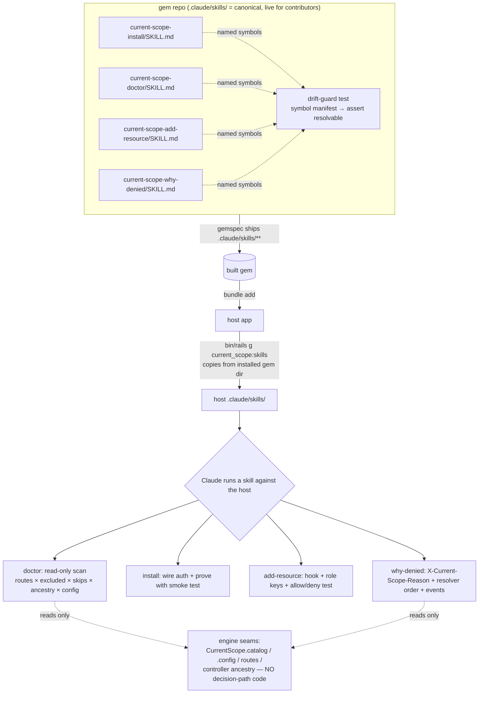

# Developer-Experience Skills (install, doctor, add-resource, why-denied) - Plan

## Goal Capsule

- **Objective:** ship a small set of Claude Code **skills** with the gem — a guided
  installer, a read-only misconfiguration **doctor**, a per-controller **add-resource**
  helper, and a **why-denied** 403 debugger — plus a one-file generator that copies them
  into a host app's `.claude/skills/`. The skills turn the README's recipes and the gem's
  own loud failure modes into checks that run against the *actual* host app, so the first
  hour of adoption and the silent-gap footguns stop being where people get stuck (or feel
  safe when they aren't).
- **Authority hierarchy:** this plan → the settled v0.2 engine model (`README.md`,
  `docs/ROADMAP.md`, `PRODUCT.md`). The engine invariants are **immutable and untouched by
  this work**: the resolver decision order (SoD veto → full_access → org role → scoped role
  → deny), the fail-closed posture, one-org-role-per-subject, resolver **purity** (no
  writes, no per-decision state), and the ambient `CurrentScope::Current` context. This
  feature ships **markdown playbooks + one generator**; it adds **no code to the decision
  path** and reads the engine only through its existing public seams. The doctor is
  strictly read-only and report-only. Nothing here can weaken an invariant because nothing
  here executes inside a decision.
- **Stop conditions:** stop and surface rather than guess if (a) any unit is tempted to add
  runtime Ruby to `lib/current_scope/resolver.rb`, `guard.rb`, `mutation_guard.rb`, or the
  catalog to support a skill — the skills must consume existing seams, not grow new
  enforcement code; (b) the doctor would ever *mutate* host code or config by default (it
  reports; humans apply); (c) the install skill's auth-detection matrix grows beyond the
  agreed MVP (Devise + Rails 8 built-in auth + "ask the human") without a decision; or
  (d) the packaging choice would let the shipped skill version drift from the gem version it
  describes.

---

## Product Contract

> **Product Contract preservation:** new feature, no upstream requirements doc
> (`product_contract_source: ce-plan-bootstrap`). Scope sourced from issue #46, which was
> itself scoped during the automated shakedown against six local scenario host apps built on
> v0.2.0, with every finding re-verified against gem source before filing.

### Summary

Four Claude Code skills live canonically in this repo's `.claude/skills/` (so they are
active for anyone working *in* the gem and can never drift from the code they describe), are
packaged into the built gem, and are copied into a host app on demand by a
`bin/rails g current_scope:skills` generator — mirroring how `current_scope:install` already
scaffolds the initializer. Each skill is a grounded playbook keyed to real gem methods,
config, and failure modes: the installer wires auth and *proves* the gate with a smoke test;
the doctor statically scans for the six documented misconfigurations and reports them with
confidence levels (never auto-fixes); add-resource wires one new controller behind the
route-derived catalog and emits allow+deny tests; why-denied reads the
`X-Current-Scope-Reason` header and walks the resolver's fixed order against real rows to
explain a 403 in plain language. Delivery is phased — install + doctor first (highest
leverage, doctor is safe by construction), then add-resource, then why-denied.

### Problem Frame

The gem is deliberately fail-closed and loud about misconfiguration — which is correct, and
is exactly why the first hour hurts. Auth wiring, session-endpoint skips, and the first
admin grant are fiddly (README §Installation/§Impersonation), and a handful of gaps are
*silent* rather than loud: an SoD action gated with a nil record skips the veto
(`lib/current_scope/resolver.rb:106-107`), an ungated hand-rolled API base is never gated at
all (`lib/current_scope/gating_tripwire.rb` exists precisely for this), and an
impersonation setup with `config.actor_method` unset leaves the whole act-as model inert
(`lib/current_scope.rb:154-163`). The README documents every one of these; the skills make
them *executable against the host's own routes and config* instead of prose a reader has to
remember to apply. This is a pure adoption-and-safety-ergonomics feature with zero blast
radius on the enforcement engine.

### Requirements

- **R1.** Four skills exist as markdown playbooks under `.claude/skills/`, one directory
  each: `current-scope-install`, `current-scope-doctor`, `current-scope-add-resource`,
  `current-scope-why-denied`. Each names the exact gem methods/config it relies on.
- **R2.** The skills are packaged into the built gem — the gemspec ships `.claude/skills/**`
  (today it ships only `{app,config,db,lib}`, so unpackaged skills would never reach a host
  that ran `bundle add current_scope`).
- **R3.** `bin/rails g current_scope:skills` copies the packaged skills into the host app's
  `.claude/skills/`, from the *installed gem's* copy (so the skill version always matches the
  bundled gem version — no separate release train, no drift). Re-running is idempotent and
  reports what it wrote/skipped.
- **R4.** `/current-scope-install` guides: generator + migrations, `Context`-then-`Guard`
  include order, an **auth-detection branch** (Devise / Rails 8 built-in auth / custom→ask)
  that wires `config.user_method` and the session-endpoint skips, the
  `rescue_from CurrentScope::AccessDenied` recipe, seeding via `CurrentScope.grant!` /
  `current_scope:grant`, and a **verification step** that generates one smoke integration
  test using `CurrentScope::TestHelpers` (granted→200, ungranted→denied) and boots to hit
  `/current_scope`. MVP auth matrix = Devise + Rails 8 auth; custom is "detect, then ask,
  then wire" — stated as a boundary.
- **R5.** `/current-scope-doctor` is **read-only and report-only**. It runs the six checks
  below against the host's routes + config + controller ancestry, each mapped to the gem
  behavior it mirrors, and reports findings **with a confidence level** (deterministic vs
  heuristic). It never edits host code or config by default.
- **R6.** The six doctor checks are: (1) gated-but-excluded controller
  (`guard.rb:41-46` raises); (2) SoD action on a model with no
  `current_scope_initiator` (`resolver.rb:112-118` raises); (3) SoD member action with a nil
  record → veto silently skipped (`resolver.rb:106-107`), suggest
  `config.warn_on_nil_sod_record = true`; (4) inert impersonation — impersonation signals
  present while `config.actor_method` is unset (`lib/current_scope.rb:154-163`); (5) ungated
  controller bases not descending from a `Guard`'d ancestor, suggest
  `CurrentScope::GatingTripwire`; (6) `config.sod_bypass_permission`'s action listed in
  `config.sod_actions` (`resolver.rb:148-153` raises). Checks 1 and 6 are deterministic
  (config-only); 2–5 are heuristic (static code inference) and MUST be labeled as such.
- **R7.** `/current-scope-add-resource` takes a controller and: confirms its routes exist
  (the catalog is route-derived — nothing to register, `permission_catalog.rb`); adds the
  memoized `current_scope_record` member-action hook keyed on
  `request.path_parameters[:id]` (per `guard.rb:11-18`); optionally
  `include CurrentScope::Scopeable` + `current_scope_label`; proposes which roles should get
  the new `controller#action` keys and emits the seed snippet noting `permission_keys=`
  filters against the live catalog; and generates an integration test asserting both the
  allow (`grant_role!`/`grant_scoped_role!`) and the fail-closed deny.
- **R8.** `/current-scope-why-denied` takes a failing request/test, reads
  `X-Current-Scope-Reason` (`no_grant`, `sod_veto`, `impersonation_gate`; `sod_bypassed` on
  audited allows), walks the resolver's fixed order against real `RoleAssignment` /
  `RolePermission` / `ScopedRoleAssignment` / SoD rows, reads recent `current_scope_events`,
  and answers in plain language with the **minimal** grant (or skip) that fixes it.
- **R9.** A **drift guard** exists: an automated check in the gem's own suite that fails the
  build if a skill names a gem symbol (config accessor, public method, header, event name)
  that no longer resolves. This is the mechanism that makes co-location's no-drift promise
  real, and it runs in CI without needing a Claude session.
- **R10.** README, CHANGELOG, and STATUS document the skills, the `current_scope:skills`
  generator, the Claude-Code-only reach, and the deferred plain-`rake` fallback.

---

## Key Technical Decisions

- **KTD-1 — Skills are data, not enforcement code; the engine decision path is not touched.**
  The single most important framing: these playbooks and the doctor read the engine through
  its existing public surface (`CurrentScope.catalog`, `CurrentScope.config`, routes,
  controller ancestry, the `X-Current-Scope-Reason` header, the `current_scope_events`
  ledger). No unit adds a branch to `resolver.rb`/`guard.rb`/`mutation_guard.rb` or the
  catalog. Consequence: resolver purity, fail-closed posture, and decision order are
  preserved *trivially* — there is no code on the hot path to get wrong. If any unit finds
  itself needing new runtime Ruby in a decision file, that is a stop-condition (Goal Capsule
  a).

- **KTD-2 — Canonical skills live in `.claude/skills/`, and the gemspec is widened to ship
  them.** The issue's honest constraint: repo-local skills only reach people working in this
  repo; a host that `bundle add`s the gem never sees them unless they travel with the gem.
  Today `current_scope.gemspec:22-23` ships only `{app,config,db,lib}/**/*`, so
  `.claude/skills/` would be dropped from the built gem. Decision: keep the canonical copy in
  `.claude/skills/` (so it is live for gem contributors *and* is the one source of truth) and
  **add `.claude/skills/**/*` to `spec.files`**. The generator (KTD-3) then copies from the
  *installed gem directory*, so the shipped skill version is always exactly the bundled gem
  version. **Design fork named:** the alternative — put canonical skills under
  `lib/current_scope/skills/` (auto-shipped) and mirror into `.claude/skills/` for repo
  activation — was rejected because it creates two copies to keep in sync, which is the exact
  drift the co-location strategy exists to avoid (see Alternatives).

- **KTD-3 — Distribution is a Rails generator, not a rake task, matching `install`.** The gem
  already scaffolds host files with `Rails::Generators::Base`
  (`lib/generators/current_scope/install/install_generator.rb`). A `skills` generator is the
  least-astonishing sibling: same `bin/rails g current_scope:...` muscle memory, same
  idempotent `copy_file`/`directory` semantics, same "Next steps" say-block. Its
  `source_root` points at the installed gem's `.claude/skills` (via `File.expand_path` from
  the generator up to the gem root), so there is no `templates/` duplicate to maintain.

- **KTD-4 — The doctor is a skill playbook now; a `rake current_scope:doctor` is explicitly
  deferred.** The issue defers a plain-rake port "until asked for." The doctor's checks are
  authored as an instruction set Claude executes against the host (read routes, read config,
  read ancestry, correlate). This keeps zero new Ruby in the gem for P1. **Tension surfaced:**
  R9's CI drift guard cannot run a Claude skill headlessly. Resolution: the CI drift guard is
  *not* "run the doctor" — it is a small symbol-existence test over the skill files (KTD-5),
  which is the actually-cheap, actually-headless guard. The heavier "run doctor against a
  demo app in CI" idea from the issue is downgraded to an open question, because the repo has
  no built demo app today (`demo/` contains only `tmp/`), only `test/dummy`.

- **KTD-5 — The drift guard is a symbol-existence test, not a second doctor.** The lazy,
  correct guard: a single test that scans the four `SKILL.md` files for a curated,
  explicitly-listed set of load-bearing gem symbols (e.g. `config.warn_on_nil_sod_record`,
  `CurrentScope::GatingTripwire`, `CurrentScope::TestHelpers#grant_role!`,
  `Resolver::INITIATOR_METHOD`, the `X-Current-Scope-Reason` header string, the
  `sod.bypassed` event name) and asserts each still resolves against the loaded gem. A
  breaking rename fails the build with a pointer to the stale skill. `ponytail:` this is a
  grep-and-assert over a hand-maintained manifest, not a Ruby parser for the markdown — the
  manifest is a dozen lines and upgrades to real extraction only if it earns it.

- **KTD-6 — Doctor findings carry confidence levels; heuristics never auto-fix.** Checks 2–5
  infer models-from-controllers and "returns nil"-style properties from static code — false
  positives are certain. Every finding is tagged `deterministic` (config-only: checks 1, 6)
  or `heuristic` (checks 2–5), and the doctor's contract is report-only. This is the single
  guardrail that keeps a noisy scan from becoming a dangerous auto-editor.

---

## High-Level Technical Design

The change has real shape: four playbooks, a packaging change, a generator, and a CI guard,
composing across the gem-repo / built-gem / host-app boundary. The diagram shows the
single-source-of-truth flow and where each skill reads the engine.

*Directional — the prose and requirements are authoritative.* The load-bearing property:
every arrow into `ENG` is a **read**. Nothing in this plan writes to the decision path.

---

## Implementation Units

Phasing: **P1 = U1–U5** (install + doctor + packaging + generator + drift guard). **P2 = U6**
(add-resource). **P3 = U7**, with **U8** (docs) landing alongside whichever phase ships.

### U1. Skill directory scaffold + shared gem-facts reference

- **Goal:** establish the `.claude/skills/` layout, the SKILL.md frontmatter/format
  convention, and a single shared "gem facts" reference block the four skills cite, so each
  skill stays grounded without repeating the same method list four times.
- **Requirements:** R1.
- **Dependencies:** none.
- **Files:** `.claude/skills/current-scope-install/SKILL.md`,
  `.claude/skills/current-scope-doctor/SKILL.md`,
  `.claude/skills/current-scope-add-resource/SKILL.md`,
  `.claude/skills/current-scope-why-denied/SKILL.md` (created as stubs here, filled by
  U2/U3/U6/U7), `.claude/skills/_shared/current-scope-facts.md` (the shared reference).
- **Approach:** define the SKILL.md house format (name, `description` trigger line, when-to-use,
  numbered playbook steps, grounding citations). Author the shared facts file: the resolver
  decision order, the config accessors and their defaults (from
  `lib/current_scope/configuration.rb`), the public API (`CurrentScope.grant!`,
  `.seed_defaults!`, `.catalog`, `.allowed?`, `.scope_for`), the header contract
  (`X-Current-Scope-Reason` values), the event names, and the enforcement seams
  (`Guard`, `MutationGuard`, `GatingTripwire`, `Scopeable`, `TestHelpers`). Each skill links
  to this file rather than duplicating it — one place to update on an API change (which also
  makes U5's manifest smaller).
- **Patterns to follow:** the existing `.claude/` convention in the repo (currently only
  `launch.json`); standard Claude Code SKILL.md structure used elsewhere in the user's skill
  tree.
- **Test scenarios:** Test expectation: none — pure content scaffold; the symbol grounding is
  exercised by U5's drift guard, not a per-file test.
- **Verification:** the four directories exist with well-formed frontmatter; the shared facts
  file's cited symbols all resolve against the current gem (spot-checked, then enforced by U5).

### U2. `/current-scope-install` skill

- **Goal:** a guided installer playbook that ends by *proving* the gate works, not just
  running generators.
- **Requirements:** R4.
- **Dependencies:** U1.
- **Files:** `.claude/skills/current-scope-install/SKILL.md`.
- **Approach:** author the six-step playbook from the issue: (1) `bin/rails g
  current_scope:install` + migrations; (2) `include CurrentScope::Context` **then**
  `include CurrentScope::Guard` in `ApplicationController`, with the *why* (Context populates
  `CurrentScope::Current.user` before the gate reads it — `guard.rb` reads
  `CurrentScope::Current.user`); (3) the **auth-detection branch** — Devise (default
  `:current_user` works, but Devise controllers inherit `ApplicationController` and would be
  gated → apply `config.excluded_controllers` + `skip_before_action :current_scope_check!`
  on the Devise base via `to_prepare`), Rails 8 built-in auth (delegate `current_user` to
  `Current.user` or set `config.user_method`), custom (detect, then ask, then wire); (4)
  `skip_before_action :current_scope_check!` on session/sign-up endpoints +
  `rescue_from CurrentScope::AccessDenied` (403 or redirect; mention `AccessDenied#reason`
  and the `X-Current-Scope-Reason` header); (5) seed with `CurrentScope.grant!(user)` or
  `bin/rails current_scope:grant SUBJECT_ID=1`; (6) **verify** — emit one smoke integration
  test using `CurrentScope::TestHelpers` (`grant_role!`→200, ungranted→denied) and boot to
  hit `/current_scope`. State the MVP boundary in the skill body: auth matrix covers Devise +
  Rails 8 auth deterministically; custom auth is guided-but-manual.
- **Patterns to follow:** the install generator's existing "Next steps" say-block
  (`install_generator.rb:14-30`) — the skill supersedes and completes it; the README
  §Installation and §Impersonation recipes are the prose source.
- **Test scenarios:** Test expectation: none (skill content). The *generated* smoke test is
  the skill's own output artifact, exercised when the skill runs against a host, not in the
  gem suite. Symbol grounding covered by U5.
- **Verification:** a human runs the skill against a fresh Rails app with Devise and again
  with Rails 8 auth; both reach a green smoke test and a loadable `/current_scope`.

### U3. `/current-scope-doctor` skill (read-only, report-only, confidence-scored)

- **Goal:** a static scan that finds the six documented misconfigurations against the host's
  real routes/config/ancestry, reporting each with a confidence level and the exact gem
  behavior it mirrors — never editing anything.
- **Requirements:** R5, R6, KTD-6.
- **Dependencies:** U1.
- **Files:** `.claude/skills/current-scope-doctor/SKILL.md`.
- **Approach:** author one check-block per finding, each stating: the failure mode, the gem
  code that raises/skips on it (cited), how to detect it statically, the confidence tag, and
  the suggested fix (report only). The six checks and their evidence:
  - **C1 gated-but-excluded** (`deterministic`): routes whose controller matches
    `config.excluded_controllers` but that inherit a `Guard`'d base and never
    `skip_before_action :current_scope_check!` → `guard.rb:41-46` raises `ConfigurationError`
    at request time. Cross-check routes × excluded regexps × skip list.
  - **C2 SoD without initiator** (`heuristic`): `config.sod_actions` non-empty and a model
    reachable through those actions lacks `current_scope_initiator` → `resolver.rb:112-118`
    raises. Route→controller→model inference (label heuristic).
  - **C3 SoD member action, nil record** (`heuristic`): an action in `sod_actions` on a
    member route where `current_scope_record` is absent/returns nil → veto **silently
    skipped** (`resolver.rb:106-107`). Suggest the memoized `request.path_parameters[:id]`
    hook and `config.warn_on_nil_sod_record = true` for dev/test (`guard.rb:85-95`).
  - **C4 inert impersonation** (`heuristic`): impersonation signals present (a pretender,
    `session[:impersonated_subject_id]`, a `true_user` method) while `config.actor_method`
    is unset → the whole act-as model is inert; `require_actor_method!`
    (`lib/current_scope.rb:154-163`) only raises if a boundary event is actually recorded, so
    a host that never calls it gets no warning — the doctor covers that gap.
  - **C5 ungated controller bases** (`heuristic`): bases not descending from a `Guard`'d
    ancestor (hand-rolled `ActionController::Base`/API bases) → silently ungated; suggest
    `include CurrentScope::GatingTripwire` + `current_scope_skip_tripwire! only:` for
    genuinely-public actions (`gating_tripwire.rb`).
  - **C6 bypass permission is an SoD action** (`deterministic`):
    `config.sod_bypass_permission`'s action listed in `config.sod_actions` →
    `resolver.rb:148-153` raises (`SystemStackError` guard). Config-only cross-check.
  Add the confidence-level legend and a top-line contract: "This skill reads; it never
  writes. Heuristic findings will include false positives — verify before acting."
- **Patterns to follow:** the loud-failure philosophy in the gem's own error messages
  (`guard.rb`, `resolver.rb`, `lib/current_scope.rb`) — each check quotes the condition the
  gem itself raises on, so the doctor and the runtime agree.
- **Test scenarios:** Test expectation: none in the gem suite (skill content); manual
  validation runs the doctor against the six scenario host apps named in the issue and
  confirms each seeded footgun is reported at the right confidence. Symbol grounding via U5.
- **Verification:** run against scenario apps 01–06; C1/C6 fire with no false positives;
  C2–C5 fire on the seeded cases and are labeled heuristic.

### U4. `current_scope:skills` generator + gemspec packaging

- **Goal:** ship the skills in the built gem and copy them into a host app idempotently,
  from the installed gem's own copy so version = gem version.
- **Requirements:** R2, R3, KTD-2, KTD-3.
- **Dependencies:** U1 (needs the directories to exist; can finalize once U2/U3/U6/U7 fill
  them, but the generator logic doesn't depend on content).
- **Files:** `lib/generators/current_scope/skills/skills_generator.rb`,
  `current_scope.gemspec` (widen `spec.files`), `test/generators/skills_generator_test.rb`.
- **Approach:** a `Rails::Generators::Base` subclass whose `source_root` resolves to the
  installed gem's `.claude/skills` (`File.expand_path("../../../../.claude/skills", __dir__)`
  — directional; the point is "up to gem root, into `.claude/skills`"), copying the tree into
  the host's `.claude/skills/` with `directory`/`copy_file` (idempotent, reports
  written/skipped), and a `say` "Next steps" block naming the four `/current-scope-*`
  triggers. Widen the gemspec glob to include `.claude/skills/**/*` alongside
  `{app,config,db,lib}` so the tree is present in the packaged gem (without this, R3's copy
  source is empty in a bundled host). `ponytail:` reuse `directory` for the whole tree rather
  than enumerating files — one line, and new skills ship automatically.
- **Patterns to follow:** `lib/generators/current_scope/install/install_generator.rb`
  (structure, `say` block, `source_root`).
- **Test scenarios:**
  - **Packaging:** building the gemspec file-list includes at least one
    `.claude/skills/current-scope-*/SKILL.md` path (guards against the ship-drop regression).
  - **Copy happy-path:** running the generator into an empty tmp host writes all four skill
    directories under `.claude/skills/`.
  - **Idempotent:** a second run reports the files as identical/skipped and does not error.
  - **Source = gem dir:** the copied content byte-matches the gem's canonical
    `.claude/skills/` (proves single-source-of-truth, no `templates/` duplicate).
- **Verification:** generator test green; a manual `gem build` + install into a scratch app
  then `bin/rails g current_scope:skills` yields the four skills in the host.

### U5. Drift guard — skill-symbol contract test

- **Goal:** fail the gem's build if a skill references a gem symbol that no longer exists.
- **Requirements:** R9, KTD-5.
- **Dependencies:** U1 (facts file), U2, U3 (skills whose symbols are asserted). Runs in CI
  independent of any Claude session.
- **Files:** `test/skills_contract_test.rb`, `.claude/skills/_shared/symbol-manifest.yml`
  (the curated list of load-bearing symbols the skills depend on).
- **Approach:** maintain a small explicit YAML manifest of load-bearing symbols — config
  accessors (`allow_sod_bypass`, `sod_bypass_permission`, `warn_on_nil_sod_record`,
  `actor_method`, `user_method`, `excluded_controllers`, `sod_actions`), public methods
  (`CurrentScope.grant!`, `.seed_defaults!`, `.catalog`, `.allowed?`, `.scope_for`),
  constants (`Resolver::INITIATOR_METHOD`, `Resolver::BYPASS_METHOD`), mixins
  (`GatingTripwire`, `Scopeable`, `TestHelpers`, and its `grant_role!`/`grant_scoped_role!`),
  the header string `"X-Current-Scope-Reason"`, and the event name `"sod.bypassed"`. The test
  asserts (a) each config accessor responds on `Configuration.new`, (b) each method/constant
  resolves, and (c) each manifest entry's string token appears in at least one SKILL.md
  (so the manifest can't rot away from the skills either). `ponytail:` assert against a
  hand-listed manifest, not a markdown parser — a dozen entries, fails loudly with the stale
  symbol name; upgrade to extraction only if the manifest ever gets unwieldy.
- **Execution note:** write the failing assertions first against a deliberately-misspelled
  symbol to confirm the guard actually catches a rename before wiring the real manifest.
- **Patterns to follow:** the gem's existing Minitest style under `test/`.
- **Test scenarios:**
  - **All resolve:** with the real gem loaded, every manifest symbol resolves and appears in a
    skill → green.
  - **Rename regression:** renaming/removing a manifested method (temporarily, in a fixture or
    via stub) makes the guard red with the offending symbol named.
  - **Skill-orphan:** a manifest entry that no skill mentions fails, so the manifest tracks
    the skills' actual dependencies.
- **Verification:** test green in CI; a local experiment renaming `warn_on_nil_sod_record`
  turns it red pointing at C3.

### U6. `/current-scope-add-resource` skill (P2)

- **Goal:** wire one new controller behind the route-derived gate and emit both allow and
  fail-closed deny tests.
- **Requirements:** R7.
- **Dependencies:** U1; ships in P2 after U2/U3 validate the authoring format.
- **Files:** `.claude/skills/current-scope-add-resource/SKILL.md`.
- **Approach:** author the playbook: confirm the controller's routes exist (catalog is
  route-derived — nothing to register, `permission_catalog.rb`); add the memoized
  `current_scope_record` hook for member actions keyed on `request.path_parameters[:id]`
  (per the three hook rules in `guard.rb:6-18`); optionally
  `include CurrentScope::Scopeable` + `current_scope_label` on the model for the scoped-role
  picker (`scopeable.rb`); propose which existing roles should tick the new
  `controller#action` keys and emit the seed snippet
  (`role.permission_keys += %w[widgets#index widgets#show]; role.save!`) noting
  `permission_keys=` filters against the live catalog; generate an integration test using
  `grant_role!` / `grant_scoped_role!` asserting both the allow and the fail-closed deny.
- **Patterns to follow:** README §Record-level decisions and §Scopeable; the hook contract
  comment block in `guard.rb`.
- **Test scenarios:** Test expectation: none in the gem suite (skill content); the generated
  allow+deny test is the skill's output, validated when run against a host. Symbol grounding
  via U5 (extend the manifest with `permission_keys`, `Scopeable`, the hook name).
- **Verification:** run against a scenario app; adding a controller yields a passing
  allow+deny test and correct grid keys.

### U7. `/current-scope-why-denied` skill (P3)

- **Goal:** explain a 403 in plain language by reading the reason header and walking the
  resolver's fixed order against real rows.
- **Requirements:** R8.
- **Dependencies:** U1.
- **Files:** `.claude/skills/current-scope-why-denied/SKILL.md`.
- **Approach:** author the playbook: read `X-Current-Scope-Reason`
  (`no_grant`/`sod_veto`/`impersonation_gate`, and `sod_bypassed` on audited allows — set by
  `mutation_guard.rb` and `guard.rb`); then walk the resolver's order against real rows —
  `RoleAssignment` for the subject → `full_access?` → `RolePermission` for the key →
  `ScopedRoleAssignment` for (subject, record) → `sod_actions` + `current_scope_initiator`
  (`resolver.rb:33-47`, `102-133`); read recent `current_scope_events` rows; and answer with
  the minimal grant (or `skip_before_action`) that fixes it. This skill composes with the
  denial-ergonomics work (see Cross-issue coupling): it consumes whatever structured denial
  surface #21/#23/#24 establish rather than re-deriving it.
- **Patterns to follow:** the reason taxonomy in `AccessDenied` (`lib/current_scope.rb:17-25`)
  and the header-setting in `mutation_guard.rb:current_scope_denied`.
- **Test scenarios:** Test expectation: none in the gem suite (skill content); manual
  validation feeds each reason value a failing case and confirms the explanation + minimal
  fix. Symbol grounding via U5.
- **Verification:** for each of `no_grant`/`sod_veto`/`impersonation_gate`, the skill names
  the exact missing grant or gate-skip.

### U8. Documentation, CHANGELOG, STATUS

- **Goal:** document the skills, the generator, the reach limits, and the deferred fallback.
- **Requirements:** R10.
- **Dependencies:** lands with whichever phase ships the skills it documents (incremental).
- **Files:** `README.md` (new "Developer-experience skills" section near §Installation /
  §Testing your app), `CHANGELOG.md` (Unreleased → Added), `STATUS.md` (mark the feature and
  its phase state).
- **Approach:** a README section that: lists the four `/current-scope-*` skills and what each
  does; shows `bin/rails g current_scope:skills`; states plainly that the skills are
  **Claude-Code-only** (non-Claude users get nothing today) and that the doctor's checks are
  the one piece worth a future plain-`rake current_scope:doctor` port, deferred until asked;
  and notes the doctor is read-only/report-only with confidence levels. Update CHANGELOG
  Unreleased and STATUS.
- **Test expectation:** none — documentation only.
- **Verification:** README renders; the generator command and skill triggers are copy-able;
  STATUS reflects the shipped phase.

---

## Scope Boundaries

**In scope:** four SKILL.md playbooks + shared facts reference (U1–U3, U6, U7), the gemspec
packaging change and `current_scope:skills` generator (U4), the symbol-existence drift guard
(U5), and docs (U8). All engine reads go through existing public seams.

**Deferred to Follow-Up Work:**
- A plain `rake current_scope:doctor` that ports checks 1–6 to headless Ruby for non-Claude
  users — the one piece worth porting if demand appears (issue's own deferral). C1/C6 are
  deterministic and would port cleanly first.
- A CI job that runs the *doctor itself* against a full demo app — blocked today because
  `demo/` is unbuilt (only `demo/tmp/`); the symbol-existence guard (U5) covers the real
  drift risk in the meantime. Revisit if a demo/showcase app lands (see the 2026-07-11
  showcase plan).
- A Claude Code plugin/marketplace distribution channel — additive, later; the copy generator
  is the foundation, not the plugin.
- Fixture/seed helper skill — folded into add-resource and install per the issue; a standalone
  skill would be scaffolding for later.
- Expanding the install auth matrix beyond Devise + Rails 8 auth into first-class detection
  for other auth stacks.

**Explicit non-goals (preserve deliberate design):** no change to the route-derived catalog
(add-resource *confirms* routes, it does not add a registration table); no change to opt-in
SoD or any default; no new runtime code in the resolver/guard/catalog; the doctor never
auto-fixes; the skills never weaken fail-closed behavior — a false-negative doctor scan must
never be read as "you are safe," which the confidence legend states outright.

---

## Open Questions

- **Doctor C2/C4 inference fidelity.** Route→controller→model inference (C2) and
  impersonation-signal detection (C4) are the heaviest heuristics. Is a labeled "possible"
  finding with a manual-verify prompt acceptable, or should low-confidence checks be behind an
  opt-in `--deep` flag in the skill so the default scan stays high-precision? (Recommend:
  ship all six, clearly labeled; revisit if the noise is real.)
- **CI drift depth.** U5's symbol-existence guard is the agreed floor. Do we also want a
  lightweight "the skill's cited `file:line` still contains the cited method" check, or is
  that over-fitting to line numbers that legitimately move? (Recommend: symbol-only; line
  citations are documentation, not asserted.)
- **Install smoke-test placement.** Should the generated smoke test land in the host's
  `test/` or be printed for the human to place? (Recommend: generate into `test/` with a
  clear filename; the human owns it thereafter.)
- **`demo/` app.** Is there appetite to build the `demo/` app so the doctor can run in CI
  end-to-end, or does `test/dummy` plus the symbol guard suffice for now?

---

## Cross-issue coupling

- **#26 adoption guide (`docs/plans/2026-07-15-008-docs-adoption-guide-plan.md`).** The
  install skill is the *executable* form of the adoption guide's prose. They must compose, not
  duplicate: the guide is the narrative a human reads; `/current-scope-install` is the
  playbook Claude runs. The skill should link to the guide for the "why," and the guide should
  point to the skill for the "do it for me." Land the guide's canonical wording first so the
  skill cites it rather than re-deriving.
- **Denial-behavior / engine-403 / denial-ergonomics cluster — #24
  (`...-006-docs-denial-behavior`), #23 (`...-005-fix-engine-403-no-reason`), #21
  (`...-021-feat-denial-ergonomics`).** `/current-scope-why-denied` (U7) is a direct consumer
  of this cluster: it reads the `X-Current-Scope-Reason` surface and the structured denial
  info those plans standardize (`AccessDenied#permission`, `rescue_responses`, the
  denial-reason log line, and the engine-UI 403 routing through the same machinery). Sequence
  P3 (U7) *after* #21/#23 land so the skill consumes the finished reason surface rather than a
  moving target.
- **#37 report-only mode (`...-019-feat-report-only-mode`).** The doctor's C5 (ungated bases)
  and the install skill's rollout advice should mention `config.enforcement = :report` as a
  safer adoption ramp — a host can turn the gate on in report mode, run the doctor, fix
  findings, then enforce. If #37 lands, add a one-line pointer in the doctor and install
  skills; until then, leave it out (don't reference a config that doesn't exist yet).
