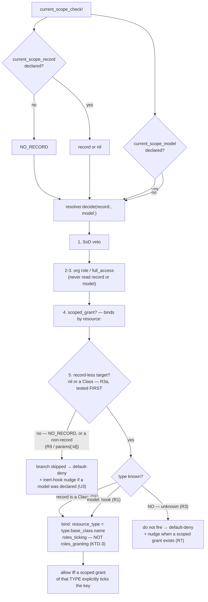

# Thread the collection's model to the resolver - Plan

## Goal Capsule

- **Objective:** give `Resolver#record_less_scoped_grant?` the one thing it lacks — the **type** it is deciding about — via an optional `current_scope_model` controller hook, and make the branch **fail closed** when that type is unknown.
- **Authority hierarchy:** this plan → issue #50 → the settled v0.2 model (`README.md`, `CONCEPTS.md`). Immutable invariants this must preserve:
  - the resolver decision order (`lib/current_scope/resolver.rb:37-52`);
  - **resolver purity** — reads only, no per-decision state, shared across threads;
  - **fail-closed**: "can't determine" is never "permit" (`lib/current_scope.rb:37-40`);
  - **no controller→model inference** — the catalog is route-derived by design (`lib/current_scope/permission_catalog.rb:59-62`);
  - **gate and list agree** — `scope_for` reads the same grants as the per-record gate (`resolver.rb:68-72`).
- **Delivery posture:** one PR, closes #50. Suite green (422 runs at `2b7f50b`) + RuboCop omakase clean per commit. **Ships in the same release as #19** — both are `[Unreleased]`, so this is one coherent behavior, not a break on top of a feature. Release as **0.3.0**, not 0.2.1: a `~> 0.2.0` pin must not pick up an authorization-semantics change on a routine `bundle update`.

---

## Problem Frame

`record_less_scoped_grant?` (`resolver.rb:304-311`) is the **only** grant check bound to neither a record nor a type. Its siblings bind: `scoped_grant?` by `resource:` (`resolver.rb:253`), `scope_for` by `resource_type:` (`resolver.rb:88`). In `decide` (`resolver.rb:37-52`) it is line **49** — and lines 46-47 never read the record at all, 48 binds. **Line 49 is the entire unbound surface.**

### The issue understates consequence 1. It is not cosmetic — it is a live escalation.

Probed against `main` @ `2b7f50b`. A subject holding **only** "Editor of Report#1", under a role that ticks `documents#index` + `documents#create`:

```
documents#index  gate -> true   | scope_for(Document) -> 0 rows
documents#create gate -> true   | NO list side exists
```

The issue says "Fail-closed on data, but it reads as broken." That holds for `#index` — the empty list saves you. It is **false for `#create`**: there is no list side, so a scoped grant on a `Report` lets the subject **create Documents**. Same for any bulk or non-list key. An insecure default here is not a documented gap; it is reachable today.

This is the fact that decides the default (KTD-1).

### Consequence 2 confirmed, same probe

"Owner of Report#1" (scoped `full_access`): `reports#index` gate → **false**, while `scope_for(Report)` → **1 row**. A 403 on a list that holds their rows — the exact gate/list contradiction #19 fixed, surviving for `full_access`.

### The code already names this fix

- `resolver.rb:292-294` — *"Reaching that needs the Guard to tell the resolver which model the collection is (see OQ-2) — until then, deny is the honest answer rather than an app-wide wildcard."*
- `permission_catalog.rb:79-83` — the catalog's own irreducible limit, same OQ-2.
- `docs/plans/2026-07-15-001-fix-scoped-collection-gate-plan.md:197` — OQ-2's full text.

This plan is OQ-2.

---

## Requirements

- **R1.** An optional **controller** hook `current_scope_model` declares the type a gated action deals in. Discovered exactly as `current_scope_record` is — private method, `respond_to?(name, true)` then `send` (`guard.rb:284-286`). Absent is a valid state, not an error.
- **R2.** When the type is known, `record_less_scoped_grant?` binds by `resource_type:`, normalized through **`base_class`** (R6), matching `scope_for` (`resolver.rb:88`).
- **R3.** When the type is **unknown**, the record-less branch **does not fire**. Fail-closed. This closes the `#create` escalation above for every host, adopted or not.
- **R3a.** `return false unless record.nil? || record.is_a?(Class)` (`resolver.rb:305`) stays the **first** line of `record_less_scoped_grant?`. The `model:` kwarg is consulted only after it passes: **a declared model never rescues a non-record-less target.** Threading a second input in is exactly the edit that invites hoisting the model consult above the guard, and a host whose `current_scope_record` returns `params[:id]` (a String — `guard.rb:179-181` calls it "the commonest mistake of all") would then be allowed off a grant held over some other record. That is the fail-open `resolver.rb:270-276` exists to prevent.
- **R4.** ~~The branch reads `roles_granting` when the type is known.~~ **WITHDRAWN — see KTD-3.** The branch keeps `roles_ticking`. Consequence 2 stays open as the documented fail-closed gap `resolver.rb:290-294` already records, and is tracked in **#65**.
- **R5.** The **class form** needs no hook: `allowed_to?(:index, Report)` already passes the type as `record` (`resolver.rb:305`). It binds from that.
- **R5a.** The **bare advisory form** — `allowed_to?(:index)` in a view — must resolve the same type the gate did, so the view and the gate agree on a declared controller. Today it passes `record: nil` and no model (`lib/current_scope/permissions.rb:13-17`); left alone it would deny where the gate allows. See KTD-6.
- **R6.** Type normalization is `model.base_class.name`, never `model.name` — scoped grants store the polymorphic base class (`resolver.rb:79-88`). Using `model.name` would reintroduce readiness item A7 **mirrored onto the gate**: an STI subclass controller 403s while `scope_for` returns rows.
- **R6a.** `base_class` normalization **collapses STI siblings**, and this branch has no backstop. `scope_for` survives it because `model.where(...)` re-applies STI's own type predicate (`resolver.rb:83-85` names that as the valve); a bare `.exists?` has none. So a subject scoped on an `Invoice` would pass a `Receipt` controller's gate — both normalize to `Document`. For `#index` that is gate-allows/list-empty (the invariant the Goal Capsule calls immutable); for `#create` it is consequence 1 surviving the fix inside one base class. The dummy has only `Invoice < Document` — **no sibling** — so R6's scenario as written cannot detect this.
- **R7.** A host whose record-less gate now denies for want of a declaration gets a **dev/test nudge** naming the hook. Log-only, default on in dev/test, off in production — the `#41` diagnostics contract.
- **R7a.** The denial carries a **distinct reason**: `:model_undeclared`, joining the `AccessDenied` vocabulary (`lib/current_scope.rb:19-23`) and riding the existing `X-Current-Scope-Reason` header. Without it the new deny is indistinguishable from an ordinary `:no_grant`, and R7's nudge is dev/test-only — so the one host who most needs the cause (production, 403s after an upgrade) is the one who cannot see it. `lib/current_scope.rb:37-40` says a misconfiguration must never become "an undiagnosable deny"; a dev-only nudge honors half that sentence. Costs no behavior change: the reason rides an existing seam, and #55 established that adding a reason is additive.
- **R8.** `NO_RECORD` **survives**, unchanged. It answers a different question (R9). Issue #50's "Done when: NO_RECORD and its `:id` heuristic are deleted" is corrected — see Assumptions.
- **R9.** Declaring `current_scope_model` without `current_scope_record` leaves the model hook **inert** — the Guard passes `NO_RECORD` (`guard.rb:284`), which is neither `nil` nor a `Class`, so the branch is skipped (`resolver.rb:305`). This is a real misconfiguration and must be surfaced, not silent.
- **R10.** The CHANGELOG folds this into #19's existing `[Unreleased]` entry as one coherent description of the shipped behavior — **not** a separate break notice. #19 never shipped (KTD-1), so a "who breaks" notice would send released readers hunting for a regression their version cannot have. It states the rule and names the hook.
- **R11.** `:enforce` behavior for every non-record-less path is byte-for-byte unchanged. Org-wide roles, `full_access` org-wide, and per-record decisions never read the model.

---

## Key Technical Decisions

### KTD-1 — Unknown type ⇒ the branch does not fire. Fail-closed, and the escalation is why.

The issue frames the default as a three-way (infer / require / narrow). The probe above collapses it: today's unbound default is a **live privilege escalation** on any key with no list side, not a cosmetic gap. Fail-closed is the engine's whole posture (`lib/current_scope.rb:37-40`), and this is exactly the case it exists for.

**Rejected — infer from `controller_name`.** The engine refuses controller→model inference twice, in code, with reasons: `permission_catalog.rb:59-62` ("against the catalog's whole design") and `guard.rb:277-282` ("Deliberately reads the DECLARATION, not the route… the route simply does not encode what the host means. The hook does."). A wrong guess on a security path is silent, and `NestedReportsController` (a `nested_reports` route dealing in `Report`) is a live counter-example **in our own dummy**.

**Rejected — keep unbound, hook only tightens.** Leaves the `#create` escalation live for every host that never adopts it. The issue argues against its own option here: "an insecure default is worse than the current documented gap."

**Accepted cost — and it is smaller than it looks, because #19 is UNRELEASED.** Verified: the only tag is `v0.2.0` (2026-07-14), and `git show v0.2.0:lib/current_scope/resolver.rb` contains **zero** occurrences of `record_less_scoped_grant?`. Both the escalation this closes and the #19 fix it "re-breaks" are `[Unreleased]` main-only behavior (`CHANGELOG.md:179-188`) that will ship in the same release. So no released consumer can experience the regression, and the deprecation-cycle question is moot — there is nobody to deprecate for. The cost is borne by main-tracking hosts only.

This still leaves the deny for hosts that adopt after release without declaring the hook, bounded by R7's nudge (names the fix) and R10's CHANGELOG. We are trading a silent escalation for a loud, documented deny — the safe direction to be wrong in.

### KTD-2 — A controller hook, twinned with `current_scope_record`, not a config or a macro.

`current_scope_record` is the only controller hook the engine discovers by `respond_to?`/`send` (`guard.rb:284-286`), and it is the structural twin: private, fixed name, optional, resolved inside `current_scope_check!` before the resolver call. Follow it exactly. Not `config` (per-controller, not per-app). Not a class macro (the tripwire's `current_scope_skip_tripwire!` is a `skip_*` delegator, a different shape).

### KTD-3 — `roles_granting` stays OUT. My original argument for it was wrong, and three reviewers refuted it.

**Withdrawn.** The first draft of this plan permitted `roles_granting` in the record-less branch — the same instruction plan 001's **KTD-4 shipped as originally written**, before it was corrected to `roles_ticking`; the reuse survives only in KTD-6's parenthetical (`docs/plans/2026-07-15-001-fix-scoped-collection-gate-plan.md:55`, *"after KTD-4's 'reuse roles_granting' instruction shipped the escalation"*). Mine argued it was safe "because R2 binds by `resource_type:` — the same bind `scope_for` uses". That argument is **false**, and it is worth recording exactly how, because it is the failure mode this repo has a whole doc about.

`resolver.rb:158-159` states the safety condition:

> Safe to wildcard full_access here because **BOTH callers bind the grant to a record**: `scoped_grant?` by `resource:`, `scope_for` by `resource_type:`.

I quoted that, then substituted **type** for **record** and declared the condition met. It is not the same condition:

| caller | binds by | what comes back |
|---|---|---|
| `scoped_grant?` (`resolver.rb:252-254`) | `resource: record` | an exact record |
| `scope_for` (`resolver.rb:86-90`) | `resource_type:` **then `.select(:resource_id)` → `model.where(id:)`** | **specific records** |
| the record-less branch (proposed) | `resource_type:` + `.exists?` | **a boolean. The id is discarded.** |

`scope_for`'s `resource_type:` is one clause of a subquery whose *output* is ids — full_access is safe there because **the answer is records, not a permit**. A boolean `EXISTS` filtered by type is strictly weaker than both, so the condition the comment names is not satisfied by R2.

**What it would have shipped:** "Owner of Report#1" (one scoped full_access grant) allowed on `reports#create`, `reports#destroy_all`, and every Report key with no list side — creating records they hold no grant on. `test/collection_scope_gate_test.rb:56-65` pins that denial **today**, for both the `nil` and Class forms, with a comment noting it is reachable with stock data (`seed_defaults!` ships a full_access "Owner" role and the picker offers every role). And `resolver.rb:287-289` answers the semantics directly: *"'Owner of Report #7' means full access to Report #7, not to every collection in the product."* A type bind does not invert that.

**So the branch keeps `roles_ticking`.** R2's type bind alone closes consequence 1 — the escalation that decides this plan (a Report-scoped subject probing `documents#create` finds no Document-typed grant). Consequence 2 stays open: a scoped full_access role still does not open its own index. That is the documented, fail-closed cost `resolver.rb:290-294` already accepts, and trading a documented 403 for a live `#create` escalation is the exact direction KTD-1 says it refuses to trade in.

**Why this is in the plan rather than quietly fixed:** the maintainer approved bounded-`full_access` on the strength of the argument above, which was mine and was wrong. The decision is reversed here on evidence, not preference — see Assumptions. Consequence 2 is now **#65**, which records this refutation so the next reader does not re-derive the same wrong argument. Its fix must narrow to granted record **ids**, not a type.

### KTD-4 — `NO_RECORD` survives. The issue is wrong that the hook subsumes it.

Two corrections, both verified against `2b7f50b`:

1. **The `:id` heuristic does not exist.** `resolve_current_scope_record` (`guard.rb:283-287`) returns `NO_RECORD` purely on `respond_to?(:current_scope_record, true)`. No route inspection. It was removed in #49 after three failed attempts to infer member-vs-collection from the route (`guard.rb:277-282`).
2. **The hook does not answer `NO_RECORD`'s question.** `current_scope_model` is per-**controller**; the record is per-**action**. `ReportsController` declares one model and still needs a per-action record answer (`reports#index` → nil, `reports#show` → the record). And `NO_RECORD` now has three dependents, all added after the issue was written: `guard.rb:221` (report mode's `would_deny` target, #37), `guard.rb:336` (`nudge_on_inert_scoped_grant`, #41), `guard.rb:362` (`nudge_on_nil_sod_record`, A5). Deleting it destroys the "declared nil" vs "declared nothing" distinction #41's nudge is built on.

### KTD-5 — Two three-valued hooks multiply. R9's inert case is the trap.

`current_scope_record` is three-valued (record / declared nil / never declared). `current_scope_model` adds a second axis (type / never declared). The dangerous cell is **model declared, record not**: the Guard passes `NO_RECORD`, the branch skips it, and the host's declaration does nothing — silently. `guard.rb:320-332` is the worked precedent for getting this distinction right (and its comment records that plan 023 guarded the wrong one). Surface it (U3), don't infer around it.


### KTD-6 — The advisory path reads the model **ambiently**, because it cannot reach the hook.

`Permissions#allowed_to?` runs in views, components, and POROs (`permissions.rb:1-17`). `current_scope_model` is a **private controller** method — unreachable from a view. So the advisory path cannot call the hook; it must be handed the answer.

The engine already has the idiom: `Permissions#current_scope_user` reads `CurrentScope::Current.user` (`permissions.rb:40-42`), and `Current` carries the boundary state (`app/models/current_scope/current.rb:15` — `:user, :actor, :request_id`). The Guard resolves the hook once per request and stashes it; the mixin reads it. **Resolver purity is untouched** — the model is still a parameter to `decide`; `Current` is read at the *boundary*, exactly as the subject is.

**The trap this must handle:** the ambient model belongs to the controller that is *handling the request*. `allowed_to?(:index, controller: "reports")` called from a projects view resolves a key for a **different** controller, and the ambient model (`Project`) would be the wrong answer. So the ambient model is used **only when the resolved controller path matches the ambient one**; otherwise the type is unknown and R3's fail-closed default applies. Denying a cross-controller collection question the view cannot answer is correct — that is the same "ask the host, don't infer" rule the hook exists for.

**Rejected — `helper_method :current_scope_model`.** Reaches views, but not components or POROs, and the mixin's whole point is that it works anywhere the subject does (`permissions.rb:1-6`).

---

## High-Level Technical Design

Where the type comes from, and what happens when it doesn't:



The three-valued interaction (KTD-5), by cell:

| `current_scope_record` | `current_scope_model` | Record-less branch | Notes |
|---|---|---|---|
| declared, returns `nil` | declared | **binds** by type | The #19 case, now correct |
| declared, returns `nil` | absent | **denies** + nudge (R7) | The adoption gap |
| declared, returns a record | either | not reached | `scoped_grant?` binds by `resource:` |
| **never declared** (`NO_RECORD`) | declared | **not reached** — inert | R9. The trap; nudge (U3) |
| never declared | absent | not reached | Today's behavior, unchanged |

---

## Implementation Units

### U1. Guard resolves and threads `current_scope_model`

- **Goal:** the Guard reads the host's type declaration and passes it to the resolver.
- **Requirements:** R1, R9, R11.
- **Dependencies:** none.
- **Files:** `lib/current_scope/guard.rb`, `lib/current_scope/resolver.rb`, `test/integration/guard_test.rb`.
- **Approach:** `decide` gains `model:` (default `nil`), **accepted and ignored** — a pure no-op parameter addition, so U1 lands green on its own. (Without it U1 calls a kwarg `decide` does not accept and every gated request raises `ArgumentError`, making U1's own commit red against a Verification Contract that demands green per commit.) Then mirror `resolve_current_scope_record` (`guard.rb:283-287`) exactly — a private `resolve_current_scope_model` using `respond_to?(:current_scope_model, true)` then `send`. Absent → `nil` (unknown), which is a plain value here rather than a sentinel: unlike the record, there is no "declared nothing" vs "declared nil" distinction to preserve for a type. Pass it as a new `model:` kwarg on `CurrentScope.resolver.decide` (`guard.rb:103-106`). Document the hook in the Guard's header alongside `current_scope_record`, including the R9 inert case.
- **Patterns to follow:** `resolve_current_scope_record` (`guard.rb:283-287`); the hook contract prose at `guard.rb:16-31`.
- **Test scenarios:**
  - A controller declaring `current_scope_model` → the resolver receives that class.
  - A controller not declaring it → the resolver receives `nil` for `model:`.
  - The hook is private → still found (`respond_to?(..., true)`).
  - A hook returning `nil` → treated as unknown, same as absent (no crash).
  - Every existing gate outcome is unchanged for org-wide and per-record paths (R11) — assert on a fixture set of allow/deny pairs before and after.
- **Verification:** the resolver is called with the declared type; no decision changes yet (U2 owns behavior).

### U2. Resolver: bind the record-less branch by type, deny when unknown

- **Goal:** the security fix. Closes consequence 1 — the escalation. Consequence 2 is **not** in scope (R4 withdrawn, KTD-3); it is #65.
- **Requirements:** R2, R3, R3a, R5, R6, R6a, R11. (**Not R4** — withdrawn, KTD-3.)
- **Dependencies:** U1.
- **Files:** `lib/current_scope/resolver.rb`, `test/resolver_test.rb`, `test/collection_scope_gate_test.rb` (the record-less branch's existing home — #19's tests live here).
- **Approach:** `decide` gains `model:` (default `nil`) and forwards it. In `record_less_scoped_grant?` (`resolver.rb:304-311`), resolve the type from **two** sources: `record` when `record.is_a?(Class)` (R5 — the class form already carries it), else the `model:` kwarg. Unknown → `return false` (R3). Known → add `resource_type: type.base_class.name` to the query (R6). **`roles_ticking` STAYS — do not reach for `roles_granting`** (R4 is withdrawn; KTD-3 explains why it is an escalation, and the Verification Contract mutation-tests exactly this swap). The bind narrows *which type*; it does not make a `full_access` wildcard safe, because this branch returns a boolean rather than records. Update the method's comment block: the reason it cannot honor `full_access` (`resolver.rb:285-294`) is **unchanged and still correct** — only add that the branch now binds by type and denies when the type is unknown.
- **Execution note:** security path — write the failing tests first and watch them go red. Mutation-test the fix before trusting it: revert each guard independently and confirm red. The load-bearing negatives are the cross-type denials and the STI normalization.
- **Patterns to follow:** `scope_for`'s `resource_type: model.base_class.name` (`resolver.rb:86-90`) — mirror its **filter clause only**, not its `roles_granting`. `record_less_scoped_grant?` as it stands today (`resolver.rb:304-311`) is the shape to keep; this unit adds one `where` clause and an early return to it.
- **Test scenarios:**
  - **Closes consequence 1 (the escalation):** subject holds only a scoped grant on `Report`, role ticks `documents#create`; gate for `documents#create` with `model: Document` → **denied**. This is the probe above, inverted.
  - **Consequence 2 is NOT closed (R4 withdrawn):** scoped `full_access` on `Report#1`, `model: Report` → `reports#index` still **denied**. `test/collection_scope_gate_test.rb:56-65` stays green byte-for-byte — it is the #49 P0's tripwire. Tracked in #65.
  - **The P0 stays shut:** scoped `full_access` on `Report#1`, `model: Document` → `documents#index` **denied**. One scoped full_access grant must not open another type's gate.
  - **#19 preserved:** scoped role ticking `reports#index` held on `Report#1`, `model: Report` → allowed.
  - **R3 fail-closed:** same subject, `model: nil` → **denied** (the branch does not fire).
  - **R5 class form:** `allowed_to?(:index, Report)` with no hook → binds from the Class → allowed for a `Report`-scoped grant, denied for a `Document`-scoped one.
  - **R6 STI:** scoped grant on an `Invoice` (whose `base_class` is `Document`); `model: Invoice` → allowed. Asserting `model.name` would fail here — that is the point. Pair with `model: Document` → also allowed.
  - **R6a, the accepted ceiling:** an `Invoice`-scoped grant with `model: Document` → allowed, because both normalize to `Document`. One resolver-level scenario, commented as the deliberate within-base-class collapse (Risks). No sibling controller, no `Receipt` — the ceiling is pinned by a comment and one assertion, not a fixture tree.
  - **R11:** org-wide role and org-wide `full_access` decisions are identical with `model:` present and absent.
  - **Unaffected:** SoD veto still precedes everything (`resolver.rb:40-43`); an SoD action still returns false from this branch (`resolver.rb:306`).
  - **Resolver purity:** `model:` is a parameter, never state — two concurrent decides with different models do not interfere.
- **Verification:** the probe's escalation is dead; #19's fix survives for declared controllers; `scope_for` untouched; suite green; RuboCop clean.

### U3. Dev nudge: the branch denied for want of a declaration, and the inert-hook trap

- **Goal:** a host whose gate newly denies learns why and how to fix it, in one log line.
- **Requirements:** R7, R9.
- **Dependencies:** U2.
- **Files:** `lib/current_scope/configuration.rb`, `lib/current_scope/guard.rb`, `lib/generators/current_scope/install/templates/initializer.rb`, `test/integration/dev_diagnostics_test.rb`.
- **Approach:** add **one** flag, `config.warn_on_undeclared_collection_model`, defaulting to `diagnostics_default_on?` (`configuration.rb`, the `#41` env-aware helper) — one flag, one nudge, matching the repo's convention without exception (`warn_on_nil_sod_record` ↔ `nudge_on_nil_sod_record`, `warn_on_inert_scoped_grant` ↔ `nudge_on_inert_scoped_grant`, `warn_on_cross_controller_derivation` ↔ its own check; `configuration.rb:150,160,168`). An earlier draft added a second flag for the R9 case; that nudge folded into an existing one (below), so its flag went with it. Log-only, at the Guard seam (never on advisory `allowed_to?`):
  1. **Denied for want of a declaration:** the decision was `:no_grant`, the record was `nil` (a *declared* collection action), the controller declared no `current_scope_model`, and the subject holds a scoped grant that would satisfy the key. Reuse `Resolver#scoped_grant_exists?` (`resolver.rb:130-151`) — it is already the diagnostics-only counterfactual, already labelled never-to-decide-on. Message names the hook.
  2. **R9 inert hook:** `current_scope_model` declared while `current_scope_record` is not. This is **byte-for-byte `nudge_on_inert_scoped_grant`'s existing trigger** (`guard.rb:336` — `return unless record.equal?(NO_RECORD)`), and that message already ends with *"`def current_scope_record = nil` says so and lets scoped grants through"* — R9's exact fix. So this is **one conditional clause appended to that message** when `respond_to?(:current_scope_model, true)` also holds, not a second nudge: two log lines saying the same thing on the same request is the noise this engine's diagnostics contract exists to avoid. The second flag (`warn_on_inert_collection_model`) is therefore withdrawn too — one nudge, one flag, per the repo's 1:1 convention.
- **Execution note:** the nudge must not claim more than the predicate proves — `scoped_grant_exists?` has no resource filter, so it shows a grant exists on *some* record. See `guard.rb:341-346` for the wording precedent (#61 review).
- **Patterns to follow:** `nudge_on_inert_scoped_grant` (`guard.rb:320-345`) — the early-return ladder, the flag-first ordering, and the `NO_RECORD`-not-`nil` keying. Note its placement **before** the report-mode branch (`guard.rb:108-118`): report mode is exactly when a retrofitting host is hunting gaps, so a nudge placed after the early return goes silent for its own audience.
- **Test scenarios:**
  - Declared-nil collection action, no model hook, subject holds a matching scoped grant → 403 **and** exactly one nudge naming `current_scope_model`.
  - Same, but the subject holds no scoped grant → 403, **no** nudge (an ordinary deny, nothing to declare).
  - Model hook declared → allowed, no nudge.
  - **R9:** `current_scope_model` declared, `current_scope_record` absent → the inert nudge fires, and says the record hook is what's missing.
  - Flag off → no nudge, and `scoped_grant_exists?` is never called (flag-first — this is the deny path).
  - **No double-fire:** a request that is both an inert-hook case and an ungranted deny emits **one** line, not two (the R9 clause rides `nudge_on_inert_scoped_grant`'s existing message).
  - Advisory `allowed_to?` for the same denied subject → zero nudges.
  - Log-only: response status, body, and `X-Current-Scope-Reason` are byte-identical with the flag on and off.
  - Fires in **report mode** too (the `#37`/`#41` interaction, `guard.rb:108-118`).
- **Verification:** a host hitting the new deny gets a line naming the one-line fix; nothing about the decision changes.

### U4. Dummy: the shapes that make U2 provable through a real request

- **Goal:** the bug #50 fixes currently has **no request-level reproduction**. Give it one.
- **Requirements:** R2, R3, R5, R6.
- **Dependencies:** U2. The controllers and routes may land first, but U4's assertions are post-U2 behavior (`GET /projects → 403 (was 200)`), so they go red against the pre-U2 resolver — and the Verification Contract requires green per commit.
- **Files:** `test/dummy/config/routes.rb`, `test/dummy/app/controllers/projects_controller.rb` (new), `test/dummy/app/controllers/documents_controller.rb` (new), `test/dummy/app/controllers/nested_reports_controller.rb`.
- **Approach:** `resources :projects, only: []` (`routes.rb:30`) routes **nothing** — it exists only to nest `nested_reports`. The catalog is derived purely from routes (`permission_catalog.rb:31-42`), so `projects#index`/`#create` are **not in the catalog at all** and `GET /projects` does not route. Widen it to `only: [:index, :create]` (the nesting is unaffected) so the keys enter the catalog, *then* add the controller — mounting one without widening the route makes the Guard raise `ConfigurationError` ("not in the permission catalog") rather than the 403 the scenario expects. The cross-type escalation is characterized only as a comment (`test/scope_for_test.rb:133-140`). Add a real `ProjectsController` (index + create) declaring `current_scope_model = Project`, and a real `DocumentsController` (STI base, R6) — `resources :documents` (`routes.rb:7`) likewise has no controller today. Then thread the hook into `NestedReportsController` — the shape where route key and model diverge (`:19-21`). **It still hands `scope_for` its explicit key** (`nested_reports_controller.rb:22`): the hook fixes the *gate's* bind, not the *list's* key derivation, which comes from `current_scope.rb:121` and is deliberately deferred (Scope Boundaries). Dropping that key would silently break the dummy's list — `scope_for(Report)` would derive `reports#index` while the gate enforces `nested_reports#index`.
- **Execution note:** this is lesson 2 of `docs/solutions/workflow-issues/plan-code-sketches-are-intent-not-code.md` — a green suite is not evidence when the dummy lacks the shape. U2's tests are only worth their green against these controllers.
- **Patterns to follow:** `NestedReportsController` (declared-nil hook, route key ≠ model); `Admin::ReportsController` (namespaced, path segment == route key).
- **Test scenarios:**
  - `GET /projects` as a `Report`-scoped subject whose role ticks `projects#index` → 403 (was 200). The escalation, through a real request.
  - `POST /projects` same subject → 403. **The escalation that has no list side to save it.**
  - `GET /projects` as a `Project`-scoped subject whose role ticks `projects#index` → 200, list holds their rows.
  - `GET /documents` for an `Invoice`-scoped subject → 200 (R6, `base_class`).
  - `nested_reports#index` for a `Report`-scoped subject → 200, and the controller **still** hands `scope_for` its explicit key (the route-key drift is out of scope; the hook binds the gate, not the key).
- **Verification:** every U2 scenario reproduces through a real request; the dummy contains the shape the fix is about.

### U6. Advisory path: the same bind, so the view cannot disagree with the gate

- **Goal:** a bare `allowed_to?(:index)` resolves the type the gate resolved. Without this, the fix hides links from the subjects it just restored.
- **Requirements:** R5a, R11, and KTD-6.
- **Dependencies:** U1, U2.
- **Files:** `app/models/current_scope/current.rb`, `lib/current_scope/guard.rb`, `lib/current_scope/permissions.rb`, `lib/current_scope.rb`, `test/permissions_mixin_test.rb`, `test/integration/guard_test.rb`.
- **Approach:** add a `Current` attribute for the request's collection model, set by the Guard from the same `resolve_current_scope_model` U1 adds (one resolution per request, not per call). `Permissions#allowed_to?` passes it to `CurrentScope.allowed?`, which forwards to `decide` — but **only when the resolved controller path equals the ambient controller path** (KTD-6's trap). `CurrentScope.allowed?` gains the `model:` kwarg to carry it. Reset semantics come free: `CurrentScope::Current` is `ActiveSupport::CurrentAttributes`, reset per request by the executor.
- **Execution note:** the probe that motivated this unit is the test to write first — a scoped-only subject's bare `allowed_to?(:index)` returns `true` on `main` and must still return `true` after U2. Watch it fail against U2-without-U6 before building it.
- **Patterns to follow:** `current_scope_user` / `current_scope_actor` (`permissions.rb:40-48`) — the ambient-read idiom, verbatim. `Current`'s existing attributes (`current.rb:15`) and its memoization comment (`current.rb:23`) for the per-request-cache precedent.
- **Test scenarios:**
  - **The regression this unit exists for:** scoped-only subject, role ticks `reports#index`, grant on `Report#1`, request handled by a controller declaring `current_scope_model = Report` → bare `allowed_to?(:index)` is `true` **and** the gate allows. Both, in one test — the point is that they agree.
  - Same subject, controller declares no hook → bare form and gate **both** deny. Agreement in the deny direction.
  - **KTD-6's trap:** from a `projects` request (ambient model `Project`), `allowed_to?(:index, controller: "reports")` → the ambient `Project` is **not** used; type unknown → denied. Assert it is not silently answered with the wrong type.
  - Class form still binds from its argument and ignores the ambient model: `allowed_to?(:index, Document)` on a `Report`-ambient request → resolves against `Document`.
  - Outside a request (a PORO/job, no ambient model) → nil → R3 deny. Fail-closed, no crash.
  - `Current` is reset between requests — a second request to an undeclared controller does not inherit the first's model.
  - R11: an org-wide-granted subject's bare `allowed_to?(:index)` is unchanged with and without an ambient model.
- **Verification:** the `main` probe's bare-form `true` survives U2 on declared controllers. `permissions.rb:5-6`'s promise holds **for a declared controller asked about its own request** — that is what U6 delivers and all it claims. A cross-controller collection question (`allowed_to?(:index, controller: "reports")` from a projects view) still denies for want of a type; the answer there is the class form, `allowed_to?(:index, Report)`, which R5 binds. U5 documents that rule; the residual is in Risks.

### U5. Docs, upgrade path, CHANGELOG

- **Goal:** the break is discoverable before a host hits it.
- **Requirements:** R10, R8, R5a.
- **Dependencies:** U2, U3, U6.
- **Files:** `README.md`, `docs/guides/adopting-in-an-existing-app.md`, `lib/generators/current_scope/install/templates/initializer.rb`, `CHANGELOG.md`, `CONCEPTS.md`.
- **Approach:** README documents the hook next to `current_scope_record` and states the rule in one line: *a scoped grant opens a collection gate only for the type the controller declares* — and notes that `allowed_to?` on that controller answers with the same bind (U6), so the view and the gate never disagree. The adoption guide gains it in the rollout ladder — a retrofitting host in report mode will see `would_deny` rows that only this hook clears. CHANGELOG entry is **upgrade-visible** and names exactly who breaks: a scoped-only subject reaching a collection action on a controller that has not declared `current_scope_model`. `CONCEPTS.md` — "Record-less target" (`CONCEPTS.md:57`) needs revising: it says the target "must mean *there is no record here*", and after this change a record-less target also carries a **type**. **Leave the "Relationships" paragraph (`CONCEPTS.md:9`) alone** — it records the full_access gate/list disagreement as live, and with R4 withdrawn (KTD-3) it stays live. (An earlier draft sent the reader to "Flagged ambiguities" for that contradiction; it is not there — those entries are about the word "granted" and about gate-vs-list conflation, and neither mentions full_access.)
- **Test scenarios:** `Test expectation: none -- documentation.` The generator template is covered by `test/generators/install_generator_test.rb`'s existing assertions if the hook is mentioned there.
- **Verification:** a reader hitting the new 403 finds the fix from the CHANGELOG or the log line alone.

---

## Verification Contract

- Engine suite green (422 runs at `2b7f50b`, plus the new ones) and RuboCop omakase clean, per commit.
- **Mutation-tested** (U2 is a security path; a green suite is not evidence):
  - drop the `resource_type:` filter → cross-type tests red;
  - **`roles_ticking` → `roles_granting`** (the withdrawn R4) → `collection_scope_gate_test.rb:56-65` red. That test must stay green byte-for-byte; it is the #49 P0's tripwire.
  - `base_class.name` → `name` → the STI test red;
  - unknown type → allow instead of deny → the fail-closed test red.
- The probe in Problem Frame, re-run: both lines must invert.
- The advisory probe (Risks), re-run: a scoped-only subject's bare `allowed_to?(:index)` must still be `true` on a declared controller. It is `true` on `main`; U2 without U6 makes it `false`.
- `scope_for` untouched — diff it to confirm.

## Definition of Done

- A collection gate for a scoped subject is bound to the type being listed.
- Consequence 1 cannot happen: a grant on type A never opens type B's record-less gate, **including for `#create` and other keys with no list side**.
- Consequence 2 is **not** resolved and is explicitly out of scope (KTD-3), tracked in **#65**. A scoped `full_access` role still does not open its own index. `test/collection_scope_gate_test.rb:56-65` stays green unchanged.
- Hosts that do not adopt the hook get a **fail-closed** default plus a dev nudge naming the fix; the upgrade path is documented.
- `NO_RECORD` survives, and the plan says why (KTD-4).
- The view and the gate agree on every declared controller — a scoped-only subject's bare `allowed_to?(:index)` returns what the gate returns (U6).

---

## Scope Boundaries

**In scope:** the `current_scope_model` hook; the record-less branch's type bind and fail-closed default; the advisory path's matching bind (U6 — not optional, see Risks); the two nudges; the dummy controllers; docs. **Not** bounded `full_access` — withdrawn (KTD-3), tracked in #65.

**Deferred to Follow-Up Work:**
- ~~**Simplifying `roles_ticking`.**~~ **Withdrawn — the premise died with R4.** This deferral assumed U2 would drop the record-less branch's `roles_ticking` call, leaving `roles_granting` (`resolver.rb:161`) as its only caller. R4's withdrawal means the branch **keeps** calling it, so `roles_ticking` has two live callers and its `full_access` exclusion is load-bearing, not vestigial. Nothing to simplify.
- **Replacing the catalog's `controller.split('/').last` bet** (`permission_catalog.rb:93`, `current_scope.rb:121`) with the declaration. The hook is the first mechanism that *could* — it would close `permission_catalog.rb:79-83`'s "irreducible limit" and sharpen `#41`'s cross-controller nudge (`current_scope.rb:176-195` concedes "nothing at the call site distinguishes intent"). Deliberately out of scope: it changes the catalog, and one issue per PR.

**Deferred to #65 — consequence 2 (a scoped `full_access` role cannot open its own index).** Not a follow-up of convenience: the type bind this plan lands does **not** make it fixable, and the tempting fix is an escalation (KTD-3). #65 carries the refutation and the id-narrowing constraint any real fix must meet.

**Explicit non-goals:**
- `scope_for` is unchanged. It already binds.
- Per-record decisions are unaffected — `scoped_grant?` binds by `resource:`.
- **No controller→model inference**, ever. The hook exists precisely so the engine never guesses (KTD-1).
- `CurrentScope::Scopeable` is untouched and unrelated — it is a *model* opting into the admin picker, browse-only and explicitly not an authorization boundary (`lib/current_scope/scopeable.rb:2-4`, pinned by `test/scopeable_test.rb:55`). It carries no controller dimension and cannot answer "which model does this controller deal in". The shared `current_scope_*` prefix is the only overlap; U5 should name the distinction so a reader does not assume one registry.

---

## Assumptions

- **Issue #50's "Done when: `NO_RECORD` and its `:id` heuristic are deleted" is corrected, not honored.** The heuristic does not exist (`guard.rb:283-287` reads only `respond_to?`); it was removed in #49. `NO_RECORD` survives because it answers a per-action question the per-controller hook cannot, and three dependents added since the issue was written rely on it (KTD-4). Recorded here rather than silently dropped.
- **Issue #50 understates consequence 1** as "reads as broken". It is a privilege escalation for keys with no list side. The plan is built on the probed behavior, not the issue's framing.
- **The maintainer approved bounded-`full_access` (consequence 2) and this plan does NOT do it.** That approval rested on my argument that R2's type bind satisfies `roles_granting`'s safety condition. Three independent reviewers refuted the argument and the refutation is verified against the code (KTD-3): the condition is a **record** bind, and a type-filtered boolean is strictly weaker than both existing callers. The decision is reversed on evidence, not preference, and is flagged for the maintainer rather than quietly dropped. If they still want consequence 2 closed, it needs a mechanism that narrows to granted record **ids** — filed as **#65**, with the refutation recorded there.

---

## Risks

- **Re-opening #49's P0 (highest).** KTD-3 **forbids** `roles_granting` in this branch, and an earlier draft of this plan permitted it — so the instruction an implementer might still carry from a stale read is the risk. `roles_ticking` stays; the type bind narrows *which type*, it does not make a `full_access` wildcard safe, because this branch answers with a boolean rather than records. Mitigation: the Verification Contract mutation-tests the swap and requires `collection_scope_gate_test.rb:56-65` to stay green byte-for-byte — that test is the P0's tripwire.
- **Upgrade regression is intentional but real.** Scoped-only subjects lose collection access on undeclared controllers. Mitigation: R7's nudge, R10's CHANGELOG, one-line fix. Accepted per KTD-1 — the alternative is a live escalation.
- **Gate/helper divergence, residual.** On an **undeclared** controller the gate denies (R3) while the class-form helper binds and may allow (R5) — a link shown that 403s. Fail-**closed** (the gate refuses), and the nudge names the fix. This is the residual U6 does *not* close, and it is the safe direction.
  - An earlier draft of this plan deferred the advisory threading entirely and claimed the divergence was "narrow (undeclared controllers only)". **That was wrong**, and in the dangerous direction: probed on `main`, a scoped-only subject's bare `allowed_to?(:index)` returns `true` today; without U6 it returns `false` while the gate returns 200 — on a **declared** controller, the fix's own happy path. The link vanishes for exactly the subjects the fix restores. That is the #19 bug class, in the direction #19 fixed. U6 exists because of that probe.
- **The type bind closes consequence 1 only ACROSS types.** Within a type it survives untouched: "Editor of Document#5" under a role ticking `documents#create` still creates Document#99, holding no grant on it and with no list side to narrow anything. That is pre-existing and deliberately accepted (`CHANGELOG.md:207-210` — "a scoped role ticking `create` or a bulk key opens those gates too"), and this plan does not close it. The DoD's "consequence 1 cannot happen" is scoped to type A → type B and must be read that way; U5 carries the same sentence so the README's one-line rule is not read as more than it is.
- **STI silently wrong if `base_class` is missed (R6).** Mitigation: an explicit `Invoice`/`Document` scenario in U2, and `resolver.rb:88` is the pattern to copy verbatim.

## Open Questions

- **Should the R9 inert-hook case raise instead of nudge?** The engine raises for a missing `current_scope_initiator` on an SoD action (`resolver.rb:199-204`) because SoD is a structural guarantee. A declared-but-inert model hook is a misconfiguration of comparable clarity — the host stated an intent the engine cannot honor. Nudge is proposed (log-only, dev/test) because unlike the initiator case it fails *closed* and breaks nothing. Raising would be louder and defensible. Resolve at implementation; the nudge is the conservative default.
- **Should `current_scope_model` accept a per-action answer?** Proposed as a plain method, so a host *can* branch on `action_name` themselves. No engine support needed; noting it so the contract is not accidentally narrowed to a constant.

## Sources & Research

- Issue #50 (origin). OQ-2's full text: `docs/plans/2026-07-15-001-fix-scoped-collection-gate-plan.md:197`.
- The engine names this fix twice in code: `resolver.rb:292-294`, `permission_catalog.rb:79-83`.
- `roles_granting`'s safety rule, verbatim: `resolver.rb:158-159`. Why `roles_ticking` exists: `resolver.rb:164-186`.
- The #49 P0 precedent: `docs/plans/2026-07-15-001-fix-scoped-collection-gate-plan.md:55` (KTD-6), and KTD-3 there — test record-less-ness as a closed positive set, never a negation.
- Hook idiom: `guard.rb:16-31`, `:277-287`. Why declaration-not-route: `guard.rb:277-282`.
- STI/`base_class`: `resolver.rb:79-88`; `test/scope_for_sti_test.rb`; readiness A7 (`docs/READINESS-AUDIT.md:146-150`).
- Diagnostics contract to mirror: `guard.rb:320-345` (#41), and the `#37`/`#41` ordering at `guard.rb:108-118`.
- Probe (this plan, Problem Frame): run against `main` @ `2b7f50b`; both consequences reproduced.
