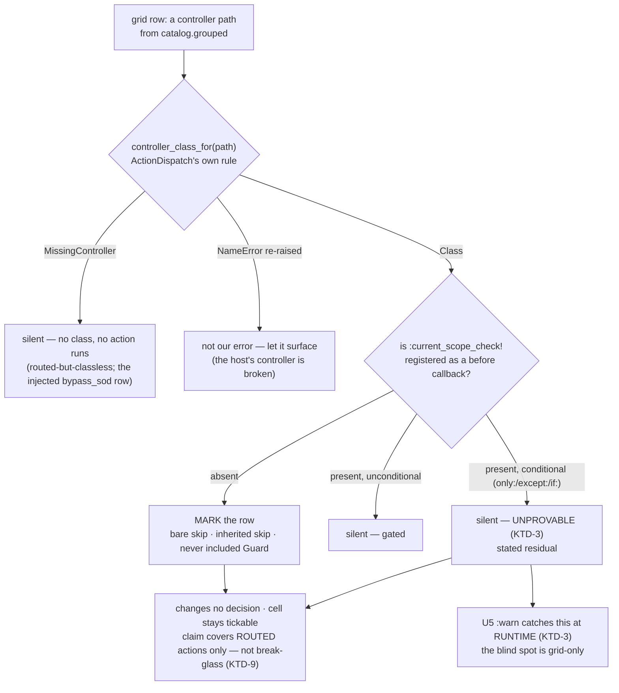

# Detect the ungated surface - grid honesty and a production-safe tripwire posture - Plan

## Goal Capsule

- **Objective:** close the *silent* half of #62. The permission grid stops rendering an action as grantable when the gate provably never runs for it, and `GatingTripwire` gains a posture that lets a real app inventory its ungated surface without raising. Detection only — the fail-open itself stays open, deliberately (KTD-4).
- **Authority hierarchy:** this plan → the direction decided on issue #62 ([comment](https://github.com/davidteren/current_scope/issues/62#issuecomment-4986085608)) → the settled v0.2 model (`README.md`, `CONCEPTS.md`). Immutable invariants this must preserve:
  - **no authorization decision changes.** Nothing here is read by `Resolver#decide` (`resolver.rb:37-52`) or by `Guard#current_scope_check!` (`guard.rb:83-127`). If a unit changes what the resolver decides, it is out of scope.
  - **a host that skips deliberately keeps working with no change and no new API.** Sign-in, webhooks, Devise. A mark is advice; it never denies, and it never un-ticks a box.
  - **a diagnostic that cries wolf is worse than none** — the repo's own thesis at `lib/current_scope.rb:189-192`. This decides KTD-3.
  - **a log-only diagnostic that raises isn't log-only** (`lib/current_scope.rb:199-203`).
  - the catalog stays **route-derived**; nothing here adds a key or removes one (`permission_catalog.rb:31-42`).
- **Delivery posture:** one PR, closes #62 — U1-U4/U7 (static detection) and U5 (runtime posture) ship together because they **compose**: U5 covers the exact shape U1's static predicate refuses to guess at (KTD-3), so splitting them would leave whichever landed first overstating its own blind spot. Suite green (**422 runs, 1258 assertions** on `main` at #68, verified) + RuboCop omakase clean per commit. Additive and behind config; releasable as **0.2.1** — no authorization semantics move. (Contrast #50, which must be 0.3.0.)

---

## Problem Frame

`skip_before_action :current_scope_check!` removes the gate's callback, and the removal **inherits into every subclass, forever**. Nothing warns, and the permission grid keeps rendering those actions as grantable — so the UI tells an admin an action is protected while the code runs it open. #62 names three symptoms with one cause: **ungated in production, undetectable at runtime, rendered as grantable in the UI.**

It is the only fail-open in an engine whose every other unknown fails closed.

### What is verified, against `main` at #68

Probed, not assumed, with the predicate from my #62 comment — **which is not the predicate this plan adopts; see KTD-1 two sections down before reusing it**. It is shown here because it is what established that the skip is *visible at all*, which is the claim this section makes:

`klass._process_action_callbacks.any? { |c| c.kind == :before && c.filter == :current_scope_check! }`

```
ReportsController                                  gated? true
WritesController (bare skip, writes_controller.rb:8)   gated? false
child inheriting a parent's bare skip                   gated? false   <- the fail-open, visible ON THE CHILD
child that re-asserts before_action                     gated? true    <- the guide's mitigation, verifiable
```

The skip is reflectable, and the mitigation the adoption guide already prescribes (`docs/guides/adopting-in-an-existing-app.md:168-173`) is checkable. Direction 1 is feasible.

### Three of this issue's premises are wrong, and one of mine is

The plan builds on the corrections, not the issue text.

| Claim | Where | Reality |
|---|---|---|
| "`GatingTripwire` … dev/test only" | #62 body | **False by mechanism.** `lib/current_scope/gating_tripwire.rb` has **zero** `Rails.env`/`config.` references. It is dev/test-only *by its doc comment* (`:2`) and raises unconditionally wherever included. A real app *can* run it; it just 500s. So U5 is not "make it able to run in production" — it is "give it a posture that is *usable* there". |
| "the skip is discoverable by reflection, but only for loaded controllers" | #62, direction 1 | **Understated, and it points at the wrong objection.** The catalog's refusal to load classes (`permission_catalog.rb:58-62`) is about **models at boot** — *"expensive, boot-order fragile"*. The catalog memoizes lazily (`current_scope.rb:55`) and **the grid renders in a request** (`app/views/current_scope/roles/edit.html.erb:38`), where controllers are loadable through Rails' own convention. Grid-time reflection sidesteps the objection; it is not a catalog change. |
| the fail-open is `skip_before_action` | #62 throughout | **One of two causes.** `BareController` and `IdentityController` route actions, sit in the catalog, and **never include `Guard` at all** (`Guard? false`, `gated? false`). The grid lies about them identically. The mark must key on the **effect** — "this action does not run the gate" — not the cause. See KTD-4. |
| `_process_action_callbacks.any? { … filter == :current_scope_check! }` is the predicate | **my own #62 comment**, and the brief for this plan | **Wrong, in the fail-open direction.** See KTD-1. |

### KTD-1's premise, stated here because it reshaped the plan

`skip_before_action :current_scope_check!, only: :index` does **not** remove the callback. It leaves it registered with an `@unless` `ActionFilter`. Probed:

```
PartialSkipController (skip_before_action :current_scope_check!, only: :index)
  callback present?                                        true
  naive any? { filter == :current_scope_check! }        => true    <- says "gated"
  ActionFilter#match?(<instance with action_name "index">) => true  <- but #index is SKIPPED
```

The predicate I put in the #62 comment answers *"is the callback registered on this class?"* — a **per-controller** question. The grid asks a **per-action** one. For a conditional skip the two disagree, and they disagree by reporting an ungated action as gated: **the grid keeps lying in a case the mark exists to fix.**

This is check 2 of `docs/solutions/workflow-issues/plan-code-sketches-are-intent-not-code.md`, committed by the person writing the plan that cites it. The sketch reached for what was in hand (`any?` over a callback list) and answered the adjacent question. Nothing in the issue said otherwise; only reading what makes `_process_action_callbacks` true does.

---

## Requirements

- **R1.** The grid marks a controller whose routed actions **provably** do not run `current_scope_check!`, so the UI stops presenting them as enforced.
- **R2.** The mark is asserted only when **proven**. Anything unprovable at grid-render time is silent — no mark, no guess. (KTD-3.)
- **R3.** The mark keys on the **effect** (the gate does not run), not on the cause (`skip_before_action` vs never including `Guard`). (KTD-4.)
- **R4.** **No authorization decision changes.** No unit touches `Resolver`, `Guard#current_scope_check!`, or the catalog's key set. Presentation and diagnostics only.
- **R5.** A marked cell **stays tickable and still saves.** Marking is not disabling. (KTD-8.)
- **R6.** `GatingTripwire` gains a posture: **raise** or **warn**. Default is env-aware — raise where the tripwire is a dev/test aid, warn elsewhere — so the production inventory is usable and never 500s. The flip's cost (ungated reads stop being withheld) is named in the CHANGELOG, not buried (KTD-6).
- **R7.** In `:warn`, the tripwire warns **once per `controller#action`**, not per request.
- **R8.** A host that skips deliberately (sign-in, webhooks, Devise) needs **no change and no new API**. Every existing test passes unmodified.
- **R9.** The residuals are stated where a reader hits them: the adoption guide, the README, the CHANGELOG, and the grid's own hint text (U3 renders it under R9's authority).
- **R10.** The ungated inventory is reachable as a **command** (`bin/rails current_scope:ungated`), not only as a badge and a log line — mirroring `current_scope:report`, its sibling inventory.

---

## Key Technical Decisions

### KTD-1 — The predicate is "the callback is absent", not "the callback is registered". My own sketch was wrong.

See the Problem Frame probe. `any? { filter == :current_scope_check! }` returns **true** for a controller that skips `only: :index` — reporting an ungated action as gated. It cannot be the predicate.

The honest predicate is its complement: **the callback is absent from the class entirely.** That is provable, needs no instance, and is exactly the shape #62 is about — an *unconditional* `skip_before_action` (which removes the callback) or a controller that never included `Guard` (which never added it).

**A conditional skip is therefore NOT marked.** That is a real residual, named in Scope Boundaries and in the guide. The alternative — evaluating `ActionFilter#match?` per action — was rejected in KTD-3.

### KTD-2 — Reuse `ActionDispatch::Request#controller_class_for`. Do not re-derive `camelize` + `constantize`.

A grid row is a controller **path** (`"admin/reports"`); reflection needs the **class**. Rails owns that rule. `ActionDispatch::Request#controller_class_for(name)` is public — read from the installed gem, not this tree (`actionpack` 8.1.3, `lib/action_dispatch/http/request.rb:93`; a version-pinned path, so re-read it rather than trusting this quote after a Rails bump) — and reads, in full:

```ruby
def controller_class_for(name)
  if name
    controller_param = name.underscore
    const_name = controller_param.camelize << "Controller"
    begin
      const_name.constantize
    rescue NameError => error
      if error.missing_name == const_name || const_name.start_with?("#{error.missing_name}::")
        raise MissingController.new(error.message, error.name)
      else
        raise
      end
    end
  # ...
```

**The `if` is the whole reason to reuse it.** It separates *"this controller does not exist"* (`MissingController`) from *"this controller loaded and raised a `NameError` from its own body"* (re-raised). Probed both:

```
controller_class_for("documents")     -> MissingController   (routed, no class — a live dummy shape)
controller_class_for("broken_thing")  -> NameError: uninitialized constant BrokenThingController::NopeNotDefined
```

A hand-rolled `constantize` under a blanket `rescue NameError` would swallow the second and silently report a genuinely broken controller as *not ungated* — a mark that goes quiet exactly when the host's code is broken. This is the "don't re-derive a condition another component already owns" rule, which is what the withdrawn `roles_granting` argument broke (`docs/solutions/workflow-issues/a-correction-rots-the-plan-it-fixes.md`, Related).

The method is a pure function of `name` — it reads no request state (readable above). Probed: `ActionDispatch::Request.new({}).controller_class_for("admin/reports")` → `Admin::ReportsController`. The reflection collaborator memoizes one throwaway request rather than threading the real one through the grid. The bet that this stays request-independent is in Risks.

### KTD-3 — Prove, or stay silent. Never guess a mark.

Three shapes cannot be answered statically at grid-render time:

1. **A conditional skip** (`only:`/`except:`) — the callback is registered with an `ActionFilter`. Answering needs `ActionFilter#match?`, which needs a **controller instance** with an `action_name`. Instantiating a host controller to render a UI hint is a cost this mark does not earn, and it has a second failure: `match?` raises `AbstractController::ActionNotFound` when an `only:` names a missing action (Rails 7.1's `raise_on_missing_callback_actions` default) — which would turn the role editor into a 500 over a host's stale callback option. `lib/current_scope.rb:199-203` already settles that: *"A 'log-only' diagnostic that raises isn't log-only."*
2. **A runtime conditional** (`if:`/`unless:` with a Proc or Symbol) — the answer is *"sometimes"*, and depends on a request that does not exist yet.
3. **An unresolvable controller** — `MissingController`. Silent here, but **deliberately deferred, not vacuous.** An earlier draft said "no class means no action runs at all, so there is nothing to warn about." That premise is refuted by **open issue [#43](https://github.com/davidteren/current_scope/issues/43)**, which verifies the opposite: a stale route to a nonexistent controller renders as a normal grantable grid row and **500s in production when hit**. There is something to warn about — it is just a *different claim*. "Stale route" is not "the gate does not run here", and this badge asserts the latter. `GatingReflection`'s `MissingController` branch **is** #43's detector (#43's own "How" proposes `camelize + constantize` at grid-render time — KTD-2 improves on that sketch by reusing Rails' own resolution). **#43 owns the badge for this shape; this PR stays silent and hands it the mechanism.** Same silence for the injected `bypass_sod` row of a namespace-only resource (`permission_catalog.rb:74-77`), which no controller routes by construction.

In all three, the grid says **nothing** — exactly what it says today. The mark asserts a positive claim ("the gate does not run here"), so it is asserted only where it is proven.

**The cry-wolf precedent transfers only partway, and the difference is the residual.** `lib/current_scope.rb:189-192` (*"a diagnostic that cries wolf is worse than none"*) governs a **log line**, where silence costs nothing because silence is the status quo. Here the mark makes the grid's silence **newly meaningful**: once some rows are badged, an unbadged row reads as an affirmative *"checked, and gated"*. Silence stops being an absence and becomes a claim. So the precedent justifies not-guessing; it does **not** justify leaving the reader to infer gatedness from absence. U3 carries that difference (the hint must state the mark's limit, and must render whenever the grid renders).

**Case 1 is grid-only, and U5 closes it at runtime — in this same PR.** Guard sets `@current_scope_checked` **inside** `current_scope_check!` (`guard.rb:86`); the tripwire early-returns only when that ivar is set (`gating_tripwire.rb:44`). A controller skipping `only: :index` never sets it on `#index`, so `config.gating_tripwire = :warn` **warns on exactly the shape this KTD refuses to mark statically** — the tripwire keys on the effect, not the cause. The blind spot is therefore **static/grid-only**, not a PR-level gap, and U6 must say so rather than listing it among symptoms that stay open.

Note the direction the *static* mark errs in: unproven stays **silent**. **Do not read this as fail-open reasoning** — R4 holds absolutely; nothing here decides access. The failure mode of a wrong mark is a UI that misinforms, and a mark nobody trusts misinforms permanently.

### KTD-4 — Detection only. The macro (#62 direction 3) stays out, and the fail-open stays open.

Direction 3 — a visible `current_scope_skip_gate!` macro — is the honest root fix, and it is what #62 argues for when filing. **Detection ships first because it needs no host adoption: it covers every host exactly as they are today, while the macro only helps a host that rewrites every skip site.** That is the reason, and it is the only one that holds.

**It is NOT that "the macro's value drops once detection exists" — an earlier draft said that, and this plan's own Open Questions refutes it.** The macro is precisely what closes KTD-3's residual, because a *declared* skip needs no `ActionFilter` inference. Detection is what *creates* the unmarked-reads-as-gated problem the macro would resolve, so the macro's value **rises** once detection ships. A reader deciding whether the follow-up is worth filing must not get the opposite signal from this KTD than from Open Questions and Risks.

So: this PR ships detection for hosts as they are today, with no new API to adopt. Direction 3 stays a named follow-up whose value this PR increases — not a prerequisite, and not a diminished idea.

The consequence to state plainly: **after this PR, `skip_before_action :current_scope_check!` still inherits and still fails open.** What changes is that it stops being invisible.

### KTD-5 — The tripwire posture is a MODE, mirroring `enforcement`. Not a fourth diagnostics boolean.

The repo runs **1 flag : 1 nudge** for its dev diagnostics (`configuration.rb:150,160,168`) and this must not bundle into them — but this is not a nudge. Those three flags *add a log line* to a path that otherwise says nothing. `GatingTripwire` already **raises**; the question is what it does, not whether it speaks. That is `enforcement`'s shape, and `enforcement`'s comment already argues the case (`configuration.rb:223-224`):

> A predicate, so callers can't express "not enforcing" — the modes are a closed set, not a boolean.

The same holds here: a boolean `gating_tripwire_raises = false` reads as *"tripwire off"* when it means *"tripwire warns"*. So:

```
config.gating_tripwire = :raise | :warn
```

with `enforcement=`'s validating writer (`configuration.rb:206-221`): an unknown value raises `ConfigurationError` at boot naming both modes, rather than leaving a host believing it is inventorying when it is not. `:off` is not a mode — a host that wants the tripwire off does not include the mixin.

### KTD-6 — The default is env-aware, which flips production from raise to warn. That flip has a real cost. Name it.

`@gating_tripwire = diagnostics_default_on? ? :raise : :warn` — reusing `configuration.rb:314-316` for its **env split and its bare-Ruby safety only**. Its emit/silence reasoning does **not** carry and must not be cited as if it did: for the three existing diagnostics, false means *stay quiet* — *"off where they'd be noise on someone else's dime"* (`configuration.rb:307-316`). Here false means `:warn`, which emits. The reason that branch is right is different: the mixin is **opt-in**, so a host that included it in production is asking for the inventory. An implementer reading `diagnostics_default_on? ? :raise : :warn` beside the three flags that share the call will otherwise read the branch backwards.

This **changes behavior** for a host that includes `GatingTripwire` in production today.

**State the cost accurately — an earlier draft of this KTD did not, and it was the bullet the whole decision rested on.** It claimed the raise "never protected anything, it only refused to render a page the gate had already let through." Both halves are false:

- **"the gate had already let it through"** — the tripwire fires precisely when the gate **never ran** (`gating_tripwire.rb:44` keys on an unset `@current_scope_checked`). There was no gate to let anything through. That is the whole point of the mixin.
- **"never protected anything"** — probed against the dummy with `show_exceptions = :all`: an after_action raise propagates out of `process_action` and the middleware **discards the rendered response**. `GET /tripwire_open` returns **500, body dropped**. So the raise does not prevent the ungated action's *side effects* (the body already ran) but it **does withhold the ungated response**. U5's own scenario concedes this by asserting `:warn` now returns `assert_response :success`.

So the honest trade: **`:warn` newly serves response bodies that previously 500'd.** Accepted, on the two legs that survive:

- the mixin is **opt-in**, and its doc comment (`gating_tripwire.rb:2,22-23`) has always called it a dev/test aid — so a production inclusion is already a host acting against the documented contract, and the affected population is hosts currently 500ing on every ungated production request;
- **it is the point of the unit.** #62's ask is a production-usable inventory. `:raise` everywhere leaves production exactly as unusable as today, and a host must not configure their way out of a 500 to get a log line.

**The CHANGELOG must name the disclosure change specifically** — not "a 500 becomes a warn", which no reader will decode into "ungated reads now return data" — and must tell a host relying on that 500 to pin `config.gating_tripwire = :raise`.

Every existing test keeps passing unmodified: the suite runs in `test`, `local?` is true, the default is `:raise`, and `test/integration/gating_tripwire_test.rb:11-15` still asserts the raise (R8).

### KTD-7 — No process-level cache. Per-grid-instance only.

The reflection reads controller **classes**, which reload in development. A process-level cache would pin stale constants — the failure `scopeable_registry` already documents (`current_scope.rb:71-74`: *"resolved lazily so dev-mode reloading never pins a stale constant"*), and the reason `Engine#to_prepare` resets three caches (`engine.rb:9-15`).

`PermissionGrid` is constructed **per request** in the view (`roles/edit.html.erb:38`), so per-instance memoization dies with the request and needs no `to_prepare` hook and no reset seam. **Do not add one for the reflection** — it would be a cache invalidation for a cache that does not outlive its owner.

**This is scoped to the reflection, and only the reflection.** U5's warn-once latch is per-*process* and **does** need a `to_prepare` reset, for the reason `engine.rb:12-14` already states. Read this KTD as "a per-request object needs no invalidation", never as "this PR adds nothing to `to_prepare`."

Cost check: one `constantize` + one callback-chain scan **per grid row**, on the role-editor page only. Not a hot path — `PermissionCatalog#include?`'s "the Guard asks this on EVERY gated request" reasoning (`permission_catalog.rb:15-20`) does not apply here.

### KTD-8 — Marking is not disabling. The checkbox stays live.

A marked row's cells stay tickable and still save. The host may be mid-retrofit and about to gate that controller; a grant made today must work the moment they do. Disabling the input would also make the mark **decide something**, which R4 forbids.

**The save path DOES construct the reflection, and an earlier draft of this KTD claimed otherwise.** It read: *"`#cell` and `#expand` are untouched, so `role_params` provably cannot change — the save path never learns the mark exists."* The second clause is false. `role_params` calls a **bare `PermissionGrid.new`** (`roles_controller.rb:135`), and U2 changes that constructor by adding `gating: GatingReflection.new`. Ruby evaluates default arguments **at call time**, so every role create and update instantiates a reflection.

R4 still holds — `#expand`'s output depends only on `@grouped` and `@groups`, which U2 does not touch — but it holds **by that reason**, not by the one the draft gave. The distinction is not pedantic: the discarded claim implied the constructor was off the save path, so nothing would have stopped an implementer from resolving the throwaway `ActionDispatch::Request`, touching routes, or reflecting eagerly in `initialize` — turning any failure there into a **500 on role save**, on a path that never reads the mark.

So the constructor is a **requirement, not an observation**: `GatingReflection#initialize` must be **inert**. Build the throwaway request and resolve every class lazily inside `#ungated?`. A role save must pay nothing for a mark it never reads. Pinned by a U2 test.

The DoD gate "`#cell` and `#expand` are unmodified" is blind to this constructor change, which is why U2 carries its own scenario for it.

### KTD-9 — The mark is row-level, with exactly one exception: break-glass.

Under KTD-1 the predicate is all-or-nothing per controller: the callback is either **absent** (⇒ every routed action on it is ungated) or **present** (⇒ silent — provably gated if unconditional, unprovable if conditional; both render the same). So the *gate* question has no half-marked row, and `Cell` gains no field.

**But one cell on a marked row is live anyway, and the badge must not claim otherwise.** `bypass_sod` is **not a routed action** — the catalog *injects* it onto the row of any controller routing an SoD action (`permission_catalog.rb:84-95`, keyed on the controller's last path segment). The resolver reads that key from the **record's** `route_key` during the SoD veto (`resolver.rb:225` → `lib/current_scope.rb:112-131`), from **whatever gate is deciding**, entirely independently of whether the badged controller runs a gate.

Probed — the shape is reachable, not theoretical. Bare-skip `ReportsController` (which routes `approve`) with `allow_sod_bypass` on:

```
row "reports"  MARKED? true
row "reports"  actions: ["approve", "bypass_sod", "destroy", "index", "show"]
```

The badge would sit over a `bypass_sod` cell that a gated `admin/reports#approve` still honors. So a row-level badge reading *"ticking these grants nothing"* would be **wrong in the permissive direction, on the cell that lifts the four-eyes fraud veto** — the most sensitive cell in the grid. A mid-retrofit host with an ungated controller routing an SoD action is exactly the population this feature targets.

**Therefore:** the badge's claim covers the row's **routed** actions only and must visibly exclude the break-glass column (U3). This is the one place a row-level mark is not the honest level, and it comes from break-glass being virtual — not from the conditional-skip case, which renders silent either way.

Should a future PR answer conditional skips (Scope Boundaries), the mark becomes per-action and `Cell` grows an `ungated_keys` field mirroring the existing `granted_keys` partial-group machinery (`permission_grid.rb:52-60`). **That is not this PR** — building the per-action shape now would be a speculative structure with one all-or-nothing caller. Excluding one known-virtual column from a claim is not that structure.

---

## High-Level Technical Design

The decision for one grid row. Every "silent" leaf renders exactly what the grid renders today.



### Every shape, and what it does

Grounded against the dummy as it is now (probed) — not assumed.

| Shape | Live example | Result |
|---|---|---|
| `Guard` included, no skip | `ReportsController`, `Admin::ReportsController` | silent (gated) |
| Unconditional `skip_before_action` | `WritesController` (`writes_controller.rb:8`) | **marked** |
| Child inheriting a parent's bare skip | new dummy shape (U4) | **marked** — *the #62 fail-open* |
| Child that re-asserts `before_action` | new dummy shape (U4) | silent — *the guide's mitigation, now verified* |
| Never includes `Guard` | `BareController`, `IdentityController`, `TripwireUngatedController` | **marked** (KTD-4) |
| Conditional skip (`only:`/`except:`/`if:`) | new dummy shape (U4) | silent — **stated residual** (KTD-3) |
| Routed, no controller class | `documents` (`routes.rb:7`) — see U4's coupling note | silent (`MissingController`) — **#43 owns this badge**, KTD-3 case 3 |
| Controller body raises `NameError` | — | re-raised, not swallowed (KTD-2) |
| Injected `bypass_sod` row no controller routes | `permission_catalog.rb:74-77` | silent — same `MissingController` path |
| **Injected `bypass_sod` cell ON a marked row** | bare-skip `ReportsController` + `allow_sod_bypass` (probed) | **row marked, but the cell is LIVE** — the badge's claim must exclude it (KTD-9) |
| Engine's own controllers | `current_scope/*` | never reach the grid — excluded (`configuration.rb:235-238`) |
| Abstract base | — | never a grid row; rows come from routes |

**Four dummy rows are marked on day one** (`writes`, `bare`, `identity`, `tripwire_ungated`). That is the mark being correct, not a regression — those controllers genuinely do not gate. `test/integration/role_grid_test.rb` will need to accept it.

---

## Implementation Units

### U1. `CurrentScope::GatingReflection` — the one place that answers "does the gate run here?"

- **Goal:** a collaborator that answers `ungated?(controller_path)` with **true only when proven**, and owns every edge case in the table above.
- **Requirements:** R1, R2, R3.
- **Dependencies:** none for the code. Two test scenarios below (the inherited-skip child, the re-asserting child) need U4's dummy fixtures, so they land once U4's controllers exist — mirroring U4's own "the controllers may land first" note.
- **Files:** `lib/current_scope/gating_reflection.rb` (new), `lib/current_scope.rb` (require), `test/gating_reflection_test.rb` (new).
- **Approach:** one public predicate. Resolve the path to a class via `ActionDispatch::Request#controller_class_for` (KTD-2) on a memoized throwaway `ActionDispatch::Request`; rescue **only** `ActionDispatch::MissingController` → `false` (silent). Let every other error surface — a `NameError` from the host's own controller body is their bug, and swallowing it is what KTD-2 exists to prevent. With a class in hand, find the `:current_scope_check!` before-callback in `_process_action_callbacks`: **absent ⇒ true (marked)**; present ⇒ `false`, unconditionally, whether or not it carries conditions (KTD-3 — present-and-conditional is unprovable, and unprovable is silent). Name the class beside `GatingTripwire` because it is the same subject: *is this action gated?*
- **Execution note:** the two probes in the Problem Frame are the first two tests. Watch the naive `any?` predicate report a `only:`-skipping controller as gated **before** writing the complement — that inversion is the unit's whole reason to exist, and a test asserting it is what stops the next reader from "simplifying" the predicate back.
- **Patterns to follow:** `PermissionCatalog` (`permission_catalog.rb`) — a small, single-purpose, injectable collaborator with the reasoning inlined as comments. `CurrentScope.warn_on_cross_controller_derivation` (`current_scope.rb:196-216`) for the prove-or-stay-silent discipline and its early returns.
- **Test scenarios:**
  - `Guard` included, no skip (`ReportsController`) → `ungated?` false.
  - Unconditional skip (`WritesController`) → **true**.
  - A child inheriting a parent's bare skip → **true**. *The #62 fail-open, at the unit level.*
  - A child that re-asserts `before_action :current_scope_check!` → false. *The guide's mitigation.*
  - Never includes `Guard` (`BareController`) → **true** (R3 — effect, not cause).
  - Namespaced (`admin/reports`) → resolves to `Admin::ReportsController`, false. *Proves KTD-2's path rule on the shape that breaks a naive one.*
  - **Conditional skip (`only: :index`) → false**, asserted with the reason in the failure message: the naive `any?` would say "gated" here and the action is in fact skipped, so this unit refuses to answer rather than guess wrong in either direction. The message is what makes a future "simplification" of the predicate argue with the decision instead of silently reverting it. *`lib/` must not reach for `ActionFilter` — KTD-3 rejects it; this scenario asserts the silence, it does not evaluate the filter.*
  - Routed path with no class (`"documents"`) → false, no raise.
  - A controller whose body raises `NameError` → **the `NameError` propagates**. Not rescued. (Fixture must live in the dummy's autoload path; my first attempt at this probe silently proved nothing because `/tmp` is not autoloaded — the fixture must be reachable by Zeitwerk or the test passes for the wrong reason.)
- **Verification:** every row of the shapes table has a test, and the two marked-vs-silent boundaries (conditional skip; missing class) fail loudly if the predicate is inverted.

### U2. `PermissionGrid#ungated?` — thread the reflection, touch nothing else

- **Goal:** the grid can answer the row question, and provably cannot affect a grant.
- **Requirements:** R1, R4, R5.
- **Dependencies:** U1.
- **Files:** `lib/current_scope/permission_grid.rb`, `test/permission_grid_test.rb`.
- **Approach:** one injected dependency and one public predicate — `PermissionGrid.new(catalog:, groups:, gating: GatingReflection.new)`, and `#ungated?(controller)` delegating to it. **`Column`, `Cell`, `#cell`, and `#expand` are not touched** (KTD-8, KTD-9). Default `gating:` to a real reflection so the **two** bare `PermissionGrid.new` call sites work — the view (`edit.html.erb:38`) **and `role_params` (`roles_controller.rb:135`)**. The injection point exists because `test/permission_grid_test.rb:11-16` already builds the grid against a `Struct` stand-in catalog with no Rails routing, and the unit tests must stay that way.
- **The constructor is on the grant-write path (KTD-8) — this is a constraint, not trivia.** Ruby evaluates the `gating:` default at call time, so every role save builds a `GatingReflection`. It must therefore be **inert**: no request built, no class resolved, no route read in `initialize`. All of that happens lazily inside `#ungated?`, which `role_params` never calls.
- **Patterns to follow:** the existing `catalog:` injection and its `Struct.new(:grouped)` stand-in (`test/permission_grid_test.rb:11-17`) — same shape, same reason.
- **Test scenarios:**
  - `ungated?` delegates per controller — a stub reflection marking only `"widgets"` marks `"widgets"` and not `"reports"`.
  - **`#cell` output is byte-identical with a marking and a non-marking reflection**, for a checked, an unchecked, a partial-group, and a blank cell. *Half of R4's evidence.*
  - `#expand` output is identical with a marking reflection — a marked controller's group token still expands to its keys. *The other half: this is what `role_params` actually calls.*
  - **Constructing `PermissionGrid.new` performs no reflection** — a spy reflection records zero calls, and building the grid resolves no controller class. *R4's constructor half, and the thing the discarded "the save path never learns the mark exists" claim would have let an implementer break.*
  - `PermissionGrid.new` with no `gating:` builds a real reflection (both bare call shapes work).
- **Verification:** `RolesController#role_params` is unmodified, and R4 holds for it **because `#expand` reads only `@grouped`/`@groups`** — not because the save path avoids the reflection, which it does not.

### U3. The grid tells the truth

- **Goal:** an admin looking at the row learns the box means nothing yet, and what to do.
- **Requirements:** R1, R5, R9.
- **Dependencies:** U2.
- **Files:** `app/views/current_scope/roles/edit.html.erb`, `app/assets/stylesheets/current_scope/application.css`, `test/integration/role_grid_test.rb`.
- **Approach:** a badge in the row header (`app/views/current_scope/roles/edit.html.erb:55-63`), beside the existing row-all control. It names the fact, the consequence, and **the next step** — *this controller does not run the gate; ticking its **routed** actions grants nothing until it does; include `CurrentScope::Guard` on it, or re-assert `before_action :current_scope_check!`* — the claim already scoped to routed actions because constraint 1 below makes the unscoped copy false on a break-glass row. Carries the same remediation vocabulary the tripwire's own message already uses (`gating_tripwire.rb:46-50`), so the two diagnostics agree. Not a checkbox, not a `title`-only tooltip, does not gray the row (KTD-8).
- **Four design constraints the plan's first draft got wrong or left open:**
  1. **The badge's claim must exclude the break-glass column** (KTD-9). On a marked row carrying an injected `bypass_sod` cell, *"ticking these grants nothing"* is false — that cell is live via any gate deciding SoD on the record's type. Scope the claim to the row's **routed** actions and mark the break-glass cell as exempt from it.
  2. **A checked cell on a marked row must not render like a real grant.** The grid's strongest signal is the `:has(input:checked)` granted wash (`application.css`), which fires regardless of the mark — so ticking a marked row lights the cell up exactly as an enforced grant would, contradicting the badge at the moment of interaction. Add a **CSS-only** rule keyed on the row's badge markup (e.g. `.cs-grid tr:has(.cs-ungated-badge) td:has(input:checked)`) — CSS-only keeps `#cell`'s HTML byte-identical, so R4's contract is untouched.
  3. **Wire the badge to the controls with `aria-describedby`.** Admins tab between checkboxes; each control already carries an explicit `aria-label` (`:60`, `:77`), and an explicit label is the accessible name — it does **not** surface sibling text in the `<th>`. Without this, a screen-reader user hears "writes create" and never the warning. Give the badge an `id`; reference it from the row-all and each cell checkbox in a marked row.
  4. **The hint renders whenever the grid renders — not only when a row is marked.** It must state the mark's **limit**, not just its findings: *the badge marks only controllers provably ungated; an unmarked row is not proof the gate runs.* The host with **zero** marked rows and a conditional skip is exactly the host the mark can mislead (KTD-3), and a hint gated on `any marked?` is invisible to them. This is the one place the break-glass hint's conditional shape (`:30-35`) is the wrong model to copy.
- **No external link.** Resolved here rather than left open: the guide is not gem-shipped (`gemspec` ships `{app,config,db,lib}` only), so a relative path 404s, and sending a self-hosted — possibly air-gapped — admin console out to GitHub is the wrong default. The remediation text above is the next step; it travels with the gem.
- **Patterns to follow:** the `allow_sod_bypass` conditional hint block (`app/views/current_scope/roles/edit.html.erb:30-35`) for the *prose* shape — but not its conditional rendering (constraint 4).
- **Test scenarios:**
  - The dummy's ungated rows (`writes`, `bare`, `identity`, `tripwire_ungated`) render the badge; `reports` and `admin/reports` do not.
  - **A marked row's checkboxes are still present, still enabled, and still carry their `name`/`value`** — R5, asserted on the rendered HTML, not on the grid object.
  - **Saving a role with a marked controller's key ticked persists that key.** *The end-to-end R4/R5 proof, through the real controller.*
  - **With `allow_sod_bypass` on and an ungated controller routing an SoD action: the row is marked, and the badge's claim visibly excludes the `bypass_sod` cell.** *KTD-9's exception — the badge must not tell an admin that ticking break-glass is inert.*
  - The badge carries an `id` and every interactive control in that row references it via `aria-describedby`.
  - The hint renders on a grid with **zero** marked rows and states the mark's limit.
  - Existing `role_grid_test.rb` assertions still pass — the marked rows are new output, not changed output.
- **Verification:** the grid no longer asserts "protected" about an action it cannot protect, never asserts "inert" about a cell that is not, and an admin who ticks the box anyway still gets the grant they asked for.

### U4. Dummy: the shapes the mark is about, and the one it refuses

- **Goal:** #62's fail-open has no reproduction in this repo. Give it one, and give the residual one too.
- **Requirements:** R1, R2, R3, R8.
- **Dependencies:** U1 (the assertions are U1's behavior). The controllers may land first.
- **Files:** `test/dummy/config/routes.rb`, `test/dummy/app/controllers/inherited_skip_base_controller.rb` (new), `test/dummy/app/controllers/inherited_skip_child_controller.rb` (new), `test/dummy/app/controllers/reasserted_gate_controller.rb` (new), `test/dummy/app/controllers/conditional_skip_controller.rb` (new), `test/permission_catalog_test.rb`, `test/integration/role_grid_test.rb`.
- **Note on those last two:** `test/permission_catalog_test.rb` asserts **exact** key sets (e.g. `@catalog.grouped["reports"]`), so four new routed controllers may require assertion edits, not merely a passing run. This unit owns them; no other unit names that file.
- **Approach:** four controllers for the four shapes that do not exist in the dummy today. A base that includes `Guard` and bare-skips, and a child that inherits it and adds nothing — **the fail-open, and the reason this PR exists.** A second child that re-asserts `before_action :current_scope_check!` — the guide's prescribed mitigation (`docs/guides/adopting-in-an-existing-app.md:168-173`), currently prescribed and never tested. A controller that skips `only:` one action — KTD-3's residual, pinned so the silence is deliberate rather than incidental. Every one needs a **route**, or it is not a grid row and not in the catalog. The base is a plain class, not `abstract_class` — an abstract base is never routed and so never a row.
- **Execution note:** this is lesson 2 of `docs/solutions/workflow-issues/plan-code-sketches-are-intent-not-code.md`. A green suite proves nothing about a shape the dummy does not contain, and the dummy currently contains **no inherited skip at all** — the exact defect #62 is filed about.
- **Cross-plan coupling — check before writing.** Plan 029 (#66, merged) is unimplemented; **#50 is still OPEN** (verified). Its U4 adds `DocumentsController` and widens `resources :projects, only: []`. That would delete the dummy's only routed-but-classless shape (`documents`), which U1's `MissingController` test uses. **Do not lean on `documents`** — route a dedicated classless path for that test so the two plans cannot break each other in either merge order. If #50 lands first, re-read this bullet before assuming it still applies.
- **Patterns to follow:** `WritesController` (`writes_controller.rb:5-9`) for the skip shape and its `raise: false`; `TripwireUngatedController` for a routed controller that never includes `Guard`.
- **Test scenarios:** (the shapes; the assertions live in U1 and U3)
  - The inherited-skip child is marked — **through the grid**, not only through the reflection unit.
  - The re-asserting child is not marked, and its action is genuinely gated (a request to it 403s without a grant). *Both halves — otherwise "not marked" could mean the reflection is broken.*
  - The conditional-skip controller is not marked, and its skipped action genuinely runs ungated (a request succeeds without a grant). *Pins the residual as real, so the Scope Boundaries entry is a fact rather than a caveat.*
  - `test/permission_catalog_test.rb` and `test/integration/role_grid_test.rb` absorb four new routed controllers without regressions.
- **Verification:** the dummy contains the defect. Reverting U1's predicate to the naive `any?` turns the inherited-skip row silent and a test red.

### U5. `config.gating_tripwire` — a posture, so the inventory is usable in production

- **Goal:** a real app can run the ungated-surface inventory without a 500.
- **Requirements:** R6, R7, R8.
- **Dependencies:** U4, for its conditional-skip fixture — the scenario that proves this unit covers KTD-3's residual. The *code* touches none of U1-U3, but **an earlier draft called this unit "independent of U1-U4", and that is the claim the compose story withdraws**: U5 is what closes the shape U1's static predicate refuses to guess at, which is why the two ship in one PR (Goal Capsule) and why U6 must not describe that shape as undetectable.
- **Files:** `lib/current_scope/configuration.rb`, `lib/current_scope/gating_tripwire.rb`, `lib/current_scope/engine.rb`, `lib/generators/current_scope/install/templates/initializer.rb`, `test/configuration_test.rb`, `test/integration/gating_tripwire_test.rb`.
- **Approach:** a closed two-mode setting with `enforcement=`'s validating writer (KTD-5) and `diagnostics_default_on?`'s env-aware default (KTD-6). `current_scope_verify_gated!` (`gating_tripwire.rb:41-51`) keeps its existing early return and its existing message verbatim — the message is already correct and already names the fix — and branches only on the mode at the end: raise, or `Rails.logger&.warn` once per `controller#action`. The warn-once latch mirrors `CurrentScope.cross_controller_warning_unseen?` (`current_scope.rb:220-223`): a plain `Set` on the module with the same `ponytail:` reasoning (worst case under a race is one extra line), plus a `reset_*!` test seam.
- **The latch DOES need a `to_prepare` reset — add it to `engine.rb` beside the existing three.** An earlier draft said it did not, reasoning that "a reload cannot change what `controller#action` means." That is true and irrelevant: it is not why the mirrored latch resets. `engine.rb:12-14` gives the actual reason verbatim — *"a reload can change what's routed, so a stale latch would hide a divergence the edit just created"* — and it applies identically here, because **a reload can change whether a given `controller#action` is gated.** Without the reset, a developer running `:warn` locally sees "reports#index ungated", fixes it, reloads, re-hits the action, and gets silence whether or not the fix worked: a false all-clear from the tool they are using to check. This does **not** contradict KTD-7, which refuses a `to_prepare` entry for the *reflection* (a per-request object that outlives nothing); this latch is per-process and does.
- **Execution note:** R8 is the tripwire's own existing suite. Run `test/integration/gating_tripwire_test.rb` unmodified against the change before touching it — all three tests must pass untouched, because the default in `test` is `:raise`. If any needs editing, the default is wrong, not the test.
- **Patterns to follow:** `enforcement=` (`configuration.rb:206-221`) — the validating writer and the shape of its error message; `report_only?` (`:225`) for the predicate-over-boolean rule; `diagnostics_default_on?` (`:314-316`) verbatim, including bare-Ruby safety.
- **Test scenarios:**
  - Default is `:raise` in `test`/`development`, `:warn` in `production` — asserted through `diagnostics_default_on?`'s own env stub, mirroring the existing diagnostics-default tests.
  - `config.gating_tripwire = :nonsense` raises `ConfigurationError` at assignment, naming **both** modes. *A host who typos this must not silently believe they are inventorying.*
  - `:raise` — the three existing tripwire tests pass **unmodified** (R8).
  - `:warn` — an ungated action returns its normal response (`assert_response :success`), logs a warning naming `controller#action`, and **does not raise**.
  - `:warn` — the warning carries the same remediation text as the raise (include `Guard`, or `current_scope_skip_tripwire!`).
  - `:warn` — two requests to the same ungated action log **once**; a request to a *different* ungated action logs again. *Warn-once must not become warn-once-per-process and hide the rest of the inventory — the exact bug the `Guard.ledger_warning_emitted?` latch accepts on purpose (`guard.rb:60-67`) and this one must not.*
  - **`:warn` — the latch is cleared by `to_prepare`**, so the same action re-warns after a reload. *Pins the false-all-clear fix; without the reset this test is the only thing that fails.*
  - **`:warn` — a controller skipping `only: :index` warns on `#index` and stays silent on its gated actions.** *KTD-3's residual, closed at runtime by this unit. This is the test that makes "the blind spot is grid-only" a fact rather than a claim, and it is why U5 is not independent of U1-U4 in the way an earlier draft said.*
  - `:warn` — `current_scope_skip_tripwire!` still exempts (the skip API is unchanged).
  - `:report` enforcement + `:warn` — a report-mode request does **not** trip the tripwire (Guard sets `@current_scope_checked` at `guard.rb:86`, before the report branch). *The two diagnostics must not double-report.*
  - Bare-Ruby `Configuration.new` with no Rails does not raise and gets `:warn`.
- **Verification:** a production host includes the mixin, runs traffic, and reads its ungated surface out of the log. Nothing 500s, and no gated app changes behavior. Together with U7 the host has both a static inventory (no traffic needed) and a runtime one (catches what static cannot prove).

### U7. `bin/rails current_scope:ungated` — the inventory as a command, like its sibling

- **Goal:** let a retrofitting host ask *"what is ungated?"* from the terminal — no mixin, no deploy, no traffic, no production config.
- **Requirements:** R1, R2, R6.
- **Dependencies:** U1.
- **Files:** `lib/tasks/current_scope_tasks.rake`, `test/report_task_test.rb` (or a sibling task test), `docs/guides/adopting-in-an-existing-app.md` (U6 owns the guide edit).
- **Why this exists — the symmetry the plan's first draft missed.** The repo already ships `current_scope:report` for the **other** inventory, precisely because a log line was not enough to serve a retrofit. This plan originally delivered the ungated inventory as a badge (seen only if you open the role editor) and a `:warn` line (seen only if you opted into the mixin *and* read logs) — and never asked why one inventory gets a task and the other does not. `lib/tasks/current_scope_tasks.rake` appears nowhere in the first draft. Meanwhile U1's `#ungated?` over `catalog.grouped` already **is** a complete static inventory of the bare-skip, inherited-skip, and never-included-Guard shapes — which is #62's actual subject.
- **Approach:** iterate `CurrentScope.catalog.grouped.keys` through `GatingReflection#ungated?` and print the marked controllers, mirroring `current_scope:report`'s output shape and its discipline of **naming the cause when the output is empty** (an empty list must not read as "you are safe" when it may mean "nothing resolved"). Carry the same remediation vocabulary as the tripwire and the badge. No new packaging: `spec.files` ships `lib/**/*` and `Rails::Engine#run_tasks_blocks` loads `paths["lib/tasks"]`, which is the identical path `current_scope:report` already reaches hosts by.
- **State its limit in the output, not just the docs.** The task inherits KTD-3 exactly: it lists what is **provably** ungated. A conditional skip does not appear, and the task must say so — pointing at `config.gating_tripwire = :warn` as the runtime half. Static and runtime are complementary here in the same way the guide's two-inventories table already frames tripwire vs. report mode.
- **Patterns to follow:** the `current_scope:report` task in `lib/tasks/current_scope_tasks.rake` — output shape, empty-state honesty, and the `environment` dependency.
- **Test scenarios:**
  - The task lists the dummy's four ungated controllers and omits the gated ones.
  - A controller that re-asserts the gate does not appear.
  - The conditional-skip controller does **not** appear, and the output names `:warn` as the way to catch it. *The residual, stated at the point of use.*
  - Empty output names its own cause rather than implying an all-clear.
- **Verification:** a host runs one command against their real app and gets the ungated surface, without deploying anything.

### U6. Docs: the residuals, where a reader hits them

- **Goal:** #62's guide section currently says the gap is open. After this PR it is partly closed, and the honest remainder must be as findable as the closed part.
- **Requirements:** R9.
- **Dependencies:** U1-U5, U7.
- **Files:** `docs/guides/adopting-in-an-existing-app.md`, `README.md`, `CHANGELOG.md`, `lib/generators/current_scope/install/templates/initializer.rb`.
- **Approach:** the guide's `⚠️ skip_before_action inherits, and it fails OPEN` section (`:138-210`) is the target. Its **"How to detect it"** (`:175-190`) gains the `:warn` posture and `current_scope:ungated` (U7) — the sentence *"a dev/test aid, not a production net"* (`:203`) is now false as an absolute and must be corrected, not appended to. Its **"The residual, stated honestly"** (`:201-210`) is the load-bearing edit: it currently reads *"ungated in production, undetectable at runtime, and rendered as grantable in the UI"* and *"That gap is real and currently open — tracked in #62."* Two of those three symptoms close here. The third — ungated in production — does **not** (KTD-4). Rewrite the section to say exactly which parts closed, which did not, and why, rather than deleting the warning. The two-inventories table (`:216-226`) gains the posture and the task. README's dev-diagnostics section gets `config.gating_tripwire`; the CHANGELOG entry names the production default flip **and specifically the response-disclosure change** (KTD-6), and tells a host relying on the 500 to pin `:raise`.
- **The conditional-skip residual is GRID-ONLY. Do not list it among the symptoms that stay open.** `config.gating_tripwire = :warn` (U5) catches it at runtime, and `current_scope:ungated` (U7) declares that it cannot see it. The guide must route that shape to `:warn` rather than describing it as undetectable — an earlier draft of this plan had U6 telling readers the opposite of what the same PR ships.
- **Execution note — this unit is where `docs/solutions/workflow-issues/a-correction-rots-the-plan-it-fixes.md` applies to the *guide*.** Grep it and the README **by name** and classify every hit as still-true or now-false.
- **The sweep list, corrected — the first draft's own list failed its own prescription.** It named `:138`, `:141`, `:203`, `:206-210`, `:313` and prescribed grepping for `#62` / "residual" / "not a production net" / "dev/test aid". **Those terms match none of the two most important lines:**
  - **`:153-155`** — *"the permission grid **still shows those actions as grantable** … Someone ticking that box is ticking nothing."* This is about the guide's **own worked example** (a bare-skipping `ApiController` with an `Api::OrdersController` child) — the exact shape U3 now marks. It sits 50 lines above the residual section this unit rewrites to say the opposite.
  - **`:129`** — the table row *"dead rows in the permission grid that look grantable and mean nothing."* Same defect.
  - So the grep terms **must include "grantable" and "permission grid"**, not only `#62` and "residual". Both lines are rewrites, not deletions: they describe real shapes whose *answer* changed.
  - The point generalizes past this list: a prescribed grep that matches only the vocabulary you were already thinking about is the failure the sibling doc names. Grep for what the PR makes false, not for what you remember writing.
- **Test scenarios:** `Test expectation: none -- documentation.` The generator's advice is already pinned by `test/generators/install_generator_test.rb:38-51`, including that the guide path it names resolves.
- **Verification:** a reader of the guide can tell, without opening #62, which symptoms are closed and which remain.

---

## Verification Contract

- Engine suite green (**422 runs, 1258 assertions** baseline on `main` at #68, verified — plus the new ones) and RuboCop omakase clean, **per commit**.
- **Mutation-tested.** A green suite is not evidence, and this repo has three same-day instances of a test that could not fail. Each mutation must turn something red:
  - invert U1's predicate to the naive `any? { … filter == :current_scope_check! }` (the sketch from my own #62 comment) → the conditional-skip test **and** the inherited-skip grid test go red. *If either stays green, the test is asserting the story and not its boundary.*
  - make U1 rescue bare `NameError` instead of `MissingController` → the broken-controller test goes red.
  - drop U5's warn-once latch → the "two requests log once" test goes red.
  - drop U5's env-awareness (default `:raise` everywhere) → the production-default test goes red.
  - drop U5's `to_prepare` latch reset → the re-warn-after-reload test goes red.
  - make `GatingReflection#initialize` do the reflection eagerly → U2's no-reflection-on-construct test goes red. *The constructor is on the role-save path (KTD-8); this is the mutation that pins it.*
  - remove U3's break-glass exclusion → the `allow_sod_bypass` badge-claim test goes red. *The badge must never call a live break-glass cell inert.*
- **R4 is proved mechanically, not argued:** `git diff` touches no file under `lib/current_scope/resolver.rb`, and `lib/current_scope/guard.rb` is unmodified. If either appears in the diff, the PR is out of scope.
- The four existing suites most able to catch an accident here — `test/permission_grid_test.rb`, `test/integration/role_grid_test.rb`, `test/permission_catalog_test.rb`, `test/integration/gating_tripwire_test.rb` — pass, and `gating_tripwire_test.rb` passes **unmodified** (R8).

## Definition of Done

- [ ] The grid marks a controller that provably does not run the gate, for both causes (bare/inherited skip; never included `Guard`).
- [ ] A marked cell is still tickable and a role saving that key persists it, proved end-to-end through `RolesController`.
- [ ] `PermissionGrid#cell` and `#expand` are unmodified; `Resolver` and `Guard` are absent from the diff.
- [ ] The dummy contains an inherited skip, a re-asserted gate, and a conditional skip — none of which exist today.
- [ ] `config.gating_tripwire = :warn` inventories an ungated action without raising, once per `controller#action`, and `:raise` is the default in dev/test with every existing tripwire test passing unmodified.
- [ ] An unknown `config.gating_tripwire` value raises at boot naming both modes.
- [ ] The adoption guide states which of #62's three symptoms closed and which did not, and every "#62 is open" claim in the guide and README has been swept by name.
- [ ] CHANGELOG names the production raise→warn default flip **in Risk 3's own words: it is a disclosure change (ungated responses that were withheld by the 500 are now served), and `config.gating_tripwire = :raise` is named as the pin** (KTD-6 — the flip alone under-states it).
- [ ] Suite green, RuboCop clean, every mutation above turns something red.
- [ ] `bin/rails current_scope:ungated` lists the ungated surface with no mixin, no deploy, and no traffic, and names its own limit in its output.
- [ ] The badge's claim visibly excludes the break-glass column, and a checked cell on a marked row does not render like a real grant.
- [ ] `GatingReflection.new` performs no reflection — pinned by a test, because the role-save path constructs it.
- [ ] The guide routes the conditional-skip shape to `config.gating_tripwire = :warn` rather than calling it undetectable.
- [ ] #62 closed by the PR; **the follow-up issue for the grid's conditional-skip blind spot is filed — pre-satisfied by #75** (with #76 carrying the direction-3 macro; see Open Questions).

---

## Scope Boundaries

### In scope

- Grid marking for the provable ungated cases; the `GatingReflection` collaborator; the dummy shapes; `config.gating_tripwire`; the `current_scope:ungated` rake task (U7); the doc corrections.

### Deferred to follow-up work

- **The conditional-skip blind spot in the GRID (KTD-3).** `skip_before_action :current_scope_check!, only: :index` is not marked, so an unmarked row reads as "gated" and for this shape that is wrong — new residual this PR introduces, since before it the grid lied uniformly and nothing distinguished the case. **Bounded by what else ships here:** U5's `:warn` detects it at runtime and U7 names the limit in its output, so the gap is grid-only and disclosed, not silent. Closing it in the grid needs per-action evaluation (`ActionFilter#match?` against a controller instance) with its own `ActionNotFound` failure mode — or, more likely, the direction-3 macro, which needs no inference at all. **Worth an issue; not worth this PR — filed as #75.**
- **`current_scope_skip_gate!` (#62 direction 3).** Explicitly out per the decided direction (KTD-4). Filed as #76.
- **Anything that closes the fail-open itself.** After this PR the skip still inherits and still fails open. Only its silence is fixed.
- **Badging a stale route (#43).** `GatingReflection`'s `MissingController` branch is #43's detector, and this PR builds it but stays silent on that shape — "stale route" is a different claim than "the gate does not run here" (KTD-3 case 3). #43 owns the badge; this PR hands it the mechanism. **The handoff supersedes plan 025's mechanism** (`docs/plans/2026-07-15-025-feat-phantom-permissions-plan.md`): 025 builds its own detector in the catalog behind a blanket `rescue NameError`, which is exactly what KTD-2's probe refutes — it swallows a real controller whose body raises `NameError` and mislabels it a phantom, violating 025's own KTD-3 invariant. #43's implementer starts from `GatingReflection`, not from 025's U1; a note to that effect is on the issue. The "hands it the mechanism" is a pattern handoff, not an API handoff — `ungated?`'s boolean collapses and discards the very fact #43 needs, and U1's `rescue MissingController → false` site is where the follow-up widens the API.

### Out of scope — not this engine's problem

- Turning a legitimate skip into a deny. A host that skips deliberately (sign-in, webhooks, Devise) must keep working with **no change and no new API** — this is a hard constraint from #62, not a preference.
- Grape/Rack endpoints, and any action that renders from a halted `before_action`. The tripwire's `after_action` blind spot (`gating_tripwire.rb:20-23`) is unchanged by the posture; `:warn` does not widen its reach, only its habitability.

---

## Assumptions

- **`ActionDispatch::Request#controller_class_for` is a pure function of its argument.** Read from the source at `actionpack-8.1.3` and probed against `Request.new({})`. It is public API, but "works on an empty env" is a property of today's implementation, not a documented contract. See Risks.
- **The dummy's `documents` route stays classless until #50 lands.** Verified OPEN. U4 explicitly refuses to depend on it either way.
- **Marking `bare`, `identity`, and `tripwire_ungated` is correct, not a regression.** Those controllers genuinely never gate. If a reviewer reads the new badges as a bug, the mark is doing its job and the dummy was the thing that was lying.

## Risks

1. **`Request.new({})` is a bet on an implementation detail.** If a future Rails makes `controller_class_for` read request state, the grid raises `NoMethodError` at render. Loud, not silent, and caught by U1's namespaced test. Mitigation if it ever fires: thread the real `request` from the view. Not worth doing pre-emptively — it adds a parameter to `PermissionGrid.new` that `RolesController#role_params` has no use for.
2. **The GRID's silence is indistinguishable from "gated" (KTD-3).** For a conditional skip the grid still lies, and now it lies *with an air of having checked*. **Scoped down from an earlier draft, which called this "the strongest argument against shipping detection" — it is not, because U5 closes it at runtime in this same PR** (`gating_tripwire.rb:44` keys on the gate not having run, whatever the cause), and U7 declares the limit at the point of use. What remains is real but narrow: an admin looking only at the grid, on a host that has not included the mixin. U3's always-rendered hint (constraint 4) is the mitigation; the follow-up issue is the fix.
3. **KTD-6 changes production behavior, and it is not free.** A host including `GatingTripwire` in production today gets warns instead of 500s — which means **ungated responses that were withheld are now served** (probed: the after_action raise returns 500 with the body discarded). Opt-in mixin, documented dev/test-only contract, and the affected population is already 500ing on every ungated request — but this is a disclosure change, and the CHANGELOG must say so in those words and name `config.gating_tripwire = :raise` as the pin.
4. **U4 and plan 029's U4 edit the same two files** (`test/dummy/config/routes.rb`, the dummy's controllers). Merge-order coupling, not a correctness risk — but a rebase, and #50's plan should be re-read at that moment rather than assumed.

## Open Questions

- ~~**Is the grid's conditional-skip follow-up its own issue, or is it the direction-3 macro issue?**~~ **Resolved 2026-07-16: two issues, cross-linked — #75 (conditional third state: detect condition *presence* statically) and #76 (the macro).** They kept separate adoption costs (zero vs rewrite-the-skip-site), and #75 adds a design this plan did not consider: presence of `@if`/`@unless` is provable even when the condition is opaque, satisfying R2. DoD's "follow-up issue is filed" item is pre-satisfied by #75. Does not change a line of this PR.
  *(The badge-link question that sat here is resolved in U3: no external link — the guide is not gem-shipped, and the remediation text travels with the gem instead.)*

## Sources & Research

- **Issue [#62](https://github.com/davidteren/current_scope/issues/62)** and the [direction comment](https://github.com/davidteren/current_scope/issues/62#issuecomment-4986085608) that decides scope. Three of the issue's premises are corrected in the Problem Frame.
- **Probes against `main` at #68** (`55de8fa`): callback reflection across seven dummy controllers; `ActionFilter#match?` on a conditional skip; `controller_class_for` on a namespaced path, a classless path, and a controller whose body raises; the after_action raise returning **500 with the body discarded** (KTD-6); a bare-skip `ReportsController` producing a **marked row carrying a live `bypass_sod` cell** (KTD-9).
- **ce-doc-review round, 2026-07-16** — seven reviewers (coherence, feasibility, security, adversarial, scope-guardian, design, product). It falsified three of this plan's own claims — KTD-6's "the raise never protected anything", KTD-8's "the save path never learns the mark exists", KTD-9's "there is no half-marked row" — and surfaced the `current_scope:ungated` symmetry (U7) that the first draft missed entirely. Each was re-verified against the tree before being applied.
- `docs/solutions/workflow-issues/plan-code-sketches-are-intent-not-code.md` (#56) — check 2 is why KTD-1 and KTD-2 exist.
- `docs/solutions/workflow-issues/a-correction-rots-the-plan-it-fixes.md` (#67) — U6's execution note.
- Precedent read in full, not by name: `enforcement=` and `diagnostics_default_on?` (`configuration.rb`, #37/#41); `warn_on_cross_controller_derivation` (`current_scope.rb`, #41) for cry-wolf and warn-once-per-site; `permission_catalog.rb:58-83` for the no-introspection rule and its actual scope.
- Adjacent work: **029** (#50, open) — dummy coupling, U4. **[#43](https://github.com/davidteren/current_scope/issues/43)** (open) — stale routes as phantom grid rows; this PR builds its detector (`MissingController`) and deliberately declines its badge (KTD-3 case 3). **#65** (open) — bounded `full_access`; unrelated to this path and must stay that way.
