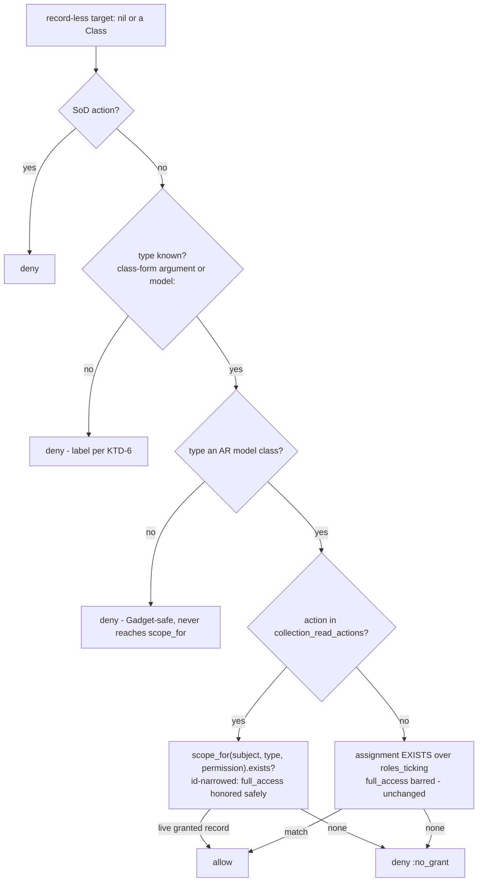

# Bounded full_access Collection Reads - Plan

## Goal Capsule

- **Objective:** Close #65 — a scoped full_access role opens the collection-read gates whose scoped list would show it records, by deriving the gate's answer from the same id-narrowed query the list uses. Gate and list agree by construction.
- **Authority hierarchy:** issue #65's "Done when" bullets > AGENTS.md hard rules (fail-closed resolver, decision order, vanilla Rails) > this plan > implementer discretion.
- **Immutable invariants:** default-deny and the decision order in `lib/current_scope/resolver.rb` (SoD veto → full_access → org-wide role → scoped role → record-less target → deny); no query that DECIDES may match scoped assignments against a full_access-inclusive role set unless it binds `resource:` to the exact record or answers in record ids (the `roles_granting` safety comment in `lib/current_scope/resolver.rb`); SoD's record-less refusal stays first and unconditional.
- **Stop conditions:** a test outside the enumerated flip set (U2) goes red → stop and re-derive rather than editing it green; any cross-type or create/mutation denial pin goes red → the change is the #49 escalation, revert; a design fork not covered by a KTD appears → surface it, don't improvise.
- **Delivery posture:** one branch → PR to `main` (PRs always), review gate
  `/dt-pre-pr-gate` (`/ce-code-review` → `/ie-review` → `/cubic-loop` local)
  before opening the PR — not `/run-review` alone (see AGENTS.md). The PR body
  must name the deliberately retired test assertions (issue requirement).

---

## Product Contract

### Summary

For a configurable set of collection-read actions (default `["index"]`), the record-less gate answers via the id-narrowed `scope_for` query instead of a boolean grant-match, so a scoped full_access role opens exactly the lists that would show it records. On by default in 0.3.0; an empty list restores 0.2 semantics.

### Problem Frame

"Owner of Report #7" — a scoped full_access grant — gets a 403 on `reports#index` while `scope_for(Report)` returns Report #7. The two halves of the per-record feature disagree out loud, and `CONCEPTS.md` records it as a live contradiction. The exclusion is deliberate: the record-less branch requires an explicit tick (`roles_ticking`) because honoring full_access in a boolean, record-unbound check would let one scoped grant open every record-less gate of its type — `reports#create` included. Plan 029 proposed exactly that relaxation after #50's type bind and three reviewers refuted it (withdrawn R4; `docs/solutions/workflow-issues/a-correction-rots-the-plan-it-fixes.md`). The refutation names the only safe shape: an answer derived from record ids, which is `scope_for`'s shape. This plan uses it.

### Requirements

Gate behavior:

- R1. A subject holding a scoped full_access grant on a live record opens that type's listed collection-read gates (nil form and class form), and the scoped list shows exactly the granted records.
- R2. The same subject stays denied on every record-less key whose action is not listed (`reports#create`, bulk actions, `new`) unless something other than the scoped full_access grant allows it.
- R3. A scoped grant on type A opens nothing of type B. For listed read actions the check inherits `scope_for`'s STI type predicate (a subclass gate no longer matches a sibling-subclass grant; the create-side base_class ceiling is unchanged).
- R4. Listed read actions answer strictly via the id-narrowed list query: no live granted record — deleted record, or no grant at all — means deny, for explicitly-ticked roles as much as for full_access. Empty list = 403, by construction.
- R5. SoD-listed actions keep their unconditional record-less refusal, evaluated before the new branch.
- R6. Shape guards run first, unchanged: a non-record-less target (String, unpersisted instance, arbitrary object), an unknown type, and a non-ActiveRecord type (the `Gadget` PORO) all deny before the new branch executes — `scope_for` is never called with a non-AR class.

Configuration:

- R7. New `config.collection_read_actions`, default `["index"]`. The empty list restores 0.2 record-less semantics byte-for-byte. Assignment normalizes members to strings so `[:index]` cannot silently disable the feature.

Diagnostics:

- R8. The `:model_undeclared` label stays honest under the new behavior: for a listed read action, a scoped grant under a full_access-inclusive role set qualifies the deny for the label (declaring the model may now fix it); for non-listed actions the predicate keeps `roles_ticking`. Nudge wording stays conditional — the predicate cannot verify record liveness.

Documentation:

- R9. `CONCEPTS.md`'s "one such disagreement is live" paragraph is deleted (it no longer is), and the record-less target, full access, gate, and scoped list entries gain the read-action qualifier (for listed reads, the gate's answer derives from the list). `resources/DESIGN.md` §3.4 and §3.7, README (configuration + record-less narrative), the install generator's initializer template, `CHANGELOG.md` (with the "Upgrade-visible" callout convention), and `STATUS.md`'s 0.3.0 section are updated in the same change (drift rule). STATUS's stale test-pin line references are corrected while touching it.

Purity and cost:

- R10. The resolver stays a pure decision function: the new branch reads config the way `sod_action?` does, takes `model:` as a parameter, writes nothing, and adds no memoization. The "deliberately not memoized" comment is updated to describe the heavier `scope_for` query it now covers.

### Acceptance Examples

- AE1. Given Alice holds a scoped full_access role on Report #7 and no org-wide role, when she opens `reports#index`, then the gate allows and the list contains exactly Report #7. (Done-when 1)
- AE2. Given the same Alice, when she attempts `reports#create` (or any record-less Report key not in `collection_read_actions`), then she is denied. (Done-when 2)
- AE3. Given the same Alice, when she opens `documents#index` (declared model `Document`), then she is denied. (Done-when 3)
- AE4. Given Alice's only grant is a scoped role (ticked or full_access) on a Report that has since been destroyed, when she opens `reports#index`, then she is denied — the gate agrees with her empty list.
- AE5. Given a host sets `config.collection_read_actions = []`, when any record-less check runs, then behavior is identical to 0.2 (the pre-#65 pins hold).
- AE6. Given `approve` is in both `sod_actions` and (mis)listed in `collection_read_actions`, when a record-less `reports#approve` check runs, then it is denied — SoD's refusal wins.

### Scope Boundaries

In scope: the resolver's record-less read-action branch, the new config key, the label predicate, tests, and the R9 documentation sweep.

Deferred to Follow-Up Work:

- Orphaned scoped-assignment rows (grant on a destroyed record) become fully inert under R4 but still render in the console and still feed the report task's advice. File a follow-up issue for reaping/labeling them; verify now (cheaply, during U3) that the console does not 500 rendering a grant whose resource is gone.
- Custom record-less read actions (`export`, `search`) are supported by the config list but not exercised by dummy-app surfaces; a worked example beyond the initializer comment is docs-only follow-up.

Outside this change's identity: per-record decisions and `scope_for` itself (both already correct — untouched); the Guard's hook plumbing (`current_scope_model` already threads); version bump and release mechanics (version.rb already reads 0.3.0; the release gate owns tagging); the showcase repo.

---

## Planning Contract

### Key Technical Decisions

- KTD-1. **The gate asks `scope_for(subject:, model:, permission:).exists?` for listed read actions.** It is the only full_access-safe shape: the answer is derived from record ids joined against the live table, satisfying the `roles_granting` safety condition, inheriting STI's type predicate, and making gate/list agreement structural rather than hand-synced. **Rejected:** a `roles_granting` boolean EXISTS over scoped assignments — plan 029's withdrawn R4, the #49 escalation shape, refuted by three reviewers; a hand-rolled id query duplicating `scope_for`'s construction — a second copy that drifts.
- KTD-2. **One config key, `collection_read_actions`, carries both approved forks** (on-by-default, opt-out): a global list of action names, default `["index"]`, empty = off. Matching keys on the action segment only (`permission.split("#").last`), the `sod_actions` idiom — controller-agnostic, so a class-form check from another controller opens exactly when that gate's list would show records (agreement holds cross-controller). **Rejected:** a separate boolean + list (two knobs for one decision); per-controller declaration (a second declaration surface; `current_scope_model` can already branch on `action_name` when a host needs per-action types); hardcoded `index` (custom list actions are real and the config list costs nothing).
- KTD-3. **Strict replacement, not additive:** for listed actions the `scope_for` answer IS the branch — explicitly-ticked roles route through it too. An empty list means 403 even where the old branch admitted into an empty page (deleted granted record). Fail-closed tightening, and the only reading under which "agree by construction" is true. This accepts the issue's named catch — for listed reads the gate now derives its answer from the list, a deliberate qualification of "the gate admits; the scoped list narrows" — and U4 updates the CONCEPTS gate/scoped-list entries to say so. **Rejected:** additive widening (keeps the gate/list disagreement alive at the deleted-record edge).
- KTD-4. **The new accessor normalizes on write** (`Array(value).map(&:to_s)`): a host writing the natural `[:index]` must not silently revert the fix to the ticking branch. Deliberate deviation from `sod_actions`' plain accessor — that footgun is grandfathered there, not a precedent to copy into a new key. Normalize, don't raise: every input has an unambiguous meaning.
- KTD-5. **`current_scope_model` stays a trusted declaration.** With full_access honored through `scope_for`, a wrongly-declared model (WidgetsController declaring `Report`) plus a scoped full_access Report grant now opens `widgets#index` — a misconfiguration that previously failed closed. Accepted: the record hook already carries identical trust (a wrong `current_scope_record` mis-grants today), and the declaration is one greppable line of host code. Stated loudly in the resolver comment, the Guard's hook doc, and README rather than guarded against. (See Risks.)
- KTD-6. **Label predicate widens only for listed read actions.** `record_less_denied_for_unknown_type?` keeps `roles_ticking` for non-listed actions (declaring a model would fix nothing there — full_access stays barred) and widens to the full_access-inclusive set for listed actions (declaring the model now genuinely may fix the deny). Wording stays conditional ("if the grant is of that type…") because the predicate runs without a model and cannot check record liveness — a deleted-record grant makes "declare the model and this allows" false, so the label must not promise. **Rejected:** keeping `roles_ticking` everywhere (the label would stay silent for the exact host #65 exists to help).

### High-Level Technical Design

The record-less path after this change (directional, not implementation spec):

Everything above the branch is today's code, order preserved. The load-bearing asymmetry: for a full_access grant, `scope_for`'s role match is key-independent — the answer depends only on the declared type and record liveness. For ticked grants the key still constrains. That asymmetry is why the action list does real safety work (create has no list to derive from) and why KTD-5's trust statement matters.

### Assumptions and constraints

- Guard and advisory paths need no changes: `current_scope_model` already threads `model:` to `decide`, and `allowed_to?` threads the same ambient model (`lib/current_scope/permissions.rb`), so views agree with the gate automatically.
- No new denial reason and no header change: the new allow is an ordinary allow (nil reason); the deny stays `:no_grant` / `:model_undeclared`.
- Report mode needs no code change: the previously-surveyed `:no_grant` denials for this case become genuine allows, so its survey shrinks — noted in CHANGELOG, not special-cased.
- Cost is accepted and pre-licensed: the listed-action check swaps a single-table EXISTS for an id-subquery EXISTS against the model table, paid only by scoped-only subjects on record-less read checks (org-wide and full_access org roles short-circuit earlier). The existing "revisit if it shows up in a profile" stance stands.

### System-Wide Impact

Surfaces checked against the codebase; the first three are verified unaffected and are stated here so a reviewer does not have to re-derive them.

- **Views and helpers agree automatically.** The advisory path (`allowed_to?` in views/components) threads the same ambient declared model to the same resolver branch, so links and gates cannot diverge; no helper changes.
- **The management console is unaffected.** No console view or controller keys off `:index`-style collection checks — console entry answers to its own org-wide full-access check (`:not_full_access`), which report mode and this change both leave alone.
- **Impersonation stays consistent.** `scope_for` and the gate both read the effective subject, and the mutation guard blocks non-GET requests while impersonating before the resolver runs. Consequence worth one doc line: a host adding a non-GET action to `collection_read_actions` still finds it blocked under impersonation — intended, and ordering is by design.
- **Report mode:** the previously-surveyed scoped-full_access index denials become genuine allows, so the `access.would_deny` survey shrinks (CHANGELOG sentence, no code).
- **Conceptual model:** for listed reads the gate's answer is now derived from the list. "The gate admits; the scoped list narrows" gains a qualifier rather than an exception — the gate still only admits or refuses; it just derives that admission from record membership (KTD-3, U4).

---

## Implementation Units

### U1. Config key with normalizing writer

- **Goal:** `config.collection_read_actions` exists, defaults to `["index"]`, normalizes to strings, and is documented where hosts look first.
- **Requirements:** R7.
- **Dependencies:** none.
- **Files:** `lib/current_scope/configuration.rb`, `lib/generators/current_scope/install/templates/initializer.rb`, `test/configuration_test.rb`.
- **Approach:** `attr_reader` + writer that assigns `Array(value).map(&:to_s)` (KTD-4); default in `initialize`. Initializer template gains a stanza in the style of the existing keys: what the list does, that `[]` opts out and what behavior that restores, and the KTD-5 trust note in one line.
- **Patterns to follow:** `sod_actions` placement and comment voice; the validating-writer precedents for where writer methods sit.
- **Test scenarios:** default is `["index"]`; `[:index]` and `%i[index export]` normalize to strings; a bare `"index"` wraps to `["index"]`; `nil` and `[]` both yield `[]` (opted out); assignment result is what `include?`-style matching sees.
- **Verification:** `bin/rails test test/configuration_test.rb` green; `bin/rubocop` clean.

### U2. Resolver read-action branch, label widening, and the unit-test migration

- **Goal:** listed read actions answer via `scope_for(...).exists?`; everything else in the record-less path is byte-for-byte; the pinned suite is migrated deliberately, not incidentally.
- **Requirements:** R1–R6, R8, R10.
- **Dependencies:** U1.
- **Files:** `lib/current_scope/resolver.rb`, `test/collection_scope_gate_test.rb`, `test/scope_for_test.rb`.
- **Approach:** in `record_less_scoped_grant?`, after the existing guards in their existing order (record-less shape → SoD refusal → type known → type is an AR model class), branch on a new private `collection_read_action?(permission)` (the `sod_action?` idiom): listed → `scope_for(subject:, model: type, permission:).exists?`; not listed → the existing `roles_ticking` EXISTS, untouched. Widen `record_less_denied_for_unknown_type?` per KTD-6 (listed actions match assignments against the full_access-inclusive set; others keep `roles_ticking`). Comment updates in the same commit: the decision-order header (step 5 gains the read-action clause), the `record_less_scoped_grant?` block (the "#65 tracked gap" paragraph becomes the shipped rule), the `roles_granting` safety comment names its fourth caller the way PR #72 named the first three, and the "deliberately not memoized" paragraph describes the new query's cost honestly.
- **Execution note:** migrate the pins in the same commit as the branch — they assert the old behavior and cannot be staged separately. Before editing, re-derive the expected flip set from the rule "listed read action + type matches a live-record grant under a full_access-inclusive role"; the enumeration below is the expected result, and any test outside it going red is a stop condition.
- **Enumerated pin flips (all in `test/collection_scope_gate_test.rb`):** the #65 tracker test (scoped full_access on own type's index, currently asserting deny) flips to allow; in the app-wide bar loop, the class-form assertions for `reports#index` and `projects#index` against `record: Report` flip (class form carries the type; the key's controller is irrelevant to a full_access match — KTD-2), while all `record: nil` (no model) and all create/`anything` assertions stay red-line denials; the "full_access with explicit permission rows is still barred" test flips its class-form read assertion (both the leftover row and the full_access wildcard now legitimately match) and keeps its nil-form and per-record assertions; the test file's "R7a"-prefixed label test — that prefix is #50's requirement numbering, not this plan's R-IDs; the governing requirement here is R8 — flips its "full_access grant stays :no_grant" assertion to `:model_undeclared` for the listed action per KTD-6. Test names that state the old rule ("app-wide", "still barred") are reworded to state the new one.
- **Test scenarios** (new pins, same files):
  - Covers AE1: scoped full_access on a live Report opens `reports#index` — nil form with `model: Report` and class form — and `scope_for` returns exactly the granted record (extend the gate/list agreement matrix in `test/scope_for_test.rb`).
  - Covers AE2: same subject denied `reports#create`, `reports#new`-shaped keys, and the bulk `widgets#anything` — the read/write split pinned with an explaining comment (a future "fix" of the asymmetry must be deliberate).
  - Covers AE3: full_access on Report denied `documents#index` with `model: Document` (cross-type), nil and class forms.
  - Covers AE4: ticked role and full_access role each granted on a destroyed record → `reports#index` denies (`:no_grant`) — the strict-agreement tightening, pinned as intended.
  - Covers AE5: with `collection_read_actions = []`, the pre-#65 assertions hold verbatim (run the flipped cases under opt-out and assert the old denials).
  - Covers AE6: an action in both `sod_actions` and `collection_read_actions` still refuses record-less (SoD first).
  - STI: grant on an `Invoice` opens `documents#index` under `model: Document` and `model: Invoice` (base_class normalization); grant on a base-`Document` sibling does NOT open an `Invoice`-declared read gate (the STI predicate tightening) while `documents#create` keeps the base-class ceiling — the second read/write split pin.
  - Shape guards: `Gadget` (non-AR `Scopeable` PORO) as class form and as `model:` on a listed action → deny, never a NoMethodError (pins that the AR-class guard precedes the new branch); String/unpersisted/garbage targets unchanged.
  - Label: undeclared model + listed action + full_access-only scoped grant → `:model_undeclared`; undeclared model + non-listed action + full_access-only → `:no_grant`; existing ticking-grant label cases unchanged.
  - Purity: extend the existing no-writes and parameter-purity tests to cover the new branch (repeat calls with different models, `assert_no_difference` on events/assignments).
- **Verification:** full engine suite green (`bin/rails test`); the Verification Contract's mutation checks behave as specified; `bin/rubocop` clean.

### U3. Integration coverage: default-on end-to-end, opt-out, report-mode survey

- **Goal:** the behavior is proven through the Guard/request stack, not just the resolver unit, in both config postures.
- **Requirements:** R1, R2, R4, R7.
- **Dependencies:** U2.
- **Files:** `test/integration/collection_read_gate_test.rb` (new), `test/dummy/app/controllers/reports_controller.rb` (read-only reference — already declares `current_scope_model` and renders `scope_for`).
- **Approach:** mirror `test/integration/report_only_test.rb`'s shape (sign-in header helper, `setup`/`teardown` config restore). Default posture: a scoped-full_access-only subject GETs `/reports` → 200 with exactly their record rendered; POSTs → 403. Opt-out posture (`collection_read_actions = []`): the same GET → 403 with `X-Current-Scope-Reason: no_grant` — the 0.2 behavior. Report mode: with the fix on, the formerly-surveyed index check emits no `access.would_deny` event (it is a genuine allow now).
- **Test scenarios:** the three postures above; plus the console render safety check from Scope Boundaries — a scoped assignment whose resource was destroyed renders in the console assignments view without a 500 (one system-or-integration assertion; if it fails, that becomes part of the follow-up issue's scope, not this PR's).
- **Verification:** `bin/rails test test/integration/collection_read_gate_test.rb` green; suite green.

### U4. Documentation sweep

- **Goal:** every surface that states the record-less rule states the new one; the upgrade is loud.
- **Requirements:** R9.
- **Dependencies:** U2 (documents shipped behavior).
- **Files:** `CONCEPTS.md`, `resources/DESIGN.md`, `README.md`, `CHANGELOG.md`, `STATUS.md`.
- **Approach:** delete `CONCEPTS.md`'s "one such disagreement is live" sentence (Done-when 4) and qualify the record-less target, full access, gate, and scoped list entries with the read-action rule (the gate/list "admits vs narrows" framing gains its qualifier, per KTD-3); update DESIGN §3.4's "a tick must be explicit / full_access is not honored here" bound and §3.7's step-5 text to the qualified rule; README configuration section documents `collection_read_actions` (the initializer stanza from U1 is the reference; README carries the narrative and the KTD-5 trust note) and the record-less narrative gains the read-action clause; CHANGELOG `## [Unreleased]` gains Added (config key) and Changed (behavior) entries with the "Upgrade-visible — who this changes:" callout naming the widening: scoped full_access holders gain working index pages on upgrade, and hosts who want 0.2 semantics set the list empty; STATUS 0.3.0 section marks the #65 half done and its stale pin line-references are corrected to the current test locations.
- **Test scenarios:** none — documentation unit; correctness is the U2/U3 suites plus the drift rule (docs land in the same PR as the behavior).
- **Verification:** every R9 surface diffed in the PR; grep for "disagreement is live" returns nothing; CHANGELOG callout present.

---

## Verification Contract

| Check | Command | Proves |
|---|---|---|
| Lint | `bin/rubocop` | omakase-clean before commit (AGENTS.md) |
| Engine test DB | `RAILS_ENV=test bundle exec rake db:create db:migrate` (repo root; one task per invocation) | suite can run |
| Unit + integration | `bin/rails test` | R1–R8, R10; all AE pins |
| System | `bin/rails test:system` | CI-enforced; no engine-view change expected — a failure here means unintended UI impact |

Mutation checks — each must go red if reverted or respelled:

- Revert the U2 branch (restore `roles_ticking`-only) → the AE1 pins and the flipped tracker test go red.
- Respell the listed-action query as an assignment-level EXISTS over a full_access-inclusive set (`.exists?`/`.any?`/`.count`, inlined union — any boolean-permit form) → the AE2 create denial, AE3 cross-type, and AE4 deleted-record pins go red. These pins are the durable tripwire the issue asks for; the grep for `roles_granting` + `.exists?` is a hint, not the invariant.
- Drop the writer normalization → the `[:index]` configuration test goes red.
- Move the new branch above the AR-class guard → the `Gadget` pin crashes red.

Scope proof: the PR diff must touch `lib/current_scope/resolver.rb` and `lib/current_scope/configuration.rb`, and must NOT touch `scope_for`'s query construction, `scoped_grant?`, or the SoD path (`git diff` inspection; the inverse of plan 030's no-resolver-diff check).

No browser QA required: no engine view changes (AGENTS.md rule 4 is conditional on UI changes). Optional post-merge sanity: the showcase app's scoped-owner flow now shows the index.

---

## Definition of Done

- All four issue "Done when" bullets hold as green tests: AE1 (owner opens index, sees only their record), AE2 (create still denied), AE3 (type B closed), and the `CONCEPTS.md` deletion shipped.
- Full suite green, `bin/rubocop` clean, CI green (`test` + `test:system` jobs).
- The R9 documentation sweep landed in the same PR (drift rule), including the CHANGELOG upgrade-visible callout.
- The PR body opens with plain-language What/Why/How and explicitly names each retired/reworded pin from U2's enumerated flip set with its one-line justification (issue requirement).
- Follow-up issue filed for orphaned scoped-assignment rows (console rendering/reaping — Scope Boundaries).
- No abandoned-attempt code in the diff; the review gate (`/dt-pre-pr-gate`:
  `/ce-code-review` → `/ie-review` → `/cubic-loop` local) ran on the PR-head
  SHA and findings are resolved.

---

## Risks

- **Trusted-declaration widening (KTD-5).** A wrong `current_scope_model` plus a scoped full_access grant on the declared type now opens that controller's listed reads where it previously failed closed. Mitigation: loud comments at the declaration seam and README; the declaration is one greppable line reviewed like the record hook. Accepted residual risk — consistent with the engine's existing hook-trust model.
- **Default-on widening at upgrade.** Every scoped full_access holder gains working index pages when a host bumps to 0.3.0. This is the fix, but in an authorization engine a silent widening is a risk by definition. Mitigation: the CHANGELOG callout names it, the minor-version bump keeps `~> 0.2.0` pins from picking it up, and the opt-out is one config line.
- **Flip-set drift.** The most likely implementation error is editing the two named pins and being surprised by the other two (the app-wide loop's `projects#index` class form; the explicit-rows test). Mitigation: U2's enumerated flip set plus the stop condition — any red outside it halts work.
- **Report-mode survey shrinkage.** Hosts mid-adoption see fewer `access.would_deny` rows for scoped-full_access subjects; the report task may also name a grant already held on a destroyed record (inert). Both are honest but surprising — one CHANGELOG sentence covers the first; the second rides the follow-up issue.

---

## Sources & Research

- GitHub issue #65 — problem statement, refutation of the type-bind shortcut, "Done when" (this plan's acceptance set).
- `docs/plans/2026-07-15-029-feat-thread-collection-model-plan.md` KTD-3 — the withdrawn `roles_granting` relaxation and its three-reviewer refutation; `docs/solutions/workflow-issues/a-correction-rots-the-plan-it-fixes.md` and `plan-code-sketches-are-intent-not-code.md` — the institutional learnings validating the `scope_for` shape and the read-the-definition discipline.
- `lib/current_scope/resolver.rb` — the `roles_granting` safety condition (the invariant this plan's query satisfies), `record_less_scoped_grant?`'s guard order, `scope_for`'s id-narrowed construction, the not-memoized cost stance.
- `test/collection_scope_gate_test.rb` and `test/scope_for_test.rb` — the pinned behavior being migrated; `test/integration/report_only_test.rb` — the integration/config-toggle pattern U3 mirrors.
- `lib/current_scope/configuration.rb` — accessor and validating-writer precedents; `lib/generators/current_scope/install/templates/initializer.rb` — the config reference surface.
- `STATUS.md` 0.3.0 section — release framing (#50 + #65 ship together); notes the stale pin references corrected in U4.
