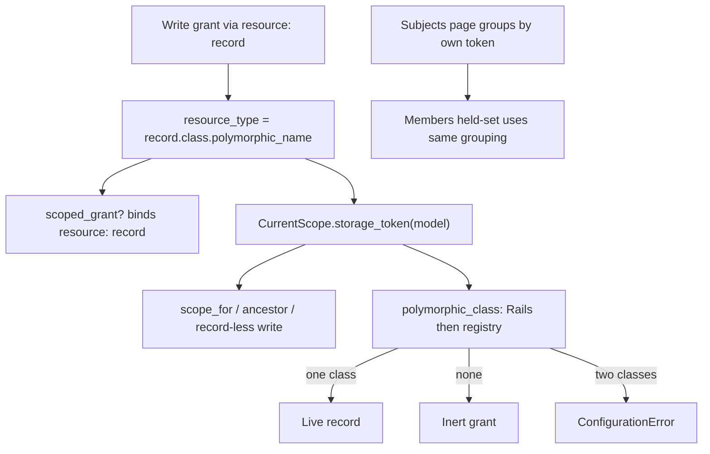

# Consistent Polymorphic Storage Tokens - Plan

## Goal Capsule

- **Objective:** One stored type token per model. A custom `polymorphic_name` means the same thing on a single-record check, a collection list, a record-less write check, reverse lookup, and the members candidate list.
- **Authority hierarchy:** this plan → issue #155 → fail-closed resolver order in `resources/DESIGN.md` §3.7 and `lib/current_scope/resolver.rb` → #151 "never guess an owner from descendants".
- **Execution profile:** test-first on the token-agreement pin. Add a dummy model that overrides `polymorphic_name` before changing query sites.
- **Stop conditions:** if a change would let a grant stored under one token open a record of another class, stop and re-read KTD-1. If reverse lookup would attach a stale token to a live class, keep the grant inert.
- **Tail ownership:** engine correctness only. No rake task, no new config surface unless KTD-2's explicit map is needed for a token Rails cannot reverse.

---

## Product Contract

> **Product Contract preservation:** new capability, no upstream requirements doc (`product_contract_source: ce-plan-bootstrap`). Scoped from issue #155 and the PR #153 review deferral in `STATUS.md`.

### Summary

Make a custom storage token first-class and consistent. Do not document custom tokens as unsupported. Do not scan descendants to guess an owner.

### Problem Frame

A grant stores `resource_type` / `subject_type` as the associated class's `polymorphic_name`. Collection queries and the record-less write arm still pass `base_class.name` into `granted_ids`. The members page filters held subjects by the configured class token only.

For the default class name those strings match, so the suite stays green. A host that overrides `polymorphic_name` (or shortens it with `store_full_class_name = false`) gets a grant that works on the record and disappears from the list. Reverse lookup of a custom token is inert after #153, on purpose. The members add-list can offer a holder who already holds the role under a subclass token.

None of these escalate privilege today. They disagree with each other. That disagreement is the bug.

### Requirements

**Token identity**

- R1. The stored type token for a model is that model's `polymorphic_name`. Write and read derive it the same way.
- R2. `scope_for`, ancestor collection arms, and the record-less non-read arm query `granted_ids` with that token, not `base_class.name`.
- R3. A per-record grant and its collection scope cannot silently disagree on the same subject, permission, and record.

**Reverse lookup**

- R4. `CurrentScope.polymorphic_class` still returns nil for a token it cannot reverse. Callers keep treating nil as inert.
- R5. A custom token that the host (or a loaded model) maps to exactly one class resolves to that class. Two classes that claim the same token fail loud at boot or reload, not by picking one.
- R6. Reverse lookup never scans `ActiveRecord::Base.descendants` to infer an owner. That guess is the #151 harm.

**Members list**

- R7. The members candidate query treats a subject as already holding the org-wide role when any of that subject's own tokens match, the same way `SubjectsController` groups assignments.

**Safety ceiling**

- R8. The R6a STI ceiling stays: a record-less non-read still binds to the base class table so a sibling subclass cannot leak. Only the *type string* used to find grant rows changes.
- R9. Parent-chain walk keys that identify a class in the hop loop may keep using `base_class.name`. They are not grant storage tokens.

### Actors

- A1. Host whose model overrides `polymorphic_name` or sets `store_full_class_name = false`.
- A2. Admin using the role members page with an STI or custom-token subject.

### Key Flows

- F1. Custom-token grant agrees
  - **Trigger:** Host grants a scoped role on a record whose class overrides `polymorphic_name`.
  - **Steps:** Write stores the custom token. Per-record allow is true. `scope_for` on that model includes the record. Record-less write check for that type sees the same grant ids.
  - **Outcome:** Gate and list agree. Covers R1, R2, R3.
- F2. Unmapped custom token stays inert
  - **Trigger:** A stored token cannot be reversed (model gone, or not yet mapped).
  - **Outcome:** `polymorphic_class` is nil. Preload and console treat the row as inert. No other live record is named. Covers R4, R6.
- F3. Members does not re-offer a holder
  - **Trigger:** An STI subclass subject with its own token already holds the role org-wide.
  - **Outcome:** That subject is listed as a holder and is absent from the add candidates. Covers R7.

### Acceptance Examples

- AE1. Covers F1. Given a dummy resource `TokenDocument` whose `polymorphic_name` is `"token_docs"` and a scoped grant is written on that record, when `scope_for` is asked for that model and permission, then the record is in the relation and `allow?` on that record is true.
- AE2. Covers F2. Given no mapping for `"uuid_people"`, when `polymorphic_class("uuid_people")` runs, then it returns nil (existing pin in `test/uuid_key_collision_test.rb` stays true until U2 registers the loaded class).
- AE3. Covers F3. Given a subclass holder stored under a token other than `subject_class.polymorphic_name`, when an admin opens members, then that holder is not in the add list.

### Success Criteria

Default models (`User`, `Document` / `Invoice`) keep today's answers. A custom-token dummy is green on list, gate, reverse lookup, and members. `bin/db` is green on SQLite, PostgreSQL, and MySQL. RuboCop is clean.

### Scope Boundaries

**In scope**

- One storage-token helper and every grant-query site that currently passes `base_class.name` as a type.
- Reverse-resolution that can name a loaded custom token without descendant guessing.
- Members candidate filter parity with the subjects page.

**Deferred to Follow-Up Work**

- Issue #150 (resource primary-key matching on business keys).
- Issue #136 (eager per-parent grant queries).

**Outside this product's identity**

- Changing resolver decision order.
- Treating an unmapped token as a permit.
- A persisted mapping table. Boot/reload registry plus an optional explicit host map is enough.

---

## Planning Contract

### Key Technical Decisions

- KTD-1 — One helper is the only grant type key. Add `CurrentScope.storage_token(klass)` that returns `klass.polymorphic_name`. Every `granted_ids(..., type: ...)` call site in `lib/current_scope/resolver.rb` uses it. Re-derive at implementation time: today those sites are `scope_for`, `ancestor_scope_for`, and the record-less non-read arm. Do not change `scoped_grant?`, which already binds `resource: record` and therefore already writes and reads Rails' token. Write side and read side of this helper must be the same method. A test that overrides `polymorphic_name` and asserts list/gate agreement is the proof.

- KTD-2 — Reverse lookup is a closed map. Keep `owner.polymorphic_class_for(type)` as the first attempt (Rails' own reverse). On `NameError`, consult a registry of `token => class`. Rebuild on `to_prepare` (dev reload) and again on `after_initialize` when `app.config.eager_load` is true (production). That split already exists for ParentChain. Merge auto-detected custom tokens with optional `config.polymorphic_class_names`. If the same token maps to two different classes, raise. Config may only restate the same class, or name a token no loaded model claims. At *lookup* time, never walk `descendants`. At *rebuild* time, enumerating eager-loaded models (or a Scopeable-style self-register) is allowed. Zero matches stay nil (inert).

- KTD-3 — Members excludes a candidate when any held assignment matches that candidate's own token and id. Build held keys from `@org_holders` as `[subject_type, subject_id.to_s]`. A candidate is already held when that pair equals `[candidate.class.polymorphic_name, candidate.id.to_s]`. Keep `candidate_key_as_text` for the SQL `NOT IN` / `NOT EXISTS` comparison. Do not drop `subject_type` from the pair (ids can collide across types).

- KTD-4 — Do not migrate existing rows. Default installs store `"User"` / `"Document"`, which equal both `name` and `polymorphic_name`. A host that already overrode `polymorphic_name` and somehow got grants under `base_class.name` is the fail-closed case this plan does not invent a data rewrite for. After this ships, new grants and new queries use the same token.

- KTD-5 — Parent-chain loop keys stay on `base_class.name`. `lib/current_scope/parent_chain.rb` uses that string as a hop identity, not as a `resource_type` lookup. Changing it would be a different bug. Only pass `storage_token(parent)` into `granted_ids`.

### High-Level Technical Design

Default STI (`Invoice` < `Document`) already stores `"Document"`. `Invoice.polymorphic_name` is `"Document"` unless overridden. Switching query sites from `base_class.name` to `polymorphic_name` is a no-op for that dummy, which is why `test/scope_for_sti_test.rb` stays the A7 pin.

### Assumptions

- Custom tokens are rare. Supporting them is cheaper than documenting a silent hole.
- Auto-registering loaded models that override `polymorphic_name` is enough for the dummy and for a host that eager-loads. The optional config map exists for tokens that must resolve before the model file loads.

### Sequencing

U1 (helper + query sites) before U2 (reverse map), because U2 is only useful once queries look up the token U1 writes. U3 (members) is independent of U2. U4 (docs) last.

---

## Implementation Units

### U1. Storage token helper and grant query sites

- **Goal:** Collection and record-less write lookups use `polymorphic_name`.
- **Requirements:** R1, R2, R3, R8, R9
- **Dependencies:** none
- **Files:**
  - `lib/current_scope.rb` (helper)
  - `lib/current_scope/resolver.rb` (three `granted_ids` type arguments)
  - `test/dummy/app/models/token_document.rb` (stable custom-token *resource*; leave `UuidUser` for subject/members)
  - `test/scope_for_custom_token_test.rb` (new)
  - `test/scope_for_sti_test.rb` (keep as A7 pin)
- **Approach:** Add `CurrentScope.storage_token(klass)`. Replace `model.base_class.name` / `parent.base_class.name` / `type.base_class.name` only where they are passed as `granted_ids`'s `type:`. Leave `collection_type?` and `storable_key?(type.base_class)` on the class object, not the token string. Add a dummy that overrides `polymorphic_name` to a non-constant string and pin list/gate agreement.
- **Execution note:** Write the custom-token agreement test first. It must fail on current `main`.
- **Patterns to follow:** `test/scope_for_sti_test.rb` for agreement; `test/support/uuid_user.rb` for a second subject class.
- **Test scenarios:**
  - Happy: scoped grant on the custom-token record appears in `scope_for` and `allow?` is true.
  - Happy: default `Invoice` / `Document` A7 cases still pass unchanged.
  - Edge: empty grant set still returns an empty chainable relation.
  - Error: a grant stored under `"Document"` does not open a custom-token model that is not that class.
  - Integration: record-less non-read for the custom-token type sees the same ids as `scope_for` would list.
  - Integration: a scoped grant on a custom-token *parent* appears in `scope_for` for the child. Parent-chain hop identity remains `base_class.name`.
- **Verification:** The new test fails before the helper is wired, then passes. Full `bin/db` unit set stays green.

### U2. Reverse-resolution registry

- **Goal:** A loaded custom token reverses to its class. An ambiguous or unknown token does not guess.
- **Requirements:** R4, R5, R6
- **Dependencies:** U1
- **Files:**
  - `lib/current_scope.rb` (`polymorphic_class`)
  - `lib/current_scope/configuration.rb` (optional explicit map writer)
  - `lib/current_scope/engine.rb` (`to_prepare` rebuild plus `after_initialize` when `eager_load`)
  - `app/models/concerns/current_scope/storable_keys.rb` (`current_scope_resolved_record` must `klass.find_by` after a mapped token, not only `public_send(side)`)
  - `test/uuid_key_collision_test.rb` (update the inert pin)
  - `test/configuration_test.rb` (ambiguous map raises)
- **Approach:** After Rails `polymorphic_class_for` raises `NameError`, look up the rebuilt map. Rebuild on `to_prepare` and on eager-load `after_initialize` (KTD-2). Merge config and auto-detect; two different classes for one token raise. After a non-nil `klass` and `canonical_key?`, `current_scope_resolved_record` loads with `klass.find_by(klass.primary_key => id)`. The existing inert test becomes: unmapped leftover token stays nil; mapped `TokenDocument` resolves through both preload and the checked reader.
- **Patterns to follow:** `config.to_prepare` resets already in `engine.rb` (`reset_catalog!`, `validate_subject_key!`). Validating writers in `configuration.rb`.
- **Test scenarios:**
  - Happy: loaded dummy with `polymorphic_name` `"uuid_people"` reverse-resolves to that class.
  - Edge: token absent from the map returns nil.
  - Error: two classes claiming `"dup"` raise `ConfigurationError` on reload.
  - Error: lookup does not call `descendants`. Token `"old_token"` in the DB, no loaded model returns that `polymorphic_name`, config empty → `polymorphic_class` is nil.
  - Error: two loaded claimants of one token raise on rebuild.
- **Verification:** Preload of a grant with a mapped custom token labels a live record. An unmapped token stays inert.

### U3. Members candidate filter uses each subject's token

- **Goal:** The add-list does not offer a subject who already holds the role under another token.
- **Requirements:** R7
- **Dependencies:** none
- **Files:**
  - `app/controllers/current_scope/roles_controller.rb`
  - `test/integration/role_members_test.rb`
- **Approach:** Exclude a candidate whose `[polymorphic_name, id]` pair is in the held set from `@org_holders` (KTD-3). Keep the text cast.
- **Patterns to follow:** `app/controllers/current_scope/subjects_controller.rb` grouping; existing UUID members test.
- **Test scenarios:**
  - Happy: default `User` members behaviour unchanged (Alice held, Bob offered).
  - Happy: UUID `UuidUser` members test still excludes the holder.
  - Edge: a subject whose token is not `subject_class.polymorphic_name` and who already holds the role is a holder, not a candidate.
- **Verification:** `test/integration/role_members_test.rb` green, including the new subclass/custom-token case.

### U4. Docs and board

- **Goal:** Hosts learn that custom tokens are supported and must stay unique.
- **Requirements:** R1, R5
- **Dependencies:** U1, U2, U3
- **Files:**
  - `UPGRADING.md`
  - `CHANGELOG.md`
  - `docs/guides/checking-permissions.md`
  - `docs/guides/configuration-reference.md` (only if the explicit map ships)
  - `docs/site/upgrading.md` / `docs/site/configuration.md` (mirrors)
  - `STATUS.md`
- **Approach:** Record the token rule in one sentence: stored type is `polymorphic_name`; two classes may not share a token. Note the members fix. Do not claim assignment export.
- **Test expectation:** none. Docs only.
- **Verification:** Drift rule: docs and code land in the same commit as the behaviour they describe.

---

## Verification Contract

| Gate | Command / signal | Proves |
|---|---|---|
| Custom-token agreement | `bin/rails test test/scope_for_custom_token_test.rb` | R1–R3 |
| STI pin unchanged | `bin/rails test test/scope_for_sti_test.rb test/collection_scope_gate_test.rb` | R8, A7 |
| Reverse map | `bin/rails test test/uuid_key_collision_test.rb test/configuration_test.rb` | R4–R6 |
| Members | `bin/rails test test/integration/role_members_test.rb` | R7 |
| Adapters | `bin/db` (SQLite, PostgreSQL, MySQL) | #151 casts still hold |
| Lint | `bin/rubocop` | house style |

No system-test change is required unless a members screenshot selector breaks.

---

## Definition of Done

- U1–U4 complete. Abandoned probe models removed from the dummy.
- Per-record allow and `scope_for` agree for default STI and for one custom-token model.
- Unmapped tokens stay inert. Ambiguous tokens raise.
- Members does not re-offer a holder stored under a non-configured token.
- Docs and `STATUS.md` name issue #155 as planned or shipped, not as an open deferral without a plan.

### System-Wide Impact

Authorization read path only. No schema change. No public rake or document format.

### Risks

- Wiring `storage_token` into a parent-chain *loop key* by mistake would change hop identity. U1's file list is the grant-query sites only.
- Auto-register on `to_prepare` alone misses production models (`to_prepare` runs before eager load). Rebuild again when `eager_load` is on.

### Sources

- Issue #155; PR #153 deferral in `STATUS.md`.
- `lib/current_scope.rb` `polymorphic_class` (inert on `NameError`).
- `lib/current_scope/resolver.rb` `granted_ids` callers.
- `app/controllers/current_scope/subjects_controller.rb` per-instance token grouping.
- `test/scope_for_sti_test.rb`, `test/uuid_key_collision_test.rb`.
- `docs/solutions/workflow-issues/plan-code-sketches-are-intent-not-code.md`: re-derive helper safety at implementation time.
