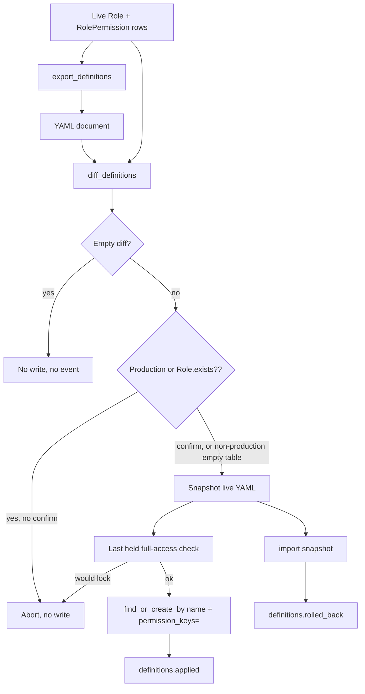

# Portable Role Definition Export Import - Plan

> **Revised 2026-08-22.** Issue #158 (subject identity) merged to main as 55f1c6b and no longer gates anything here. Assignment export (issue #156 v2) now waits only on issue #150 (primary keys), planned separately as docs/plans/2026-08-22-001-fix-scoped-grant-primary-keys-plan.md. Every file path, method name, and lock claim below was re-verified against main at 55f1c6b. No v1 unit changes: the definitions document carries no subject references, so the new `identify_subject` / `resolve_subject` API does not touch U1 to U5. One new fact from #158: SchemaGuard's boot allow-list is now unanimous across chained rake tasks, and the new definitions tasks stay off that list (see KTD-9 and U5).

## Goal Capsule

- **Objective:** A host can carry role definitions between environments as one reviewable YAML document, with a diff, a confirm gate on a populated or production database, and rollback through the same apply path.
- **Authority hierarchy:** this plan → issue #156 v1 → catalog-strict `Role#permission_keys=` → last-held full-access lock in `RolesController` → fail-closed resolver (untouched).
- **Execution profile:** build the PORO first, then thin rake wrappers. Prove export → mutate fixture → diff → confirm apply → empty second diff → rollback.
- **Stop conditions:** if apply would remove the last org-wide full-access holder, refuse. If a document key is not in the live catalog, refuse. Do not invent assignment rows.
- **Tail ownership:** definitions only. Assignments wait for issue #150 (primary keys) and stay out of the document schema. Issue #158 (subject identity) shipped on 2026-08-22 and gates nothing in this plan.

---

## Product Contract

> **Product Contract preservation:** new capability, no upstream requirements doc (`product_contract_source: ce-plan-bootstrap`). Scoped from issue #156 (v1 definitions) and the confirmed planning synthesis.

### Summary

Export, diff, import, and rollback role names, descriptions, `full_access`, and permission-key bundles. The document is the shared workspace for humans, CI, and later the control-plane RFC (#157). Assignments are not in this document.

### Problem Frame

Role meaning today lives in one database. Staging and production drift by hand. `seed_defaults!` can create Owner and Member. It cannot replay a grid shaped in development. A production role change should be readable before it mutates, gated when the environment already has roles, and reversible. None of that exists.

Permission keys are route-derived catalog strings. They are already portable. Role `name` is already unique. That is the portable core. Subject and scope ids are not. They stay out.

### Requirements

**Document**

- R1. One YAML format only. Psych `safe_load`. No JSON twin. No plugin format.
- R2. The document is desired state for definitions: role `name` (identity), `description`, `full_access`, and the permission-key set. Roles sorted by `name`. Keys sorted inside each role.
- R3. A version field (`apiVersion: current_scope/definitions-v1`). Diff and apply refuse any other or missing value before they write.
- R4. Applying the same document twice is a no-op the second time.

**Diff**

- R5. Diff against live state names roles added or removed, keys added or removed per role, and `full_access` or `description` changes. It reads as an authorization change.
- R6. Diff is read-only. It never writes.

**Apply and gate**

- R7. Apply reconciles through `Role.find_or_create_by!(name:)` and `permission_keys=` (strict). Unknown catalog keys fail the apply. Do not use `scrub: true` on this path.
- R8. `Rails.env.production?` always requires an explicit confirm, even when the roles table is empty. Non-production requires confirm when any `Role` row already exists. A non-production empty roles table may apply without confirm.
- R9. Confirm is `confirm: true` on the API and `CONFIRM=1` on the rake task. A TTY prompt is allowed only when `$stdin.tty?` and `ENV["CI"]` is blank. Otherwise abort and name the flag. An agent must not set the flag unless a human asked in that turn.
- R10. Apply refuses a change that would leave zero org-wide full-access holders. Check the post-document world, not one role at a time. Reuse the holder rule (held rows, not spare unassigned full-access roles). Do not bypass it.
- R10b. Apply refuses to delete a role that still has org-wide or scoped holders. Diff names those holder counts first.

**Rollback and ledger**

- R11. Just before a mutating apply, snapshot the live definitions in the same document shape.
- R12. Rollback applies that snapshot through the same apply path (and the same last-holder lock).
- R13. A successful apply records one `definitions.applied` event. A successful rollback records one `definitions.rolled_back` event. Details carry the diff. The `Role` model still records nothing.
- R14. A no-op apply (empty diff) records nothing.

**Surface**

- R15. Programmatic API is the source of truth: `CurrentScope.export_definitions`, `diff_definitions`, `import_definitions`, `rollback_definitions`. Rake tasks under `current_scope:` are thin wrappers. Rollback uses the same confirm gate as import.
- R16. `docs/site/ai-agents.md` gets a short playbook: export, commit, diff, human confirm, import. Apply and rollback stay human-gated in production.

### Actors

- A1. Maintainer moving a role grid from development to staging or production.
- A2. Reviewer reading a PR that changes the YAML document.
- A3. CI or deploy job that may run diff (always) and import (only with confirm).

### Key Flows

- F1. Reviewable change
  - **Trigger:** Maintainer exports, edits a role in the YAML (or edits live, then exports), opens a PR.
  - **Steps:** Diff against the target environment. Reviewer reads added/removed keys. Human sets confirm. Import applies. Second diff is empty.
  - **Outcome:** Live roles match the document. One ledger row. Covers R2, R5, R7, R13.
- F2. Gated production apply
  - **Trigger:** Import on production, or on a non-production database that already has roles, without confirm.
  - **Outcome:** No mutation. A message names the flag. Covers R8, R9.
- F3. Last full-access refused
  - **Trigger:** Document turns off or deletes the only held full-access role.
  - **Outcome:** Apply aborts inside a transaction. Live roles unchanged. Covers R10.
- F4. Rollback
  - **Trigger:** A bad apply, then rollback of the pre-apply snapshot.
  - **Outcome:** Live state matches the snapshot. `definitions.rolled_back` recorded. Covers R11, R12, R13.

### Acceptance Examples

- AE1. Covers F1. Given live roles Owner (full_access) and Editor (`reports#index`), when a document adds `reports#approve` to Editor and import runs with confirm, then Editor's keys include `reports#approve`, a second diff is empty, and one `definitions.applied` row exists.
- AE2. Covers F2. Given `Role.exists?` is true and confirm is false, when import runs, then no role row changes.
- AE3. Covers F3. Given only Owner is full_access and someone holds it, when the document sets Owner `full_access: false` and there is no other held full-access role, then import raises and Owner stays full_access.
- AE3b. Given Editor has one org holder, when the document omits Editor, then import raises, Editor remains, and that grant remains.
- AE4. Covers F4. Given AE1 just applied, when rollback runs on the snapshot taken before AE1, then Editor's keys are the pre-AE1 set.

### Success Criteria

Export of the dummy's roles is deterministic across two runs. Diff names a single added key in one line a reviewer can read. Import is idempotent. The last-holder lock holds. `bin/db test` and `bin/rubocop` are green.

### Scope Boundaries

**In scope**

- Definitions document, diff, gated apply, snapshot rollback, rake wrappers, one agent playbook paragraph.

**Deferred to Follow-Up Work**

- Assignment export/import (issue #156 v2). Blocked on #150 (primary keys), planned separately as docs/plans/2026-08-22-001-fix-scoped-grant-primary-keys-plan.md. Not blocked on #158, which shipped.
- Control-plane service (issue #157). Must speak this document format; do not build the service.
- A CI workflow file in this gem. Hosts can call `current_scope:definitions:diff` themselves.

**Outside this product's identity**

- Exporting org-wide or scoped assignments.
- Changing what a permission key means.
- Auto-apply on boot.

---

## Planning Contract

### Key Technical Decisions

- KTD-1 — YAML only, desired-state, identity is `name`. YAML is the issue's preferred PR-diff shape. Psych is already in Ruby. `safe_load` with the default permitted set (Hash, Array, String, Numeric, true, false, nil). Role identity is the unique `name` column, never `roles.id`. A name absent from the document is deleted only when that role has zero org-wide and zero scoped holders. A held role missing from the document fails the apply (named error, holder counts in the diff). Rollback cannot restore grants, so v1 must not destroy them. An extra destroy-held-roles flag is out of this plan.

- KTD-2 — PORO under `lib/current_scope/`, rake is a wrapper. Match `grant!` / `current_scope:grant`. Suggested type name is directional: a definitions document object with `export`, `diff(other)`, `apply(confirm:)`, `rollback(snapshot, confirm:)`. Exact class name is an implementation choice. Tests hit the PORO. Rake tests only cover env, confirm, and print.

- KTD-3 — Extract the last-holder check, do not copy it. `RolesController#would_lock_console_by_removing_role?` is the live rule (holders, not spare unassigned full-access rows). Also extract `lock_full_access_console_state!`. Apply locks first, then evaluates the planned name and `full_access` set against current holders. Refuse if the pre-apply world had a held full-access org role and the post-apply world would not. A document that demotes several full-access roles in one pass is one check, not N copies of the singular UI predicate. Test: demote held Owner while adding an unheld spare full-access role. That must refuse.

- KTD-4 — One ledger event per apply, not one per role. `definitions.applied` / `definitions.rolled_back` with the diff in `details`. Do not emit per-role events from apply, because v1 will not destroy held grants. Extend `Event.record!`: when `target:` is the reserved string `"current_scope:definitions"`, write that token to the `target` column and require `target_label:` (default "Role definitions"). Do not call `to_gid` or `label_for` on that string. The events index already prints `target_label` for inert targets. Pin that it does not 500. Rake and other non-controller callers must pass `actor:` (and `subject:`). Resolve rake identity with `ACTOR_ID=`: constantize `config.subject_class`, `find_by(id:)`, abort when missing. That is the same lookup shape `current_scope:grant` uses for `SUBJECT_ID=` (verified 2026-08-22: grant's variable is `SUBJECT_ID=`, so the definitions tasks need their own `ACTOR_ID=` name). If audit is on and actor is missing, fail before mutate.

- KTD-5 — Snapshot is the last pre-apply document, and it is a different file from the incoming document. Import/export/diff read `FILE=` (the desired-state document). A mutating apply writes the pre-apply snapshot to `#{FILE}.pre.yml` beside it, or to `tmp/current_scope/last_definitions_snapshot.yml` when FILE is unset. Rollback reads `SNAPSHOT=` (or an argument), never `FILE=`. After `import FILE=roles.yml`, rollback is `rollback SNAPSHOT=roles.yml.pre.yml`. Passing the live document to rollback would diff empty against live (R14 no-op) and restore nothing. Always write the snapshot file on a mutating apply. Always store a path or short summary in `details.snapshot`, not the full YAML (the events index dumps every details value as a chip). Next apply overwrites that one snapshot file. Rollback uses the same confirm gate as import, and prints the rollback diff before it mutates.

- KTD-6 — Populated means `Role.exists?`. `Rails.env.production?` always requires confirm. This is a closed predicate. Do not special-case "only Owner and Member". Those rows are live authorization state.
- KTD-8 — No rename sugar in v1. Identity is `name`. Renaming a role in the YAML looks like remove plus add. Apply will not move holders. If the old name still has holders, R10b refuses. Renames stay in the management UI (`role.renamed`).

- KTD-7 — Agents get export and diff now. They do not get autonomous apply. The playbook on `ai-agents.md` states the confirm rule in the same words as R9.

- KTD-9 (added 2026-08-22). The rake actor is a raw id, not an identity key. `ACTOR_ID=` looks up `subject_class` by primary key. It does not call the #158 `resolve_subject` API. Identity keys exist for portable subject references across environments, which is exactly the v2 assignment problem gated on #150. The actor here is a local operator on the target database, so a local id is correct and needs zero identity configuration. Likewise, the definitions tasks stay OFF `SchemaGuard::BOOT_EXEMPT_TASKS`. They read and write role tables, so an unrepaired schema must still fail at boot, the same call #158 made for `identity:setup`. The allow-list is unanimous: a chain that includes a non-exempt definitions task still runs the boot check. On an unrepaired schema that raises before any task, including `db:migrate`. On a repaired schema the chain proceeds. Run migrate first, then import, so an unrepaired database can migrate at all.

### High-Level Technical Design

Reconcile per role, in one transaction:

1. Create or update each document role.
2. Set description and `full_access`.
3. Replace keys via strict `permission_keys=`.
4. Delete live roles whose names are absent from the document, after the lock check.
5. Commit or raise.

### Assumptions

- Hosts will commit the YAML next to the app (for example `config/current_scope/roles.yml`). The engine does not require a path.
- Unknown keys fail apply rather than scrub, because a dropped key on a portable document is a silent authorization shrink.

### Sequencing

U1 export schema → U2 diff → U3 apply + lock + gate → U4 snapshot/rollback/events → U5 rake + docs. Diff can be written against export before apply exists.

---

## Implementation Units

### U1. Definitions document and export

- **Goal:** Live roles serialize to a deterministic YAML document.
- **Requirements:** R1, R2, R3
- **Dependencies:** none
- **Files:**
  - `lib/current_scope/definitions_document.rb` (name is directional)
  - `lib/current_scope.rb` (`export_definitions`)
  - `test/definitions_document_test.rb`
- **Approach:** Read `Role.order(:name)` and each role's keys sorted. Include `apiVersion`. Two exports of the same rows must be byte-identical aside from a trailing newline convention you pick once.
- **Patterns to follow:** `Role#permission_keys` read path; no model callbacks.
- **Test scenarios:**
  - Happy: Owner (`full_access: true`, no keys required) and Editor (two keys) export in name order with keys sorted.
  - Edge: empty roles table exports a valid document with an empty roles list.
  - Edge: description nil serializes as empty string or omit. Pick one and pin it.
- **Verification:** Fixture comparison on a known role set.

### U2. Diff

- **Goal:** A reviewer can read what would change.
- **Requirements:** R5, R6
- **Dependencies:** U1
- **Files:**
  - same PORO as U1
  - `test/definitions_document_test.rb`
- **Approach:** Compare document to `export` of live state. Structure the result so rake can print it and tests can assert on added/removed names and per-role key deltas. Do not write.
- **Test scenarios:**
  - Happy: one added key on Editor.
  - Happy: new role appears under added.
  - Happy: removed role appears under removed, after FA demotions, with org and scoped holder counts.
  - Happy: printed order is removals, then FA demotions, then key removals, then adds.
  - Happy: `full_access` flip is named.
  - Edge: identical document yields an empty diff.
- **Verification:** Each case above has a named assertion on the diff object, not only on printed text.

### U3. Apply with confirm gate and last-holder lock

- **Goal:** Desired-state apply that cannot lock the console and cannot run unconfirmed on a populated environment.
- **Requirements:** R4, R7, R8, R9, R10, R10b, R14
- **Dependencies:** U2
- **Files:**
  - PORO apply
  - `app/models/current_scope/role.rb` or extracted lock helper
  - `app/controllers/current_scope/roles_controller.rb` (call the extracted helper)
  - `test/definitions_import_test.rb`
  - existing role-lock tests if the helper moves
- **Approach:** Refuse missing or foreign `apiVersion` first. Preflight every document key against `CurrentScope.catalog`. If diff empty, return success and write nothing. If gate requires confirm and it is missing, raise a named error. Otherwise one transaction: lock full-access console state, refuse held-role deletes, refuse a post-state with no held full-access when pre-state had one, then create/update unheld deletes. Use `permission_keys=` only. Any failure leaves zero role or grant row changes.
- **Execution note:** Start with a failing test that a last-holder demotion via document is refused.
- **Patterns to follow:** `would_lock_console_by_removing_role?`; `grant!` transaction + explicit actor later in U4.
- **Test scenarios:**
  - Happy: add a key with confirm. Idempotent second apply.
  - Happy: non-production empty table, no confirm, creates roles from the document.
  - Error: populated, no confirm, no writes.
  - Error: `Rails.env.production?`, empty roles table, confirm false, no writes.
  - Error: document key not in catalog, no writes.
  - Error: last held full-access removed or demoted, no writes.
  - Error: document omits a role that still has holders, no writes. Diff names the holder counts.
  - Error: missing or wrong `apiVersion`, no writes.
  - Edge: deleting an unassigned spare full-access role is allowed when another held full-access remains.
  - Edge: demote held Owner while adding an unheld spare full-access role. Refuse.
- **Verification:** Controller still refuses last-holder demotion from the UI after the extract.

### U4. Snapshot, rollback, ledger events

- **Goal:** A bad apply can be undone, and both actions appear in the ledger.
- **Requirements:** R11, R12, R13, R14
- **Dependencies:** U3
- **Files:**
  - PORO snapshot/rollback
  - `app/models/current_scope/event.rb` only if the target override is required
  - `test/definitions_import_test.rb`
  - `test/models/event_test.rb` if `record!` grows an override
- **Approach:** Snapshot = U1 export taken inside the apply transaction before mutations, written to `#{FILE}.pre.yml` (KTD-5). Ledger `details.snapshot` stores that path, not the full YAML. Rollback = `rollback_definitions(snapshot, confirm:)` with the same gate as import, then `definitions.rolled_back`. Rake rollback reads `SNAPSHOT=`, not `FILE=`. Record both events per KTD-4. Rake passes `ACTOR_ID=`. Print the rollback diff before mutate.
- **Patterns to follow:** `grant!` explicit `actor:` / `subject:` for rake; UI/controller ambient actor when one exists.
- **Test scenarios:**
  - Happy: apply then rollback restores keys.
  - Happy: no-op apply writes no event.
  - Integration: `config.audit == :strict` and a missing events table rolls back the apply (same contract as other mutations).
  - Error: rollback of a missing snapshot raises and writes nothing.
  - Error: populated rollback without confirm writes nothing.
- **Verification:** Ledger has one applied and one rolled_back row for the happy pair. Role table matches the snapshot.

### U5. Rake wrappers and operator docs

- **Goal:** `current_scope:definitions:export`, `diff`, `import`, `rollback` wrap the API. Agents can copy a playbook.
- **Requirements:** R15, R16
- **Dependencies:** U4
- **Files:**
  - `lib/tasks/current_scope_tasks.rake`
  - `test/definitions_task_test.rb`
  - `README.md`
  - `CHANGELOG.md`
  - `docs/guides/configuration-reference.md` or a short new guide linked from README
  - `docs/site/ai-agents.md`
  - `docs/site/llms.txt`
  - `STATUS.md`
- **Approach:** ENV path for the document is `FILE=`. Rollback path is `SNAPSHOT=`. Import reads `CONFIRM=1`. The TTY confirm prompt is human-only; non-interactive callers pass `CONFIRM=1` (R9). Print the diff on import and on rollback before mutating. Playbook: export and diff are agent-safe; import and rollback are not autonomous in production. Do not add the definitions tasks to `SchemaGuard::BOOT_EXEMPT_TASKS` (KTD-9): no SchemaGuard change is needed, absence is the default and the safe direction.
- **Patterns to follow:** `test/grant_task_test.rb` load/reenable/`capture_io`.
- **Test scenarios:**
  - Happy: export writes the file. Diff prints an added key.
  - Error: import without CONFIRM on a populated dummy aborts.
  - Error: missing FILE prints usage and aborts.
- **Verification:** Rake tests plus the playbook names the same confirm flag as the API.

---

## Verification Contract

| Gate | Command / signal | Proves |
|---|---|---|
| Document + diff | `bin/rails test test/definitions_document_test.rb` | R1–R6 |
| Apply / lock / gate | `bin/rails test test/definitions_import_test.rb` | R7–R14 |
| Rake | `bin/rails test test/definitions_task_test.rb` | R15 |
| Existing UI lock | existing roles controller tests | R10 extract did not drift |
| Adapters | `bin/db test` | string keys and transactions |
| Lint | `bin/rubocop` | house style |

### Definition of Done

- U1–U5 complete. No assignment keys in the YAML schema.
- Export → diff → confirm import → empty diff → rollback is proven in tests.
- Last held full-access cannot be removed by a document.
- `ai-agents.md` playbook exists and does not tell an agent to set `CONFIRM=1` on its own.

### System-Wide Impact

New operator surface and two new ledger event names. Resolver and gate are untouched. Hosts that never call import see no behaviour change.

### Risks

- Full-replace delete of a role not in the document is easy to miss in a hand-edited YAML. Diff must name removals first in the printed output.
- The reserved event target must not be `safe_constantize`d anywhere as a class name.

### Sources

- Issue #156. Its body pins v2 (assignments) on the primary-key work in #150 / #151. Issue #158 shipped on 2026-08-22 and is no longer a sequencing input.
- `CurrentScope.seed_defaults!`, `Role#permission_keys=`, `RolesController` last-holder lock (all re-verified on main at 55f1c6b).
- `lib/tasks/current_scope_tasks.rake` and `test/grant_task_test.rb`.
- `lib/current_scope/schema_guard.rb` boot allow-list (`BOOT_EXEMPT_TASKS`, unanimous across chained tasks, from #158).
- Agent-native assessment: shared YAML workspace, human-gated apply.
