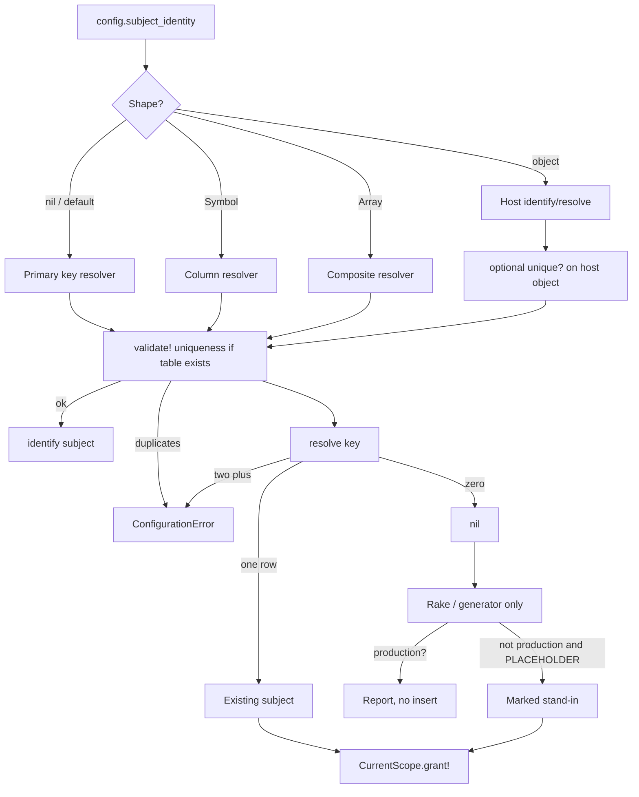

# Configurable Subject Identity Resolution - Plan

## Goal Capsule

- **Objective:** A host can declare how a subject is identified for portable, cross-environment use, resolve that key back to a row in this environment, and walk existing users onto roles with a dry-run first.
- **Authority hierarchy:** this plan → issue #158 → #151 storable/canonical key rules (do not reintroduce collapse) → `subject_label` stays display-only.
- **Execution profile:** ship the identify/resolve contract and uniqueness boot check first. Tooling and prompts sit on that contract. Do not export assignments.
- **Stop conditions:** if resolve would return the wrong subject because two rows share a natural key, raise. If production is missing a subject, do not create one.
- **Tail ownership:** identity contract plus guided adoption. Assignment document format is issue #156 v2, after this lands.

---

## Product Contract

> **Product Contract preservation:** new capability, no upstream requirements doc (`product_contract_source: ce-plan-bootstrap`). Scoped from issue #158 and the confirmed planning synthesis (identity plus the guided walkthrough).

### Summary

The host declares a subject identity: one column, a composite, or a small object with `identify` and `resolve`. Default remains the primary key. Uniqueness is fail-loud. A missing subject may become a marked placeholder only outside production. A generator and an interactive rake task walk an adopting app onto that declaration and can seed Owner and Admin against a real or placeholder subject.

### Problem Frame

Grants store a polymorphic subject primary key. That key differs across environments. Role *definitions* are already portable (issue #156 v1). Assignments are not, and the reason is the subject key.

An adopting app already has users. It may key them on email, on name plus email, or on a join to contacts. There is no declared way to say "this grant belongs to `info@example.com`" so a later import can find that person here.

`subject_label` is a display string. It is allowed to fail soft. It must not become the resolver. Identity is load-bearing.

### Requirements

**Contract**

- R1. `config.subject_identity` accepts a Symbol (one column), an Array of symbols (composite), or an object that responds to `identify(subject)` and `resolve(key)`. Default is the primary key. Existing installs change nothing until they opt in.
- R2. `identify(subject)` returns the portable key for that row. `resolve(key)` returns the subject in this environment or nil.
- R3. One blessed object shape. Symbol and Array are sugar that compile to that object. Do not ship a parallel lambda-pair API.
- R4. A composite key round-trips as a structured list (YAML sequence or equivalent Ruby array). No delimiter string that can appear inside a name.

**Uniqueness and boot**

- R5. The natural key must be unique among subjects. Validate at `Configuration#validate!` / boot against live data when the table exists. Duplicates raise `ConfigurationError`.
- R6. `resolve` refuses a key that matches more than one row. Sugar resolvers load at most two rows (`where` + `limit(2)`): zero is nil, one is the subject, two raises. Later assignment import (#156 v2) only calls this contract. Do not build assignment import here.

**Missing subject**

- R7. Production: a missing key is reported and no row is created.
- R8. Non-production: an explicit placeholder mode may create a marked stand-in subject so a role shape can be exercised. The stand-in is identifiable and listed in the dry-run. Cleanup is documented (delete the marked rows). It is never the default of `resolve`.

**Tooling**

- R9. A generator scaffolds the `subject_identity` line (and a stub object when identity is split across tables).
- R10. An interactive rake task asks which column(s) or join identify a subject, checks uniqueness, prints a dry-run of what would be granted, then writes only after an explicit opt-in.
- R11. The same task can seed the standard primary roles (Owner, and Admin as a named full-access or near-owner role if the host wants it) and attach one real subject or one placeholder. Org-wide attach goes through `CurrentScope.grant!`.
- R12. Dry-run is the default. Write requires a flag in the same spirit as the migrate skill's review-then-run.

**Guidance**

- R13. Copy-paste prompts land on `docs/site/ai-agents.md` and an index line on `docs/site/llms.txt`. They cover: declare identity, uniqueness check, dry-run, seed Owner, attach a real or placeholder subject. They say never invent a production subject.
- R14. Do not merge this into `.claude/skills/current-scope-migrate/`. Cross-link only.

**Non-interference**

- R15. `subject_label` remains display-only and fail-soft. Identity failures are loud.
- R16. Grant storage stays on the storable primary key. This layer does not change `subject_id` columns or redo issue #150.

### Actors

- A1. Maintainer adopting the engine on an app that already has users.
- A2. Agent following `ai-agents.md` prompts in a non-production checkout.
- A3. Later #156 v2 import, which will call this resolve contract.

### Key Flows

- F1. Column identity
  - **Trigger:** Host sets `config.subject_identity = :email`.
  - **Steps:** Boot checks uniqueness of `email`. `identify(user)` returns the email. `resolve("a@example.com")` finds that user.
  - **Outcome:** Default PK path unused for portability. Grants still store `subject_id`. Covers R1, R2, R5, R16.
- F2. Collision
  - **Trigger:** Two users share the configured email.
  - **Outcome:** Boot raises. No silent first-row win. Covers R5.
- F3. Guided attach, dry-run then write
  - **Trigger:** Maintainer runs the rake task on a local database.
  - **Steps:** Choose `:email`. See collisions (none). See "would grant Owner to a@example.com". Confirm. `grant!` runs.
  - **Outcome:** One audited org-wide grant. Covers R10, R11, R12.
- F4. Missing in production
  - **Trigger:** `resolve("ghost@example.com")` in production, or placeholder mode requested in production.
  - **Outcome:** Nil / refused. No insert. Covers R7, R8.

### Acceptance Examples

- AE1. Covers F1. Given unique emails, when identity is `:email`, then `identify` / `resolve` round-trip the same user and a PK-only install still grants by id.
- AE2. Covers F2. Given two rows with `email: "dup@x.com"`, when the app boots with `subject_identity = :email`, then boot raises `ConfigurationError`.
- AE3. Covers F3. Given a dry-run then `WRITE=1`, when the chosen user has no org role, then `grant!` assigns Owner and an `org_role.assigned` bootstrap event exists.
- AE4. Covers F4. Given production, when the key is unknown, then no `User` row is inserted.

### Success Criteria

Default PK identity passes every existing grant test unchanged. An email-identity dummy path is unique-checked and round-trips. Production placeholder is impossible. Prompts and generator comments agree on the flag names.

### Scope Boundaries

**In scope**

- Config contract, uniqueness, placeholder policy, generator, interactive dry-run rake, Owner/Admin seed attach, `ai-agents.md` prompts, adoption-guide notes.

**Deferred to Follow-Up Work**

- Assignment export/import (#156 v2) that *consumes* this contract.
- Control-plane assignment rules (#157).
- Issue #150 resource business keys.

**Outside this product's identity**

- Using `subject_label` as a resolver.
- Inventing production users.
- A new migrate skill, or folding this into the Pundit/CanCanCan skill.
- Changing one-org-role-per-subject.

---

## Planning Contract

### Key Technical Decisions

- KTD-1 — One object, two sugars. Internally always call `identify` / `resolve` on a resolver object. A Symbol becomes "read this column / `find_by` this column". An Array becomes "read these columns in order / `find_by` that hash". A host object is used as-is after a `respond_to?` check. A Proc pair is rejected at assignment so there is one blessed shape (issue open question 1).

- KTD-2 — Composite keys are arrays, never joined strings. `identify` returns `["Ada", "Lovelace"]` (or a frozen array of stringified values). `resolve` accepts that array. YAML for later assignment export will already be a sequence. Do not pick a delimiter.

- KTD-3 — Uniqueness is a real query at boot when the subject table exists, and again before backfill writes. Skip the boot query during `db:create` / `db:schema:load` / other database tasks the way `SchemaGuard.running_a_database_task?` already skips. Skip it for the default primary-key identity (the table already unique-indexes that). For a Symbol or Array, count only rows where every identity column is non-blank; blank rows do not collide and never resolve. For a host object, call `unique?` if it exists; if it does not, boot does not invent a join scan, and R6 still raises on a multi-match `resolve`. A unique index on the host table is recommended in docs. On a large table the boot query may be slow: document that, and ship an offline `current_scope:identity:check` rake that is the path operators run in CI. Do not add an engine migration on the host table.

- KTD-4 — Placeholder is an explicit mode on the tooling, not a `resolve` fallback. `resolve` returns nil when missing and never inserts. The rake task, when `PLACEHOLDER=1` and `CurrentScope.config` reports not production (`Rails.env.production?`, the same helper impersonation already uses), calls a host-supplied factory from the generated stub. A dummy `User.create!(email: ...)` is not assumed to work on Devise hosts. Production, or the flag absent: print the unresolved key and exit non-zero. Leftover placeholder rows restored into production are an operator cleanup duty, not an auto-delete.

- KTD-5 — `subject_label` and `subject_identity` stay separate writers. Label remains Symbol/Proc/nil and fail-soft. Identity is validating and fail-loud. Docs must say this in one sentence so an agent does not point both at `:email` and assume they are the same thing.

- KTD-6 — Tooling calls `grant!` for org-wide attach. That keeps bootstrap ledger behaviour (`org_role.assigned`, `source: "bootstrap"`). Do not insert `RoleAssignment` rows directly.

- KTD-7 — Prompts ship in the same change as the generator flags they name. Do not document a flag that is not implemented. Cross-link the migrate skill. Do not duplicate its Pundit analyzer.

### High-Level Technical Design

Storage of grants is unchanged: `subject_type` + storable `subject_id`. Identity is a mapping layer above that.

### Assumptions

- #151 already stores subject ids as strings. This plan can treat the raw key as correctly stored.
- "Admin" in the issue means a second named role the host can attach, not a new engine invariant. Owner remains the stock full-access role from `seed_defaults!`. Admin, if created, is a host-named role the task `find_or_create_by`s. It does not have to be `full_access` unless the operator says so in the prompt.

### Sequencing

U1 contract + boot uniqueness. U2 sugars and composite encoding. U3 placeholder policy tests. U4 generator and rake. U5 docs and prompts. U4 depends on U1–U3 so prompts do not lie.

---

## Implementation Units

### U1. Identity config, default PK, boot uniqueness

- **Goal:** A declared identity exists. Default behaviour equals today. Colliding data fails boot.
- **Requirements:** R1, R2, R3, R5, R15, R16
- **Dependencies:** none
- **Files:**
  - `lib/current_scope/configuration.rb`
  - `lib/current_scope/subject_identity.rb` (directional)
  - `lib/current_scope/engine.rb` (`validate!` already runs after_initialize)
  - `test/configuration_test.rb`
  - `test/subject_identity_test.rb`
- **Approach:** Validating writer. Unknown shape raises and leaves the previous value. Default resolver uses the primary key. Sugar `resolve` uses `where` + `limit(2)`, never `find_by`. Uniqueness query uses `group(column).having("count(*) > 1")` for the Symbol case, ignoring blank values; skip when `SchemaGuard.running_a_database_task?`.
- **Patterns to follow:** `enforcement=` / `audit=` writers; `SchemaGuard` db-task skip; `validate_subject_key!`.
- **Test scenarios:**
  - Happy: unset config, identify/resolve match `User.find(id)`.
  - Happy: `:email` on unique emails round-trips.
  - Error: `:email` with a duplicate raises at `validate!`.
  - Error: `config.subject_identity = "email"` or a Proc raises at assignment.
  - Edge: validate during a simulated db task does not query.
- **Verification:** Existing `test/grant_test.rb` and assignment tests stay green with default config.

### U2. Composite sugar

- **Goal:** An array of columns identify and resolve without a delimiter.
- **Requirements:** R1, R3, R4, R6
- **Dependencies:** U1
- **Files:**
  - `lib/current_scope/subject_identity.rb`
  - `test/subject_identity_test.rb`
  - dummy user columns only if the dummy lacks a pair (prefer existing `name` plus a test-only attribute, or a dedicated test model)
- **Approach:** `identify` returns an array of string values. `resolve` uses `find_by` with all columns. Blank parts are not a match. Two rows with the same tuple fail uniqueness.
- **Test scenarios:**
  - Happy: `[:name, :email]` round-trips one user.
  - Edge: a value that contains a comma still round-trips (proves no delimiter encoding).
  - Error: two rows with the same tuple raise at validate and at `resolve` (no first-row win).
  - Edge: two rows with blank emails do not collide; `resolve("")` returns nil.
- **Verification:** No string-join implementation remains in the resolver.

### U3. Missing-subject and placeholder policy

- **Goal:** Production never invents a subject. Non-production placeholder is opt-in and marked.
- **Requirements:** R7, R8
- **Dependencies:** U1
- **Files:**
  - tooling helper next to the rake/generator (not inside `resolve`)
  - `test/subject_identity_placeholder_test.rb`
- **Approach:** Keep `resolve` pure. Put `materialize_placeholder!(key)` on the tooling object. It raises in production. It no-ops if `resolve` already finds a row. It stamps the documented mark.
- **Test scenarios:**
  - Happy: non-production + flag creates one marked row and later `resolve` finds it.
  - Error: production + flag raises and count is unchanged.
  - Error: `resolve` alone never inserts.
- **Verification:** A grep-able mark string exists in generator comments and in the test.

### U4. Generator and interactive rake

- **Goal:** An adopter can declare identity and attach Owner without opening a console.
- **Requirements:** R9, R10, R11, R12
- **Dependencies:** U1, U2, U3
- **Files:**
  - `lib/generators/current_scope/install/templates/initializer.rb` (commented examples)
  - new generator or install hook for a stub resolver class
  - `lib/tasks/current_scope_tasks.rake` (`current_scope:identity:setup` or similar)
  - `test/generators/install_generator_test.rb` (comment presence)
  - `test/identity_task_test.rb`
- **Approach:** Dry-run prints collisions, unresolvable rows, would-grant lines, and each role's `full_access` yes/no. Default Admin (if created) is not full_access. Owner remains the only stock full_access from `seed_defaults!`. `WRITE=1` performs `seed_defaults!` as needed and `grant!`. `PLACEHOLDER=1` is ignored when `production?`. Non-interactive ENV: `IDENTITY=` (column or comma list), `SUBJECT=` (portable key), `ROLE=` (name, default Owner), `WRITE=1`, `PLACEHOLDER=1`. ARGV prompts only when tty.
- **Patterns to follow:** `current_scope:grant`; install generator tests; migrate skill report-only default.
- **Test scenarios:**
  - Happy: dry-run names the user and writes nothing.
  - Happy: WRITE grants Owner through `grant!`.
  - Error: uniqueness collision aborts before grant.
  - Error: production placeholder aborts.
- **Verification:** Task tests plus initializer template includes `subject_identity` next to `subject_label` with the "not the same knob" sentence.

### U5. Adoption prompts and guides

- **Goal:** A human or agent can copy a prompt that names only shipped flags.
- **Requirements:** R13, R14, R15
- **Dependencies:** U4
- **Files:**
  - `docs/site/ai-agents.md`
  - `docs/site/llms.txt`
  - `docs/guides/adopting-in-an-existing-app.md`
  - `docs/guides/configuration-reference.md`
  - `docs/site/configuration.md`
  - `CONCEPTS.md` (subject identity vs subject label)
  - `.claude/skills/current-scope-migrate/SKILL.md` (one cross-link)
  - `UPGRADING.md`, `CHANGELOG.md`, `README.md`, `STATUS.md`
- **Approach:** One prompt block. Hard-stop line: never invent a production subject. Point migrate-skill readers here for greenfield identity, not for Pundit mapping.
- **Test expectation:** none beyond existing generator comment assertions.
- **Verification:** Every flag in the prompt exists on the rake task. No fourth skill directory.

---

## Verification Contract

| Gate | Command / signal | Proves |
|---|---|---|
| Contract + uniqueness | `bin/rails test test/subject_identity_test.rb test/configuration_test.rb` | R1–R6, R15, R16 |
| Placeholder | `bin/rails test test/subject_identity_placeholder_test.rb` | R7, R8 |
| Task / generator | `bin/rails test test/identity_task_test.rb test/generators/install_generator_test.rb` | R9–R12 |
| Existing grants | `bin/rails test test/grant_test.rb test/models/role_assignment_test.rb` | default PK unchanged |
| Adapters | `bin/db` | uniqueness SQL |
| Lint | `bin/rubocop` | house style |

### Definition of Done

- U1–U5 complete. `resolve` never inserts.
- Default installs behave as they do on current `main`.
- Duplicate natural keys fail loud.
- Prompts, initializer comments, and rake flags use the same names.
- Assignment export is not implemented and not claimed.

### System-Wide Impact

New config knob and operator tasks. Management UI can later *display* the portable key. It does not have to in this plan. Grant rows stay PK-based.

### Risks

- Boot uniqueness on a large `users` table is a full scan. Document it. Do not add an engine migration on the host table.
- A host Proc-shaped label copied into identity would fail the writer. That is intended. The error must name the object shape.

### Sources

- Issue #158; #156 comment that v2 blocks on this contract.
- `config.subject_label` vs `config.subject_class` in `lib/current_scope/configuration.rb`.
- `CurrentScope.grant!`, `SchemaGuard.running_a_database_task?`.
- `.claude/skills/current-scope-migrate/SKILL.md` (do not merge).
- `docs/site/ai-agents.md` existing prompt style.
