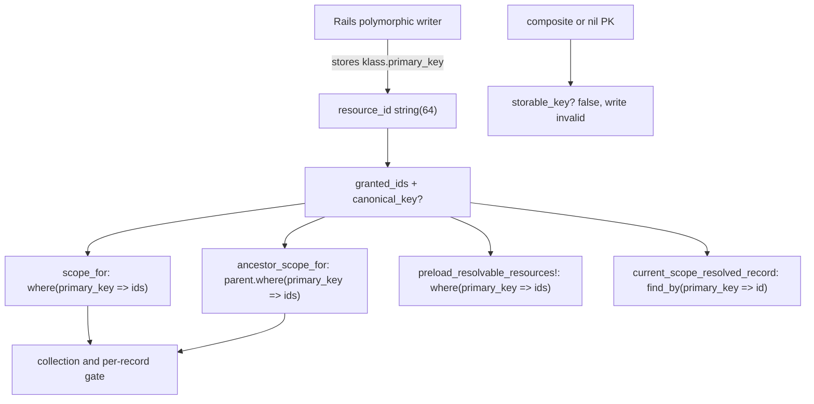

# Scoped Grant Business Primary Keys - Plan

## Goal Capsule

- **Objective:** A scoped grant on a model whose declared primary key is a business column (`self.primary_key = "code"`) matches that record, not a different row whose surrogate `id` equals the business key. Composite and nil keys stay refused. The leftover refusal branch is not merged.
- **Authority hierarchy:** this plan → issue #150 → the #151 string-column and `canonical_key?` rules → fail-closed resolver (DESIGN.md §3.7). The issue body is stale against main at 55f1c6b; this plan owns the remaining work, not a second column migration.
- **Execution profile:** characterization first. Add dummy Ledger/Entry and tests that pin the 200-vs-200 collision. Change production code only if a site still looks records up by the `id` column.
- **Stop conditions:** do not widen `resource_id` again. Do not add a fourth match-key helper next to `storable_key?` / `canonical_key?` / `klass.primary_key`. Do not refuse a chain through a business-key parent. Do not support composite or nil keys.
- **Tail ownership:** resource-side matching for a single-value declared primary key, including parent-chain hops. Subject identity (#158) and assignment export (#156 v2) stay out.

---

## Product Contract

> **Product Contract preservation:** no upstream requirements doc (`product_contract_source: ce-plan-bootstrap`). Scoped from issue #150, re-derived against main@55f1c6b because the issue body predates #151 (PR #153) and still describes an integer `resource_id` column and `id`-column lookups that are no longer on main.

### Summary

#151 already stores grant ids as strings and already keys the resolver, ancestor arm, preloader, and checked reader on `klass.primary_key`. UuidUser proves a string `id` column. What is still unproven is a model that keeps a surrogate `id` column while declaring a different primary key. That is the collision the issue named: a grant on the ledger keyed `200` must not open the ledger whose `id` is `200`. This plan adds that shape to the dummy app, pins it on all three adapters, and only then edits production code if a leftover `id` lookup still exists.

### Problem Frame

Issue #150 was filed when three consumers still looked records up by the `id` column while Rails' polymorphic writer stored `klass.primary_key`. On a model with `self.primary_key = "code"` and a leftover `id` column, a grant on Alpha (`code = "200"`, `id = 1`) resolved to Beta (`id = 200`, `code = "999"`). The collection gate opened on the wrong match because `record_less_scoped_grant?` takes `.exists?` of the same relation.

#151 then widened `subject_id` and `resource_id` to `string(64)` and switched those consumers to `klass.primary_key`. Composite and nil keys are refused by `CurrentScope.storable_key?`. UuidUser covers UUID-as-`id`. The leftover branch `fix/parent-chain-custom-primary-key` still refuses a chain through a business-key parent, on the old assumption that lookups use `id`. That branch is 10 commits behind main and must not merge.

The gap that remains is proof, not storage. No dummy model on main declares a non-`id` primary key. SQLite's numeric affinity hid the original bug; PostgreSQL is the adapter that would have raised. The issue asked for that Postgres leg before calling it done.

### Requirements

**Matching**

- R1. A scoped grant on a record whose declared primary key is a business column matches that record on the per-record gate, the collection list, and the record-less listed-read arm. It does not match a different row whose surrogate `id` equals the stored key.
- R2. `ScopedRoleAssignment#preload_resolvable_resources!` and `current_scope_resolved_record("resource")` label that grant as live, not inert.
- R3. A non-numeric business key (`"ACME-001"`) stores whole and matches. Truncation is still refused by the existing 64-character guard.

**Parent chain**

- R4. `current_scope_parent` through a business-key parent is allowed when the child's foreign key holds the parent's declared primary key. A grant on that parent lists the children. `ParentChain.validate_key!` keeps refusing only the #139 association form (`belongs_to ..., primary_key: :other_column`).

**Preservation**

- R5. Composite and nil primary keys stay unstorable. UuidUser and integer-keyed models stay green.
- R6. No second migration of `resource_id` / `subject_id`. The columns stay `string(64)`.
- R7. Adapter merge gate: `bin/db test` (sqlite, postgres, mysql) plus CI adapter jobs. SQLite alone is not enough.

**Docs**

- R8. CHANGELOG and UPGRADING say a single-value declared primary key is supported, and that composite/nil keys are still refused. The leftover refusal branch is named as obsolete.

### Actors

- A1. A host whose models use a business primary key (code, slug) and still have a surrogate `id`.
- A2. The implementer, who must not re-introduce the leftover refusal.
- A3. The #156 v2 implementer, who needs this proof before assignment export stores scope ids.

### Key Flows

- F1. Direct collision
  - **Trigger:** Ledger Alpha `code="200"` `id=1`. Ledger Beta inserted with `id=200` `code="999"`. Grant on Alpha.
  - **Outcome:** Alpha is allowed. Beta is denied. `scope_for` lists Alpha only. Covers R1.
- F2. Non-numeric key
  - **Trigger:** Ledger `code="ACME-001"`. Grant on it.
  - **Outcome:** stored `resource_id` is `"ACME-001"`. Gate and list match that row only. Covers R3.
- F3. Parent chain
  - **Trigger:** Entry belongs to Ledger on `ledger_id` → `code`. Entry declares `current_scope_parent :ledger`. Grant on Alpha.
  - **Outcome:** collection lists Alpha's entries, not Beta's. Covers R4.
- F4. Unstorable
  - **Trigger:** a class with a composite or nil primary key.
  - **Outcome:** `storable_key?` is false. A grant write is invalid. Covers R5.

### Acceptance Examples

- AE1. Covers F1. Given Alpha and Beta as above, when a subject holds a scoped grant on Alpha, then `decide` allows Alpha, denies Beta, and `scope_for` returns Alpha only.
- AE2. Covers F2. Given a ledger keyed `ACME-001`, when a grant is created on it, then `resource_id` equals `"ACME-001"` and the per-record gate allows only that row.
- AE3. Covers F3. Given Entry declares the chain and one entry belongs to Alpha, when the subject holds the grant on Alpha, then `scope_for(Entry)` includes that entry and excludes an entry that belongs to Beta.
- AE4. Covers F4. Given the existing composite/nil classes in `test/uuid_key_collision_test.rb`, then `storable_key?` stays false.

### Success Criteria

The 200-vs-200 collision cannot regress without a red test. `bin/db test` is green. Composite/nil still refused. The leftover branch is not merged. CHANGELOG names the support.

### Scope Boundaries

**In scope**

- Dummy Ledger/Entry, collision tests, parent-chain proof, leftover-site fixes if characterization finds any, docs.

**Deferred to Follow-Up Work**

- Assignment export (#156 v2). This plan unblocks it. It does not build it.
- Issue #166 (console degrade on a poisoned registry).
- Supporting composite primary keys. Still refused.

**Outside this product's identity**

- Changing Rails' polymorphic writer.
- Dropping host surrogate `id` columns.
- Reopening the #139 association-form refusal (`belongs_to` with `primary_key:` other than the parent's declared key).

---

## Planning Contract

### Key Technical Decisions

- KTD-1 — Treat the issue body as historical. On main@55f1c6b, `test/dummy/db/schema.rb` already has `t.string "resource_id", limit: 64`. `Resolver#scope_for` and `ancestor_scope_for` already call `model.where(model.primary_key => granted_ids(...))`. `preload_resolvable_resources!` already uses `klass.primary_key` and skips a non-String key. `current_scope_resolved_record` already does `find_by(klass.primary_key => id)`. Do not plan a column migration or a blanket rewrite of those methods.

- KTD-2 — The match-key helper the issue asked for already exists as three predicates: `storable_key?` (class can be named by one value), `canonical_key?` (this value round-trips through that type), and `klass.primary_key` (the column to query). Do not add a fourth helper unless characterization finds a site that still hard-codes `"id"`. If one is found, switch that site onto the same three predicates.

- KTD-3 — Do not merge `fix/parent-chain-custom-primary-key` (593e36a, local only; no remote of that name). It refuses a chain through a business-key parent because the then-current ancestor arm keyed on `id`. That assumption is false on main. Reuse its dummy shape: implicit integer `id` as the table primary key, unique string `code`, ActiveRecord-only `self.primary_key = "code"`, `entries.ledger_id` as string holding `Ledger.code` (not `t.references :ledger`). Those files are not on main; copy the shape, do not expect `test/parent_chain_custom_primary_key_test.rb` in this tree. Flip the leftover tests from "declaration raises" to "grant on Alpha does not open Beta".

- KTD-4 — Characterization first. U1 and U2 may land as dummy models plus tests against current code. If they go green, production Ruby does not change. If a test shows an `id` lookup, fix that site in the same unit and keep going. Do not "fix" passing tests by re-introducing a boot refusal.

- KTD-5 — Ledger/Entry live as real dummy models with a migration, not as UuidUser-style load-time `create_table`. UuidUser is load-time because MySQL cannot run DDL inside a test transaction and two suites share that table. Ledger needs both columns in `schema.rb`, so a dummy migration is the right precedent (`test/dummy/db/migrate`). The table primary key stays the implicit integer `id`. Only ActiveRecord sets `self.primary_key = "code"`. Passing `primary_key: :code` to `create_table` would drop the surrogate `id` and delete the collision. Entry does not declare the chain in the model file until U3, so boot validation stays quiet for tests that do not opt in.

- KTD-6 — Adapter suite is the merge gate, not a nicety. The original bug was SQLite-invisible. `bin/db test` must include the new file on postgres and mysql. CI adapter jobs on the PR head are required before merge.

- KTD-7 — STI that overrides `primary_key` to another single string column is in scope as one test if a cheap dummy subclass can do it. If the override is an Array, `storable_key?` already refuses it (AE4). Do not invent STI tables for that refusal.

### High-Level Technical Design

Every arrow already exists on main. The new work is the Ledger fixture that makes `primary_key` and `id` disagree, plus tests on each box.

### Assumptions

- Current main already matches on `klass.primary_key` at the four sites above. Verified by reading `lib/current_scope/resolver.rb`, `app/models/current_scope/scoped_role_assignment.rb`, and `app/models/concerns/current_scope/storable_keys.rb` at 55f1c6b.
- `ParentChain.validate_key!` still only compares `reflection.association_primary_key` to `reflection.klass.primary_key` (the #139 association form). A parent whose model PK is `"code"` and whose child FK holds `code` values is already legal.
- `bin/db` still runs the suite against sqlite, postgres, and mysql.

### Sequencing

U1 dummy schema. U2 collision tests (may be green with no production edit). U3 parent-chain declaration and tests. U4 docs. U2 can stop the whole plan if it finds a fail-open lookup that cannot be switched onto `primary_key` without regressing composite keys; report rather than invent.

---

## Implementation Units

### U1. Dummy Ledger and Entry

- **Goal:** the suite has a model whose declared primary key is not the `id` column, with a leftover surrogate `id` so the 200-vs-200 collision is representable.
- **Requirements:** R1 (fixture), R6. Decisions: KTD-3, KTD-5.
- **Dependencies:** none
- **Files:**
  - `test/dummy/app/models/ledger.rb`
  - `test/dummy/app/models/entry.rb`
  - `test/dummy/db/migrate/<timestamp>_create_ledgers_and_entries.rb`
  - `test/dummy/db/schema.rb`
- **Approach:** `create_table :ledgers` with the implicit integer/bigint `id` as the database primary key. Add unique string `code` (not null) and string `name`. Do not pass `primary_key: :code` to `create_table`. In `ledger.rb` only, set `self.primary_key = "code"`. `create_table :entries` with `t.string :ledger_id` (holds `Ledger.code`, including `"ACME-001"`) and string `title`. Do not use `t.references :ledger` (that would be a bigint FK to the surrogate `id`). Entry `belongs_to :ledger, optional: true, foreign_key: :ledger_id, primary_key: :code`. Entry does not call `current_scope_parent` yet (U3). Do not copy the leftover branch's Gemfile.lock or Rails CVE lockfile bump. The leftover models live only on that local branch; copy the column shape from KTD-3, not a path on main.
- **Patterns to follow:** leftover `Ledger` / `Entry` from `fix/parent-chain-custom-primary-key` (shape only); dummy migrations next to `test/dummy/db/migrate`.
- **Test expectation:** none -- schema only. U2 owns behavior.
- **Verification:** dummy boots. `Ledger.primary_key` is `"code"`. `Ledger.column_names` includes `id` and `code`.
- **Stop here if:** a dummy migration cannot keep both an integer `id` and a string primary key `code` on all three adapters. Report the adapter error; do not drop the surrogate `id` (that would delete the collision).

### U2. Pin the 200-vs-200 collision and the non-numeric key

- **Goal:** a grant on Alpha cannot open Beta, a non-numeric key stores whole, and the preloader still sees the grant as live.
- **Requirements:** R1, R2, R3, R5, R7. Decisions: KTD-1, KTD-2, KTD-4, KTD-6, KTD-7.
- **Dependencies:** U1
- **Files:**
  - `test/business_primary_key_test.rb` (new)
  - `lib/current_scope/resolver.rb` (only if a test fails)
  - `app/models/current_scope/scoped_role_assignment.rb` (only if a test fails)
  - `app/models/concerns/current_scope/storable_keys.rb` (only if a test fails)
- **Approach:** Create Alpha with `code: "200"`. Insert Beta with raw SQL so `id=200` and `code="999"` (ActiveRecord will not assign a conflicting `id` through the PK writer). Grant on Alpha. Assert `decide` allows Alpha, denies Beta, and `scope_for(Ledger)` lists Alpha only. Create a third ledger `ACME-001` and assert `resource_id == "ACME-001"`. Call `preload_resolvable_resources!` and assert Alpha's grant is not `orphaned_resource?`. Also call `current_scope_resolved_record("resource")` on that row and assert it returns Alpha (R2 names both the preloader and the checked reader). Keep the existing composite/nil assertions in `test/uuid_key_collision_test.rb` (AE4); do not duplicate them unless this file needs a local pointer. If any assertion fails, find the `id`-column lookup and switch it to `klass.primary_key` plus `canonical_key?`. Do not refuse the model at boot. Do not expect `test/parent_chain_custom_primary_key_test.rb` on this tree; write the new file from KTD-3's shape.
- **Execution note:** Start with the failing collision test. Change production code only after it is red for a real `id` lookup.
- **Patterns to follow:** leftover collision insert in `test/parent_chain_custom_primary_key_test.rb`; `test/uuid_key_collision_test.rb` for UUID-as-id (different shape, do not merge the files).
- **Test scenarios:**
  - Covers AE1. Alpha granted, Beta not: per-record allow/deny and `scope_for` list.
  - Covers AE2. `ACME-001` stores whole and matches only that row.
  - Covers R2. Preloader: Alpha's grant `orphaned_resource?` is false; a grant whose `resource_id` is a canonical `code` is live.
  - Guard: UuidUser and integer `User` grants still pass (`bin/rails test test/uuid_key_collision_test.rb`).
  - Optional, cheap: an STI subclass of Ledger that keeps the same string PK still matches (KTD-7). Skip if it needs its own table.
- **Verification:** `bin/rails test test/business_primary_key_test.rb test/uuid_key_collision_test.rb` green. Then `bin/db test` includes this file on all three adapters.
- **Stop here if:** switching a failing site onto `primary_key` compiles `WHERE ()` for composite keys or `WHERE ""` for nil keys. Those shapes must stay refused by `storable_key?`, not queried. Report rather than special-case SQL.

### U3. Parent chain through a business-key parent

- **Goal:** a declared chain through Ledger matches children of the granted parent, not children of the surrogate-id collision row.
- **Requirements:** R4, R7. Decisions: KTD-3, KTD-4.
- **Dependencies:** U2
- **Files:**
  - `test/dummy/app/models/entry.rb`
  - `test/business_primary_key_test.rb`
  - `lib/current_scope/parent_chain.rb` (only if a test fails)
- **Approach:** Add `current_scope_parent :ledger` on Entry once U2 is green. Create one entry on Alpha and one on Beta. Grant on Alpha. Assert `scope_for(Entry)` includes Alpha's entry and excludes Beta's. Assert `ParentChain.validate_key!(Entry, Entry.reflect_on_association(:ledger))` does not raise. Keep the existing #139 test in `test/parent_chain_test.rb` that refuses `belongs_to :project, primary_key: :name`.
- **Patterns to follow:** `test/parent_chain_test.rb` for declaration vs boot-validation. Do not use an anonymous child class for the happy path: `validate_declarations!` skips classes that `safe_constantize` cannot find.
- **Test scenarios:**
  - Covers AE3. Grant on Alpha lists Alpha's entries only.
  - Guard: `validate_key!` still raises for the #139 custom association-key fixture in `test/parent_chain_test.rb`.
  - Guard: `validate_declarations!` stays quiet for Project/Report (id-keyed parents).
- **Verification:** `bin/rails test test/business_primary_key_test.rb test/parent_chain_test.rb` green. Re-run `bin/db test` before the PR.
- **Stop here if:** the chain matches Beta's children. That is the original collection-gate bug. Fix the ancestor arm; do not refuse the declaration.

### U4. Docs and the obsolete branch

- **Goal:** hosts and later agents are told the remaining shape is supported, and that the leftover refusal branch is obsolete.
- **Requirements:** R8.
- **Dependencies:** U2, U3
- **Files:**
  - `CHANGELOG.md`
  - `UPGRADING.md`
  - GitHub issue #150 (comment on implement, not in this docs PR unless the same branch lands the code)
- **Approach:** One CHANGELOG Unreleased line: single-value declared primary keys (business column, leftover surrogate `id`) match on that key; composite/nil stay refused; #151 already did the string column. UPGRADING: a short note under the #151 string-key section, not a new migration. Name `fix/parent-chain-custom-primary-key` as an obsolete local leftover in the PR body so nobody rebases it. It has no remote of that name.
- **Patterns to follow:** the #151 UPGRADING section; CHANGELOG Unreleased style after #158.
- **Test expectation:** none -- docs-only unit.
- **Verification:** every claim in the new paragraphs is true of the code U2/U3 shipped (`primary_key` matching, string column, composite refused).
- **Stop here if:** U2 needed a production change that the docs would then understate. Update the docs to name the site that changed.

---

## Verification Contract

| Gate | Command / signal | Proves |
|---|---|---|
| Collision | `bin/rails test test/business_primary_key_test.rb` | R1, R2, R3, R4, AE1–AE3 |
| UUID and unstorable | `bin/rails test test/uuid_key_collision_test.rb` | R5, AE4 |
| Parent chain guard | `bin/rails test test/parent_chain_test.rb` | R4 #139 still refused |
| Full unit suite | `bin/rails test` | nothing else regressed |
| Adapters | `bin/db test` | R7, SQLite cannot hide this |
| Lint | `bin/rubocop` | house style |
| CI adapter jobs | postgres and mysql (trilogy) green on the PR head | R7 |

### Definition of Done

- Alpha (`code="200"`) granted does not open Beta (`id=200`).
- `"ACME-001"` stores and matches.
- Entry's chain through Ledger lists the right children.
- Composite/nil still refused. No second column migration.
- `fix/parent-chain-custom-primary-key` was not merged.
- CHANGELOG and UPGRADING match the shipped behavior.
- All verification gates green on the merge head.

### System-Wide Impact

Hosts with UUID `id` columns are already supported (#151). This unblocks hosts whose PK is a business column and unblocks #156 v2 assignment export, which must store whole scope keys. Resolver order is unchanged. Fail-closed is unchanged.

### Risks

- Characterization goes green and someone still wants the leftover refusal "for safety". Rejected: refusing a now-correct shape locks out the hosts this issue exists to serve. The tests are the safety.
- Raw SQL insert of Beta (`id=200`) is adapter-sensitive. Mitigate by using the same sanitize_sql pattern the leftover test used, and by running `bin/db test`.
- U3's chain declaration runs at dummy boot for every later test. If `validate_key!` is still wrong, the whole suite fails to boot, which is the correct fail-closed signal. If that happens, fix U3 rather than undeclaring the chain to green the suite.
- #156 v2 must not start until this lands. The #156 plan already waits on this file.

### Sources

- Issue #150 (original three-site bug, integer column, revert of the first `primary_key` rewrite).
- #151 / PR #153: string columns, `canonical_key?`, `storable_key?`, UuidUser.
- `lib/current_scope/resolver.rb` (`scope_for`, `ancestor_scope_for`, `granted_ids`, `narrow_through`) at 55f1c6b.
- `app/models/current_scope/scoped_role_assignment.rb` (`preload_resolvable_resources!`).
- `app/models/concerns/current_scope/storable_keys.rb`.
- `lib/current_scope/parent_chain.rb` (`validate_key!`, still the #139 association-form check).
- Leftover branch `fix/parent-chain-custom-primary-key` (593e36a): dummy shape to reuse, refusal not to merge.
- Issue #156 v2 waits on this proof.
