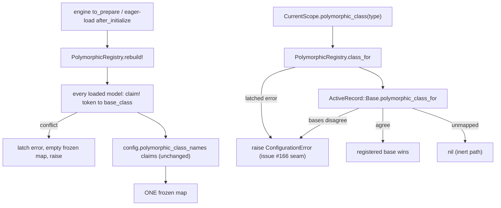

# Simplify Polymorphic Registry Internals - Plan

## Goal Capsule

- **Objective:** Three behavior-preserving refactors of the polymorphic registry: one map with `claim!` as the single collision net, no vestigial `owner:` parameter on `polymorphic_class`, and the registry extracted to `lib/current_scope/polymorphic_registry.rb` behind thin facade delegators.
- **Authority hierarchy:** this plan → issue #163 → the #155 registry semantics (closed registry, fail-closed collision raise, nil for unmapped) → the #151 key rules. None of those semantics may change.
- **Execution profile:** three separate units, one commit each, in issue order. In-place simplification first, extraction last, so the extraction diff is pure code movement. The full suite is the proof at every step.
- **Stop conditions:** if any test other than the two named deliberate edits changes outcome, the refactor is not behavior-preserving. Stop and report; do not patch tests to green. If the extraction needs a logic change to compile, stop: it must be a pure move.
- **Tail ownership:** this plan owns the cleanup only. Issue #166 (console degrade on a poisoned registry) and issue #164 (members-page inert labels) stay open; this plan only shapes the #166 seam and flags the #164 overlap.

---

## Product Contract

> **Product Contract preservation:** no upstream requirements doc (`product_contract_source: ce-plan-bootstrap`). Scoped from issue #163, which is itself a deferred finding set from the #155 pre-PR review gate.

### Summary

The registry that maps polymorphic storage tokens to classes works and is security-reviewed, but it carries three internal complications: dual `owners`/`map` bookkeeping with a default-token exclusion, a re-entrant `owner:` dispatch on a security path, and ninety lines of one cohesive subsystem sitting on the top-level `CurrentScope` module. Each is removed in its own revertable unit. No user-visible change. The full unit, system, and adapter suites prove it.

### Problem Frame

`rebuild_polymorphic_registry!` builds two parallel structures. `owners` maps every token to its base class and is the collision net. `map` holds only tokens Rails cannot reverse, kept small by a `default_storage_token?` helper and a `rails_reverses` check. Two structures mean two invariants to keep aligned, for a size optimization that buys nothing: a default token always resolves through Rails first, so a default entry in the map is dead weight, never wrong.

`polymorphic_class(type, owner:)` still takes an `owner`. Callers pass three values: `ActiveRecord::Base` (the default, used by `StorableKeys.polymorphic_class_for` and `current_scope_resolved_record`), `self.class` (the write validation in `current_scope_check_storable_keys`), and `self` (`ScopedRoleAssignment.preload_resolvable_resources!`). Since the engine registry became the source of truth, a grant model's `polymorphic_class_for` override just re-enters `CurrentScope.polymorphic_class(name, owner: ActiveRecord::Base)`. All three values are behaviorally identical, and the grant-model values add a re-entrant dispatch (registry calls model, model calls registry) to a security path.

The registry (`rebuild_polymorphic_registry!`, `claim!`, `resolve_polymorphic_token`, `default_storage_token?`, `polymorphic_registry`, plus `@polymorphic_registry` and `@polymorphic_registry_error`) is one cohesive subsystem on the already-large facade. The repo's own precedent (`ParentChain`, `SchemaGuard`, `GatingTripwire`, `SodPreflight`) gives each such concept its own file under `lib/current_scope/`.

### Requirements

**Bookkeeping**

- R1. `rebuild_polymorphic_registry!` keeps one map. Every loaded, non-abstract model that responds to `polymorphic_name` claims its token through `claim!`, defaults included. `claim!` is the single collision net and raises the same `ConfigurationError` on a same-token, different-base conflict. The `owners` hash, the `default_storage_token?` helper, and the `rails_reverses` block are deleted.
- R2. Default Rails tokens may now appear in the registry map. The one test that pins the old exclusion (`"shortened STI sibling tokens do not raise"` in `test/polymorphic_registry_test.rb`, its `assert_nil CurrentScope.polymorphic_registry["Document"]` line) is updated deliberately to pin the new content. No other pin changes.

**Parameter**

- R3. `CurrentScope.polymorphic_class(type)` takes no `owner:`. `resolve_polymorphic_token` always asks `ActiveRecord::Base.polymorphic_class_for`. All three caller shapes are updated. The `polymorphic_class_for` override on the grant models stays, because Rails' `belongs_to` reverse resolution is its real consumer; only its delegation drops the now-gone keyword.

**Extraction**

- R4. The registry lives in `lib/current_scope/polymorphic_registry.rb` as `CurrentScope::PolymorphicRegistry`, following the `ParentChain` / `SchemaGuard` file-per-concept precedent. `CurrentScope.polymorphic_class`, `.storage_token`, `.rebuild_polymorphic_registry!`, and `.polymorphic_registry` remain on the facade as thin delegators. The engine (`lib/current_scope/engine.rb`) calls `CurrentScope::PolymorphicRegistry.rebuild!` directly at both rebuild sites.

**Preservation**

- R5. No behavior change. Before merge: `bin/rails test` green, `bin/rails test:system` green, `bin/rubocop` clean, and the CI mysql (trilogy) and postgres adapter jobs green. The issue names the adapter jobs explicitly; they are a merge gate, not a nicety. (`rake test` runs nothing and is never the check.)
- R6. Fail-closed semantics are preserved exactly. A poisoned rebuild still latches its error, leaves an empty frozen map, and re-raises on every later lookup. A live constant that disagrees with a registered owner on `base_class` still raises. An unmapped token still returns nil (the inert path). `config.polymorphic_class_names` validation is untouched.

**Seams, not in scope**

- R7. The extraction leaves one obvious landing place for issue #166 (console should degrade, not 500, on a poisoned registry): both raise paths live in the single lookup method of the new file, named in a comment. The rescue itself is not built here.
- R8. Issue #164 (members-page inert labeling) is not absorbed. Only the file-overlap sequencing risk is recorded.

### Actors

- A1. Maintainer landing and reviewing this refactor, who must be able to revert any one unit alone.
- A2. The later #166 implementer, who needs one method to make degradable.
- A3. Host apps on the published 0.5.1 beta, whose facade calls must keep working unchanged.

### Key Flows

- F1. Collision at rebuild
  - **Trigger:** Two loaded classes emit the same token with different base classes.
  - **Outcome:** `claim!` raises `ConfigurationError`, the error latches, the map empties. Identical before and after. Covers R1, R6.
- F2. Custom token lookup
  - **Trigger:** `polymorphic_class("token_docs")` for a class with an overridden `polymorphic_name`.
  - **Outcome:** Rails cannot reverse it; the registry returns the registered base class. Unchanged. Covers R1, R3.
- F3. Default token lookup
  - **Trigger:** `polymorphic_class("User")`.
  - **Outcome:** Rails reverses it; the registry now also holds the same base class; the answer is the same class as today because the rebuild stores `base_class` and the mismatch raise still guards disagreement. Covers R1, R2, R6.
- F4. Grant write validation
  - **Trigger:** `validates_storable_polymorphic_keys` resolves the stored type during a save.
  - **Outcome:** Same class, same errors, with no re-entrant hop through the grant model. Covers R3.

### Acceptance Examples

- AE1. Covers F1, F2, F4. The entire existing `test/polymorphic_registry_test.rb`, `test/scope_for_custom_token_test.rb`, and storable-keys suites pass with only the two deliberate edits named in R2 and U3.
- AE2. Covers F3. After U1, `CurrentScope.polymorphic_registry["Document"]` (shortened STI token case) is the registered base class, asserted by the updated pin.
- AE3. Covers R5. `bin/db test` passes on sqlite, postgres, and mysql locally; the CI adapter jobs pass on the PR head.

### Success Criteria

The diff deletes more than it adds. The facade's registry section shrinks to delegators. Every existing caller (`resolver.rb`'s `storage_token` uses, both grant models, the engine, the tests) works without knowing anything moved. Reverting any one of the three commits restores the prior state cleanly.

### Scope Boundaries

**In scope**

- The registry section of `lib/current_scope.rb`, the `owner:` threading in `app/models/concerns/current_scope/storable_keys.rb` and `app/models/current_scope/scoped_role_assignment.rb`, the new `lib/current_scope/polymorphic_registry.rb`, the two engine call sites, the two deliberate test edits, one CHANGELOG line.

**Deferred to follow-up work**

- Issue #166: console degrade on a poisoned registry. This plan only positions the seam (see KTD-6).
- Issue #164: members-page inert-badge treatment for unmapped-token holders.

**Outside this product's identity**

- Any change to which token a grant stores, to the collision raise, or to the nil-for-unmapped inert path.
- New public API beyond the `CurrentScope::PolymorphicRegistry` module name.
- Deprecation shims for the `owner:` keyword (it was never documented host API; see KTD-3).

---

## Planning Contract

### Key Technical Decisions

- KTD-1 — In-place first, extraction last, one commit per unit. U1 and U2 simplify the code where it lives, so their diffs are small and blame-readable. U3 then moves code that no longer needs simplifying, so its diff is pure movement. Each unit is independently revertable, which is the issue's explicit constraint. The issue's own numbering (collapse, drop, extract) is kept as U1, U2, U3.

- KTD-2 — Defaults enter the one map. Cost: one frozen-hash entry per loaded base class. Gain: `claim!` becomes the only collision net and two helpers plus one bookkeeping hash disappear. Correctness is unchanged because lookup still asks Rails first, the rebuild stores `base_class` for every claim (so a registered default answers with the same class Rails answers with), and the registered-versus-resolved mismatch raise still guards real disagreement. The `assert_nil` pin flips to a positive assertion so the new content is pinned as deliberately as the old exclusion was.

- KTD-3 — `owner:` is removed, not deprecated. Grep confirms no caller outside the gem's own three shapes, no test passes it, and no doc names it as host API. The gem is a published beta, but the keyword was an internal thread, and `polymorphic_class(type)` remains callable exactly as every external example calls it. A deprecation shim would preserve a parameter whose every value is identical, which is the complication being deleted.

- KTD-4 — All four facade entry points stay as thin delegators: `polymorphic_class`, `storage_token`, `rebuild_polymorphic_registry!`, and `polymorphic_registry`. The first two are the issue's named public API. `rebuild_polymorphic_registry!` is documented in its own comment as safe to call from `to_prepare`, so a host may already call it; removing it would not be behavior-preserving. Keeping the `polymorphic_registry` reader also leaves every test assertion (`assert_empty`, frozen check, content pins) untouched. Only the one test that pokes the ivar directly (`"Rails reverse cannot override a registered token owner"` uses `instance_variable_set(:@polymorphic_registry, ...)`) re-targets `CurrentScope::PolymorphicRegistry`, because the state moves with the module.

- KTD-5 — Module shape follows `SchemaGuard`: `module CurrentScope::PolymorphicRegistry` with module-level methods and state in module ivars, no instances. Directional method names: `rebuild!`, `class_for(token)`, `registry`, private `claim!`. `storage_token(klass)` moves in as the one-liner it is. The require line lands in `lib/current_scope.rb` beside the other extracted concepts, before `current_scope/engine`.

- KTD-6 — The #166 seam is one method. After extraction, `PolymorphicRegistry.class_for` is the single place that raises on a poisoned registry: it re-raises the latched rebuild error and raises the live-constant-disagreement error. A short comment names issue #166 there. When #166 lands, it becomes either a rescue in the two console-feeding callers (`ScopedRoleAssignment.preload_resolvable_resources!`, `RoleAssignment.subject_types_for`) or a soft-reading variant beside `class_for`; either way it is a one-method change in this file plus its call sites, and nothing in this plan pre-builds it.

- KTD-7 — The existing suite is the behavior spec. No new tests are written. The registry already has eighteen tests plus the custom-token scope, uuid-collision, and members integration coverage. A refactor that needs new tests to feel safe is changing behavior; the only edits are the two deliberate ones in R2 and KTD-4, and the plan treats any further test delta as a stop condition.

### High-Level Technical Design

The delegators are the whole public surface. `owners`, `default_storage_token?`, the `rails_reverses` check, and the `owner:` keyword do not appear in the after-state.

### Assumptions

- The issue's equivalence claim for the three `owner:` values is correct because the grant-model override delegates straight back into the registry, and `resolve_polymorphic_token` already rescues the override's `NameError` to nil. U2's stop condition catches it if the claim is wrong.
- No code outside the gem reads `CurrentScope.polymorphic_registry` expecting "custom tokens only". Grep finds readers only in the gem's tests.

### Sequencing

U1 collapse, U2 drop `owner:`, U3 extract. U3 depends on U1 and U2 so the move carries the simplified code. U1 and U2 are logically independent, but the fixed order keeps each diff minimal and matches the issue. Coordinate with issue #164 (see Risks): whichever branch lands second rebases over the first.

---

## Implementation Units

### U1. Collapse the dual token bookkeeping

- **Goal:** One map. `claim!` is the only collision net.
- **Requirements:** R1, R2, R5, R6
- **Dependencies:** none
- **Files:**
  - `lib/current_scope.rb` (the `rebuild_polymorphic_registry!` body; delete `default_storage_token?`)
  - `test/polymorphic_registry_test.rb` (the one pin named in R2)
- **Approach:** Inside the descendant loop, keep the abstract and blank-token guards, then `claim!(map, token, klass.base_class)` unconditionally. Delete the `owners` hash and its inline conflict raise, the `default_storage_token?` call and method, and the `rails_reverses` block. The config-mapping section, the freeze, and the latch-on-rescue stay byte-identical. Flip the R2 pin from `assert_nil CurrentScope.polymorphic_registry["Document"]` to assert the registered base class, with a comment saying the exclusion was a size optimization removed by #163.
- **Patterns to follow:** the existing `claim!` error message (it must stay identical, since three tests match on it).
- **Test scenarios (all existing, no additions):**
  - Collision tests ("two classes claiming one token", "custom token matching another class's default token", STI sibling shares) still raise the same message.
  - "shortened STI sibling tokens do not raise" passes with the flipped pin.
  - "a failed rebuild leaves the registry empty" and "the rebuilt registry is frozen" pass unchanged.
  - `test/scope_for_custom_token_test.rb` and `test/integration/role_members_test.rb` pass unchanged.
- **Stop here if:** any test other than the one flipped pin changes outcome, or a default-token lookup returns a different class than before. That would mean the exclusion was load-bearing after all; report it on issue #163 instead of forcing green.

### U2. Drop the vestigial `owner:` parameter

- **Goal:** `polymorphic_class(type)` has one arity and no re-entrant dispatch.
- **Requirements:** R3, R5, R6
- **Dependencies:** U1 (order only; keeps each diff single-purpose)
- **Files:**
  - `lib/current_scope.rb` (`polymorphic_class` and `resolve_polymorphic_token` signatures)
  - `app/models/concerns/current_scope/storable_keys.rb` (three call shapes: the `polymorphic_class_for` override, `current_scope_resolved_record`, `current_scope_check_storable_keys`)
  - `app/models/current_scope/scoped_role_assignment.rb` (`preload_resolvable_resources!` drops `owner: self`)
- **Approach:** `resolve_polymorphic_token(token)` calls `ActiveRecord::Base.polymorphic_class_for(token)` directly, keeping the `rescue NameError` and everything after it. Remove the keyword from the public method and every caller. Keep the grant models' `polymorphic_class_for` override exactly where it is (Rails' `belongs_to :resource` / `:subject` reverse resolution consumes it); its body becomes `CurrentScope.polymorphic_class(name) || raise(NameError, ...)`. `app/models/current_scope/role_assignment.rb` already calls without the keyword and needs no edit.
- **Test scenarios (all existing, no additions):**
  - Storable-keys write validations produce the same errors on the same inputs.
  - `current_scope_resolved_record` and `preload_resolvable_resources!` registry tests pass unchanged.
  - `create!` with a live custom-token record still stores and resolves the custom token.
- **Stop here if:** any validation message, resolution result, or raise site differs. That falsifies the issue's three-values-identical claim; revert this unit and report on #163 with the failing case.

### U3. Extract `CurrentScope::PolymorphicRegistry`

- **Goal:** The registry is its own file. The facade keeps thin delegators. The #166 seam is one named method.
- **Requirements:** R4, R5, R6, R7
- **Dependencies:** U1, U2
- **Files:**
  - `lib/current_scope/polymorphic_registry.rb` (new)
  - `lib/current_scope.rb` (require line, registry section becomes four delegators)
  - `lib/current_scope/engine.rb` (both rebuild call sites become `CurrentScope::PolymorphicRegistry.rebuild!`)
  - `test/polymorphic_registry_test.rb` (only the ivar-poking test re-targets the module, per KTD-4)
  - `CHANGELOG.md` (one internal-refactor line, no behavior change)
- **Approach:** Pure move. The module carries `rebuild!`, `class_for(token)`, `registry`, `storage_token(klass)`, private `claim!`, and the two state ivars, with the existing comments moved intact (they encode the #139/#155 review history). `class_for` owns both raises and carries the one-line #166 seam comment (KTD-6). The facade defines `polymorphic_class(type)` (keeping its blank-token guard or delegating it, implementer's choice, provided nil-for-blank is preserved), `storage_token`, `rebuild_polymorphic_registry!`, and `polymorphic_registry` as one-line delegators with a pointer comment. No logic edits ride along.
- **Patterns to follow:** `lib/current_scope/schema_guard.rb` (module shape, "its own file rather than more of Engine" framing); the require block at the top of `lib/current_scope.rb`.
- **Test scenarios (all existing, one edit):**
  - The full registry suite passes with only the `instance_variable_set` target changed.
  - Engine boot paths still rebuild: `test/integration/role_members_test.rb` and `test/scope_for_custom_token_test.rb` pass unchanged (they call the kept facade delegator).
- **Stop here if:** the move needs any logic change to work (a load-order NameError, a config availability problem at require time, a frozen-state difference). A move that edits logic has stopped being U3; report before improvising.

---

## Verification Contract

| Gate | Command / signal | Proves |
|---|---|---|
| Registry behavior | `bin/rails test test/polymorphic_registry_test.rb test/scope_for_custom_token_test.rb` | R1, R2, R3, R6 per unit |
| Full unit suite | `bin/rails test` | R5 (never `rake test`; it runs nothing and exits 0) |
| System suite | `bin/rails test:system` | R5 on the console pages that consume resolution |
| Adapters, local | `bin/db test` | R5 on sqlite, postgres, mysql before push |
| Adapters, CI | mysql (trilogy) and postgres jobs green on the PR head | R5, the issue's explicit merge gate |
| Lint | `bin/rubocop` | house style |

Run the unit-suite and registry gates after every unit. Run the full table before opening the PR and again on the final head.

### Definition of Done

- U1, U2, U3 landed as three separate commits, each revertable alone.
- The only test edits are the R2 pin flip and the KTD-4 ivar re-target.
- `lib/current_scope.rb` holds delegators only; the logic lives in `lib/current_scope/polymorphic_registry.rb`.
- The #166 seam comment exists on the one raising method. Issues #166 and #164 remain open and unabsorbed.
- All six verification gates green on the merge head.

### System-Wide Impact

None user-visible, by definition of the plan. Internal: the registry map now contains default tokens (larger frozen hash, one entry per loaded base class), and future registry work happens in one file instead of the facade. The facade's public surface is unchanged.

### Risks

- The dual bookkeeping guards subtle collision cases that were security-reviewed under #155. The suite pins them well (three distinct collision tests plus the STI-base preference test), and the stop conditions treat any unexpected delta as a finding, not an obstacle. This is the reason the issue demands the adapter jobs before merge, and the plan keeps that gate.
- Issue #164 edits `app/views/current_scope/roles/members.html.erb` and the label helper, which consume registry resolution through `preload_resolvable_resources!` and `current_scope_resolved_record`. U2 touches the models behind both. If #164 work starts in parallel, the branches conflict on behavior expectations even where files differ. Sequence them: land one, rebase the other. This plan does not absorb #164.
- A host calling `CurrentScope.rebuild_polymorphic_registry!` or reading `CurrentScope.polymorphic_registry` (both plausible from the published docstrings) is protected by the KTD-4 delegators. Removing either later is a separate, versioned decision.
- The re-entrant `polymorphic_class_for` dispatch being removed in U2 is also a recursion guard question: today the override re-enters the registry once. After U2 the registry never calls back into grant models at all, which removes the cycle rather than deepening it. If any path still recursed, the suite would hang or overflow loudly in U2's gate.

### Sources

- Issue #163 (scope, the three refactors, the adapter-suite merge gate).
- Issue #166 (the console-degrade seam this extraction must leave obvious).
- Issue #164 (the members-page overlap flagged in Risks).
- `lib/current_scope.rb` registry section; `app/models/concerns/current_scope/storable_keys.rb`; `app/models/current_scope/scoped_role_assignment.rb`; `lib/current_scope/engine.rb` rebuild sites.
- `lib/current_scope/schema_guard.rb` and `lib/current_scope/parent_chain.rb` (extraction precedent and module shape).
- `test/polymorphic_registry_test.rb` (the behavior spec, including the two pins this plan edits deliberately).
- `docs/plans/2026-08-13-001-fix-polymorphic-storage-token-plan.md` (the #155 origin of the registry semantics that must not change).
