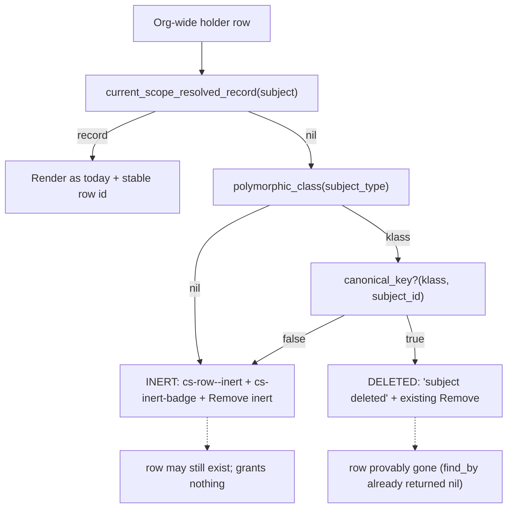

# Members Page Inert vs Deleted Org-Wide Holders - Plan

## Goal Capsule

- **Objective:** On the role members page, an org-wide holder whose subject does not resolve shows WHY: an inert badge when the stored token or id cannot be resolved (the subject row probably still exists), or "subject deleted" when the row is provably gone. Today both say "subject unavailable", which implies deletion.
- **Authority hierarchy:** this plan → issue #164 → the scoped-holders inert treatment on the same page (#90, PR #104) → #151 canonical-key rules (never resolve a non-canonical id to a live record).
- **Execution profile:** view and helper change only. Reuse the existing `cs-inert-badge` / `cs-row--inert` CSS unchanged. Classification adds no SQL beyond the resolution call the view already makes.
- **Stop conditions:** never claim "deleted" without proof. If a cause cannot be classified, render the inert wording, which admits both. Do not touch the resolver, the guard, or grant storage.
- **Tail ownership:** honest state labels for org-wide holders, plus the zero-subjects empty-state wording on the same page. The unbounded org-holders table is deferred (see Scope Boundaries).

---

## Product Contract

> **Product Contract preservation:** new work, no upstream requirements doc (`product_contract_source: ce-plan-bootstrap`). Scoped from issue #164 and code investigation of the members view, the label helpers, and `StorableKeys#current_scope_resolved_record`.

### Summary

The org-wide holders table gets the same honesty the scoped-holders table on the same page already has. A holder whose stored `subject_type` token does not reverse-resolve (or whose stored id is not a canonical key) is badged inert: the row probably still exists, only the mapping is broken, and the assignment grants nothing. A holder whose class and key are valid but whose row is missing reads "subject deleted". The two causes are told apart with in-memory checks only.

### Problem Frame

`current_scope_resolved_record("subject")` returns nil for three distinct causes:

1. The stored token does not reverse-resolve (`CurrentScope.polymorphic_class` returns nil). The subject row usually still exists; the model is not loaded or the token is not mapped. #155 invites custom `polymorphic_name` tokens, so this state is now reachable by design.
2. The stored id is not a canonical key for the resolved class (a pre-#151 collapsed value, or a host `insert_all`). The intended row may exist; its identity cannot be proven.
3. The class resolves, the key is canonical, and `find_by` finds no row. The row is gone.

The view collapses all three into one `else` branch reading "subject unavailable", which implies cause 3. The scoped-holders table on the same page already renders cause-honest UI: `cs-inert-badge`, `cs-row--inert`, "Remove inert" wording, and an explanatory `title`. The org-wide table has none of that, and the label degrades to a raw token string (`token_people #5`) with no explanation.

### Requirements

**Classification**

- R1. An org-wide holder whose subject does not resolve is classified into exactly two states: **deleted** (the token maps to a class, the stored id is a canonical key for it, and no row exists) or **inert** (every other cause: unmapped token, non-canonical id, blank id).
- R2. Deletion is claimed only when proven. Any cause that cannot be classified renders as inert, never as deleted.
- R3. Classification runs no SQL. It uses the registry lookup and the canonical-key cast only, after the resolution call the view already makes has returned nil.

**Rendering**

- R4. The inert state reuses the scoped table's treatment: a `cs-inert-badge` reading "inert", a `cs-row--inert` row class, "Remove inert" button wording with a matching confirm prompt, and an explanatory `title` that says the subject row may still exist and the assignment grants nothing.
- R5. The deleted state replaces "subject unavailable" with "subject deleted". The existing Remove button and its "orphaned" confirm prompt stay.
- R6. A holder whose subject resolves renders exactly as today. No markup change for healthy rows.
- R7. The label for an unresolved holder stays the raw `type #id` fallback (traceable, per PR #104 review). The badge and title carry the explanation; the label helper's fallback text does not change.
- R8. Org-holder rows carry stable DOM ids (`org_holder_<id>` on the row; ids on the remove buttons), matching the scoped rows' `scoped_holder_<id>` convention and the repo testing policy.

**Ride-along (same page, decided in KTD-6)**

- R9. The add-members empty state distinguishes zero subjects from full coverage. "Every subject already holds this role org-wide" appears only when at least one subject exists.

**Non-interference**

- R10. No change to the resolver, `StorableKeys`, grant storage, or the fail-closed #151 rules. The badge styling ships unchanged and stays correct in both themes (it derives from `--cs-danger`, which both dark-theme blocks redefine).

### Actors

- A1. Admin reviewing who holds a role, deciding which stale assignments to remove.
- A2. Host developer who adopted a custom `polymorphic_name` token (#155) and sees old rows stored under a token that no longer maps.
- A3. Operator cleaning up after a real subject deletion.

### Key Flows

- F1. Inert holder
  - **Trigger:** an org assignment stored under `subject_type: "token_people"` while no loaded class claims that token.
  - **Steps:** admin opens the members page. The row is muted (`cs-row--inert`), badged "inert" with a title explaining the token does not resolve and the assignment grants nothing, and the button reads "Remove inert".
  - **Outcome:** the admin knows the subject was not necessarily deleted. Covers R1, R4, R8.
- F2. Deleted subject
  - **Trigger:** a holder's `User` row is destroyed; the assignment row survives (polymorphic, no `dependent:`).
  - **Outcome:** the row reads "subject deleted" with the existing Remove button. No inert badge. Covers R1, R5.
- F3. Healthy holder
  - **Trigger:** a normal holder.
  - **Outcome:** identical markup to today plus the stable row id. Covers R6, R8.
- F4. Empty subject table
  - **Trigger:** the host has zero subjects and the role has zero holders.
  - **Outcome:** the add section no longer claims "Every subject already holds this role org-wide". Covers R9.

### Acceptance Examples

- AE1. Covers F1. Given a `RoleAssignment.insert!` row with an unmapped token, when the members page renders, then `#org_holder_<id>` has class `cs-row--inert`, contains a `.cs-inert-badge`, and its button says "Remove inert".
- AE2. Covers F2. Given a holder whose `User` row was destroyed, when the page renders, then the row says "subject deleted" and has no `.cs-inert-badge`.
- AE3. Covers F1/F2 boundary. Given a mapped token with a non-canonical stored id (for example `"007"` on a bigint key), then the row renders inert, not deleted (R2: identity unproven).
- AE4. Covers F4. Given zero subjects, when the members page renders, then the "Every subject already holds this role" sentence is absent.

### Success Criteria

An admin can tell "mapping broken, row probably alive" from "row gone" without opening a console. All existing members-page tests stay green. No new SQL per row. The badge is legible in light and dark themes in a real browser.

### Scope Boundaries

**In scope**

- The org-wide holders `else` branch on the members view, one classification helper, stable DOM ids on org rows, the zero-subjects empty-state wording, tests (helper, integration, system), CHANGELOG entry.

**Deferred to Follow-Up Work**

- The unbounded org-holders table (`RoleAssignment.where(role: @role).to_a` renders every row while the add list caps at 100). This is a scale concern, not a labeling concern; it needs a pagination or cap design consistent with the subjects page, and this plan's per-row work is O(1) in memory, so it does not worsen the render. It stays tracked in #164's related-observations note; file a dedicated issue when the PR defers it on a review thread (repo rule: a deferral must cite an issue).
- Registry internals cleanup is issue #163; see KTD-3 for the seam.

**Outside this product's identity**

- Auto-deleting inert rows, or resolving a non-canonical id to a "probable" record. #151 forbids guessing.
- Changing the label helper's raw `type #id` fallback text.
- Any resolver or storage change.

---

## Planning Contract

### Key Technical Decisions

- KTD-1 — Two user-facing states, three internal causes. `current_scope_resolved_record("subject")` proves deletion only on cause 3 (class resolves, key canonical, `find_by` nil). Causes 1 (unmapped token) and 2 (non-canonical id) both render inert: the row's identity or mapping is broken, and claiming deletion would be a lie. This is the issue's "reserve the deleted wording" ask, taken strictly: deleted is the narrow, proven branch; inert is the honest default.

- KTD-2 — Classification lives in one helper next to the holder-label helpers in `app/helpers/current_scope/application_helper.rb`. It runs only after the view's existing resolution call returned nil, and it re-derives the cause with `CurrentScope.polymorphic_class(assignment.subject_type)` (a registry hash read) and `CurrentScope.canonical_key?(klass, assignment.subject_id)` (a type cast; it rescues internally and fails closed). No query: the "row missing" fact is already established by the nil resolution. Rescue discipline mirrors `current_scope_holder_subject_label`: rescue `NameError` and `ActiveRecord::RecordNotFound` into the inert state; let `ConfigurationError` (poisoned registry) propagate, exactly as `current_scope_resolved_record` does deliberately.

- KTD-3 — Call `CurrentScope.polymorphic_class(type)` without the `owner:` keyword. `RoleAssignment.subject_types_for` already calls it bare, and issue #163 plans to drop the vestigial parameter. A bare call means #163 and this change merge in either order with zero friction. There is no hard dependency between the two; note for the portfolio pass: if #163 lands first, nothing here changes; if this lands first, #163's sweep does not touch this call site.

- KTD-4 — Reuse the CSS unchanged, both themes already covered. `.cs-inert-badge` and `.cs-row--inert` derive from `--cs-danger` via `color-mix` on transparent (`app/assets/stylesheets/current_scope/application.css`). `--cs-danger` is redefined in both dark blocks (`@media (prefers-color-scheme: dark)` guarded by `:root:not([data-cs-theme])`, and `:root[data-cs-theme="dark"]`), so the badge is theme-correct on the org table with zero stylesheet work. Verified by reading the token definitions; the system test plus the showcase check confirm it in a real browser.

- KTD-5 — The inert title states the authorization fact, not just the mystery. `Resolver#org_role` looks up `RoleAssignment.find_by(subject: subject)`, which writes the live subject's current storage token, so a stale-token row can never match: the assignment grants nothing. It also does not block a re-grant (the one-org-role validation compares raw type strings, and `subject_types_for` drops unmapped tokens, so the add list re-offers the subject). "Remove inert" is therefore always safe advice. Title wording (directional): "This subject cannot be resolved from the stored type and id. The row may still exist, but this assignment grants nothing." The deleted-state text is the two words "subject deleted".

- KTD-6 — Ride-along decisions, made explicitly per the issue's ask. (a) The zero-subjects empty state **rides along**: it is the same page, the same honest-wording theme, and a two-line change (the view branches on whether any subject exists; the controller exposes that with one `exists?` query fired only when the candidate list is empty). (b) The unbounded org-holders table is **deferred**: different concern (scale, not honesty), needs a pagination design, and this plan does not worsen it. See Scope Boundaries for the tracking rule.

- KTD-7 — Test split follows the repo policy. Helper unit tests own the cause classification (all three causes plus blank id). Integration tests own the markup, DOM ids, and wording (the existing `test/integration/role_members_test.rb` already builds unmapped-token holders with `RoleAssignment.insert!`). One cuprite system test owns real-browser rendering of both states, mirroring `test/system/subject_flows_test.rb`'s orphaned-badge test. Before merge, the states are also verified by eye in the showcase app (:3006), per the repo's real-browser UI rule.

### High-Level Technical Design

The prose is authoritative: the `cls`/`key` steps are in-memory; the only query in the flow is the resolution call the view already makes.

### Assumptions

- An org `RoleAssignment` row with an unmapped token or non-canonical id can only exist via direct insert or drift (validation blocks it at write time). That is exactly the population this UI must describe honestly, and `insert!` is how tests build it.
- "Cheap" means no additional SQL per row. The registry lookup and the key cast are in-memory; `canonical_key?` reads the schema cache already loaded by the page.

### Sequencing

U1 classifier. U2 view rendering on top of U1. U3 empty-state ride-along (independent, same files). U4 system test and browser verification after U2. No dependency on #163 in either order (KTD-3).

---

## Implementation Units

### U1. Unresolved-subject cause classifier

- **Goal:** One helper answers "why did this holder's subject not resolve": inert or deleted.
- **Requirements:** R1, R2, R3
- **Dependencies:** none
- **Files:**
  - `app/helpers/current_scope/application_helper.rb`
  - `test/helpers/application_helper_test.rb`
- **Approach:** A helper (directional name: `current_scope_unresolved_subject_state(assignment)`) called only when resolution already returned nil. It returns the deleted state only when `CurrentScope.polymorphic_class(assignment.subject_type)` (bare call, KTD-3) returns a class AND `CurrentScope.canonical_key?(klass, assignment.subject_id)` is true; every other outcome, including a rescue, is inert. Sits next to `current_scope_holder_subject_label` and follows its rescue set (KTD-2).
- **Patterns to follow:** `current_scope_holder_subject_label` rescue discipline; `StorableKeys#current_scope_resolved_record` cause ordering; `RoleAssignment.insert!` fixture style from `test/integration/role_members_test.rb`.
- **Test scenarios:**
  - Happy: mapped token, canonical id, destroyed row → deleted.
  - Happy: `insert!` row with token `"token_people"` and no registered class → inert.
  - Edge (covers AE3): mapped token with non-canonical id (`"007"`, or a UUID-shaped string on a bigint key) → inert, never deleted.
  - Edge: blank `subject_id` → inert.
  - Error: a token whose classification raises `NameError` → inert, page survives.
- **Verification:** `bin/rails test test/helpers/application_helper_test.rb` green; no SQL asserted in the classifier paths that skip `find_by` (the deleted case relies on the caller's prior nil resolution, not a new query).
- **Stop here if:** the deleted case turns out to need a second `find_by` to be correct. That would break R3; stop and re-read the view's call order before adding any query.

### U2. Org-wide else branch renders the two states

- **Goal:** The members page shows inert and deleted differently, with stable DOM ids.
- **Requirements:** R4, R5, R6, R7, R8, R10
- **Dependencies:** U1
- **Files:**
  - `app/views/current_scope/roles/members.html.erb`
  - `test/integration/role_members_test.rb`
  - `CHANGELOG.md`
- **Approach:** In the org-wide holders loop: add `id="org_holder_<id>"` to every row and `cs-row--inert` when the state is inert. Split the view on the resolved record, not on `subject_gid`. `to_gid` with a bare rescue can nil a live subject and would then label it deleted. When resolution is nil, branch on U1's state: inert renders the `cs-inert-badge` with the KTD-5 title, a "Remove inert" `button_to` (id `org_remove_<id>`) with a matching confirm; deleted keeps the existing button (same id) and swaps "subject unavailable" for "subject deleted". Take `to_gid` only on the healthy path. The healthy branch also gains the row id. Labels stay on `current_scope_holder_subject_label` unchanged (R7). No CSS edits (KTD-4).
- **Patterns to follow:** the scoped-holders rows in the same file (`scoped_holder_<id>`, badge + title, "Remove inert" prompt wording); `cs_confirm` data attributes.
- **Test scenarios (integration):**
  - Covers AE1. Unmapped-token holder: `#org_holder_<id>.cs-row--inert` exists, `.cs-inert-badge` present, button text "Remove inert", body does not contain "subject deleted" for that row.
  - Covers AE2. Destroyed subject: row says "subject deleted", no `.cs-inert-badge` in the org table.
  - Healthy holder: no badge, no inert class, row id present (AE-adjacent, pins R6/R8).
  - The inert row's remove button still deletes via `role_assignment_path` (DELETE) and the row disappears.
  - Existing test "members does not re-offer a holder stored under a custom subject token" stays green after the markup change.
- **Verification:** `bin/rails test test/integration/role_members_test.rb` green; `bin/rubocop` clean; no change to `app/assets/stylesheets/current_scope/application.css` in the diff.
- **Stop here if:** distinguishing the states forces a per-row query or a controller preload change. That contradicts R3/KTD-2; go back to U1 rather than widening the controller.

### U3. Zero-subjects empty state (ride-along)

- **Goal:** "Every subject already holds this role org-wide" appears only when subjects exist.
- **Requirements:** R9
- **Dependencies:** none (same files as U2; land after it to avoid merge noise)
- **Files:**
  - `app/controllers/current_scope/roles_controller.rb`
  - `app/views/current_scope/roles/members.html.erb`
  - `test/integration/role_members_test.rb`
- **Approach:** When `@candidates` is empty, the controller asks once whether any subject exists (`subject_class.exists?`, fired only in that branch). The view then renders either the existing sentence or a zero-state sentence (directional: "No subjects exist yet, so there is no one to add."). No behavior change when candidates exist.
- **Test scenarios:**
  - Covers AE4. Zero subjects, zero holders: the "Every subject already holds" sentence is absent; the zero-state sentence is present.
  - One subject holding the role, none free: the existing sentence still renders.
- **Verification:** `bin/rails test test/integration/role_members_test.rb` green.
- **Stop here if:** the distinction needs more than one extra query in the empty branch. Then it is not the two-line ride-along KTD-6 approved; defer it alongside the unbounded-table observation instead.

### U4. System test and real-browser verification

- **Goal:** The badge and wording are proven in a real browser, both states, both themes.
- **Requirements:** R4, R5, R10 (browser proof); repo UI rule (real browser before merge)
- **Dependencies:** U2
- **Files:**
  - `test/system/members_inert_badge_test.rb` (new)
- **Approach:** One cuprite system test seeding both an unmapped-token holder (`insert!`) and a destroyed-subject holder on one role, visiting `/current_scope/roles/<id>/members`, and asserting `#org_holder_<id>.cs-row--inert`, `.cs-inert-badge` text `/inert/i`, "Remove inert" button, and "subject deleted" on the other row. Mirror `test/system/subject_flows_test.rb`'s orphaned-badge test (it already handles the CSS uppercase transform). Dark mode: KTD-4 shows the tokens are theme-complete; add one assertion flipping the `data-cs-theme="dark"` attribute (the `theme_toggle_test.rb` pattern) and re-asserting badge visibility, rather than a screenshot diff.
- **Test scenarios:**
  - Covers AE1/AE2 in a real browser: both rows render their distinct states on one page.
  - Dark theme: badge still visible after toggling to dark.
- **Verification:** `bin/rails test:system` green. Then the manual gate: run the showcase app (sibling repo `current_scope_showcase`, port 3006, engine as `path:` gem; restart the server since `app/` helpers hot-reload but a stale process can mask view changes), create the two states, and eyeball both themes before merge. The repo owner requires this; it is not optional.
- **Stop here if:** the showcase app cannot reach the inert state (it may block direct inserts). Fall back to the dummy app via `bin/rails s` inside `test/dummy` for the eyeball check and say so in the PR body.

---

## Verification Contract

| Gate | Command / signal | Proves |
|---|---|---|
| Classifier | `bin/rails test test/helpers/application_helper_test.rb` | R1, R2, R3 |
| Page markup | `bin/rails test test/integration/role_members_test.rb` | R4 to R9 |
| Real browser | `bin/rails test:system` | badge renders, both states, dark theme |
| Manual browser | showcase (:3006) or dummy server, both themes | repo UI rule |
| Regression | `bin/rails test` | nothing else moved |
| Lint | `bin/rubocop` | house style |

Note: `rake test` runs nothing and exits 0 in this repo; only `bin/rails test` counts. CI's mysql and postgres adapter jobs need no special attention: the change adds no SQL beyond one `exists?` in an empty-state branch.

### Definition of Done

- U1 to U4 complete. "subject unavailable" no longer appears in the org-wide table.
- "subject deleted" renders only on the proven branch; every other unresolved cause is badged inert.
- Org rows carry stable ids. CSS untouched. No new per-row SQL.
- The zero-subjects empty state no longer claims full coverage.
- The unbounded-table observation is explicitly deferred with an issue reference in the PR conversation, not silently dropped.

### System-Wide Impact

Display-only. The resolver, guard, storage, and audit paths are untouched, so no security surface moves. The subjects page's scoped chips already carry their own inert treatment and are unaffected. Issue #163's registry refactor shares one call site shape with U1; KTD-3 keeps the seam frictionless in either merge order.

### Risks

- Wording drift: docs describe "inert" as "a grant whose record was deleted" (`docs/guides/checking-permissions.md`). This plan widens inert on the org side to "cannot be resolved". The badge title carries the precise meaning; if a reviewer flags the guide, a one-line clarification there is in-scope for the PR, not a new unit.
- A poisoned registry raises `ConfigurationError` through the new helper (KTD-2). That is the existing, deliberate fail-loud contract of `current_scope_resolved_record`; do not rescue it just to keep the page up.
- The view's existing `subject_gid` line uses a bare inline `rescue nil`; the classifier must not rely on state that rescue may have swallowed. U1's own rescue-to-inert covers this.

### Sources

- Issue #164 (this work); issue #163 (registry refactor, KTD-3 seam).
- `app/views/current_scope/roles/members.html.erb` (both tables; the `else` branch).
- `app/helpers/current_scope/application_helper.rb` (`current_scope_holder_subject_label` rescue set).
- `app/models/concerns/current_scope/storable_keys.rb` (`current_scope_resolved_record` nil causes).
- `lib/current_scope.rb` (`polymorphic_class`, `canonical_key?`); `lib/current_scope/resolver.rb` (`org_role` live-token lookup, KTD-5).
- `app/assets/stylesheets/current_scope/application.css` (`--cs-danger` in `:root`, the `prefers-color-scheme` block, and `[data-cs-theme="dark"]`; `.cs-inert-badge`, `.cs-row--inert`).
- `test/integration/role_members_test.rb` (unmapped-token `insert!` pattern); `test/system/subject_flows_test.rb` (badge system-test pattern).
