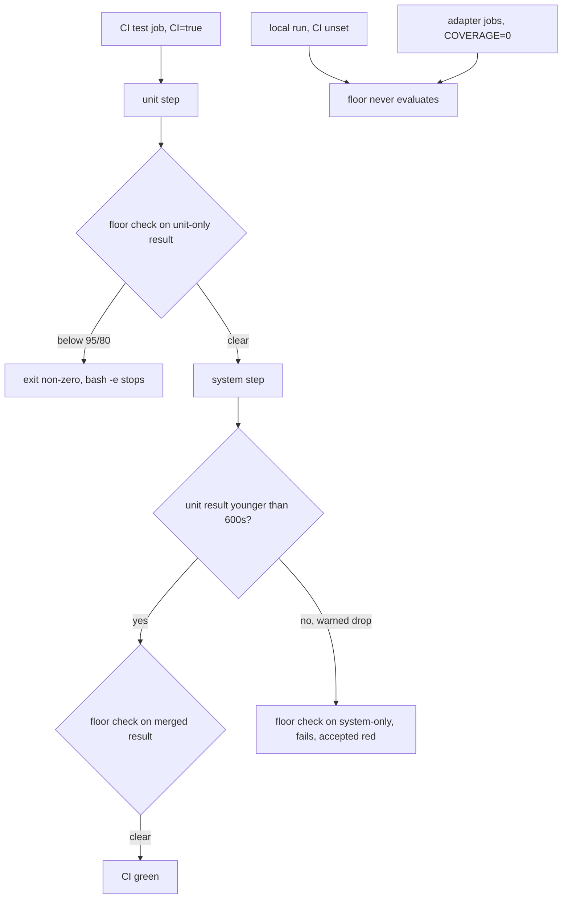

# Minimum Coverage Floor - Plan

## Goal Capsule

- **Objective:** CI goes red when coverage collapses. A `minimum_coverage` floor lands in `test/coverage_setup.rb`, armed only in CI, with numbers derived from today's real baseline, not from the stale table in issue #146.
- **Authority hierarchy:** this plan → issue #146 → the #145 revert rationale (merge_timeout stays 600s; a warned wrong-low figure beats a silent wrong-high one) → the existing pin ethos of `test/coverage_setup_test.rb`.
- **Execution profile:** one config file, one pin test, one docs paragraph. No workflow YAML change. No new knobs beyond the floor itself.
- **Stop conditions:** if a CI-measured unit-only run comes in materially below the local baseline (below 96% line or 82% branch), stop and re-derive the floor before merging. Never lower the floor to make a PR pass.
- **Tail ownership:** the floor and its docs. The docs/solutions entry for the two SimpleCov traps stays with issue #147. The four sibling PRs from this batch land after this one and must clear the floor unmodified.

---

## Product Contract

> **Product Contract preservation:** no upstream requirements doc (`product_contract_source: ce-plan-bootstrap`). Scoped from issue #146, re-derived against main@55f1c6b as instructed, because the issue's numbers predate the #158 merge.

### Summary

`test/coverage_setup.rb` gets `minimum_coverage line: 95, branch: 80`, evaluated only when `ENV["CI"]` is set. Both CI coverage steps enforce it; the unit-only step is the binding one. Local runs, including single-file runs, never fail on it. A pin test proves the floor is armed in CI and disarmed locally. CONTRIBUTING tells a contributor what a floor failure means and what to do.

### Problem Frame

Since #145 the reported figure is real, but nothing acts on it. CI uploads the coverage report as an artifact nobody has to read. The wiring pins in `test/coverage_setup_test.rb` catch load-order regressions (the ~35% failure mode), but nothing catches coverage genuinely falling because code landed untested.

Issue #146 proposed the floor but its table is stale twice over. The percentages (97.27% line / 85.34% branch on 1543 lines) predate the codebase growing to 2105 relevant lines. And its claim that "#145 set `merge_timeout 3600`" describes a mid-PR state: #145 raised it, then reverted it in review before merge (commit a9aa871 narrates the revert). Today `merge_timeout` is the 600s default, and the local "[SimpleCov]: Excluded 2 result(s) older than merge_timeout (600s)" message is that default's documented warned-drop behavior, not a bug.

Measured on main@55f1c6b, 2026-08-22:

| Run | Line | Branch |
|---|---|---|
| unit only (binding) | 96.67% (2035/2105) | 83.99% (829/987) |
| unit + system merged | 96.76% (2037/2105) | 84.09% (830/987) |

A same-day unit measurement reported 83.89% branch (828/987), so at least one branch of run-to-run jitter exists. Any floor must sit clear of that noise.

### Requirements

- R1. CI fails when coverage collapses: a line and branch `minimum_coverage` floor evaluates at the end of every CI coverage run, and a breach exits non-zero (the `bash -e` step then fails).
- R2. The floor carries headroom below the binding unit-only baseline, so honest PRs pass, including the four sibling PRs from this batch. Only collapse-scale regressions fail.
- R3. Local runs never fail on the floor. A single-file run (`bin/rails test test/grant_test.rb`) reports far below any sane floor by design and must stay green. A documented opt-in reproduces the CI check locally.
- R4. A contributor who hits the floor can find out what to do without archaeology: guidance lives in CONTRIBUTING and in the comment above the floor, and names the uploaded coverage artifact.
- R5. The floor's arming is pinned by a test, matching the file's existing ethos: the silent failure to prevent is the floor quietly not being armed in CI.
- R6. The adapter jobs (postgres, mysql) and the migrate-skill checks are untouched. They run `COVERAGE=0` and never evaluate the floor.
- R7. `merge_timeout` stays at the 600s default. No workflow YAML change.

### Actors

- A1. A contributor whose PR lands untested code at scale.
- A2. A maintainer reading a red CI step and deciding whether the floor or the code is wrong.
- A3. The four in-flight sibling PRs from this batch, which merge after this floor exists.

### Key Flows

- F1. Collapse caught
  - **Trigger:** a PR deletes tests or lands a large untested surface.
  - **Steps:** the unit step's coverage drops below 95% line or 80% branch. SimpleCov prints its below-minimum message and exits non-zero. `bash -e` fails the step.
  - **Outcome:** CI red before the system suite spends runner time. Covers R1.
- F2. Honest PR passes
  - **Trigger:** a sibling batch PR adds tested code and moves coverage a little.
  - **Outcome:** both steps stay above the floor inside the headroom. Covers R2.
- F3. Local single-file run
  - **Trigger:** `bin/rails test test/grant_test.rb` with no CI env.
  - **Outcome:** coverage reports low, the floor never evaluates, exit zero. Covers R3.
- F4. Lost merge (accepted red)
  - **Trigger:** the system step ends more than 600s after the unit result was written. Never observed in CI: the whole prepare + unit + system step takes about 45 seconds today.
  - **Outcome:** SimpleCov drops the unit result with a warning and evaluates system-only coverage (historically about 60% line), which fails the floor. That red is correct: the published artifact would be wrong. Covers R1, R7.

### Acceptance Examples

- AE1. Covers F1. Given `CI` is set and a run reports line below 95 or branch below 80, then the process exits non-zero.
- AE2. Covers F3. Given `CI` is unset, then `SimpleCov.minimum_coverage` is empty and a partial run exits zero.
- AE3. Covers F2. Given current main, when the CI-style pair of commands runs with `CI=1`, then both clear the floor.
- AE4. Covers R5. Given the pin test runs in CI, then `SimpleCov.minimum_coverage` equals exactly `{ line: 95, branch: 80 }`.

### Success Criteria

CI on this PR is green with the floor armed. A deliberate local check with `CI=1` clears the floor on both commands. The pin test fails if the floor is removed, moved, or lowered. Adapter jobs are byte-identical in behavior.

### Scope Boundaries

**In scope**

- The floor in `test/coverage_setup.rb`, its CI gate, its pin test, and the CONTRIBUTING paragraph plus CHANGELOG line.

**Deferred to Follow-Up Work**

- The docs/solutions entry for the two SimpleCov silent-failure traps (issue #147).
- Any per-file floor (`minimum_coverage_by_file`) or coverage ratchet tooling. Nothing today needs it.

**Outside this product's identity**

- Raising `merge_timeout`. #145 tried and reverted it for cause.
- Custom `at_exit` wrappers that re-implement SimpleCov's enforcement for a prettier message.
- Enforcing the floor on adapter jobs or local runs.

---

## Planning Contract

### Key Technical Decisions

- KTD-1 — Floor values: `line: 95, branch: 80`. Derived from the binding unit-only baseline on main@55f1c6b (96.67% line, 83.99% branch), not from issue #146's stale table. Line 95 leaves about 35 lines of headroom at today's 2105-line denominator. Branch 80 leaves about 39 branches, well clear of the observed ±1 branch jitter. Both floors sit far above the real failure modes they exist to catch: a bootstrap wiring regression reports about 35% line, and a lost merge publishes about 60%. The issue's example (90/75) would also work; 95/80 is tighter while still absorbing drift from the four sibling batch PRs. Changing the floor later is a deliberate one-line edit that the pin test (KTD-4) makes visible in review.

- KTD-2 — The floor applies to both CI steps; the unit-only step is the binding constraint. CI runs `SIMPLECOV_COMMAND_NAME=unit` then `=system` as separate `bash -e` commands, and SimpleCov evaluates the floor at each process exit. The unit step sees unit-only numbers; the system step sees the merged result, which is strictly higher, so it passes a fortiori. Rejected: arming the floor only on the merged step. It buys nothing (`bash -e` already skips system when unit is red, and a lost merge would evaluate system-only there anyway) and it would let a unit-only collapse ride green whenever the system step is skipped.

- KTD-3 — Enforcement is gated on a raw `ENV["CI"]` check, and that requires no workflow change: GitHub Actions sets `CI=true` on every step. Do not call `ENV["CI"].present?`. `test/coverage_setup.rb` runs after bundler/setup and before `require "rails/all"`, so ActiveSupport is not loaded and `String#present?` would raise on every run, including local single-file runs. Dummy `test.rb` may keep `.present?` because Rails is already loaded there. An unconditional floor would fail every local single-file run, because the `cover` glob keeps all of app/ and lib/ in the denominator. Local reproduction is `CI=1` in front of the two documented CI-style commands. Rejected: gating on `SIMPLECOV_COMMAND_NAME`, because a naming knob that silently switches on enforcement violates least astonishment.

- KTD-4 — One pin test, two branches on `ENV["CI"]`. When `CI` is set (GitHub, or a local `CI=1` reproduction) it asserts `SimpleCov.minimum_coverage` equals exactly `{ line: 95, branch: 80 }`. When `CI` is unset it asserts the hash is empty. Both branches must be in the same test: two separate tests that skip in opposite environments would leave the empty-hash case red in CI, because GitHub sets `CI=true`. Exact values on purpose: lowering the floor must show up as a test diff. Rejected: grepping the source of `coverage_setup.rb`, the hand-copy drift the test file itself warns against.

- KTD-5 — Stock SimpleCov failure message, guidance in docs. SimpleCov already prints "Line coverage (...) is below the expected minimum coverage (95.00%)" and sets a non-zero exit. Contributor guidance goes where a person will look next: the comment directly above the floor, and a CONTRIBUTING paragraph saying open the uploaded `coverage` artifact (or local `coverage/index.html`), cover the new red lines, and never lower the floor without a maintainer decision named in the PR. No custom `at_exit` wrapper; re-implementing enforcement for a nicer string is how silent drift starts.

- KTD-6 — The merge_timeout question is closed, not reopened. #145's in-PR revert to the 600s default stands: an expired result is dropped with a warning, a merged stale one is silent, and the CI window (about 45 seconds for prepare + unit + system) is 13x inside the timeout. The plan records this so nobody "fixes" the local exclusion warning by raising the timeout again.

### High-Level Technical Design

The floor is one config line inside the existing `SimpleCov.start` block. Everything else in the diagram already exists.

### Assumptions

- CI-measured coverage sits at or slightly above the local figures (CI eager-loads the dummy app; the denominator is glob-driven and identical). The floor is derived from the lower local figure, so the skew is on the safe side. The stop condition in the Goal Capsule covers the surprise case.
- simplecov 1.1.1 (bumped by #167) keeps the 1.x `minimum_coverage line:, branch:` API and the `minimum_coverage` getter. Verified against the installed gem during implementation, and the pin test fails loudly if the getter moves.

### Sequencing

U1 floor plus pin test. U2 docs. U2 depends on U1 so CONTRIBUTING never documents an unarmed floor.

---

## Implementation Units

### U1. Arm the floor in CI and pin it

- **Goal:** the floor exists, evaluates only in CI, and cannot silently disappear.
- **Requirements:** R1, R2, R3 (gate half), R5, R6, R7. Decisions: KTD-1, KTD-2, KTD-3, KTD-4, KTD-6.
- **Dependencies:** none
- **Files:**
  - `test/coverage_setup.rb`
  - `test/coverage_setup_test.rb`
- **Approach:** inside the `SimpleCov.start` block, add `minimum_coverage line: 95, branch: 80` guarded by a raw `if ENV["CI"]` (KTD-3: no `.present?`). Replace the trailing "No minimum_coverage yet — tracked in #146" comment with a short comment stating the baseline the numbers came from (unit-only 96.67/83.99 on main@55f1c6b, 2026-08-22), that the unit step is the binding evaluation, and that lowering the floor is a maintainer decision, not a PR fix. No change to `merge_timeout`, `cover`, or the `skip` filters.
- **Patterns to follow:** the existing pin style in `test/coverage_setup_test.rb` (assert observable config state, name the silent failure in the assertion message); the raw `ENV["COVERAGE"] == "0"` guard at the top of `coverage_setup.rb` (same file, same load timing).
- **Test scenarios:**
  - Covers AE2 and AE4 in one test (KTD-4). If `ENV["CI"]` is set, `SimpleCov.minimum_coverage` equals exactly `{ line: 95, branch: 80 }`. If it is unset, the hash is empty. Message names why local single-file runs must stay green.
  - Guard: `SimpleCov.respond_to?(:minimum_coverage)` asserted first with a re-derive-not-delete message, matching the file's existing internals-pin discipline.
- **Verification:** `bin/rails test test/coverage_setup_test.rb` green locally. Then `CI=1 SIMPLECOV_COMMAND_NAME=unit bin/rails test` followed by `CI=1 SIMPLECOV_COMMAND_NAME=system bin/rails test:system` on a fresh `coverage/`: both exit zero and print figures above the floor (AE3). A deliberate negative control once, locally: set the line floor to 99 and watch the unit run exit non-zero, then restore.
- **Stop here if:** the `CI=1` unit run reports below 96% line or 82% branch (the CI/local skew assumption is then wrong; re-derive the floor from the actual figure before proceeding), or `SimpleCov.minimum_coverage` does not exist or returns a different shape under 1.1.1 (the pin needs a different probe; do not ship the floor unpinned).

### U2. Tell contributors what a floor failure means

- **Goal:** a contributor who hits the floor knows what happened and what to do next.
- **Requirements:** R3 (docs half), R4. Decisions: KTD-5.
- **Dependencies:** U1
- **Files:**
  - `CONTRIBUTING.md`
  - `CHANGELOG.md`
- **Approach:** extend the existing "Test suite" coverage passage in CONTRIBUTING with one short paragraph: CI enforces `minimum_coverage line: 95, branch: 80`; a failure means code landed without tests; open the `coverage` artifact CI uploads (or local `coverage/index.html`) and cover the red lines; reproduce locally by putting `CI=1` in front of the two already-documented `SIMPLECOV_COMMAND_NAME` commands; the floor is not lowered to make a PR pass. One CHANGELOG line under the unreleased section. Do not restate the merge_timeout story; CONTRIBUTING already covers it.
- **Patterns to follow:** the existing CONTRIBUTING coverage prose (plain sentences, commands in fenced blocks).
- **Test expectation:** none -- docs-only unit; U1's pin test owns the behavior.
- **Verification:** every command and number in the new paragraph exists in the shipped code (floor values match `test/coverage_setup.rb` exactly). `bin/rubocop` stays clean.
- **Stop here if:** the paragraph needs to name a flag or value U1 did not ship; fix U1 first, never document intent.

---

## Verification Contract

| Gate | Command / signal | Proves |
|---|---|---|
| Pin | `bin/rails test test/coverage_setup_test.rb` | R5, floor disarmed locally |
| Local parity | `CI=1` in front of both CI-style commands, fresh `coverage/` | R2, R3, AE3 |
| Negative control | line floor briefly set to 99, unit run exits non-zero, restored | R1, AE1 |
| Full suite | `bin/rails test` and `bin/rails test:system` | nothing else regressed |
| Adapters | `bin/db test` | R6, `COVERAGE=0` path untouched |
| Lint | `bin/rubocop` | house style |
| CI on the PR | unit and system steps green with `CI=true` | R1, R2, AE4 |

### Definition of Done

- The floor is armed in CI at 95/80, disarmed locally, and pinned by a test.
- Current main clears it with the measured headroom.
- CONTRIBUTING and the code comment agree on the numbers and the recovery steps.
- `merge_timeout`, the workflow YAML, and the adapter jobs are unchanged.

### System-Wide Impact

CI failure behavior changes for the first time since #145: a coverage collapse is now red, not an unread artifact. The four sibling batch PRs inherit the floor; their honest test-backed changes fit inside the headroom. No runtime, gem, or host-app impact; this is test tooling only.

### Risks

- The batch PRs drift coverage toward the floor legitimately. Accepted: 35 lines and 39 branches of headroom absorb normal drift, and a deliberate floor adjustment is a visible one-line edit plus a pin-test diff.
- A future slow system suite could cross the 600s merge window and turn the system step red at about 60% line. Accepted and documented in F4: that red is correct because the published artifact would be wrong. The fix at that point is faster steps, never a raised timeout (KTD-6).
- CI-vs-local skew from eager loading. Mitigated by deriving the floor from the lower local figure and by the U1 stop condition.

### Sources

- Issue #146 (the proposal, with stale numbers) and issue #147 (the traps write-up, deferred).
- Commit a9aa871 (#145): the merge_timeout 3600 revert rationale in the commit narrative.
- `test/coverage_setup.rb`, `test/coverage_setup_test.rb`, `.github/workflows/ci.yml`, `CONTRIBUTING.md`.
- Measurements on main@55f1c6b, 2026-08-22: unit-only 96.67% line (2035/2105) / 83.99% branch (829/987); merged 96.76% / 84.09%; sibling same-day unit run at 83.89% branch; CI "Run tests" step duration about 45 seconds on the latest main run.
