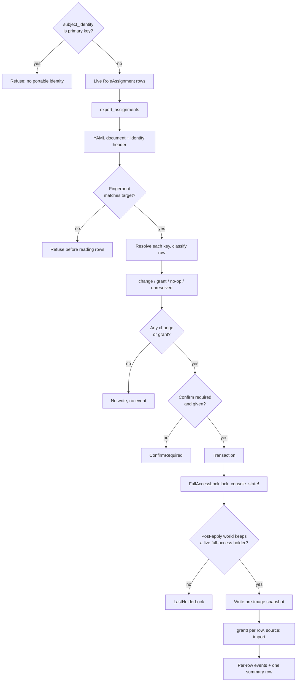

# Portable Role Assignments - Plan

> **This is issue #156 v2.** v1 shipped role definitions (PR #177, merged as
> `5d66839`). Definitions travel because a role is a name and a set of
> route-derived permission keys. Assignments do not travel, because they name a
> subject by a primary key that means nothing in the next environment. This plan
> covers that gap for **org-wide** assignments only. Every file path, method
> name, and guard claim below was verified against `main` at `be63631`.

## Goal Capsule

- **Objective:** a host can carry org-wide role assignments between environments
  as one reviewable YAML document, keyed on a portable subject identity, with a
  diff, a confirm gate, and a rollback bounded to the subjects the document names.
- **Authority hierarchy:** this plan → issue #156 v2 → `config.subject_identity`
  (#158) → the last-held full-access lock → fail-closed resolver (untouched).
- **Execution profile:** extend the identity API's first real caller. Build the
  document PORO, then thin rake wrappers, matching v1 unit for unit.
- **Stop conditions:** refuse to export when the host has no portable identity.
  Refuse to apply when the document's identity fingerprint does not match the
  target's. Refuse to apply a change that would leave zero live org-wide
  full-access holders. Never create a subject. Never revoke by omission.
- **Tail ownership:** org-wide only. Scoped assignments need a portable way to
  name the scope record and no such mechanism exists; they are deferred with
  their reason written down (KTD-8).

---

## Product Contract

> **Product Contract preservation:** new capability, no upstream requirements
> doc (`product_contract_source: ce-plan-bootstrap`). Scoped from issue #156 v2,
> the four product decisions confirmed on 2026-08-23 (KTD-1, KTD-2, KTD-3,
> KTD-9), and a code survey of the identity, assignment, and document machinery.

### Summary

Export, diff, and import org-wide role assignments as one YAML document. A row
is a portable subject key plus a role name. The document is additive: it grants
what it names and never revokes. Rollback restores the prior state of exactly
the subjects the document named.

### Problem Frame

`current_scope_role_assignments` stores `subject_type` plus `subject_id`, and
`subject_id` is the subject's declared primary key as a string. A development id
names nothing in production, or worse, names an unrelated person. So the one
thing an operator most wants to replay between environments, who holds which
role, is the one thing v1 could not carry.

#158 already solved the key half and said so in writing: `config.subject_identity`
compiles to a resolver with `identify` (record to portable key) and `resolve`
(portable key to record in this environment). It reads only, refuses a two-row
match rather than taking a first-row win, and raises at boot when the declared
identity columns are not unique. It has no production callers yet. This plan is
its first one.

The trap is the default. `config.subject_identity` defaults to `nil`, which
compiles to `PrimaryKeyResolver`, so an unconfigured host mints exactly the
non-portable id this feature exists to avoid. Export must refuse that state
rather than produce a file that looks portable and is not.

### Requirements

**Document**

- R1. One YAML format, `apiVersion: current_scope/assignments-v1`. Psych
  `safe_load` with `permitted_classes: []` and `aliases: false`, matching v1.
- R2. A row carries a portable subject key and a role `name`. Nothing else. The
  key is whatever `CurrentScope.identify_subject` returns: a String for a single
  column or the primary key, an Array of Strings for a composite.
- R3. The document header records the identity that minted the keys (the
  declared column list, the literal `primary_key`, or a host object's class
  name). Diff and apply refuse a document whose fingerprint does not match the
  target environment's own configuration.
- R4. Rows are sorted by subject key, then by role name. Two exports of the same
  state are byte-identical.
- R5. Applying the same document twice is a no-op the second time.

**Export**

- R6. Export refuses when the compiled resolver reports `primary_key?`. The
  message names `config.subject_identity` and the setup task. There is no
  override, because a file produced in that state is indistinguishable from a
  portable one once it leaves the machine.
- R7. Export skips an assignment whose stored subject no longer resolves to a
  live record, and reports each skipped row. An inert row has no portable
  identity to mint.

**Diff**

- R8. Diff is read-only and never writes.
- R9. Diff classifies every row: a grant (the subject holds no org role), a
  change (the subject holds a different org role), a no-op (already holds it),
  or unresolved (the key finds no subject here). A change prints both role
  names, because one org role per subject means a grant to a held subject is a
  replacement.
- R10. Diff prints changes before grants, so the destructive half of an additive
  document is read first.

**Apply**

- R11. Additive only. A subject absent from the document keeps whatever they
  hold. There is no revoke-by-omission and no flag that enables one.
- R12. Apply skips an unresolved row, records it in the result, and applies the
  rest. It never creates a subject. The diff shows the same rows first, so an
  operator can fix the document before applying.
- R13. Apply refuses a document that names two org roles for one subject, at
  parse time, not mid-transaction.
- R14. Apply refuses a change that would leave zero live org-wide full-access
  holders, using the same rule and the same lock as v1. Additive does not make
  this safe: replacing the last full-access holder's role is a revocation.
- R15. `Rails.env.production?` always requires an explicit confirm. Other
  environments require confirm when any org-wide assignment already exists.
- R16. Confirm is `confirm: true` on the API and `CONFIRM=1` on the rake task. A
  TTY prompt is allowed only when `$stdin.tty?` and `ENV["CI"]` is blank. An
  agent must not set the flag unless a human asked in that turn.

**Rollback and ledger**

- R17. Before a mutating apply, snapshot the prior org role of exactly the
  subjects the document names, including an explicit absence for a subject who
  held none.
- R18. Rollback restores that snapshot through the same apply path and the same
  guards. Restoring an explicit absence removes the org role the import added.
- R19. Each applied row records one `org_role.assigned`, `org_role.changed`, or
  `org_role.removed` event, targeted at the grantee per the ledger's normative
  rule. `details.source` names the operation that wrote it, `"import"` or
  `"rollback"`, so a ledger filter can tell an undo from an apply. A removal
  carries `details.role`, matching the shape the console already writes. The
  operator is both the actor and the subject of every one of these rows (R19b).
- R19b. An imported row is not an impersonation. The ledger's normative rule is
  that impersonated rows are exactly those where `subject` differs from `actor`,
  so an import must set BOTH to the operator and carry the grantee in `target:`.
  Setting only the actor would label every bulk import as an act-as.
- R20. The operation records one summary event, `assignments.applied` or
  `assignments.rolled_back`, against a reserved target, carrying the counts and
  the snapshot path.
- R21. A no-op apply (every row already holds its role) records nothing.

**Surface**

- R22. The programmatic API is the source of truth:
  `CurrentScope.export_assignments`, `diff_assignments`, `import_assignments`,
  `rollback_assignments`. Rake tasks under `current_scope:assignments:` are thin
  wrappers, matching the shape of `current_scope:definitions:`.
- R23. A guide at `docs/guides/portable-assignments.md`, and a short playbook
  line in `docs/site/ai-agents.md` that states the confirm rule in the same
  words as R16.

**Roles the target does not have**

- R24. Diff and apply resolve every distinct role name against the live roles
  table before the transaction opens, and refuse the whole document naming every
  missing name, mirroring v1's `UnknownCatalogKey`. The write is handed an
  already-resolved `Role`, never a name. This is a numbered requirement rather
  than an assumption because of what it guards: `CurrentScope.grant!` treats a
  nil role as "seed the defaults and grant Owner", and the seeded Owner is
  `full_access`. A role name that silently resolved to nil would therefore hand
  out console access, which is the one privilege escalation this feature could
  produce.

### Actors

- A1. Maintainer replaying a known set of operators into a fresh staging database.
- A2. Reviewer reading a pull request that changes the assignments document.
- A3. CI or deploy job that may run diff always and import only with confirm.

### Key Flows

1. **Configure once.** The host sets `config.subject_identity` and runs
   `current_scope:identity:check`. Without this, export refuses (R6).
2. **Export.** `current_scope:assignments:export FILE=config/current_scope/assignments.yml`.
3. **Review.** The file goes in a pull request. It is sorted and stable (R4).
4. **Diff on the target.** `current_scope:assignments:diff FILE=...` prints
   changes, then grants, then unresolved rows.
5. **Apply.** `current_scope:assignments:import FILE=... CONFIRM=1 ACTOR_ID=1`.
6. **Undo.** `current_scope:assignments:rollback SNAPSHOT=...pre.yml CONFIRM=1 ACTOR_ID=1`.

### Acceptance Examples

- AE1. An unconfigured host runs export and gets a refusal naming
  `config.subject_identity`. No file is written.
- AE2. A document naming a subject who holds no org role applies as one grant
  and records `org_role.assigned` with `details.source = "import"`.
- AE3. A document naming a subject who already holds a different org role prints
  as a change, applies as a replacement, and records `org_role.changed`.
- AE4. Re-applying the same document writes nothing and records nothing.
- AE5. A document whose header identity is `[email]` applied to a host
  configured `[username]` is refused before anything is read.
- AE6. A document that would move the only live full-access holder to a
  non-full-access role is refused with the last-holder message, and nothing is
  written.
- AE7. A key that resolves to no subject is skipped, named in the result, and
  the remaining rows still apply.
- AE8. Rollback after AE2 removes the org role again, because the snapshot
  recorded that the subject held none.

### Success Criteria

- SC1. A staging database with zero assignments reaches a known operator set
  from one file, one confirm, and no console clicks.
- SC2. Every refusal names the setting or the row that caused it.
- SC3. No path in this plan creates a subject, and no path revokes a role the
  document does not name.

### Scope Boundaries

**In:** org-wide assignments, the identity fingerprint, the additive apply, the
bounded rollback, the ledger rows, the rake wrappers, the guide.

**Out, each with its reason:**

- **Scoped assignments.** They name a polymorphic scope record and there is no
  portable way to name one (KTD-8).
- **A scope-side identity API.** Deferred with scoped assignments.
- **Fixture or placeholder subjects in bulk.** Today's placeholder path handles
  one subject per run, needs a host-written `create_placeholder!` factory, is
  refused in production, and has no cleanup task. Import reports instead (R12).
- **Revocation.** Additive by decision (KTD-2). Revoking stays a console action.
- **Merging into the v1 definitions file.** Two documents, two confirm gates
  (KTD-7).
- **Actor portability.** `ACTOR_ID` stays a local primary key, per v1 KTD-9.

---

## Planning Contract

### Key Technical Decisions

- **KTD-1: Export refuses the default identity; there is no marker mode.**
  Confirmed 2026-08-23. `config.subject_identity` defaults to `nil`, which
  compiles to `PrimaryKeyResolver`, so an unconfigured host would export local
  ids that silently bind to whatever rows hold those numbers in the target. The
  detection primitive is public and already used twice in the engine:
  `resolver.primary_key?`. The rejected alternative was exporting with a
  non-portable marker and gating the import instead. It keeps same-database
  round trips working, and it puts a dangerous-looking-safe file on disk whose
  safety depends on a second gate that a copy, a paste, or a different tool will
  not run. A backup and restore is `pg_dump`'s job, not this feature's.

- **KTD-2: Additive only, with no desired-state flag.** Confirmed 2026-08-23.
  v1's `persist_roles!` destroys anything the document omits, which is why it
  needs `refuse_held_deletes!`. Copying that to assignments means a stale or
  partial export strips access on apply. Additive cannot do that. The rejected
  alternative, additive with a desired-state opt-in, doubles the code paths and
  the guard sets for a capability nobody has asked for. Revocation stays where
  it is visible: the console, and `current_scope:grant`.

- **KTD-3: Org-wide only.** Confirmed 2026-08-23. See KTD-8 for what the scope
  side would take.

- **KTD-4: The identity fingerprint is a first-class header, not a comment.**
  An arity mismatch already raises inside the resolver, but a same-arity
  mismatch does not: a document minted by `:email` applied to a host configured
  `:username` resolves quietly to a different person, who then holds the role.
  That is the worst failure this feature can have, because nothing raises and
  the resulting rows are valid. The header records the declared columns (or the
  literal `primary_key`, or a host object's class name) and the diff and apply
  compare it before reading a single row.

- **KTD-5: The snapshot is a pre-image of the named subjects, not a full
  export.** Additive rollback is otherwise impossible: a snapshot that is itself
  additive cannot undo a grant to a subject who previously held nothing. The
  snapshot therefore records, for each subject the document names, the org role
  they held, or an explicit absence. **Absence is `role: null` on an ordinary
  row**, and a snapshot declares itself with `kind: snapshot` in its header.
  `parse` refuses a null role on a document without that header, so an import
  document still cannot revoke (R11), and `import_assignments` refuses a
  snapshot-kind document while `rollback_assignments` refuses a plain one, each
  naming the other entry point. Rollback applies the pre-image through the same
  path, and an explicit absence removes the row the import created, through the
  delete branch named in KTD-6. The blast radius of a rollback is exactly the
  blast radius of the apply it undoes.
  This is a different snapshot shape from v1's, and it is the reason the two
  documents do not share `default_snapshot_path` (KTD-7).

- **KTD-6: Extend `grant!` rather than write a second assignment path.**
  `CurrentScope.grant!` already does the replace correctly: it locks the
  transaction, finds or initialises by subject, updates the role, and records
  `org_role.assigned` or `org_role.changed` with the same-role case a no-op. It
  is wrong for import in exactly two ways: it hardcodes `details.source =
  "bootstrap"` and it self-attributes (`actor: subject, subject: subject`). Add
  three optional keywords, `actor:`, `subject:`, and `source:`, all defaulting to
  today's behaviour. All three matter: passing only `actor:` would leave
  `subject:` as the grantee, and the ledger reads a row whose subject differs
  from its actor as an impersonation, so a bulk import would render as a bulk
  act-as (R19b). A second write path would have to re-derive the prior role, the
  replace semantics, and the event pair, and would drift from this one.

  **`grant!` covers grant and change only.** It is a find-or-initialise-and-update
  path with no delete branch. The removal a restored absence performs is a delete
  plus one `org_role.removed`, written by the apply loop itself, inside the same
  transaction and after the same last-holder guard as the grants. That is the one
  write this plan does not route through `grant!`, and it is named here so it does
  not arrive unannounced in U4.

  > **Open against #182 (filed 2026-08-23, after this plan).** That issue reports
  > that model-level grant writes bypass the ledger entirely, and the chosen
  > direction is to record from model callbacks rather than from the console
  > controllers. If that lands first, the MECHANISM here changes: `grant!` stops
  > being where the event is written, so the three keywords carry the actor,
  > subject and source to the callback instead. The DECISION does not change, and
  > neither do R19 and R19b: one row per assignment, targeted at the grantee,
  > `source` naming the operation, and the operator as both actor and subject.
  > Reconcile this KTD with whichever of the two lands second. Do not implement
  > U3 or U5 against this mechanism until that order is settled.

- **KTD-7: Two documents, two applies, two snapshots.** A combined file would
  force one transaction holding both guard sets, and would invalidate every
  existing v1 file. `API_VERSION` on the v1 class is a single frozen constant
  compared with `==`; the assignments document gets its own constant and its own
  class. `DefinitionsDocument.default_snapshot_path` stays as it is, and the new
  class carries its own, because the two snapshots have different shapes (KTD-5)
  and one path would let a definitions apply overwrite an assignments undo point.

- **KTD-8: Why scoped assignments are deferred, so the next author does not
  re-derive it.** A scoped grant names `resource_type` plus `resource_id`.
  `resource_type` stores `klass.polymorphic_name`, which a host may override and
  which `store_full_class_name = false` shortens, so a verbatim token binds the
  file to the source environment's naming, and an unmapped token raises
  `NameError` out of validation rather than reporting a row. `resource_id` is
  the record's declared primary key, so #150 already makes a scoped grant
  portable **when the model declares a business primary key**, and not otherwise.
  The subject side is safe with one global knob because there is exactly one
  subject class, so the class invariant is checkable in both directions. Scopes
  are polymorphic across arbitrarily many host models, so the same trick does
  not transfer: it needs a per-model declaration (most plausibly a
  `current_scope_key :slug` macro beside `current_scope_parent`), a per-model
  uniqueness audit where today's boot check is written for exactly one class,
  and an ambiguity refusal mirroring `ColumnResolver#resolve`. That is its own
  plan. File it when a real host asks.

- **KTD-9: Unresolved rows are skipped and reported, not refused wholesale.**
  Confirmed 2026-08-23. Skipping fails closed: the subject does not get the
  role. The diff shows the same rows before anything is applied, so an operator
  who wants all-or-nothing gets it by reading the diff first. This is the one
  place v2 needs vocabulary v1 does not have, a result object that names what
  applied and what did not, because v1's apply is all-or-nothing by construction.

- **KTD-10: Ledger: one row per assignment, plus one summary row.** The Event
  class header states a normative rule: assignment events target the grantee,
  role events target the role. One bulk row against a reserved token would
  contradict it. One row per assignment honours it and is what an audit reader
  needs, and `details.source = "import"` is what lets them tell an import from a
  click. The summary row against a reserved `ASSIGNMENTS_TARGET` carries the
  counts and the snapshot path, mirroring v1's `definitions.applied`.

### High-Level Technical Design

### Assumptions

- A1. The host has configured `config.subject_identity` and its columns are
  unique. Boot validation already raises otherwise.
- A2. The target environment already has the roles the document names. Roles
  travel by the v1 document; this one does not create them. The refusal that
  enforces this is R24, not an assumption, because a nil role reaching `grant!`
  grants full access.
- A3. Assignment counts are operator-scale (tens to low thousands). Every
  resolve is one query. Batch resolution is a later optimisation, not a v2 unit.

### Sequencing

**Before U3, settle the #182 ordering** (see the note in KTD-6). U1, U2, U4 and
U6 are unaffected by it, so the plan is startable; U3 and U5 write the ledger
rows and must not be built against a mechanism that is about to move.

U1 and U2 are the document and its diff, and nothing else depends on the write
path. U3 adds the guards and the write. U4 adds the snapshot and rollback, which
needs U3's write path. U5 is the operator surface. U6 is the guide.

---

## Implementation Units

### U1. Assignments document, export, and the identity fingerprint

Add `CurrentScope::AssignmentsDocument` under `lib/current_scope/`. Reuse v1's
`load_source` shape (Hash, Pathname, document, inline YAML or path) and its
`safe_load` hardening, including the `Psych::Exception` to `InvalidDocument`
conversion. Add `API_VERSION = "current_scope/assignments-v1"`.

`from_live` refuses when `config.subject_identity_resolver.primary_key?` (R6),
mints each key with `CurrentScope.identify_subject`, and skips assignments whose
subject does not resolve, collecting them for the caller (R7). `to_h` emits the
identity header and the sorted rows (R3, R4).

`parse` refuses an empty document, a non-mapping, a foreign `apiVersion`, a
non-list `assignments`, a row that is not a mapping, a blank key, a blank role,
and two org roles for one subject (R13). A `null` role is the absence marker and
is accepted only on a document whose header carries `kind: snapshot` (KTD-5);
anywhere else it is refused, so an import document cannot revoke.

Tests: refusal on the default identity; a composite key round-trips as an Array;
two exports are byte-identical; an inert subject is skipped and reported; each
parse refusal.

### U2. Fingerprint compare and diff

`fingerprint_matches?` compares the document header with the target's compiled
resolver and refuses on mismatch (R3, AE5).

`diff` resolves every key once and classifies each row as change, grant, no-op,
or unresolved (R9). `Diff#to_s` prints changes first, then grants, then
unresolved (R10). Read-only (R8).

Tests: a change prints both role names; a no-op yields an empty diff; an
unresolved row is named; a fingerprint mismatch refuses before any resolve.

### U3. Apply, confirm gate, and the last-holder guard

`apply(confirm:, actor:, subject: nil, source: "import", snapshot_path: nil,
event: "assignments.applied")`, matching v1 keyword for keyword so U4 and U5 add
behaviour rather than reopening the signature.

**`subject:` here is the ledger subject of the SUMMARY row only** (R20), the same
meaning v1 gives it, and it defaults to the actor. It is not the per-row subject.
The per-row writes never take a default: the apply loop passes `actor: operator`
and `subject: operator` explicitly on every row, with the grantee carried by
`target:`. Relying on `grant!`'s default there would leave the subject as the
grantee and record the whole import as an impersonation (R19b).

Outside the transaction:
fingerprint, then every distinct role name resolved against the live roles table
with a refusal naming any that are missing (R24), then diff, returning early when
nothing would change (R21). Then the confirm gate,
`Rails.env.production? || RoleAssignment.exists?` (R15, R16). Then the audit
actor check, matching v1.

Inside the transaction, in order: `FullAccessLock.lock_console_state!`, then the
post-apply full-access holder check (R14), then the per-row writes through the
extended `grant!` (KTD-6), then the summary event (R20).

The holder check is the subtle one, and it belongs **inside** `FullAccessLock`
rather than in the document. `live_holder?` is a `private_class_method`, and v1's
KTD-3 already settled that the last-holder rule lives in one place. Add a public
predicate that takes the post-apply org-role map (live rows, with the document's
resolved rows applied over them) and answers whether the live world had a live
full-access holder and the post-apply world would not. Inside the module it
keeps using the private `live_holder?`, so a subject whose row no longer resolves
does not count as a hand-off.

Tests: replacing the only full-access holder's role is refused and writes
nothing; a document naming a role the target does not have is refused before the
transaction, naming it (R24); an unresolved row is skipped while the rest apply;
a second apply is a no-op; an imported row records `subject == actor` so it does
not read as an impersonation (R19b); production with an empty table still
requires confirm; the audit actor refusal.

### U4. Snapshot, rollback, and the ledger

`write_snapshot` records the pre-image of exactly the named subjects, with an
explicit absence for a subject holding no org role (KTD-5, R17). Reuse v1's
`snapshot_destination` self-overwrite guard, its `ensure`-based restore, and its
own `default_snapshot_path` for this document type (KTD-7).

`CurrentScope.rollback_assignments` parses the pre-image and applies it through
the same path with the `assignments.rolled_back` event (R18). Applying an
explicit absence deletes the row and records one `org_role.removed` against the
grantee with `details.source = "rollback"` (R19), written by the apply loop
because `grant!` has no delete branch (KTD-6).

Add `Event::ASSIGNMENTS_TARGET` beside `DEFINITIONS_TARGET`, and its
`target_label`. Pin that the events index does not 500 on it, the way v1 did.

Tests: rollback after a grant removes the row and records `org_role.removed`
with `details.source = "rollback"`; rollback after a change restores the prior
role; an import document carrying a null role is refused; `import_assignments`
refuses a snapshot-kind document and names `rollback_assignments`; the summary
row carries the counts and the snapshot path; a rolled-back apply leaves the
previous snapshot intact.

### U5. Facade and rake wrappers

`CurrentScope.export_assignments`, `diff_assignments`, `import_assignments`,
`rollback_assignments` (R22). Extend `grant!` with all THREE keywords KTD-6
names, `actor:`, `subject:`, and `source:`, each defaulting to today's behaviour.
Pin two things: the default path still records `source: "bootstrap"` with actor
and subject both the grantee, and an imported row records actor and subject both
the operator (R19b). Two keywords is not enough. Adding only `actor:` leaves
`subject:` as the grantee, and a row whose subject differs from its actor is what
the ledger defines as an impersonation.

Rake: `current_scope:assignments:export|diff|import|rollback`, reusing the
`apply_document` lambda shape, `resolve_actor`, the `CONFIRM=1` policy, and the
undo-path print. Stay off `SchemaGuard::BOOT_EXEMPT_TASKS`, matching v1 KTD-9.

Tests: the task suite sets `CI` so the prompt never reads stdin, matching the
definitions task tests; import without `CONFIRM` aborts on the confirm message;
import with `CONFIRM=1` and no `ACTOR_ID` aborts on the actor message.

### U6. Guide and agent playbook

`docs/guides/portable-assignments.md`: the identity prerequisite first, then
export, review, diff, import, rollback. State plainly that the document is
additive, that scoped grants are not covered and why, and that an unresolved row
is skipped rather than created. Add the playbook line to `docs/site/ai-agents.md`
and the guide to the Source list in `docs/site/llms.txt`. CHANGELOG entry under
Unreleased.

---

## Verification Contract

### Definition of Done

- DoD1. `bin/rails test`, `bin/rails test:system`, and `bin/rubocop` green.
- DoD2. `bin/db test` green on all three adapters. The document round-trips a
  composite key and a UUID-keyed subject, which is where the string column and
  the collation work from #151 has to hold.
- DoD3. Every requirement R1 to R24 has a test or a documented reason it does not.
- DoD4. The pre-PR gate runs on the PR-head commit: ce-code-review, ie-review,
  cubic-loop local, then local CI, then open the PR.

### System-Wide Impact

- The resolver, the guard, and the management UI are untouched.
- `grant!` gains three optional keywords, `actor:`, `subject:`, and `source:`.
  Its default behaviour is pinned, and so is the imported row: both write actor
  and subject together, so neither reads as an impersonation.
- The events table gains two event names and one reserved target token.
- `config.subject_identity` gets its first production callers. A host on the
  default primary-key identity boots silently today, because boot validation
  returns early for exactly that resolver, and will now be refused at export. A
  declared identity whose columns are not unique already raises at boot; it does
  not warn.

### Risks

- **R-1. Silent mis-binding.** A same-arity identity mismatch grants the right
  role to the wrong person, and nothing raises. Mitigated by the fingerprint
  (KTD-4) and by running `current_scope:identity:check` on both environments.
  This is the risk to write the adversarial test for.
- **R-2. Console lockout by replacement.** Additive does not mean safe: an org
  role replacement is a revocation. Mitigated by R14, and it is the reason that
  guard is in this plan at all.
- **R-3. The two-document sequence.** A definitions apply and an assignments
  apply are each guarded, but the sequence, demote a role in one file and
  replace a holder in the other, is not proven safe. Write the adversarial case
  before shipping U3.
- **R-4. Partial apply.** KTD-9 accepts a partial result by design. The risk is
  an operator who reads "applied" and misses the skipped rows. The result object
  and the rake output must make the skipped count impossible to miss.

### Sources

- Issue #156, v2 section and open question 3.
- `docs/plans/2026-08-13-002-feat-role-definition-export-import-plan.md` (v1).
- `docs/plans/2026-08-13-003-feat-subject-identity-resolution-plan.md` (#158),
  which names this document format as its intended consumer.
- `docs/plans/2026-08-22-001-fix-scoped-grant-primary-keys-plan.md` (#150).
- `lib/current_scope/subject_identity.rb`, `lib/current_scope/definitions_document.rb`,
  `lib/current_scope/full_access_lock.rb`, `lib/current_scope.rb`,
  `app/models/current_scope/event.rb`, `app/models/current_scope/role_assignment.rb`.
