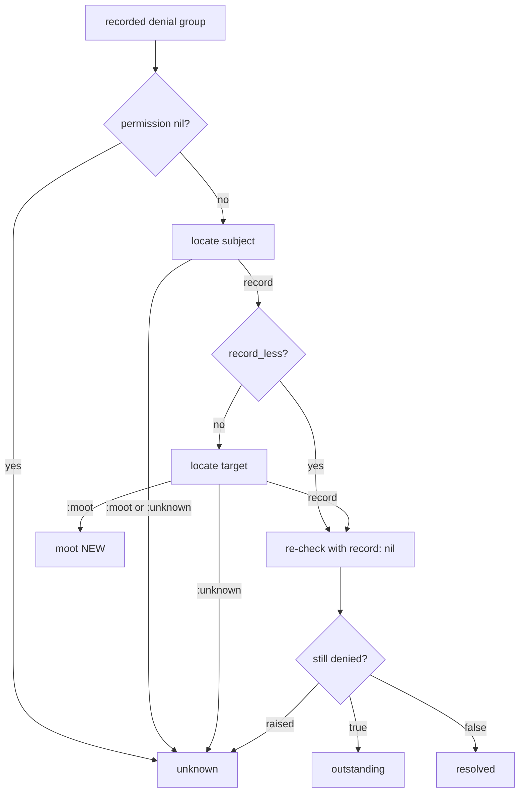

# Report Moot vs Unknown Denials - Plan

> **This is issue #190, found by the #116 real-host bake.** PR #184 (merged as
> `25c2f9f`) gave `current_scope:report` an exit condition by re-checking every
> recorded denial against live grants. The bake against a real Rails app
> (`davidteren/miela_app`, PostgreSQL, branch `chore/current-scope-bake-116`)
> proved the exit condition is still unreachable: 350 of the 1029 outstanding
> denials name a target record that has been deleted, and no grant can ever
> clear them. Every file path and line anchor below was verified against `main`
> at `8036b33`.

## Goal Capsule

- **Objective:** `current_scope:report` stops counting a recorded denial as
  outstanding when the denial's target record no longer loads, reports those
  rows on a line of their own, and keeps counting a denial whose class no longer
  resolves as outstanding.
- **Authority hierarchy:** this plan → issue #190 → the design note
  `docs/solutions/workflow-issues/the-exit-condition-nobody-can-reach.md` (its
  "cannot tell is not the same as ready" rule still binds for the unknown
  bucket) → PR #184 / PR #185 → `AGENTS.md`.
- **Execution profile:** one narrow change inside the re-check loop of the
  `current_scope:report` rake task, plus two report-line changes, plus seven
  test arms (four in U1, three in U2) and three doc edits. No resolver change,
  no gate change, no schema change.
- **Claim discipline:** this fix makes zero REACHABLE. It does not make the
  count reach zero. On the bake host the outstanding count falls from 1029 to
  679, with 350 denials moving to the new moot line. Say "makes zero reachable"
  in the plan, in the PR body, and in any comment on #190 or #116. Do not write
  "the exit condition finally reaches zero": 679 denials on that host still need
  real grants.
- **Stop conditions:** never widen this to the SUBJECT side. A denial whose
  subject no longer resolves stays UNKNOWN and stays counted as outstanding.
  Never classify a row as moot from a `nil` return or from a generic
  `StandardError`: only `ActiveRecord::RecordNotFound` on the target proves the
  class loaded and the row is gone.
- **Tail ownership:** the "should a dead subject be moot too?" question is out
  of scope and stays open on #116. If the implementer wants it, file a separate
  issue rather than widening this PR.

---

## Product Contract

> **Product Contract preservation:** no upstream requirements doc
> (`product_contract_source: ce-plan-bootstrap`). Scope comes from issue #190,
> from the bake evidence quoted in it, and from a read of the report task at
> `8036b33`.

### Summary

Split the report's single "could not be re-checked" bucket into two. A target
record that no longer loads is MOOT: the gate can never be asked about that
record again, so the row is excluded from the outstanding count and reported on
its own line. A target whose class no longer resolves is UNKNOWN: the report
cannot tell, so the row stays counted as outstanding. Subject behaviour does not
change.

### Problem Frame

`lib/tasks/current_scope_tasks.rake:201-206` defines a `locate` lambda that
rescues `StandardError` to `nil`:

```ruby
locate = lambda do |gid|
  gid.presence && begin
    GlobalID::Locator.locate(gid)
  rescue StandardError
    nil
  end
end
```

That collapses two different facts into one `nil`. The caller at
`current_scope_tasks.rake:225-228` then sends both to the `unknown` bucket,
which `current_scope_tasks.rake:312-313` adds into the headline count.

The two facts are distinguishable, and they already raise different exceptions.
Verified twice: on the bake host, and locally in this repo's dummy app at
`8036b33` via `bin/rails runner`.

| Input | Result | Meaning |
|---|---|---|
| GID of a deleted row | raises `ActiveRecord::RecordNotFound` | the class loaded, the row is gone |
| `gid://dummy/VanishedModel/1` | raises `NameError` | the class itself no longer resolves |
| `"not a gid"` | returns `nil` | unparseable, nothing was asked |

The bake numbers make the consequence concrete. The report read 1029
outstanding, of which 350 "could not be re-checked". All 7,029 recorded subjects
still resolve. Every one of the 350 is a deleted target record: 232 `Client`,
116 `InvoiceKeyRequest`, 2 `BillingCodeRequest`. The operator can grant the
other 679 and the count still reads 350, for ever. That is the unreachable exit
condition PR #184 was written to remove, one layer down.

### Requirements

**Classification**

- R1. A recorded denial whose target GID raises `ActiveRecord::RecordNotFound`
  is classified MOOT.
- R2. A recorded denial whose target GID raises `NameError` is classified
  UNKNOWN and stays counted as outstanding.
- R3. A recorded denial whose target GID is blank, unparseable, or fails for any
  other reason is classified UNKNOWN.
- R4. The subject is resolved and judged first. A denial whose subject does not
  resolve is UNKNOWN, whatever the target's state. This is unchanged behaviour.
- R5. A record-less denial never consults the target, so its classification is
  unchanged.

**Reporting**

- R6. Moot denials are excluded from the "would-be denials STILL ungranted"
  headline count.
- R7. Moot denials are excluded from the "Would-be denials still outstanding"
  detail list, so the headline and the list still agree.
- R8. Moot denials print on their own line, stating the count, that the record no
  longer loads, and that they are not counted.
- R9. The all-clear sentence does not claim every recorded denial is granted when
  some of them are moot.

### Acceptance Examples

- AE1. A host whose only remaining recorded denials name deleted records runs
  `bin/rails current_scope:report` and reads zero outstanding, plus the moot
  line. (Issue #190, "Acceptance", bullet 1.)
- AE2. A host with one recorded denial whose target class was removed from the
  app reads that denial as outstanding. (Issue #190, "Acceptance", bullet 2.)
- AE3. A host with one recorded denial whose subject row was deleted still reads
  "could not be re-checked" and does not read the all-clear. (Issue #190,
  "Acceptance", bullet 3; this is the behaviour PR #184 shipped and it must not
  move.)

### Scope Boundaries

**In scope**

- The re-check loop and the report lines in `lib/tasks/current_scope_tasks.rake`.
- Regression coverage in `test/report_task_test.rb`.
- The three docs that carry the exit-condition story.

**Deferred to follow-up work**

- Making a dead SUBJECT moot. The subject is who a grant is written for, and a
  subject can fail to resolve for reasons that are not deletion (a class not
  loaded in this process, a tenant not connected, a soft delete that will be
  undone). File a separate issue if the bake shows this matters.
- Retiring moot rows from the ledger. The ledger is append-only by design
  (`app/models/current_scope/event.rb:24`), and this plan reinterprets history
  rather than rewriting it.
- Moving the `locate` lambda out of the `.each` block. It is re-created per
  group today. That is a tidy, not this fix.

**Outside this change**

- `lib/current_scope/resolver.rb` and `lib/current_scope/guard.rb`. Nothing about
  the gate or the recording side changes.
- The other five `GlobalID::Locator.locate` call sites
  (`lib/tasks/current_scope_tasks.rake:124`,
  `app/controllers/current_scope/application_controller.rb:89`,
  `app/controllers/current_scope/scoped_role_assignments_controller.rb:31` and
  `:92`, `app/helpers/current_scope/application_helper.rb:149`). They answer
  different questions and none of them feeds the outstanding count. One of them,
  `application_helper.rb:149`, is still required reading: it is the in-repo
  precedent for KTD-1. Its code does not change; see KTD-1.

---

## Planning Contract

### Key Technical Decisions

**KTD-1: Classify by exception class, not by a pre-flight existence query.**
`GlobalID::Locator::BaseLocator#locate` (globalid 1.4.0,
`lib/global_id/locator.rb:211-217`) calls `gid.model_class` then
`model_class.find`. The first raises `NameError` through `constantize`; the
second raises `ActiveRecord::RecordNotFound`. Rescuing the two classes
separately costs one `rescue` clause and needs no extra query. A pre-flight
`exists?` would need the class to resolve first, which is the very thing being
tested.

**Precedent, read it before coding.** This is not a new fact in this repo.
`current_scope_gid_label` (`app/helpers/current_scope/application_helper.rb:148-155`)
already rescues these two classes and its comment states the contract KTD-1 rests
on: "locate RAISES for a deleted record or renamed class (nil is only for
unparseable strings)". One correction to the record, since an earlier note said
otherwise: that helper lists both classes in ONE `rescue` clause, because a
display label degrades the same way for either. The report must split them,
because a deleted row and a vanished class classify differently (R1 versus R2).
Follow its idiom and **point the new comment on the rake `locate` lambda at that
helper by path** instead of restating the globalid internals a third time.

**KTD-2: The `locate` lambda returns a symbol on failure, and the caller decides
what it means.** The lambda cannot classify on its own, because the same
`ActiveRecord::RecordNotFound` means MOOT on a target and UNKNOWN on a subject
(R4). Return the record, `:moot`, or `:unknown`, and let each call site map it.
This keeps one locate implementation with one behaviour and moves the policy to
where the policy differs.

**Contract, binding on the caller:** under the new lambda, `locate` NEVER returns
`nil`. Every failure is a Symbol. Two consequences the implementer must honour:

1. The existing guard `if subject.nil? || (!record_less && record.nil?)`
   (`current_scope_tasks.rake:225-228`) becomes dead code and must be DELETED,
   not left in place. Leaving it turns a Symbol into a truthy value that falls
   through to the re-check.
2. The value passed to `CurrentScope.resolver.allow?(record:)`
   (`current_scope_tasks.rake:231`) is only ever an ActiveRecord object or `nil`.
   A Symbol must never reach it. The caller shape in the next section enforces
   this by returning from the loop body before the re-check, on every Symbol.

**KTD-3: A dead subject stays UNKNOWN, and the subject is judged first.** A row
with both a dead subject and a dead target counts as UNKNOWN, not moot. The
conservative direction wins: "cannot tell" outranks "moot", which preserves the
rule the design note states. It also keeps AE3 green without a special case.

**KTD-4: Moot rows get their own array, not a flag on an existing pair.** The
detail list is already built from `(outstanding + unknown)` at
`current_scope_tasks.rake:401`. A third array keeps that expression correct with
no edit, so R7 holds by construction rather than by remembering to filter.

**KTD-5: The moot line says "no longer loads", not "was deleted", and the
soft-delete trade is accepted on the record.** A host using `acts_as_paranoid`,
`discard`, or any `default_scope` that hides rows also raises
`ActiveRecord::RecordNotFound`, so a soft-deleted record is classified moot. The
wording must not overclaim, and one parenthetical carries that.

**The rule traded against is `AGENTS.md` hard rule 1, "Fail-closed is the
product", in the spirit the design note states it: "cannot tell is not the same
as ready". The trade is ACCEPTED.** Reason: the gate loads a target the same way
the report does, through `model_class.find` and therefore through the same
`default_scope`. A record the report cannot load is one the host's own controller
cannot load either, so the gate is never asked and the denial cannot recur.

Residual, named not solved: a host whose scope differs by context, such as an
admin path reading the row with `Model.unscoped.find` and then reaching the gate
with a real record. Three things contain it and no config flag is added. The moot
line says "hidden by a default scope" out loud (R8). U3 step 2 puts the same
caveat in the rollout ladder, where the operator plans the flip. And hard rule
1's literal subject, `lib/current_scope/resolver.rb`, is untouched, so the gate is
exactly as fail-closed as before. If a bake host proves the residual bites, file
an issue for an opt-out rather than widening this PR.

**KTD-6: The all-clear sentence gains ONE moot variant, and it names its units.**
When moot rows exist, "Every would-be denial recorded so far is now granted" is
false. Print a second wording. R9 is a truthfulness requirement at the exact
moment an operator decides to flip enforcement, so it is not a place to save a
line.

One variant, not two, and the units are stated in the sentence. The existing
number is `resolved.count`, in PAIRS; the moot number is in DENIALS. A moot-only
ledger has `resolved` empty, so a careless variant prints "0 pair(s) re-checked"
beside a moot count of 350 and reads as a contradiction. The one variant is
therefore worded to be true whether `resolved` is empty or not, and it names the
unit beside each number. See "Exact report strings".

**KTD-7: moot is NOT a signal; the "nothing found" line is suppressed instead.**
`signals` (`current_scope_tasks.rake:308-319`) lists the categories the operator
must ACT on and drops zero counts at `:319`. Moot needs no action, so adding it
would put an unactionable number in the act-on-this list. Leaving `signals` alone
is not enough on its own: a moot-only ledger makes `signals` empty, so `:323`
prints "CurrentScope report: nothing found in any category." above a moot line,
which is the ambiguous "did the tool even run?" output this task already avoids.

**Decision: guard that one line with the moot bucket too, `if signals.empty? &&
moot.empty?`, and let the widened all-clear block carry the explanation.** No
silent hole results: `signals` is empty only when `outstanding.sum + unknown.sum`
is zero, every pair counts at least one, so both arrays are empty and the
all-clear block's widened guard always fires in exactly that case.

**Amended during the pre-PR review gate (ie-review).** Suppressing the line
outright left a moot-only run with NO headline at all, so the report started
mid-sentence on an indented paragraph and never named itself. That is the same
"did the tool even run?" ambiguity this decision set out to avoid. The guard now
prints a replacement headline instead of nothing: "CurrentScope report: nothing
to act on in any category." It is true (`signals` is the act-on list and it is
empty), it is not the false "nothing found" line, and it keeps the invariant that
every run of this task names itself on its first line.

### High-Level Technical Design

The change lives entirely in the per-group body of the re-check loop
(`current_scope_tasks.rake:193-239`) and in the printing block
(`:328-340`).



Directional sketch of the new lambda contract, not implementation
specification:

```ruby
# Returns the record, :moot (the class loaded and the row is gone), or
# :unknown (we cannot tell). The CALLER decides what each means, because
# the same missing row is moot on a target and unknown on a subject.
locate = lambda do |gid|
  return :unknown if gid.blank?
  GlobalID::Locator.locate(gid) || :unknown
rescue ActiveRecord::RecordNotFound
  :moot
rescue StandardError
  :unknown
end
```

`NameError` is not an `ActiveRecord::RecordNotFound`, so it falls to the
`StandardError` clause and lands in `:unknown` with no clause of its own. Note
for the implementer: `NameError` descends from `StandardError`, so clause order
does not matter here, but the narrower `RecordNotFound` clause must come first.

**The caller, which is where the classification actually happens.** This replaces
the block at `current_scope_tasks.rake:216-228`. Directional shape, not
implementation specification, but the control flow and the deletions are binding
(KTD-2):

```ruby
subject = locate.call(subject_gid)
# A dead SUBJECT is UNKNOWN, never moot, and it is judged BEFORE the target, so a
# row with both a dead subject and a dead target counts as unknown (KTD-3). Do not
# reorder these two blocks: it silently flips such a row to the permissive side.
if subject.is_a?(Symbol)
  unknown << pair
  next
end

# ... record_less is computed exactly as today, comments unchanged ...

record = nil
unless record_less
  located = locate.call(target_gid)
  case located
  when :moot    then moot << pair ; next   # NEW: the class loaded, the row is gone
  when :unknown then unknown << pair ; next
  else record = located
  end
end

# `record` here is an ActiveRecord object or nil. Never a Symbol.
still_denied = begin
  !CurrentScope.resolver.allow?(subject: subject, permission: permission, record: record)
rescue StandardError
  nil
end
```

Two deletions the implementer must make, not leave: the old combined guard
`if subject.nil? || (!record_less && record.nil?)` at `:225-228` goes away
entirely, and the one-line `record = record_less ? nil : locate.call(target_gid)`
at `:224` is replaced by the `unless record_less` block above. Both are dead or
wrong under the new contract, because `locate` no longer returns `nil`.

### Exact report strings

R8's line, printed when the moot bucket is non-empty, immediately after the
existing "could not be re-checked" block at `current_scope_tasks.rake:335-340`:

```
  <N> recorded denial(s) name a record that no longer loads (deleted, or hidden
  by a default scope). The gate can never be asked about that record again, so
  they are NOT counted as outstanding.
```

`<N>` is `moot.sum { |pair| pair[3] }`. **Unit: DENIALS**, the same unit the
headline at `:312-313` and the unknown line at `:337` use, so the three numbers on
screen are comparable.

R9's all-clear variant, replacing only the FIRST line of the block at
`current_scope_tasks.rake:328-334` when the moot bucket is non-empty:

```
  Nothing recorded so far is still outstanding: <X> subject/permission pair(s)
  re-checked against live grants are granted, and <Y> recorded denial(s) name a
  record that no longer loads.
```

- `<X>` is `resolved.count`. **Unit: PAIRS.** Same expression and same unit as
  the existing sentence, which already prints "subject/permission pair(s)".
- `<Y>` is `moot.sum { |pair| pair[3] }`. **Unit: DENIALS.** Not `moot.count`.

The units differ and the sentence names each one beside its number, which is what
keeps this off the wrong side of the design note's Rule 1. The wording also holds
when `<X>` is zero, so no third string is needed.

When the moot bucket is EMPTY the existing first line is unchanged, character for
character. Two tests pin that exact string: `test/report_task_test.rb:51-73`
asserts it IS printed after the grant, `:75-86` asserts it is NOT printed when a
subject is gone. Neither may be edited.

The two following lines of that block ("The ledger still lists them because it is
append-only. That is the list you were waiting to see empty; this is what empty
looks like.") stay as they are in both variants.

The guard on that block widens from
`outstanding.empty? && unknown.empty? && resolved.any?` to
`outstanding.empty? && unknown.empty? && (resolved.any? || moot.any?)`.

And per KTD-7, `current_scope_tasks.rake:322-323` changes from `if signals.empty?`
to `if signals.empty? && moot.empty?`, so
"CurrentScope report: nothing found in any category." does NOT print when only
moot rows remain. That is the decision: on a moot-only ledger the operator sees
the moot line and the all-clear block, and never the "nothing found" line.

### Assumptions

- `ActiveRecord::RecordNotFound` reaches the rescue only from the single `find`
  inside `GlobalID::Locator.locate`. Nothing else runs inside that lambda, so a
  host callback cannot smuggle a different `RecordNotFound` in.
- The dummy app's GID app name is `dummy`, so test GIDs for a vanished class
  take the form `gid://dummy/VanishedModel/1`. Verified at `8036b33`.

---

## Implementation Units

### U1. Split a dead target from a genuinely unknown one

**Goal:** the re-check loop classifies a target that raises
`ActiveRecord::RecordNotFound` as moot and keeps everything else counted as
before.

**Requirements:** R1, R2, R3, R4, R5.

**Dependencies:** none.

**Files:**
- `lib/tasks/current_scope_tasks.rake` (the `locate` lambda at `:201-206` and the
  classification block at `:216-228`; a new `moot = []` beside
  `outstanding = []` at `:180`)
- `test/report_task_test.rb`

**Approach:** change `locate` to return `:moot` / `:unknown` per KTD-2. Resolve
the subject first and send both symbols to `unknown` (KTD-3), then resolve the
target only when the denial is not record-less and route `:moot` to the new
array and `:unknown` to the existing one. Keep the existing comments that explain
`record_less` and the grouping key; add one comment naming why a dead subject is
not moot, so the next reader does not "fix" it.

**Patterns to follow:** the block already uses `next` per bucket rather than
nested conditionals (`current_scope_tasks.rake:196-198`, and the guard at
`:225-228` that this change deletes). Keep that shape. The file's comment style
states the reason in place, not a pointer to an issue number alone.

**Execution note:** run every arm against `main` at `8036b33` BEFORE writing the
fix, and record which colour each one came back. The design note's own finding is
that three tests written to pin this class of bug passed against it. A test that
was never run against the broken code proves nothing. The expected colours are
labelled per arm below, and getting an unexpected colour means the arm is wrong,
not that the fix already landed.

**Test scenarios** (add to `test/report_task_test.rb`; add a helper that writes a
`would_deny` row with an explicit `target` GID and `"record_less" => false`, since
the existing `would_deny` helper at `test/report_task_test.rb:22-29` always sets
`target` to the subject's GID). Two fixture facts: `CurrentScope::Event` puts no
validation on `target`, so an arbitrary GID string writes fine; and the dummy
app's `Report` model requires `requested_by`, so build target rows as
`Report.create!(requested_by: alice)`.

Each arm is labelled **CHANGE-DETECTING** (it must be proved RED against `main` at
`8036b33` before the fix lands) or **PIN** (it pins behaviour this change must not
move, so it is GREEN on `main` by construction and proving it red is impossible).
Confusing the two is what produced the contradiction the validator caught: only
arm 1 below can go red on `main`, because `main` has no moot bucket at all.

1. **CHANGE-DETECTING. Moot arm.** A live subject, one recorded denial whose
   target is a `Report` row that is then deleted. The report must not count that
   denial in the "would-be denials STILL ungranted" headline, and must not list
   it under "Would-be denials still outstanding". Red on `main`: today that row
   locates to `nil`, lands in `unknown`, and is counted. (Covers AE1, R1, R6, R7.)
2. **PIN. Vanished class stays unknown.** A live subject, one recorded denial
   whose target GID is `gid://dummy/VanishedModel/1`. The output must still say
   "could not be re-checked" and must still count the denial in the headline.
   Green on `main`: the `NameError` already rescues to `nil` and already counts.
   The arm exists so the fix cannot widen `:moot` to cover `NameError`.
   (Covers AE2, R2.)
3. **PIN, and the ordering pin.** A denial whose subject row AND target row are
   both deleted counts as unknown, not moot: "could not be re-checked" is
   present, the headline counts it, and the moot line is absent. Green on `main`
   trivially (there is no moot line there), load-bearing after the fix: it is the
   only arm that fails if an implementer resolves the target before the subject.
   (Covers KTD-3, R4.)
4. **PIN. Unparseable target.** A denial with `"record_less" => false` and a
   target GID of `"not a gid"` counts as unknown, not moot. Green on `main`.
   (Covers R3.)

**No new arm for R5 and AE3.** Two existing tests already own them and must pass
UNMODIFIED: "a record-less denial re-checks with no record, so granting clears
it" (`test/report_task_test.rb:109-135`, R5) and "a denial whose subject no longer
resolves counts as outstanding, not ready" (`:75-86`, AE3). Re-run both; do not
add assertions to them. Cut from an earlier draft of this plan: a separate
dead-subject-with-live-target arm, which reaches `unknown` on both `main` and the
fix by two different paths and therefore detects nothing that arm 3 does not.

**Verification:** `bin/rails test test/report_task_test.rb` green. Arm 1 proved red
against `main` at `8036b33` before the fix. Arms 2, 3 and 4 proved GREEN against
`main` before the fix, which is their point.

---

### U2. Report the moot bucket, and keep it out of the count

**Goal:** the operator sees moot denials on their own line, the headline can
reach zero when the only rows left are moot, and the all-clear never claims a moot
denial was granted. Note the wording: zero becomes REACHABLE. On a real host with
both moot and genuinely ungranted denials the headline stays non-zero, which is
correct.

**Requirements:** R6, R7, R8, R9.

**Dependencies:** U1.

**Files:**
- `lib/tasks/current_scope_tasks.rake` (the `signals` hash at `:308-319`, the
  "nothing found" line at `:322-323`, the all-clear block at `:328-334`, the
  unknown block at `:335-340`; the headline sum at `:312-313` and the `open_keys`
  set at `:401` are READ but not edited)
- `test/report_task_test.rb`

**Approach:** leave the headline sum, the `signals` entries, and `open_keys`
untouched. All three already read `outstanding` and `unknown` only, so a separate
moot array satisfies R6 and R7 with no edit (KTD-4), and moot correctly stays out
of the act-on-this list (KTD-7). Make exactly three edits: guard the "nothing
found in any category." line with `&& moot.empty?` (KTD-7), widen the all-clear
guard to `(resolved.any? || moot.any?)` and add its second first-line wording
(KTD-6), and add the moot line after the unknown block (R8). Use the exact strings
and the exact count expressions from the Planning Contract's "Exact report
strings", including `moot.sum { |pair| pair[3] }` rather than `moot.count`.

**Patterns to follow:** the printing section's `separate` lambda
(`current_scope_tasks.rake:288-292`) owns blank lines between sections. The moot
line belongs inside the existing headline block, beside the unknown paragraph, not
as a new `separate`-gated section, because it qualifies the count that was just
printed.

**Test scenarios.** Three arms, all **CHANGE-DETECTING**: every one fails against
`main` at `8036b33`, because `main` has no moot bucket. An earlier draft of this
plan specified five, of which three were separate assertions on two fixtures.
Merged, because eleven arms for a fifteen-line change dilutes the arms that
actually detect the bug.

1. **The bake scenario in miniature.** A subject with two recorded denials on two
   different records. Grant the permission for one of them; delete the other
   record. Assert all four in one run: the output contains neither "would-be
   denials STILL ungranted" nor "Would-be denials still outstanding"; it contains
   the moot line; its all-clear first line is the new "Nothing recorded so far is
   still outstanding" wording; and it does NOT contain "Every would-be denial
   recorded so far is now granted". (Covers AE1, R6, R7, R8, R9.)
2. **Moot-only ledger, nothing resolved.** Every recorded denial names a deleted
   record and no denial was granted. Assert the moot line prints; assert
   "nothing found in any category" does NOT print (KTD-7); assert the all-clear
   block prints with `<X>` reading 0 and `<Y>` reading the denial count. This is
   the arm that pins the zero-`resolved` wording decision. (Covers R9, KTD-7.)
3. **Units and list agreement.** One outstanding denial recorded three times, one
   moot denial recorded twice. Assert the headline reads 3, not 5, and not 2
   (R6); assert the moot line reads 2 denials, not 1 pair (KTD-6's unit
   decision); assert the moot denial's permission key is absent from
   "Would-be denials still outstanding" while the outstanding one is present
   (R7).

**Verification:** `bin/rails test test/report_task_test.rb` green; the full suite
green; the output of a manual `bin/rails current_scope:report` in the dummy app
reads correctly to a human, not only to an assertion.

---

### U3. Update the docs that carry the exit-condition story

**Goal:** the guide, the design note, and the changelog say what the report now
does, so the story stays in one place per this repo's convention.

**Requirements:** R6, R8 (documentation of the same behaviour).

**Dependencies:** U1, U2.

**Files:**
- `docs/guides/adopting-in-an-existing-app.md`
- `docs/solutions/workflow-issues/the-exit-condition-nobody-can-reach.md`
- `CHANGELOG.md`

**Approach:**

1. `docs/guides/adopting-in-an-existing-app.md:57-58` currently ends the "What
   'empty' means here" paragraph (`:54-58`) with: "and a denial you cannot
   re-check (its subject is gone) is counted as outstanding, never as ready."
   Extend that with the moot case: a denial naming a record that no longer loads
   cannot recur, so it is reported separately and not counted. Keep the existing
   sentence intact: the unknown rule did not change.
2. `docs/guides/adopting-in-an-existing-app.md:406-413`, step 5 of the rollout
   ladder ("**Flip to `:enforce`.**"). **Decision: add one sentence here. Do not
   skip it.** PR #185's recorded lesson is that a flip-time caveat has to reach
   the ladder step where the operator plans the flip, not only the terminal
   output. Moot rows themselves need no operator action, and the guide should say
   that plainly, but the soft-delete residual from KTD-5 does need action and the
   flip is where it bites. Add, after the existing authentication sentences:
   "Denials naming a record that no longer loads are reported on their own line
   and do not block the flip: the gate can never be asked about that record
   again. One exception. If you soft-delete (`acts_as_paranoid`, `discard`, or any
   `default_scope` that hides rows), a hidden-but-live record is reported the same
   way, and a controller that reads it with `unscoped` will still reach the gate.
   Check that line before you read it as clear."
   **Do not shorten, soften, or re-word the authentication sentences already in
   step 5 while editing around them.** They are PR #185's caveat, and the #116
   bake host answered their question with a NO (`davidteren/miela_app#758`: the
   `CurrentScope` gate runs before `require_authentication`, so the flip turns
   every signed-out visit into a 403). That makes them a live flip blocker on a
   real host, not a theoretical note.
3. `docs/solutions/workflow-issues/the-exit-condition-nobody-can-reach.md` is the
   one place that owns this design story, and #190 is round six of the same
   class it already names. Add #190 to the `related_issues` frontmatter, add a
   symptom line for "a denial on a deleted record is counted as outstanding for
   ever", and extend the "Cannot tell is counted on the not-ready side" bullet
   under Rule 1 with the distinction this change draws: moot is knowable, and
   knowable-moot is not the same as cannot-tell. Do not start a second note.
4. `CHANGELOG.md` under `## [Unreleased]` (line 7) → `### Fixed` (line 73): one
   entry naming `current_scope:report`, the moot/unknown split, and issue #190.
   Word it as "makes zero reachable", not "reaches zero", per the Goal Capsule's
   claim discipline.

   **Merge-order note, so this does not apply dirty.** Issue #191 (the UPGRADING
   0.4 to 0.5 documentation fix) adds a bullet to the SAME `### Fixed` list. The
   two changes are functionally independent but they collide textually.
   **#190 lands first; #191 rebases onto it.** If #191 has already merged when
   this branch is prepared, rebase this branch instead and re-read the list
   before adding the bullet. Do not assume a clean apply either way.

**Line-anchor refresh (do not skip).** The design note cites line ranges that
this change shifts. Re-verify and update every one of them in the same commit.

In `lib/tasks/current_scope_tasks.rake`: `:169-240`, `:187-194`, `:191-240`,
`:220-221`, `:222-228`, `:308-319`, `:328-334`, `:335-340`, `:346-355`.

In `test/report_task_test.rb`: `:109-135`, `:117-119`, `:141-164`, `:169-198`,
`:203-213`.

In `docs/guides/adopting-in-an-existing-app.md`, **both cited by the design note
and both shifted by steps 1 and 2 of this very unit**: `:49-58` (design note
line 138) and `:406-413` (design note line 163). These two were missing from an
earlier draft of this refresh list, which meant the same commit that exists to
prevent anchor drift would have introduced it.

**Test scenarios:** `Test expectation: none. Documentation only. The behaviour
these edits describe is pinned by U1 and U2.`

**Verification:** every line anchor in the design note resolves to the code it
claims to quote, checked by opening each one after the code change lands.

---

## Verification Contract

Run from the repo root.

1. Test database, one command per invocation (the engine's `bin/rails` runs one
   command per call, so these cannot be combined):
   `RAILS_ENV=test bundle exec rake db:create` then
   `RAILS_ENV=test bundle exec rake db:migrate`.
2. Focused suite: `bin/rails test test/report_task_test.rb`.
3. Full unit suite: `bin/rails test`. Do NOT use `rake test`: it runs nothing and
   exits 0, which reads as green.
4. Lint: `bin/rubocop` clean.
5. System tests are not required. This change touches a rake task and no view.
6. Manual read-through: run `bin/rails current_scope:report` against the dummy
   app with a seeded moot denial and confirm the output reads correctly to a
   human.

Pre-PR review gate, on the exact commit that will be the PR head, per
`AGENTS.md`: `/ce-code-review`, then `/ie-review`, then `/cubic-loop` in local
mode, then local CI green. `/dt-ship-pre-pr-gate` covers the first three and must
write its gate-record file.

## Definition of Done

- R1 through R9 are each pinned by at least one assertion in
  `test/report_task_test.rb`.
- The four CHANGE-DETECTING arms (U1 arm 1, U2 arms 1, 2 and 3) were proved RED
  against `main` at `8036b33` before the fix, and the proof is stated in the PR
  body. The three PIN arms (U1 arms 2, 3 and 4) were proved GREEN against `main`
  before the fix: they exist to stop the change moving behaviour that must not
  move, and asking them to go red is impossible. Do not claim "every new arm was
  red on main" in the PR body: it is false and it hides which arms carry the fix.
- AE1, AE2, and AE3 hold. AE3 in particular is the existing test
  "a denial whose subject no longer resolves counts as outstanding, not ready"
  (`test/report_task_test.rb:75-86`), which must still pass unmodified, as must
  "a denial that has since been granted stops counting as outstanding" (`:51-73`)
  and "a record-less denial re-checks with no record, so granting clears it"
  (`:109-135`).
- `bin/rails test` green, `bin/rubocop` clean.
- The three doc edits in U3 are in the same commit or the same PR as the code,
  per the AGENTS.md drift rule, and every refreshed line anchor resolves.
- No dead-end or experimental code left in the diff.
- The PR body opens with plain-language What / Why / How and references `#190`.
- The PR body says this fix **makes zero reachable**, and gives the bake numbers
  (1029 outstanding to 679, with 350 moving to the moot line). It must not say
  the exit condition now reaches zero.
- The PR body names the soft-delete behaviour change from KTD-5 and states that
  the trade against `AGENTS.md` hard rule 1 is accepted, with the reason.

---

## Risks and Dependencies

- **Soft deletes read as moot, and this is a named trade against `AGENTS.md`
  hard rule 1 ("Fail-closed is the product").** A host with `acts_as_paranoid`,
  `discard`, or any row-hiding `default_scope` gets
  `ActiveRecord::RecordNotFound` for a row that still exists. Those denials are
  classified moot and drop out of the count. **KTD-5 records the decision: the
  trade is accepted**, because the gate loads a target through the same
  `default_scope` the report does, so a record the report cannot load is one the
  gate is never asked about. The residual (an admin path reading the same row
  with `unscoped`) is contained by the moot line's own wording, by the new
  sentence in step 5 of the rollout ladder (U3 step 2), and by the fact that
  `lib/current_scope/resolver.rb` is untouched. No config flag. If a bake host
  proves the residual bites, file an issue. Repeat the trade and the reason in
  the PR body; do not leave it to the plan alone.
- **A restored record.** If a moot record is later restored, its old denial stays
  moot in the report while a new denial would be recorded on the next request in
  report mode. Report mode is transitional, so this is accepted rather than
  solved.
- **Multi-database and disconnected targets.** A target in a database this
  process is not connected to raises `ActiveRecord::ConnectionNotEstablished` or
  `ActiveRecord::StatementInvalid`, both of which fall to the `StandardError`
  clause and land in unknown. That is correct and needs no extra code, but do not
  add a broad `ActiveRecord::ActiveRecordError` rescue that would swallow them
  into moot.
- **Line-anchor drift in the design note.** The note quotes line ranges that this
  change moves, in three files, not two. U3 makes the refresh explicit; skipping
  it leaves the repo's one design-story document quoting the wrong lines.
- **`CHANGELOG.md` collision with #191.** Both changes append to the same
  `[Unreleased]` → `### Fixed` list. U3 step 4 fixes the order (#190 first, #191
  rebases). Not a functional dependency, only a textual one.
- **Downstream, not in this repo, and currently owned by nobody.** Merging #190
  does not by itself produce the evidence #116 asks for. `miela_app`'s
  `Gemfile:54` pins `current_scope` at `ref: "8036b33..."`, which predates this
  fix. After #190 merges, someone must bump that pin a second time, re-run
  `bin/rails current_scope:report` on the bake host, and record the reading
  (expected: outstanding falls from 1029 to 679, with 350 on the moot line). That
  re-read is the evidence, and this plan cannot produce it. Raise it on #116 when
  #190 merges so it does not fall through.

## Sources and Research

- Issue `#190`, including the bake table of 232 `Client`, 116
  `InvoiceKeyRequest`, and 2 `BillingCodeRequest` dead targets.
- PR `#184` (merged as `25c2f9f`): the re-check that made the count able to fall,
  and the five review rounds behind it.
- PR `#185` (merged as `4e8c1ef`): the unauthenticated blind-spot caveat, which
  prints unconditionally and is untouched here.
- `davidteren/miela_app#758`: on the #116 bake host the `CurrentScope` gate runs
  as `before_action` #7 and `require_authentication` as #11, so PR #185's caveat
  question is answered NO there. Not fixed by this plan; it is why U3 step 2
  forbids weakening the authentication sentences in the rollout ladder.
- `davidteren/current_scope#191`: the UPGRADING 0.4 to 0.5 documentation fix. No
  functional dependency, but it edits the same `CHANGELOG.md` list (U3 step 4).
- `docs/solutions/workflow-issues/the-exit-condition-nobody-can-reach.md`: the
  design story this change extends, including the "assert the question, not a
  downstream verdict" rule that shapes U1's test arms.
- globalid 1.4.0, `lib/global_id/locator.rb:207-217` and
  `lib/global_id/global_id.rb:57-78`: where the two exception classes come from.
- Local verification at `8036b33` via `RAILS_ENV=test bin/rails runner`: deleted
  row raises `ActiveRecord::RecordNotFound`, `gid://dummy/NoSuchModel/1` raises
  `NameError`, `"not a gid"` returns `nil`.
