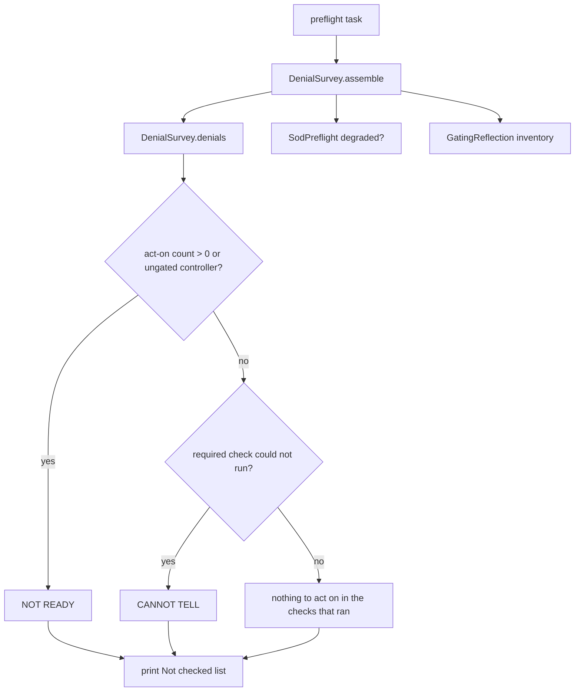

# Enforce Preflight - Plan

Issue #187 asks for one task that answers whether a host can leave report mode.
The answer is allowed to be "not ready" or "cannot tell".
It is never "safe to enforce".
Paths below were read on `origin/main` at `a3d4fef`.

## Goal Capsule

- **Objective:** Add `bin/rails current_scope:preflight`. It reuses the report task's classifier and prints one of three headlines: a check found a problem, a required check could not run, or nothing was found in the checks that ran.
- **Authority hierarchy:** this plan, then issue #187, then `docs/solutions/workflow-issues/the-exit-condition-nobody-can-reach.md`, then `docs/plans/2026-08-24-002-runbook-116-bake-execution.md` section F2, then `AGENTS.md` hard rule 1.
- **Execution profile:** Extract the report re-check into one object. Add a rake task that prints a composite headline and an unchecked list. Leave the report task's printed sentences unchanged.
- **Stop conditions:** Do not print "safe to enforce". Do not print a line that says the host is ready to flip. The required headline "NOT READY" is not that claim. Do not add ledger rows. Do not change resolver order. Do not claim a bake count reaches zero. Do not compute host authentication order.
- **Tail ownership:** Report printing moves in issue #140. This plan only gives that work a summary object to call.

---

## Product Contract

### Summary

`current_scope:report` already lists what it found and refuses a verdict (`lib/tasks/current_scope_tasks.rake` around the comment at line 531).
Operators still have to combine that listing with `current_scope:ungated` and the SoD preflight by hand.
The new task runs those same checks and prints one headline plus the list of things it did not check.

### Problem Frame

The report headline is not a flip decision.
An empty act-on list can mean the checks ran and found no act-on item, or it can mean this process cannot see today's denials.
After a host leaves report mode, new denials are log lines, not ledger rows.
The engine also cannot see whether the host authenticates before the gate.
That question is answered per host. For the bake host it is miela_app issue #758, not a result this gem can compute.

### Requirements

**Headline**

- R1. `current_scope:preflight` prints exactly one of these headlines: `CurrentScope preflight: NOT READY. A check found a problem.` or `CurrentScope preflight: CANNOT TELL. A required check could not run.` or `CurrentScope preflight: nothing to act on in the checks that ran.`
- R2. The task never prints "safe to enforce". It never prints a line that says the host is ready to flip. The words "NOT READY" inside the first headline are required.
- R3. A found problem outranks a check that could not run. A check that could not run outranks "nothing to act on".

**What counts as a problem**

- R4. The task treats every non-zero act-on count from the report `signals` hash as a found problem. That hash is the would-be denials still ungranted (outstanding plus unknown), scoped grants that can never match, scoped grants worth checking, scoped grants their type no longer accepts, SoD actions that will raise, SoD blind-spot denials, and SoD actions that already raised.
- R5. Unknown denials stay inside the ungranted count. They are a found problem, not a silent pass.
- R6. Moot denials are not a found problem. They stay out of the act-on counts. When the moot count is not zero, print it on its own line and say those rows are not work to grant. A moot-only ledger does not change the headline.

**What counts as cannot tell**

- R7. When enforcement is not `:report`, the denial survey is "cannot tell", including when the ledger is empty.
- R8. Each of these is "cannot tell", and a zero count does not hide it: enforcement is not `:report`; audit is neither `true` nor `:strict`; `SodPreflight#degraded?` is true; `SodPreflight#blind?` is true; the grant scan rescued an error; the `current_scope_events` table is missing. The grant-scan fact covers both rescues: the batch rescue that clears the grant arrays, and the per-grant rescue inside `grant_refused_by_declaration`. The per-grant rescue sets the flag even when the printed nonconforming count is not zero. The flag is not the headline. A non-zero act-on count still wins, and the Why line still names the rescue. When the rescue fires and that count is zero, the headline is CANNOT TELL. The Why line does not say the grant is conforming. Leave the report warn text unchanged. Do not add a new signals key or a new report sentence for that flag. A missing events table is not an empty ledger. The classifier returns that fact and does not abort. The report task still aborts with the same migrate sentence, before any other section. Preflight prints CANNOT TELL and that sentence under Why. Empty stand-in rows must not select the third headline. An unrelated `StatementInvalid` still raises.
- R9. Ungated state is four rules, each from a named method. `GatingReflection#ungated?` true is NOT READY, and the task lists those controllers. `GatingReflection#missing_controller?` true is CANNOT TELL, and the task lists those paths. Both methods false means the controller is gated, which is not a problem by itself. A conditional `skip_before_action` (`only` or `except`) uses the same limit sentence the ungated task already prints. Print that sentence under Not checked on every run. Do not print it only when a skip is detected. Reflection cannot tell whether a conditional skip exists. That sentence does not change the headline. Do not add a third gating method.
- R10. After the headline, every run prints three blocks. "Why:" lists each fired reason, including a cannot-tell reason when the headline is NOT READY. "Act on:" lists each non-zero signal count. It does not list the moot count. "Not checked:" names host authentication order, routes with no recorded traffic, the fact that denials after a flip are log lines rather than ledger rows, and the conditional-skip limit sentence from R9.
- R11. Items on the "Not checked" list do not change the headline into NOT READY or CANNOT TELL. They are printed so "nothing to act on" cannot be read as permission to flip.
- R14. A `NameError` during the ungated walk is CANNOT TELL. The task still prints a headline and names the controller. It does not exit with no headline.

**One classifier**

- R12. The report task and the preflight task call the same denial classifier. The report task's existing sentences stay the same.
- R13. The preflight task does not write ledger rows, including for requests with no subject.

### Acceptance Examples

- AE1. Report mode, one still-denied row, SoD preflight clean, no ungated controller.
  - **Covers:** R1, R3, R4
  - **Given:** enforcement is `:report` and the classifier returns one ungranted denial.
  - **When:** the operator runs `current_scope:preflight`.
  - **Then:** the headline is NOT READY, and the unchecked list is still printed.
- AE2. Enforce mode, empty ledger, every other check clean.
  - **Covers:** R3, R7, R10
  - **Given:** enforcement is `:enforce` and the ledger has no `access.would_deny` rows.
  - **When:** the operator runs the task.
  - **Then:** the headline is CANNOT TELL, and a Why line names enforcement `:enforce`.
- AE3. Report mode, no act-on counts, SoD preflight skipped one controller.
  - **Covers:** R3, R8
  - **Given:** `SodPreflight#degraded?` is true and every signal count is zero.
  - **When:** the operator runs the task.
  - **Then:** the headline is CANNOT TELL, and a Why line says the SoD preflight could not complete.
- AE4. Report mode, audit on, every routed controller gated, none missing, SoD preflight not degraded and not blind, signals empty.
  - **Covers:** R1, R2, R9, R10, R11
  - **Given:** `ungated?` is false and `missing_controller?` is false for every routed controller, and audit is `true`.
  - **When:** the operator runs the task.
  - **Then:** the headline is "nothing to act on in the checks that ran", the Not checked list includes authentication order and the conditional-skip sentence, and the output does not contain "safe to enforce". A non-zero moot count is on its own line, those rows are not work to grant, and the headline stays the third headline.

### Scope Boundaries

- The report task keeps its detail sections and its current headline wording.
- The adopting guide's flip steps, and the README installation sentence those steps point at, are edited in this change. The operator runs `current_scope:preflight`. None of the three headlines is permission to set `:enforce`. Keep the authentication warning and the soft-delete warning. Leave the identity section and the downgrade table. The guide's short-version pointer must not lead back to the old flip sentence.
- Issue #140 may later move that printing. It should consume this summary and must not grow a second classifier.
- Host authentication order stays on the unchecked list. This gem does not read the host's `before_action` chain to answer it.
- No change to resolver decision order, SoD veto rules, or the audit event shape.

### Sources

- `lib/tasks/current_scope_tasks.rake` report task at line 144, `signals` at line 537, verdict refusal at line 531, ungated task at line 872.
- `lib/current_scope/sod_preflight.rb` `scan` at line 71, `degraded?` at line 48.
- `lib/current_scope/gating_reflection.rb` `ungated?` at line 24.
- `docs/solutions/workflow-issues/the-exit-condition-nobody-can-reach.md`.
- `docs/plans/2026-08-24-002-runbook-116-bake-execution.md` section F2.

---

## Planning Contract

### Key Technical Decisions

- KTD-1. Put the shared classifier in `CurrentScope::DenialSurvey`. The name is a summary, not a verdict. `DenialSurvey.denials` returns the buckets the report already prints: outstanding, unknown, resolved, moot, superseded, legacy-model, and dead-model rows, the three grant arrays, the blind rows, the initiator rows, the `SodPreflight::Result`, the signals hash built from those inputs, and the grant-rescue flag. The report task prints from that object. It does not build a second signals hash. `assemble` reads `degraded?` and `blind?` from that same result. The report task calls `denials` and keeps printing. The preflight task calls `assemble`.
- KTD-2. `current_scope:report` does not start running the ungated inventory. That walk is preflight-only, so this extraction does not change the report task's cost or sentences.
- KTD-3. Headline priority is fixed: any non-zero act-on signal, including a controller with `ungated?` true, is NOT READY. Else any R8 or R9 cannot-tell fact, including a `NameError` from the ungated walk, a missing events table, and either grant-scan rescue, is CANNOT TELL. Else the headline is "nothing to act on in the checks that ran". Empty stand-in rows are not that third headline.
- KTD-4. An empty ledger is "nothing to act on" only while enforcement is `:report` and audit is `true` or `:strict`. Otherwise the denial check could not see current denials, so the headline is CANNOT TELL even when the table is empty.
- KTD-5. The unchecked list is printed under every headline. Authentication order, unexercised routes, and post-flip log-only denials are permanent members. They are not computed checks.
- KTD-6. Do not record a denial when the subject is missing. `Event` requires an actor. The report recorders already return in that case. Preflight only reads.

### High-Level Technical Design

`DenialSurvey.denials` owns the re-check loop that today lives inside the report task, including moot versus unknown versus outstanding and the `collection_type?` branch.
It also records whether the grant scan rescued an error, without adding a report sentence.
`DenialSurvey.assemble` adds enforcement, audit, `SodPreflight#degraded?`, `SodPreflight#blind?`, and the four ungated states in R9.
The preflight rake task prints the headline, the act-on counts it received, and the unchecked list.
It tells the operator to run `current_scope:report` for the row-level listing.

### Assumptions

- The report task's classifier on `a3d4fef` is the one to move, not a second copy.
- `GatingReflection#ungated?` and `#missing_controller?` are the two methods R9 names. Do not invent a third method. Conditional skips stay the printed limit the ungated task already uses.
- Issue #140 is not implemented in this change.

### Sequencing

- U1 moves the classifier and keeps report output identical.
- U2 adds the composite answer on the extracted object.
- U3 adds the rake task.
- U4 pins the four acceptance examples and the forbidden words.

### Risks

- A sloppy move will change a report sentence and hide inside a passing-looking diff. U1 is done only when the existing report tests pass without edited expectations.
- Treating a cannot-tell result as the third headline is the failure this task exists to prevent. AE2 is the pin. The third headline is "nothing to act on in the checks that ran".
- Running the ungated walk inside the report task would slow a task operators already run on large ledgers. KTD-2 forbids that.

---

## Implementation Units

### U1. Move the denial classifier without changing the report

- **Goal:** The report task prints the same sentences from buckets returned by `DenialSurvey.denials`.
- **Requirements:** R12
- **Dependencies:** none
- **Files:**
  - `lib/current_scope/denial_survey.rb` (new)
  - `lib/tasks/current_scope_tasks.rake` (report task body)
  - `test/report_task_test.rb`
- **Approach:** Move the re-check loop and the `signals` hash construction into `DenialSurvey.denials`. Return the fields named in KTD-1, including the grant-rescue flag for both rescues. A missing `current_scope_events` table is a returned fact, not empty rows, and not an abort inside the classifier. The report task still aborts with the existing migrate sentence before any other section. Leave every `puts` in the rake task. Pass the returned object into the existing print block. Do not add the ungated walk here. Do not add a report sentence.
- **Patterns to follow:** The report task's comments around line 531 and line 557. Those comments stay next to the print they explain.
- **Test scenarios:** The existing report examples in `test/report_task_test.rb` pass with the same expected strings. No example is rewritten to match a new sentence.
- **Verification:** Report output for a ledger with outstanding, unknown, moot, and empty categories matches the current test expectations.

### U2. Add the composite answer

- **Goal:** `DenialSurvey.assemble` returns the headline kind, the Why lines, the act-on counts, the moot count, and the unchecked list.
- **Requirements:** R3, R4, R5, R6, R7, R8, R9, R10, R11, R13, R14
- **Dependencies:** U1
- **Files:**
  - `lib/current_scope/denial_survey.rb`
  - `test/denial_survey_test.rb` (new)
- **Approach:** Call `denials` for the act-on counts. Read enforcement from configuration. Call the existing SoD preflight and ungated reflection. Map those facts through KTD-3. Build the unchecked list from KTD-5 every time. Do not write events.
- **Patterns to follow:** `SodPreflight#degraded?` and `GatingReflection#ungated?`. Do not re-derive either check.
- **Test scenarios:** A non-zero ungranted count returns NOT READY even when the SoD preflight is degraded, and the Why lines still name that degrade. Enforce mode with an empty ledger returns CANNOT TELL and names enforcement. Audit off returns CANNOT TELL. `blind?` returns CANNOT TELL. A missing controller returns CANNOT TELL. `ungated?` true returns NOT READY. A clean gated survey returns "nothing to act on" and still includes authentication order and the conditional-skip sentence. Moot-only input is not NOT READY. The moot count is on its own line, not under Act on. A batch grant-scan rescue is CANNOT TELL even when its printed report count is zero. When a per-grant rescue fires and the nonconforming count is not zero, the headline stays NOT READY and the Why lines still name the rescue. When that rescue fires and the count is zero, the headline is CANNOT TELL. The Why line does not say the grant is conforming. Leave the report warn text unchanged. A missing events table is CANNOT TELL and is not the third headline. A `NameError` prints a headline, names that controller path, and is CANNOT TELL. If a later controller has `ungated?` true, the headline stays NOT READY. Rescue around each controller and keep walking. Do not rescue the error inside `ungated?`.
- **Verification:** The unit tests name the three headline kinds and never contain the substring "safe to enforce".

### U3. Print the preflight task

- **Goal:** `bin/rails current_scope:preflight` prints the assemble result and points at the report task for detail.
- **Requirements:** R1, R2
- **Dependencies:** U2
- **Files:**
  - `lib/tasks/current_scope_tasks.rake`
  - `test/preflight_task_test.rb` (new)
  - `docs/guides/adopting-in-an-existing-app.md`
  - `README.md` (the installation sentence the guide calls the short version)
- **Approach:** Add the task next to `report` and `ungated`. Print the exact headline from R1, then the Why lines, then Act on, then the moot line when the count is not zero, then Not checked. Mention `bin/rails current_scope:report` for the row listing. Do not print a fourth headline. In the adopting guide, replace the steps that say to re-run the report until nothing is ungranted and then set `:enforce`, including the ladder steps that watch the report reach zero and then flip. Tell the operator to run `current_scope:preflight`. Say none of the three headlines is permission to set `:enforce`. Keep the authentication warning and the soft-delete warning. Leave the identity section and the downgrade table. In `README.md`, replace the installation sentence that says to flip to `:enforce` once new requests stop adding rows. Point it at `current_scope:preflight`, and say none of the three headlines is permission to set `:enforce`. Change the guide's short-version pointer so it does not lead to the old sentence.
- **Patterns to follow:** The report task's "name yourself on the first line" rule at line 561. The ungated task's refusal to claim an empty catalog is all-clear, around line 910.
- **Test scenarios:** Each headline kind is asserted as a full string. A scan of the output fails if it contains "safe to enforce" or a line that says the host is ready.
- **Verification:** The task loads in the dummy app and the three headline examples pass.

### U4. Pin the acceptance examples

- **Goal:** The four acceptance examples are executable and the report suite stays green.
- **Requirements:** R1 through R14
- **Dependencies:** U3
- **Files:**
  - `test/preflight_task_test.rb`
  - `test/denial_survey_test.rb`
  - `test/report_task_test.rb`
- **Approach:** Cover AE1 through AE4 at the task boundary. Keep the report suite as the characterization net for the move.
- **Patterns to follow:** `test/report_task_test.rb` and `test/ungated_task_test.rb` for rake-task examples. `test/sod_preflight_test.rb` for preflight fixtures.
- **Test scenarios:** AE2 uses an empty ledger under `:enforce` and expects CANNOT TELL. AE4 expects the authentication-order item in the output. A direct call does not insert an `Event` row.
- **Verification:** The new tests fail if the headline priority is reversed, and the old report tests fail if a printed report sentence changes.

---

## Verification Contract

| Check | Command | Proves |
|---|---|---|
| Classifier and preflight | `bin/rails test test/denial_survey_test.rb test/preflight_task_test.rb test/report_task_test.rb test/ungated_task_test.rb test/sod_preflight_test.rb` | R1 to R14, and report sentences unchanged |
| Lint | `bin/rubocop` | New files match engine style |

Run one test process per checkout. The suite shares `storage/test.sqlite3`.

## Definition of Done

- `current_scope:preflight` prints one R1 headline, then Why, Act on, and Not checked.
- No output contains "safe to enforce" or says the host is ready to flip.
- Empty ledger outside report mode, or with audit off, is CANNOT TELL.
- `blind?`, a missing controller, a degraded SoD scan, either grant-scan rescue, a missing events table, and a `NameError` in the ungated walk are CANNOT TELL, and each prints a Why line even when another fact is NOT READY.
- A missing events table does not become the third headline.
- None of the three headlines, in the task or in the adopting guide, is permission to set `:enforce`.
- The report task's existing expected strings are unchanged.
- `DenialSurvey` is the only denial classifier. The rake task does not keep a private copy of the loop.
- Abandoned experiments are not left in the diff.
